### 练习2：练灵感闪现

这个的确是我最近在刻意练习的一个核心能力。

回顾一下，刚好从2021开始有意识做"**灵感激发和科学管理"**的工作，刚好每年一个大的阶段，我尝试带大家还原一下，这背后的刻意练习过程吧。

初始状态：从2019年开始发布课程，一直到2020年，一堂前面几年解决的都是一些商业重大决策的问题，基本上比较顺手。

到了2021年，我发现公司出现了一堆局部的新问题：设计新产品，打磨马拉松销售方案，提升老带新转化率，激发教研选题，写营销文案....这种问题典型的特点是：**开放，需要创造力，容易低效憋方案。**

22年初，一次很偶然的机会，我发现团队憋马拉松的"销售方案设计"非常痛苦：各种看同行、问用户、找专家，最后发现效果都不怎么好，**无法讲一个逻辑清楚、打动人的产品卖点。**

眼瞅着时间点越来越近，开始Miss the Deadline，开始Delay一天，两天，三天，非常焦虑。

然后跟我开评审会的时候，我说，你们有尝试把你们对于这个产品的理解，对于一堂的核心稀缺性，全部榨干写进来吗？我接着说：

> 要不我来试着挑战一下，你们给我一个小时，我尝试着把我对于这件事所有的理解，如果我来卖，我会怎么组织逻辑。

然后我进到封闭办公室，大概1个小时时间，开始试着一句一句写我的灵感，从一个点开始，然后展开：如果我来销售，哪些话是很值得说的？

然后我流淌了10几句，然后分类型，又流淌了一些，然后分组，又流淌了一些，凑了满满一页纸：

> 这是最早的一个版本，还非常糙，逻辑格式都很差劲。

大概40分钟，我在27寸竖屏显示器写了满满的一屏幕【营销信息点】，而且这些信息点，绝大多数都可以【入课】，发现效率极高。

于是我问自己：这个动作，能不能长期刻意练习呢？

貌似可以啊，我开始给自己定了一个很高的目标：**我希望未来可以成为一个"灵感闪现"的高手，善于激发自己，不依赖别人，用搜索自己的“前半生见识”来不断涌现创造性的解法。**

> 这是我人生红点（作品型-泛产品设计专家）的必经之路，高阶能力。

开始刻意练习最简单的方法，先尽快把4个练习要素凑齐：**固定套路、非舒适区、及时反馈和大量重复。**

我建立了一个文档，用来试着总结灵感闪现的执行方法，

> 左边为内部使用（自用/内训）版本，右边是《泛产品设计2：工具篇》的卡片。

开始不断做心理暗示：以后做开放方案，不能按直觉，不能看到一个不错的就拍脑袋，要努力多准备一些选项，努力准备PlanABC再做决策。

这个也开始增加总结复盘意识，每次完了之后，回顾一下得失，下次怎么做更好。

这个阶段努力逼自己重复，不管是写《一封信》还是《营销文案》，还是方案的风险策略，还是销售卖点，基本都会努力走一遍灵感闪现的流程。

大概2022年一整年，每个月平均2-3次吧，通过差不多二三十次，不断练**压，看，聚，拆，再。**基本上我开始养成了灵感闪现的习惯了。

这个时候，我发现自己的成长速度明显慢下来了，面对开放方案，也能有一些办法，但是速度和质量，很难有大幅的提升了，怎么办呢？

于是我开始升级模型：

**第一，开始自我立Flag。**我开始试着给自己增加数量的预期，不只是"努力想"而是"努力想到N条"。
1. 跟自己多一个对赌：30分钟写10条，一晚上写30条，**下车前写5个备选思路。**
2. 目的有三个：①瞬间专注  ②容易激发  ③不容易中途自满

**第二，给灵感闪现环境建模。**我开始总结灵感闪现的环境（通勤/走路/竖显示器/听课），并且给深度思考总结模型：

**第三，开始逼自己拉满。**每次都争取立一个努力跳才能完成的目标，不收力地去追求，从最早的3个，到保5争10，到保10争20，到现在经常保20争30，不断让自己待在非舒适区。

**第四，开始总结版本。**没有教练反馈（苦），我得给自己找反馈机会，我会用飞书的版本功能，对比前后的思考过程，然后把一些无意识的动作，变成了下一次执行的确定性（套路）。

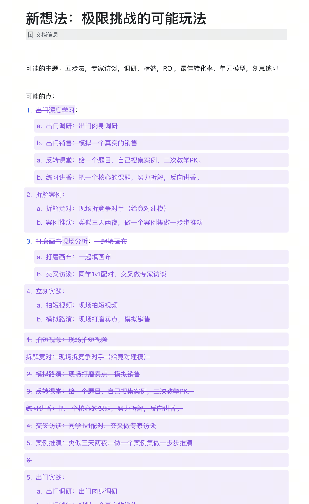

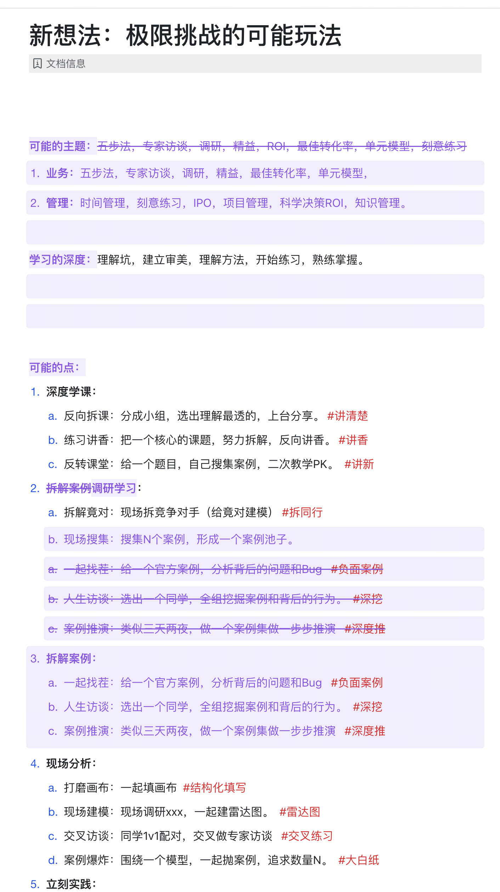

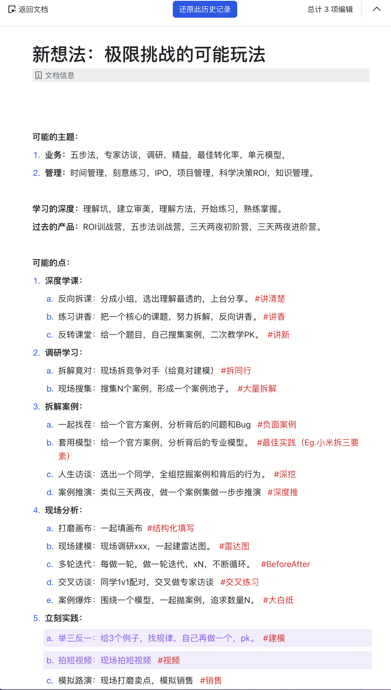

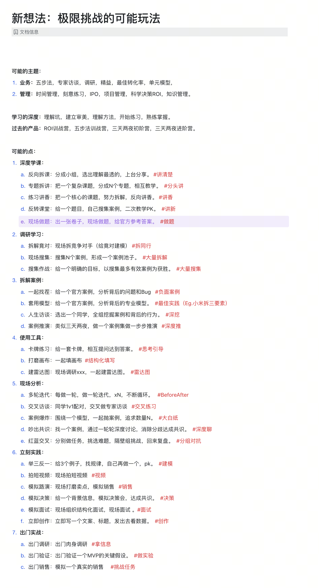

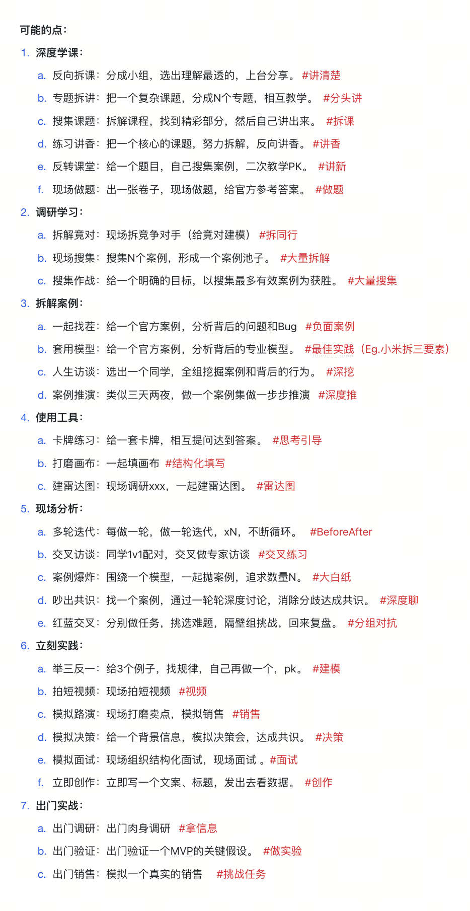

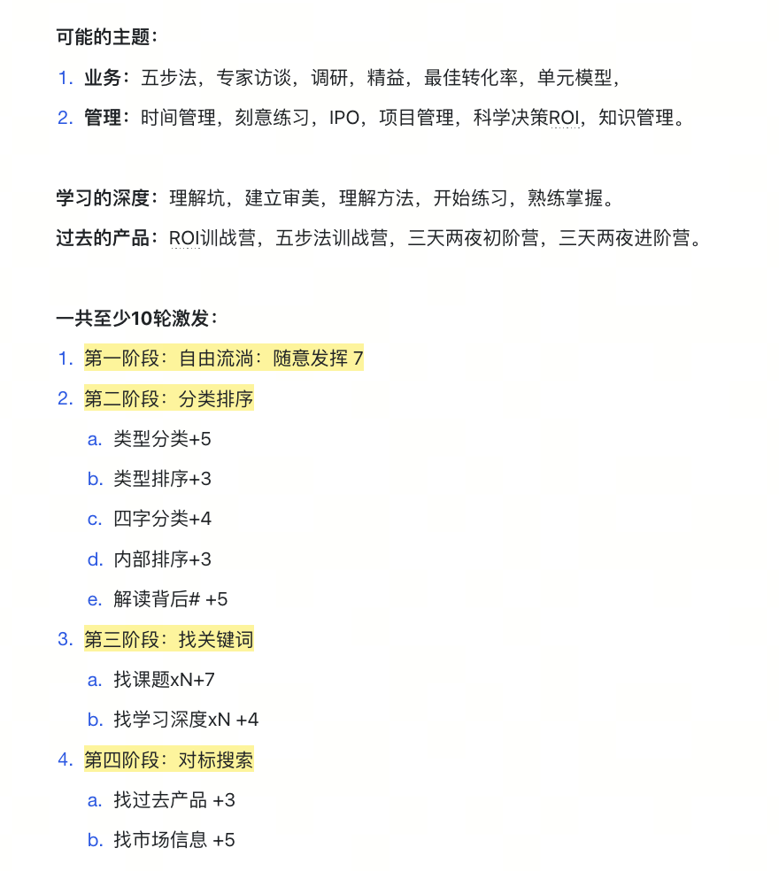

**第五，努力主动练习。**努力想办法，增加练习的场景，做课场景，设计卖点场景，增长周会场景，经过几个月的优化，我大概每周都有2-3次了，数量从每年二三次，变成了一两百次。

这个阶段做了一轮升级：

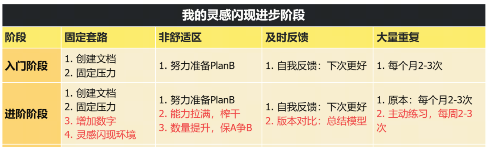

差不多到了23年，基本上灵感闪现我已经很快了，给我30分钟，闪现大概30条，已经变得越来越熟了。又开始进入到了舒适区，感觉自己很棒了，算是半个专家了，开始自我满足了.... 怎么办呢？

- 我可以在15分钟内，围绕一个项目风险，闪现10-15个应对策略。
- 我可以在通勤路上30分钟，给一个官方宣讲发布，写40句营销点。
- 我可以在一个晚上，闪现30个故事点/金句，写一封高分《致同学的信》。
- ......

到了2023年底，我继续升级我的练习：

**第一个工作：继续升级"灵感闪现"模型。**

我开始试着用"解放思想"的原理，开始努力找底层逻辑，通过底层规律完成上层的闪现，大幅提升闪现的成功率和质量。

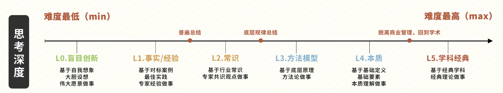

甚至最近开始挑战**10层解读**，围绕一个复杂的教研课题，通过多个角度的灵感闪现，进行解读和知识关联，大幅提升严肃枯燥理论的可读性和易用性。

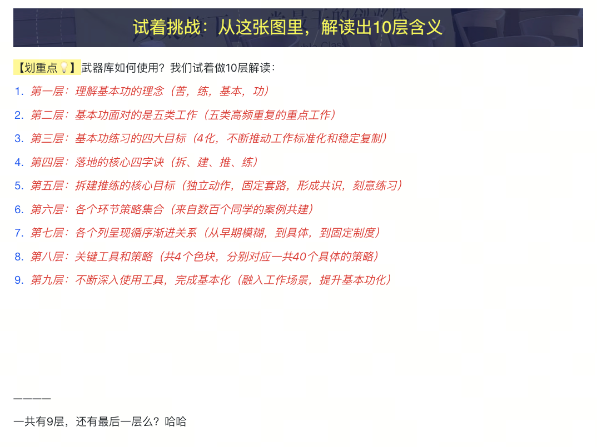

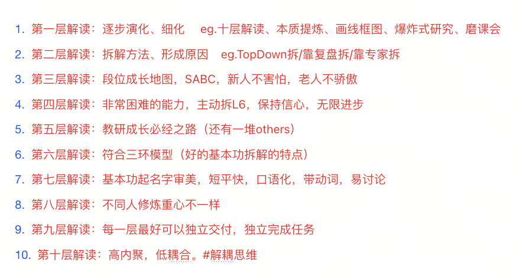

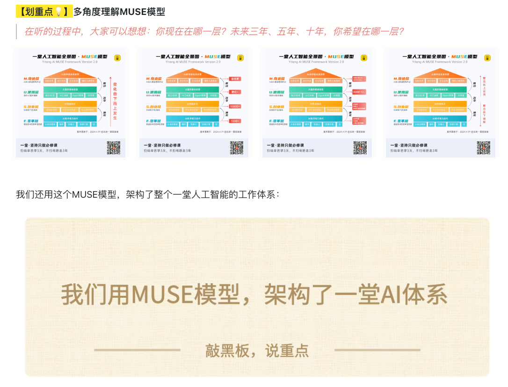

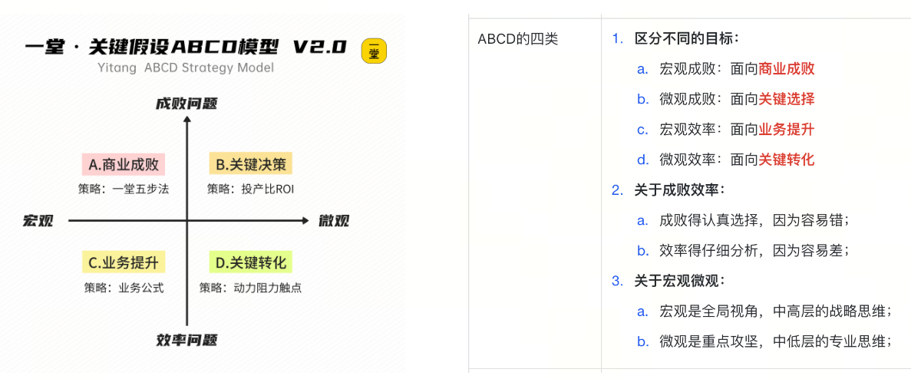

**第二个工作：开始逼自己现场建模。**

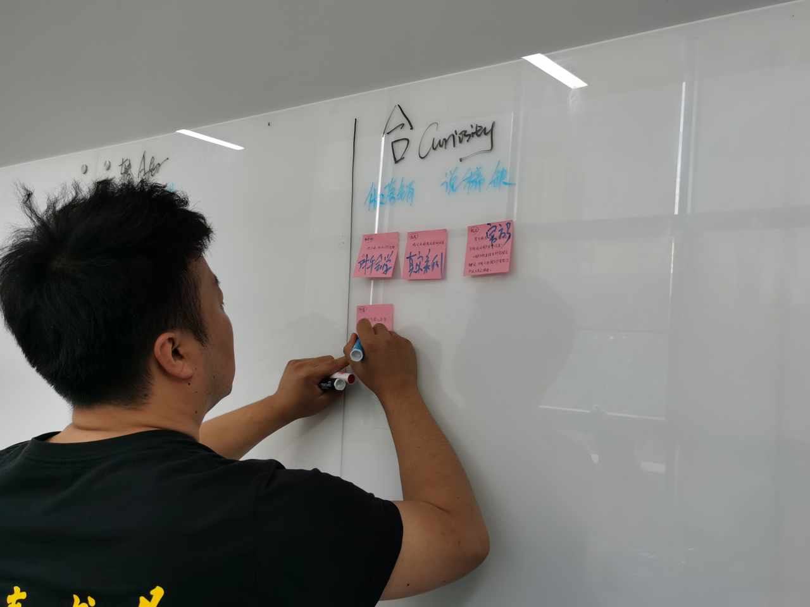

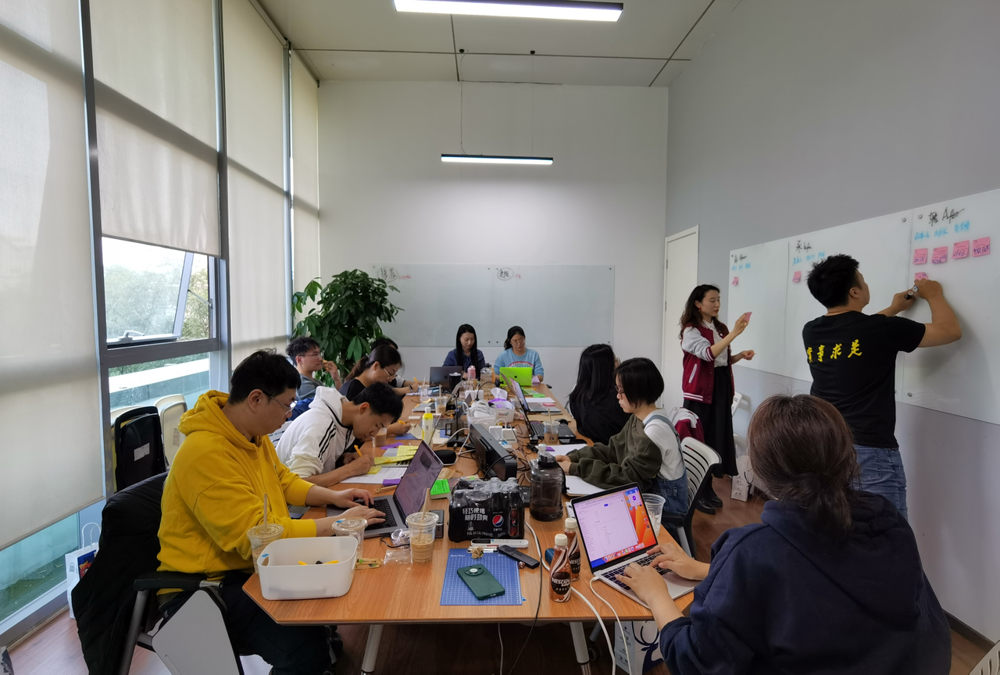

除了"数量"，我开始关心质量，开始练习"**闪现现场建模**"，开始试着给灵感现场MECE，然后进行第二轮、第三轮闪现，最大程度激发灵感。

**第三个工作：自己建立最佳实践池子。**

把过去一些我的灵感闪现的最佳实践文档收录在一起，构建一个池子，每次做完闪现，问自己一个问题：

> 如果放到池子里，这次是历史巅峰吗？能力是拉满了么？

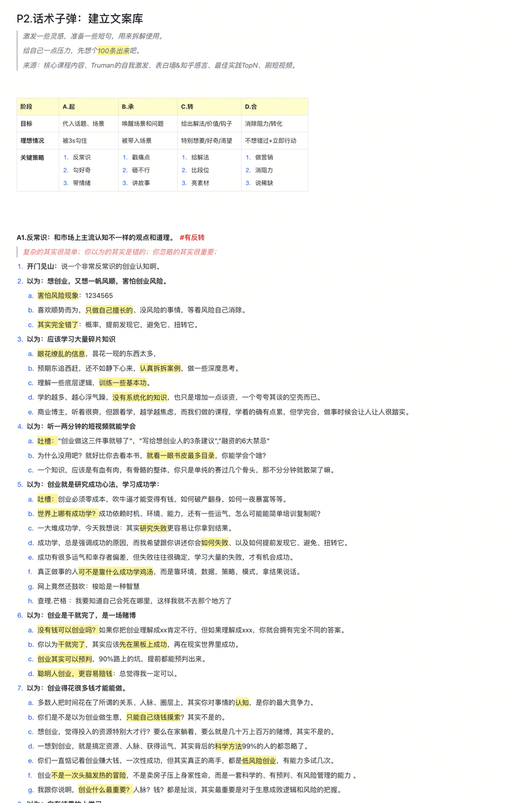

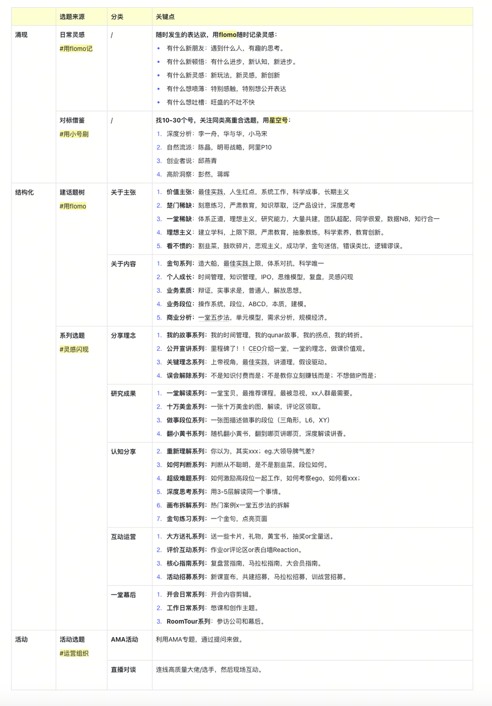

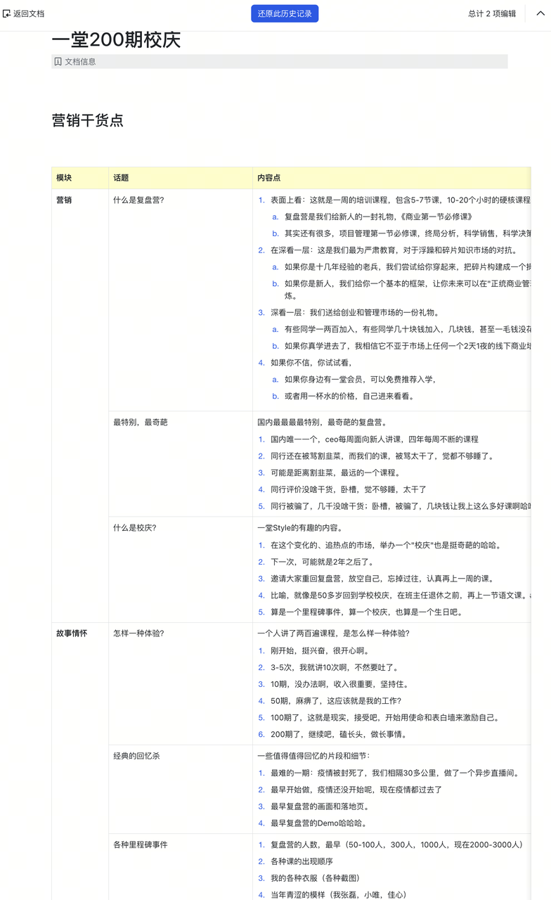

**最后，就是大量带着团队做。**

我一个人重复，一年100次已经是极限了，于是我开始带着一堂的业务负责人们，开始一起练习，给大家分配灵感闪现的小任务，融入到教研流程、项目管理流程、内容制作流程等等。
1. 雨安，短视频的加好友率能不能你先自己做一轮加法，保5争10先想一写假设
2. 佳心，马拉松的续费礼品，你能不能每个先想保5争10地想一下卖点
3. 盈盈，每次线下活动交付能不能给我提出10个迭代的假设
4. 晓莉，关于一堂MBA体系这个价值主张，能不能保5争10地想一些角度
5. 熙熙，关于短视频我的口播主题，能不能保10争20地想一些话题
6. 教研，关于这个工具，你们能不能每个人保5争10地做一下多角度解读
7. 倩倩，关于我请客礼物，能不能想保10争20句文案，把这个礼物讲香人人想要
8. lidi，你给我保10争20条朋友圈一句话介绍吧，然后再来碰
9. Sherry，关于作业率的提升，能不能给我保20争30个假设

这个时候，通过**大量迁移**到各个工作场景，经过我手的灵感闪现，瞬间就从每年100个，跃升到300-500次，几乎每天都遇到不止一个Case，又进一步增加了我的重复次数。

整理一下：

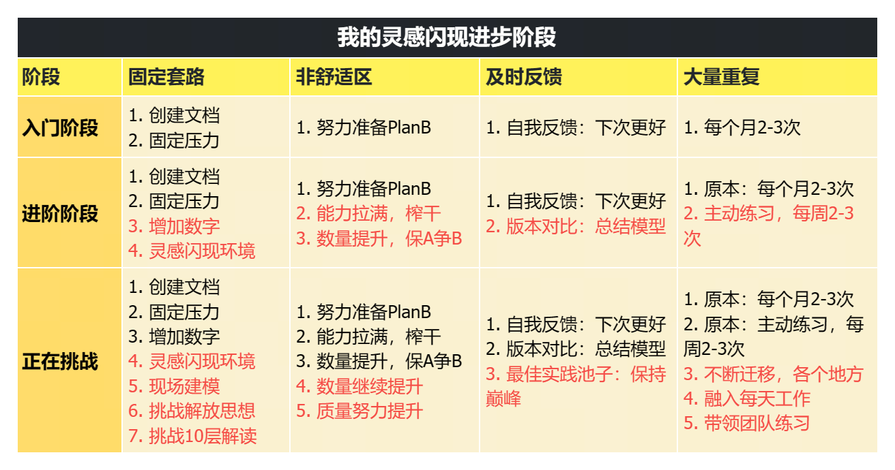

哈哈哈，到了2024年，我也尝试把这个核心能力，交给一部分一堂的同学，希望未来可以一堂更加开放，跟随大家一起灵感闪现，进一步增加灵感闪现的数量和频率。

- 评论区闪现：专门约定30min，带着大家一起灵感闪现。
- 灵感闪现短视频：每个月，固定用一条短视频收集大家的灵感。
- 灵感闪现比赛：给一堂某个重要决策，股东们集体闪现Max，采纳发奖学金。

希望未来能做到，每年1000轮大大小小的灵感闪现吧，用灵感闪现把一堂推向一个更高的水平。

**大家思考一个问题：**这四个要素都重要吗？如果忽略其中一个要素会怎么样呢？或者如果不能持续升级，我能达到现在的状态么？

ok，我们来看最后一个例子，也是比较难的一个刻意练习。