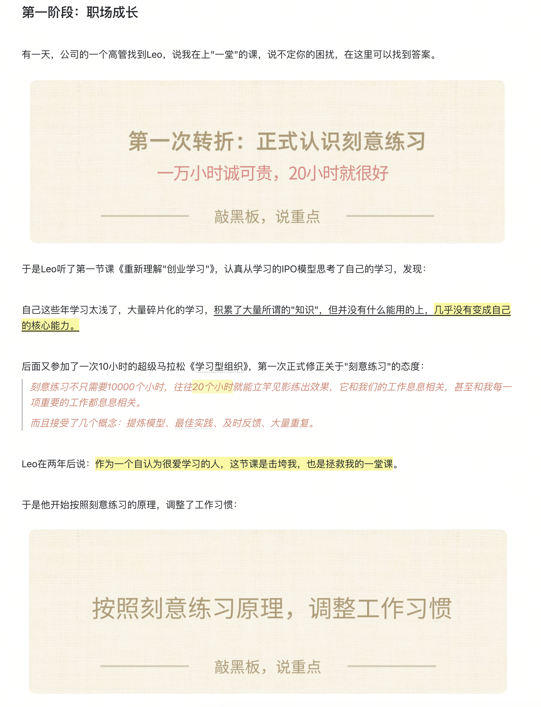

### 第二轮理解：十倍速进步

我们再次理解一下这张图：

现在请大家回顾一下问题：这4个要素，对于一个人的成长，真的重要吗？哪个是必要的，哪个是不那么必要的？你的答案是什么？

很多人都曾完成过"刻意练习"的**觉醒和升级**，这种故事大家见过/经历过么？

> 重点体会：如果失去了要素ABCD，会有什么区别？

我曾经内部磨课，推演过一个“100年前老师傅教京剧”的场景，如果你有10几个新弟子，经过层层筛选，天资悟性都差不多，你愿意带谁，谁更"孺子可教"，有机会未来成为你的传人呢？

- 追求很高：对于长期独当一面，甚至成为一个“名角”有很强的渴望。
- 固定套路：固定基本功听话照做，不打折扣；不断揣摩新动作，总结规律。
- 非舒适区：每次都拉满做事，不收力，每次都练到位，追求日拱一卒，不断进步。
- 及时反馈：主动对比动作，主动请教，主动寻找自己的问题。
- 大量重复：勤奋练习，主动起早贪黑，熬夜练。

如果其他条件都差不多的话，是不是我们都喜欢带这种“值得带”的徒弟啊。

ok，下面我们来讲讲，每一个环节具体该怎么快速掌握，快速入门。