## 建立笃定：全面认识刻意练习

### 前提要素：长期追求

**【思考🙋🏻‍♀️】**对于一个练习来说，【长期的刻意追求】重要吗？必要吗？

——————

**极度必要。**

这个环节，之前课程里有，我默认大家都知道，给简化了。单这一年多的观察来说，我发现大量同学往往从这里，就开始出问题了。

如果你不够"**刻意**"，如果没有渴望，没有动机，没有心气儿，没有追求，没有成为专家or高手的欲望，那么刻意练习是很难展开的。

如果让大家现在就写下来3条或者10条，你最想刻意练习的核心能力，你能写出来么？大家的难题和卡点是什么？

我们调研中，观察到大家常见的2个卡点：

你是不是也有这种困扰：一万小时的确很科学，很有道理，但是我的未来还没想清楚，我很难拿出10000个小时，压在某一个技能上啊，这样性价比太低了。

————

诶，一万小时定律是一个重大的误解，这是典型的**二极管思维**，学习和成长怎么可能是一个非黑即白的呢？

> 刻意练习不需要10000个小时，往往**20个小时**就能立竿见影练出效果，它和我们的工作息息相关，甚至和我每一项重要的工作都息息相关。

> 市场上绝大多数人，都从来没刻意练习过，你只要稍微认真练几轮，就能超越多数的人。

哈哈，我这些年用20小时练过很多能力，比如设计一堂文化衫，设计一堂LOGO，写爆款标题，剪短视频，练习打麻将，练习制造惊喜...

**案例：打麻将的案例**

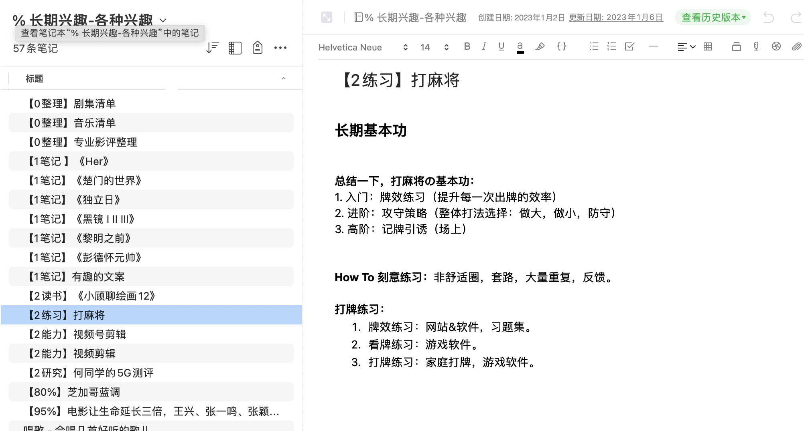

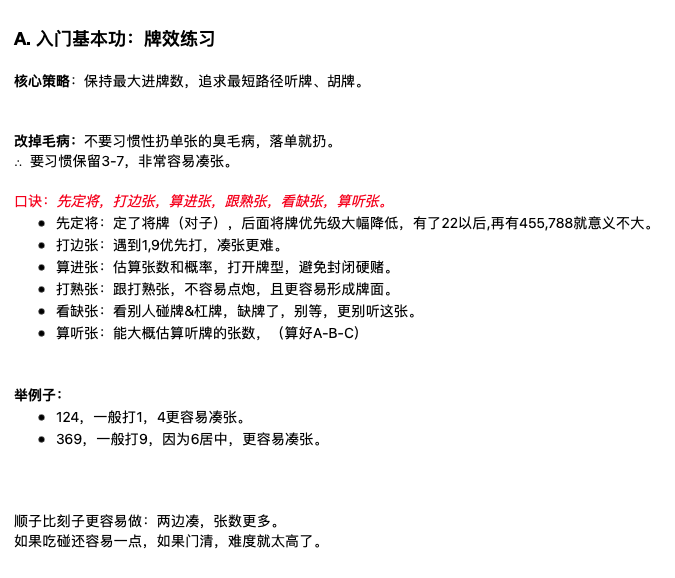

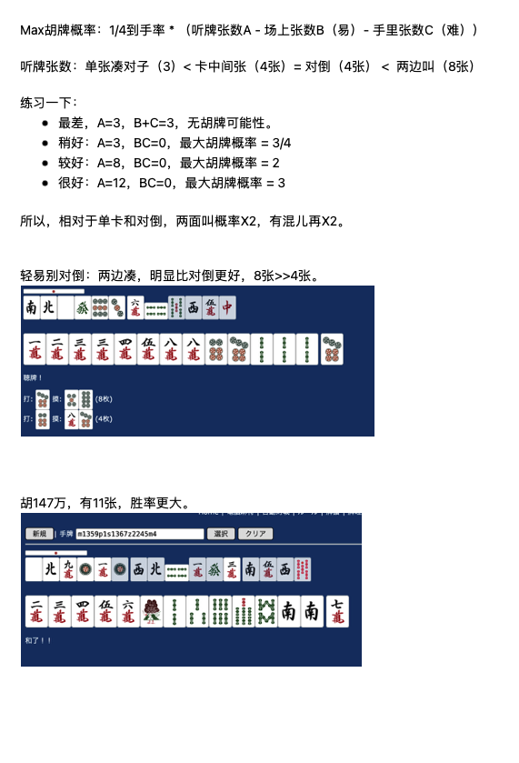

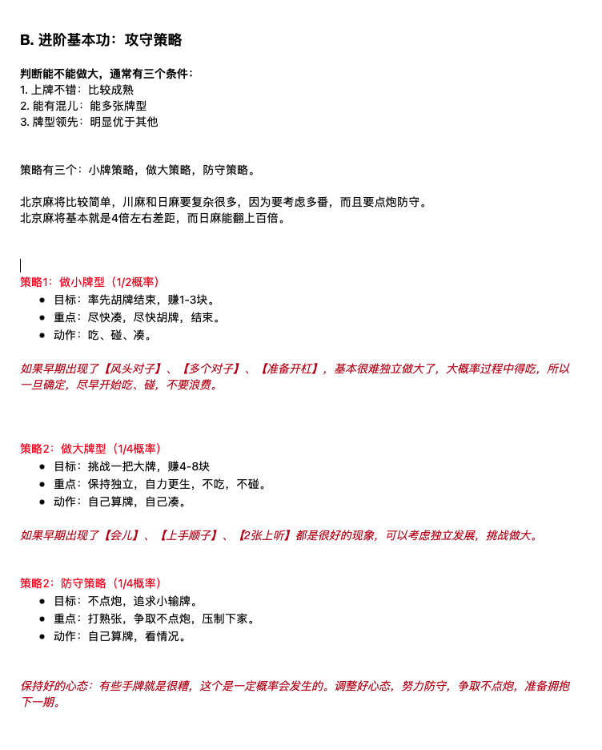

> 训练目标：纯新人，和数百小时经验的家人玩，中等水平，不排最后一名。

> 凑齐要素：①稳定模型+打牌前背诵   ②按模型拉满   ③打牌后回顾错牌  ④专门牌效练习

> 提醒：这个就是20小时小白入门版，请不要用这个模型用来赌博，真的会输光的。

**【划重点💡】**你可以从业余兴趣开始，把练习目标分为三个追求：
1. **快速上手：**超越80%的人，专业上手（几个几十个小时，60分够用）
2. **成为专家：**超越95%的人，成为专家（几十几百小时，追求85分）
3. **无限进步：**超越99.99%的人，无限追求（几千上万小时，追求100分）

比如，我的快速上手（白）和成为专家（黄）：

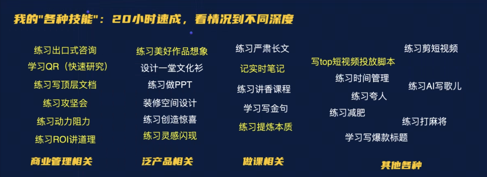

ok，讲完了第一个卡点，这个部分我们还有一个发现。

这是第二个卡点，太多了，乱七八糟：摄影，唱歌，写PPT，五步法，科学决策ROI，讲香....而且彼此层层嵌套，展开能写100+各种练习题目，太多了啊。

怎么办呢？

我这些年的实践，抓住重点，定期回顾最最重要的【练习题目】，其他的看情况，用10年的心态，有机会就磨一磨呗。

- **核心练习：**主动大量练习，努力做。
- **其他练习：**顺带着练习，拉长时间，期待时间复利的惊喜。

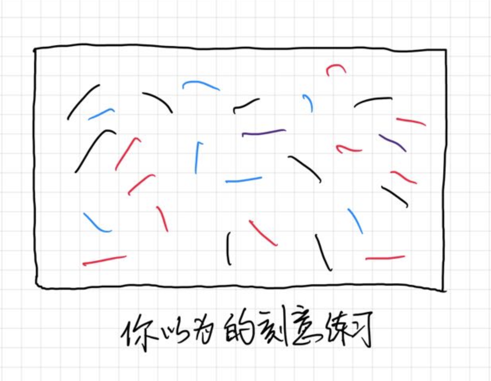

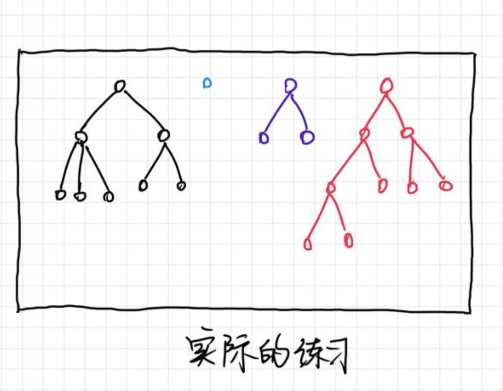

我曾经在MBA进阶营里做过一个我的示范，我的主动核心练习可以分成三环模型：

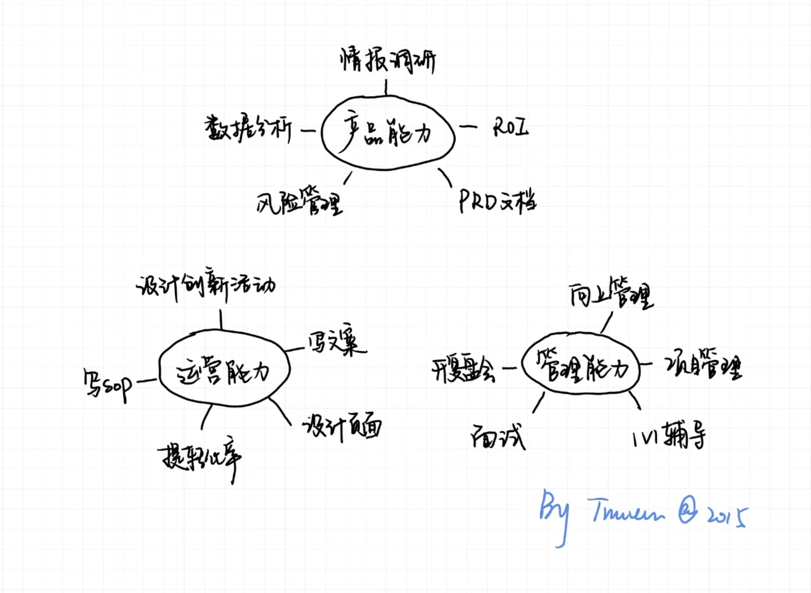

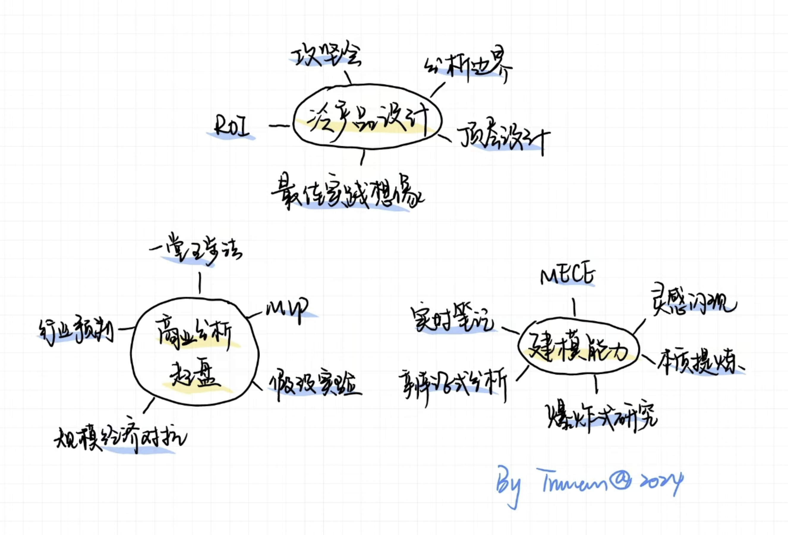

你用**十年视角**+**ROI思维**理解基本功，就不怕多了，没那么纠结了，反而技多不压身，练习题目越多，长期可迁移的能力越强。

曾经有一段时间，我想减肥，我问一个减脂专家，让他给一些建议，没想到他给了我一个完全意外的答案：

> 你得幻想你就是个瘦子，现在的你不是你，xx体重才是正常的你，你得想象那个本来就很美好的你。

很有道理啊，那段时间我的确减了20斤，不过后来做一堂，又胖回来了==。

对于我们也是一样，练习之前先**培养动机**，先许愿，我**渴望练习**成xx样子，那个专业、资深甚至高阶的**状态**，才是我自己，现在这个"弱弱的状态"，只是个开始。

一旦你有了动机，后面很多的练习就可以自然展开了，但是如果动机不足，那么你就很难投入足够多的精力训练你自己。

**【抢答🙋🏻‍♀️】**来，所有刻意练习的动机里面，最最最最强的动机是什么？

——————

答案：人生红点，尤其是**你人生红点的必经之路。**

比如我的人生红点是作品型，路径规划篇讲过我的核心能力（泛产品设计/商业操盘/懂教育/建模能力），我的能力失去了，我就失去了红点，失去了人生最大的意义啊==。

反过来说，如果我通过刻意练习把能力提升100%，那么我的红点实现水平就会提升一倍，我还有什么任何理由不认真练习，不努力追求么。

除了人生红点还有哪些动机呢？我和教研团队做了一个爆炸式研究，回顾了大量案例，做了一张超级小抄：

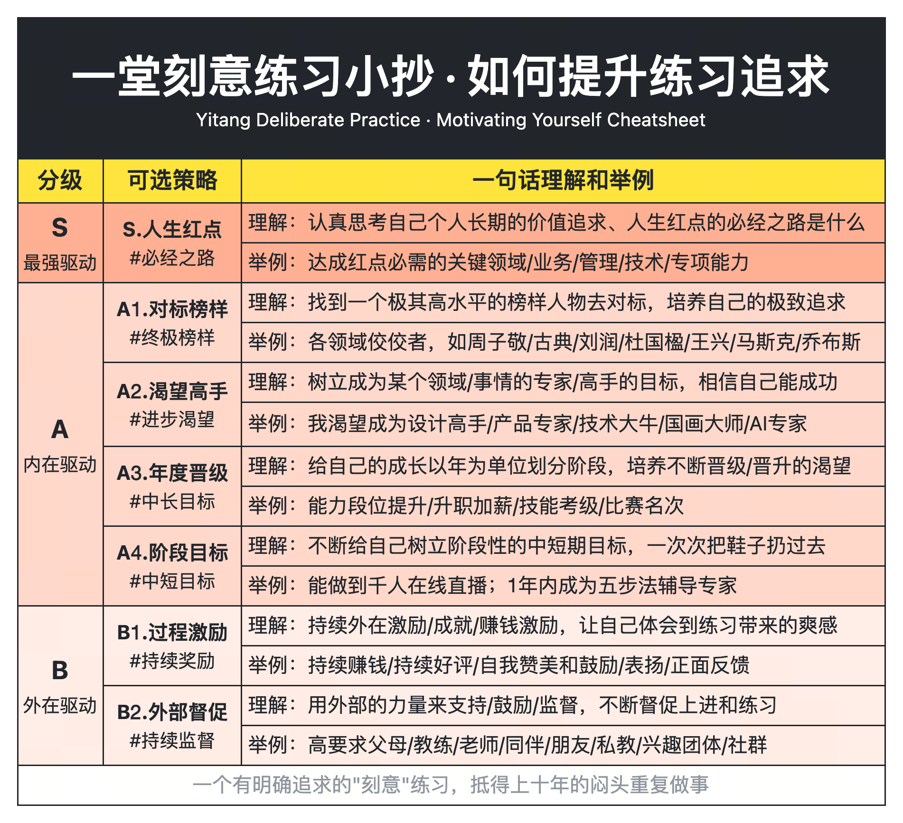

为了做课，我们搜集了内部很多真实的动力激发，如果你感兴趣，可以参考：

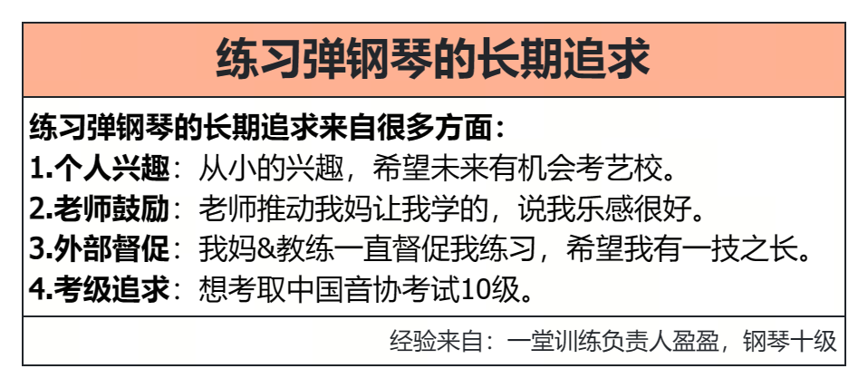

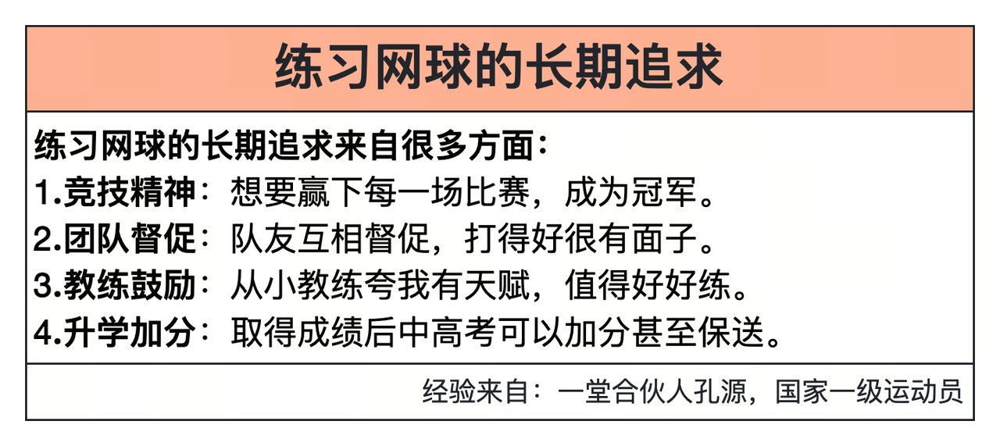

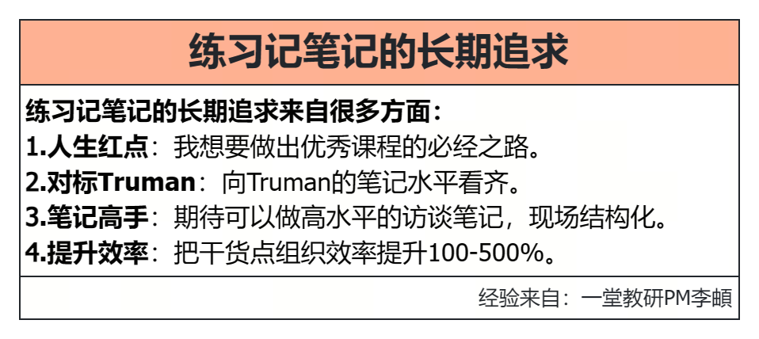

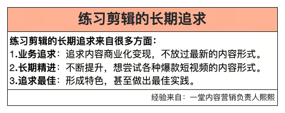