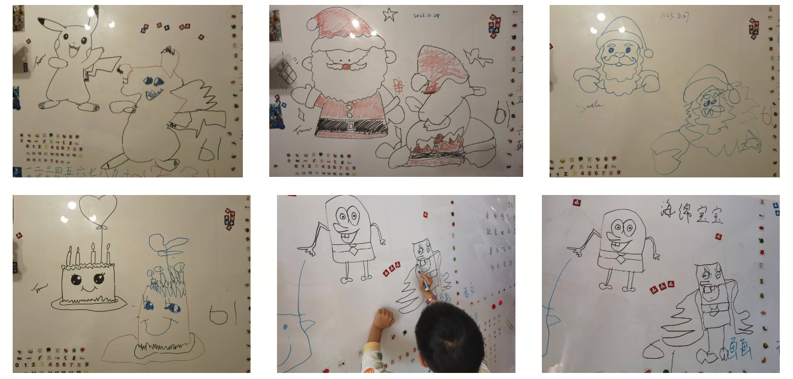
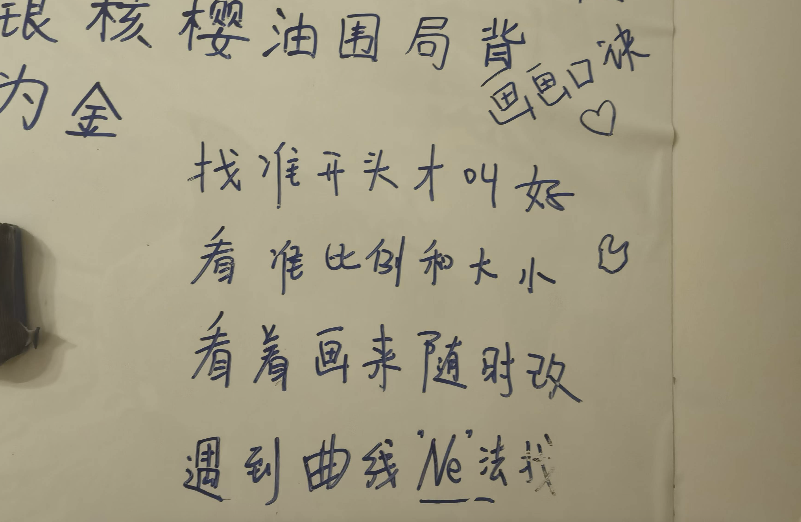
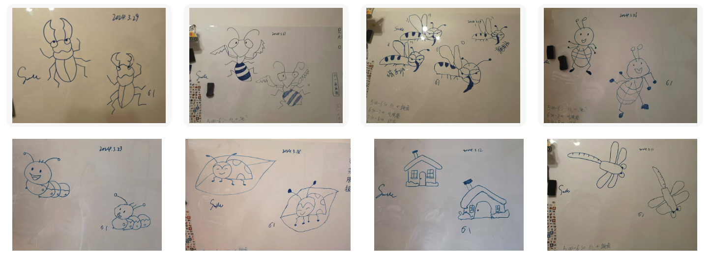
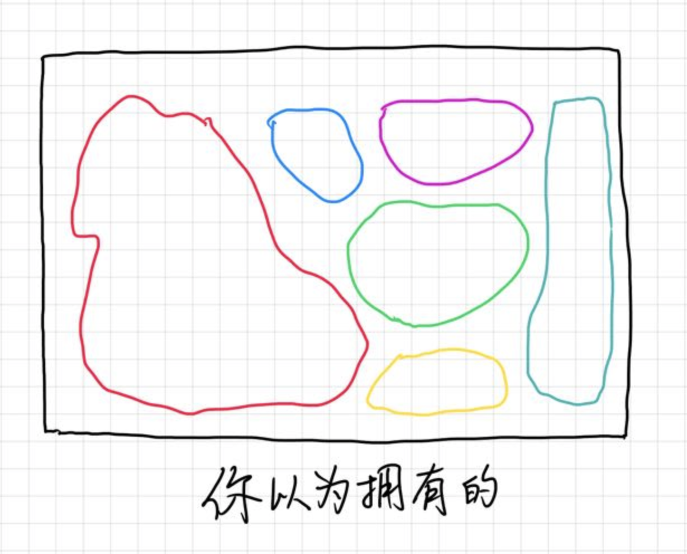
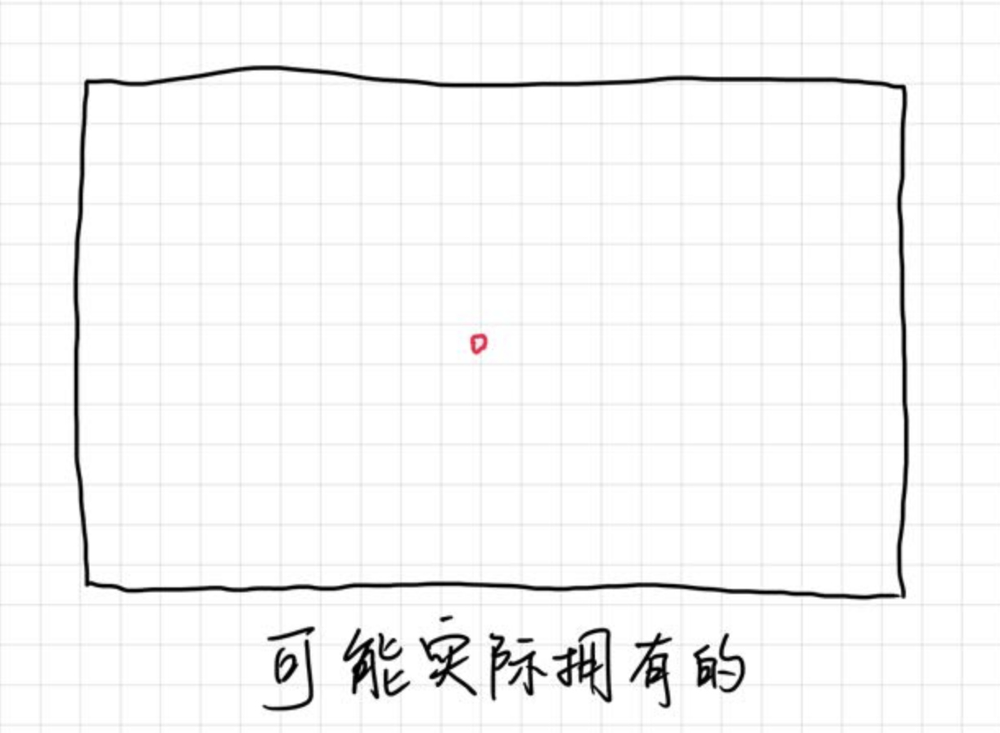
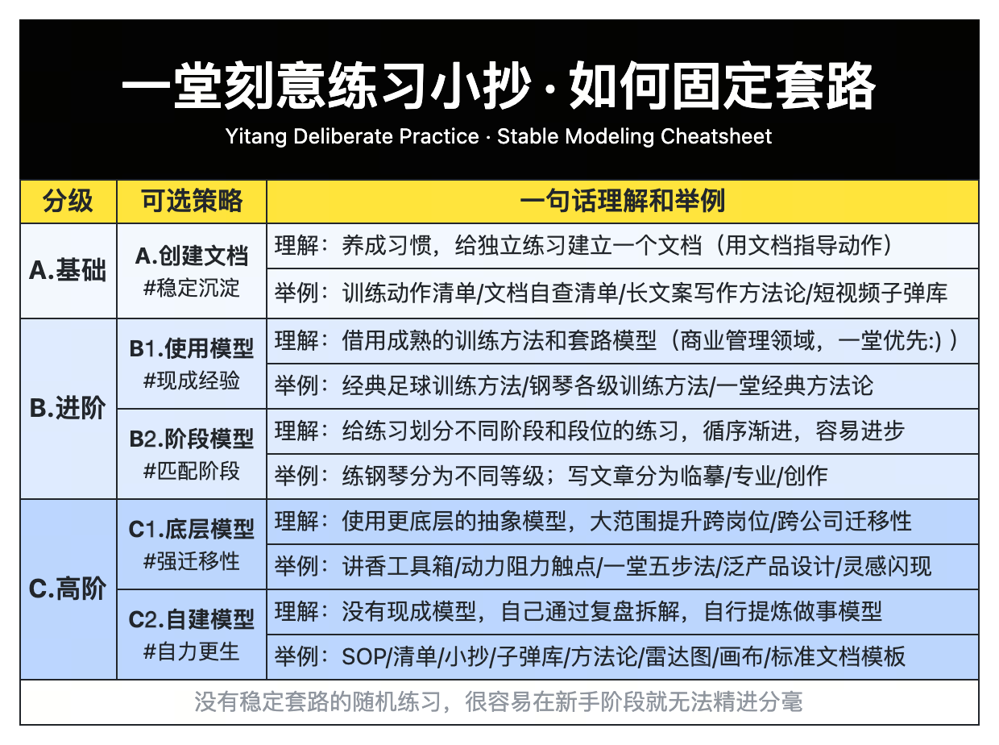
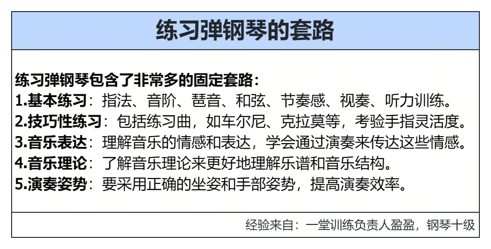
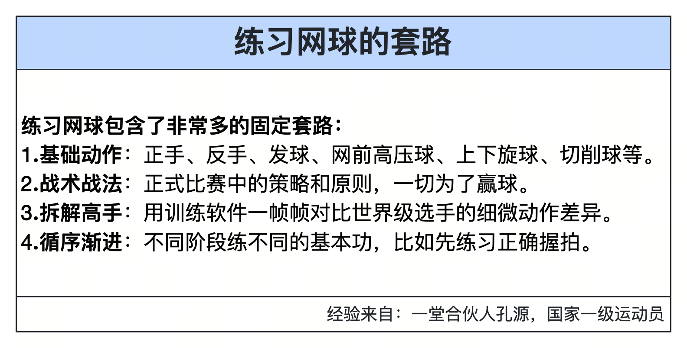
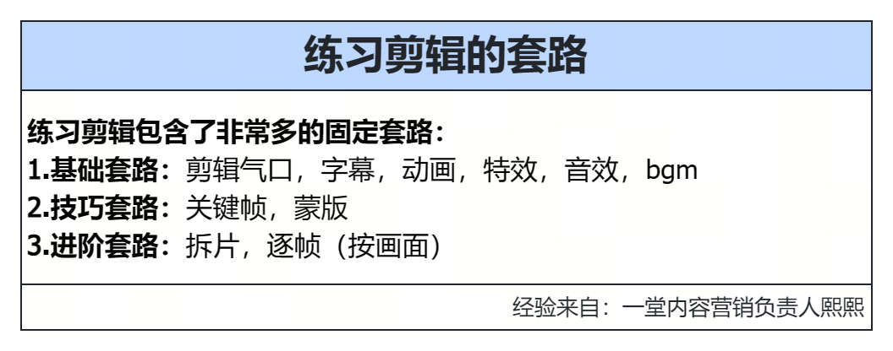

### 第一要素：固定套路

**【思考🙋🏻‍♀️】**对于一个练习来说，【固定的套路】重要吗？必要吗？

————

你们写文案，判断视频，做商业分析，做招聘，有固定的套路么？

我这些年的原则：**但凡重复，必有套路；无套路，不练习。**

在没有套路的阶段，我就算重复再多次，也都算是兴趣or直觉手感，不算刻意练习。

**这是刻意练习最最基本的要求，有了一个确定的套路，反复练习，才能进步。**

哈哈，讲一个小例子。平时待家里很少，为了异步亲子互动（儿子四五岁），我试着设计了一个"异步画画"的玩法：后半夜我画画，白天儿子临摹，但很长一段时间，因为年龄小，他一直控笔做不好，总是画的歪七扭八，总是被妈妈说，很长时间都是这样，越来越没信心。

怎么办呢？问题出在哪儿了呢。

————

我发现问题是，有几个动作要领每次都随机发挥，控笔控制不住，而且偶尔发挥好的一两次姿势，也很难保留下来，于是我在墙上给他写了一个打油诗：

然后花了10分钟让他背下来，然后每次鼓励它就用这个口诀来画，养成习惯。一周后立竿见影，一方面是可以反复提醒自己，另一方面他开始用这句话来自己检查了，甚至开始很兴奋的给别人讲，自己学会了画画口诀。

磨课过程中，我发现有两个常见，却截然相反的难题：

你们是不是有这样的困扰：学了很多课，公司也有很多模型，方法论，最佳实践案例，刷了很多短视频，我还有大量的黄宝书工具，一堆武器库，但是这些东西没用啊。

大家有这么样的困扰么？怎么破？

————

个人层面的"**刻意练习**"和组织层面的"**苦练基本功**"底层逻辑是完全一样的。

刻意练习是100%的**实操课题**：一动手就知道会不会，水平高低。

**知行合一很公平，客观事实是不会惯着我们的：**刻意练习不看你笔记本里有多少条笔记，不看你书架上有多少书本，不是看你收藏夹里有多少资料，而是看你"**实际动手能操作**"的模型有多少个。

百亿大佬的发家方法，世界冠军的训练方法，巴菲特的投资方法，姚明的训练方法，这些并不难获得。但是当你在早期阶段，这些说实话，跟你基本上没有什么关系。

一种非常值得警惕的情况是，你看上去学了3年MBA，看了100本书，看上去贼能聊，但很可能你的长期刻意练习**套路=0**，在解决具体的问题的时候，你可能一套稳定的模型都拿不出来。

> 2015-2016年的我就是这样，认知极度自信&实操极度心虚，刻意练习帮我挣脱了出来。

第二种情况：一看到书上的例子，比如围棋棋谱，数学公式，大家往往都很容易理解，但一关联自己的职业能力，往往大家就断片了。

> 我的工作内容都不一样啊，哪有那么多机会刻意练习重复的事情？

> 每次我还没练完呢，领导就安排我做下一个事情了。

你们有这个困扰么？怎么破？

我在面试一些业务负责人/教研岗位的时候，我很喜欢问一个问题：**你简历上的这几段经历看上去毫不相关（比如写作/自媒体运营/讲课/做销售），背后有统一的能力吗？**

一个比较理想的样子是，业余写小说，可以提升你工作的PPT能力；你做一个直播销售话术，可以提升你讲课的能力；你设计一个海报的能力，可以提升你演讲的能力。

这个真的可以实现吗？

所以我经常跟内部同学讲：**大家要意识到，其实你大量的工作，都是反复锻炼几条底层能力。**

哈哈哈，来，我来提几个问题，我们来做一组测试：

**【简单题1🙋‍♂️】**有很多的事情，看上去毫不相关，背后的统一能力是：__________
1. 提升页面转化率：商品列表页到详情页。
2. 设计一个海报：一个课程招生海报。
3. 写一段销售话术：淘宝直播间卖面膜。
4. ....

————

所有的**说服&转化率工作**，核心是设计：动力、阻力、触点。

- 动力：为什么做动作，核心因素是什么？
- 阻力：为什么不做动作，核心因素是什么？
- 触点：如何一遍遍传达，最后完成说服？

**【进阶题2🙋‍♂️】**有很多的事情，看上去毫不相关，背后的统一能力是：______
1. 今年双十一销售压力很大，如何完成业绩，需要想一些对策。
2. 赠品策略今年得更新了，如何设计好的赠品策略。
3. 今年要面向公域做公开课，有哪些运营策略可以扩大品牌影响力。

——————

所有的评估工作，至少有三个课题：**科学决策ROI，泛产品设计，灵感闪现。**

- 科学决策ROI：用来评估选择题，做不做，划不划算。
- 泛产品设计：为了实现更大的用户价值，打磨核心产品。
- 灵感闪现：开放题目的加减法，提升开放选择题的决策质量。

**【高难题3🙋‍♂️】**有很多的事情，看上去毫不相关，背后的统一能力是：______
1. 业余时间写网络短篇小说
2. 设计直播销售话术
3. 设计一套知识管理课程
4. 写一段知识短视频脚本

————

所有产品交付类的工作，都可以用**泛产品设计工具箱**（30件套）。

所有的表达工作，都可以用**一堂表达力火箭**：卖点，结构，张力，逐字稿。

- 卖点：你最想说服用户、最核心表达的主题是什么？
- 结构：逻辑故事线设计，浅显易读，容易有代入感。
- 张力：有趣有张力有情节，大家爱听，能听得下去，**讲香**。
- 逐字稿：用工具反复打磨，提升表达力。

举了三个例子，你大概率能理解我想表达什么了：

其实职业发展的核心能力，就是那么几条，如果做事很表层，就是每次都是新事情，每次都是重头来，每次都是60分。而如果你有底层的核心方法，那你可以反复练习一条，长此以往，成为专家。

以我为例，这些年，我一直在努力借假修真，刻意练习的能力：深度思考能力，提炼能力，说服力（pitch），泛产品设计能力，专题研究能力，笔记能力，表达能力，评估ROI能力，战略预判能力...

从2016年，我进入刻意练习以来，你看到我每天忙的事情都很不一样。

但我90%的工作，都在**一遍遍重复训练和加强我这些能力**，所有你们觉得我做得很专业(蛮厉害?)的东西，我都有一个固定套路，至少重复了100次。

**【抢答🙋🏻‍♀️】**如果想正经练习一个东西，第一件ROI最高的事情是什么？

————

哈哈，建一个文档，过去几年我建立过几十个《如何XXX》的文档，建立一个文档，**就去组织一个知行合一的模型，把你每一个套路都记进去**。

> 关联：个人成长三部曲《深度学习：IPO》《科学成长：刻意练习》《个人知识管理》

> 其中的**《刻意练习笔记》**是一种价值极高的笔记类型。

具体怎么找呢？我们做了一个爆炸式研究：

为了做课，我们搜集了内部很多真实的练习套路，如果你感兴趣，可以参考：

