### 第二要素：非舒适区

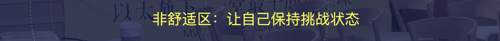

有了套路，直接做就行，为什么还要在非舒适区呢？

**【思考🙋🏻‍♀️】**大家认为"非舒适区"重要么？或者必要么？你们过去做的好么？

————

**极其必要**，没有非舒适区，**十分的练习，可能只有一分的效果。**

访谈过程中，我们发现很多人有很多习惯性的难题：

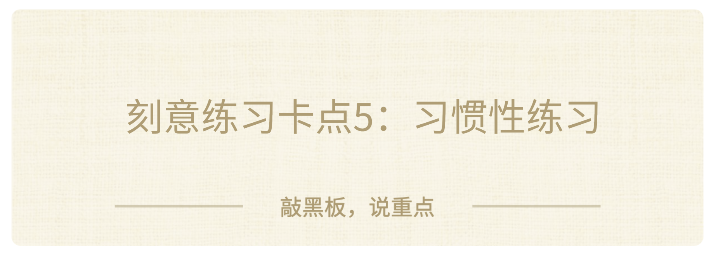

有些人，习惯做简单的，待在简单的舒适区，一直闷头执行，甚至无脑执行，陷入惯性，用一点点肌肉记忆就可以完成工作。

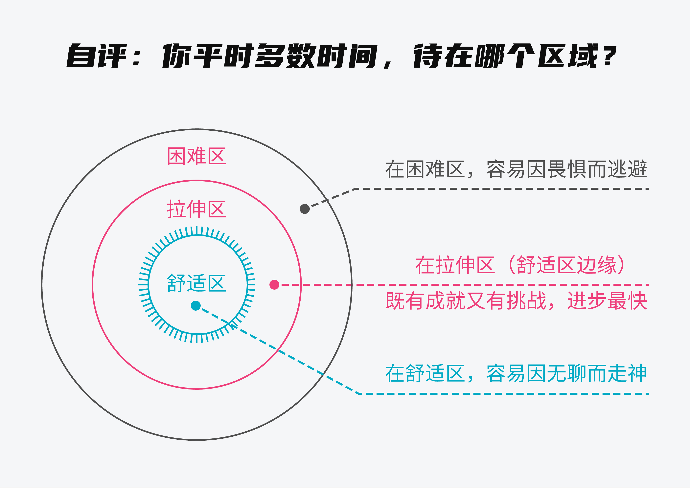

你常年开车，常年买菜，常年坐地铁，常年聊天，如果按照习惯、惯性做事，除了第一个小时/天/周会快速成长，后面几十年，基本上就没有什么大的长进了。

反过来，你的成长和进步，都在"**暂时不会**"的那个部分：

- 比如你做灵感闪现，前20个很轻松，第20-30个想方设法完成的部分，才是你的进步；
- 比如你做无氧器械，前3组很轻松，第4-5组咬牙完成的部分，才是你的进步。
- 比如你做五步法学习，自己写作业很轻松，说服老板很难的部分，才是你的进步。

哈哈，至于你的非舒适区，习惯在所谓的【拉伸区】还是【恐慌区】，没有严格的定义，看你的信心和眼下工作的容错空间。

我一般的习惯是，会努力拔高一些，适当恐慌，成长更快，比如：
1. 第一次设计婚礼，其实不太会做，就是拉满硬做。
2. 第一次马拉松大课，其实不太会做，就是拉满硬做。
3. 第一次大厂交付五步法，其实不太会做，就是拉满硬做。
4. 第一次设计房子，其实不太会做，就是拉满硬做
5. ......

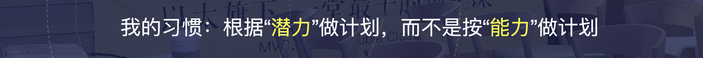

我习惯按照我的潜力做计划，而不是能力做计划，潜力代表已经把未来几周/几个月的练习的进步buffer算进去了，这样会倒逼一定会完成目标。

很多人觉得：没有办法啊，我一做就是很好了，已经成功了，就很不错了，成了身边人里面很厉害的了，才几次就陷入到"满意"的状态了。

你们有这样的困扰么？怎么破？

**【提问🙋🏻‍♀️】**对于商业管理范畴，保持非舒适区最简单的做法是什么？

————

答案是：**最佳实践。**

保持学习非舒适区最简单的方法，就是觉得自己不行，去学习和追求**最佳实践**。

一旦你or你的团队，开始有了最佳实践的习惯，往往就很容易跳出舒适区了，你的学习速度会大幅加快。

不知道大家有没有思考过一个问题：**当我们面对一个难题，尤其是复杂的新问题，有什么方法，可以提升能力，快速入门吗？**

很多时候，我们从业余到专业，需要大量的刻意练习。如果非要找一个金手指，可以让你在非常短的时间内，快速入门，快速进阶，那这个方法就是**最佳实践**了。

为了更有说服力，给大家分享一下这10年，我的最佳实践启蒙过程吧：

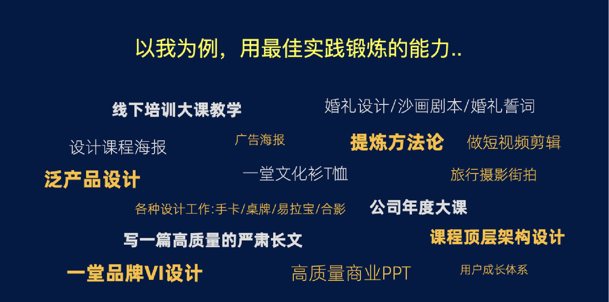

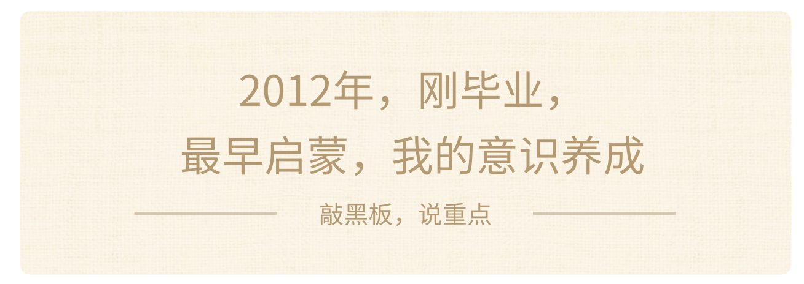

> 故事的开头，来自一次不经意的很小开始，最早是**jQuery的动画效果**，卧槽、卧槽。

> 然后一个晚上，去国内外动画案例库看，把见识刷满，然后就再也没有卧槽过了。

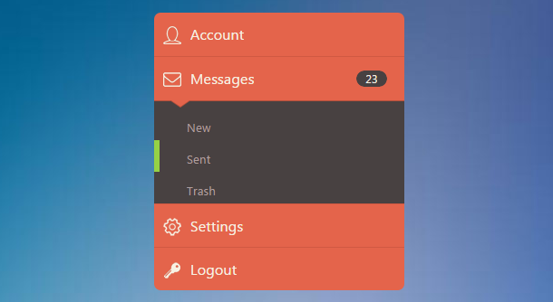

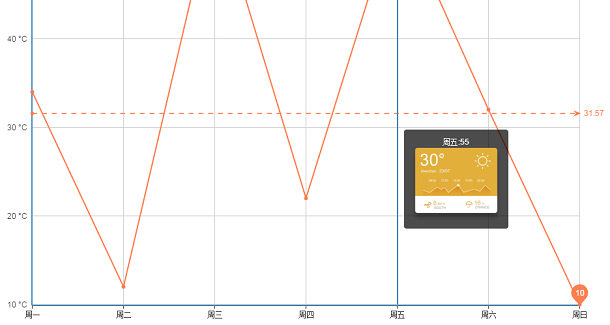

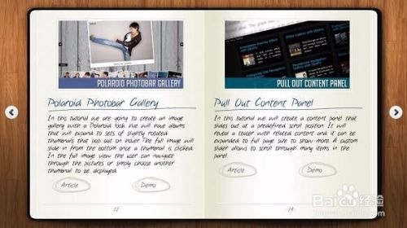

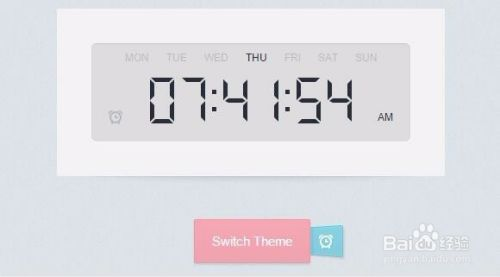

这种**极速提升**见识和执行力的感觉太好了。

别人“卧槽”、“惊为天人”的东西，在我这也不过如此了。

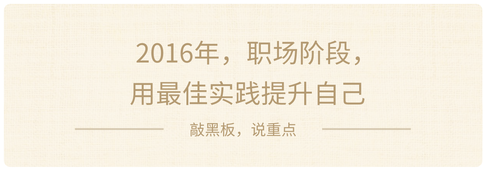

在接触刻意练习以后，我突然意识到最佳实践的价值，自己摸索太慢了。为什么不找最厉害的，直接临摹，然后直接做一个类似的呢？

这几年，我曾经给过自己几个任务：
1. 我现在有两周空闲，我想练习写一篇好文章，怎么办？
2. 我每年只能练习一次旅行摄影，一次有10天，我该怎么办？
3. 我只有10次训练机会，如何成为这个培训机构最好的PM老师？
4. 我只有一个晚上，如何掌握专业商业PPT的制作能力？
5. 我只有一个晚上，如何掌握优秀的标题党的基本制作能力？

**于是我做了很多专题学习和研究：**最好的B站科技区UP主，最好的旅行摄影集，最好的严肃长文作者，最好的产品经理培训课，最好的产品经理简历模板，最好的项目管理，最好的演讲，最好的商业演讲PPT.....

追求最佳实践的最大好处，可以让我在**第一次做就能达到60分（专业）**，并且在未来的N年可以保持不断追求进步、挑战难题的工作状态。

然后到了2018年底，开始做创业培训，一堂这个业务。

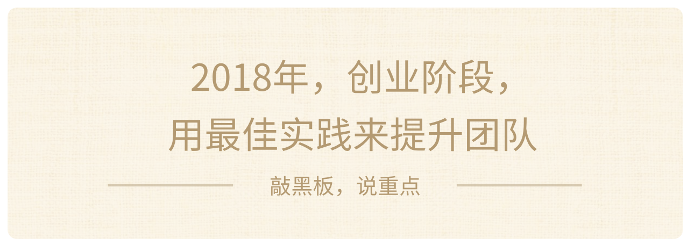

产品内核要足够独特和清晰，至于过程，能借鉴就借鉴，能抄就抄。

我之前分享过最早一堂MVP一周发布，其实是参考了**三个维度的最佳实践**：
1. 课程架构：三节课+Udacity
2. 文稿制作：得到
3. 用户运营：混沌大学

在认知不够的时候，直接发布**第一版MVP**，产品质量，基本就**达到了行业内专业的水平**。

然后这两年，就在各个维度上，开始提炼、带着团队练最佳实践：

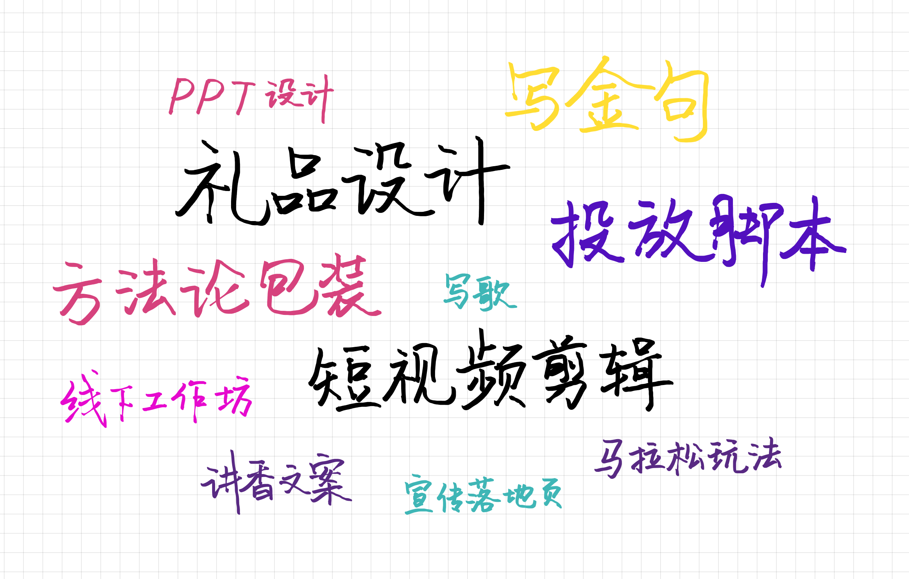

> 礼品设计、短视频剪辑、投放脚本、讲香文案、马拉松玩法、线下工作坊、PPT设计、写歌、写金句、宣传落地页、方法论包装

好啦，关于“非舒适区”我说清楚了，最后给大家一些核心建议吧：

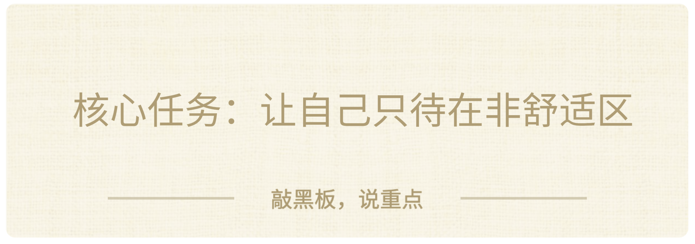

我们做了一组爆炸式研究：

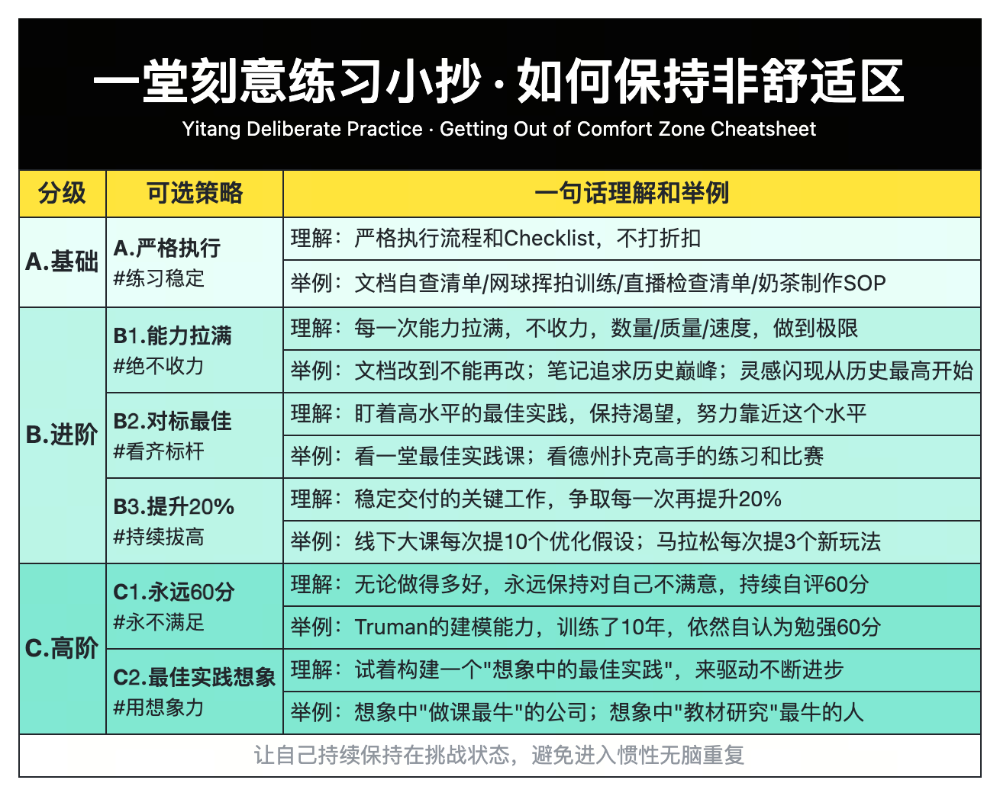

目前我们所有工具箱里的，最高水平的策略是C2，如果在某些领域，你真的已经领先了，没有最佳实践了，可以试试我最近在用的方法：**最佳实践想象。**

本质上，是不是真实的最佳实践不重要，走到最后，**真正能限制你的，只有你的想象力。**

为了做课，我们搜集了内部一些保持在非舒适区的方法，如果你感兴趣，可以参考：

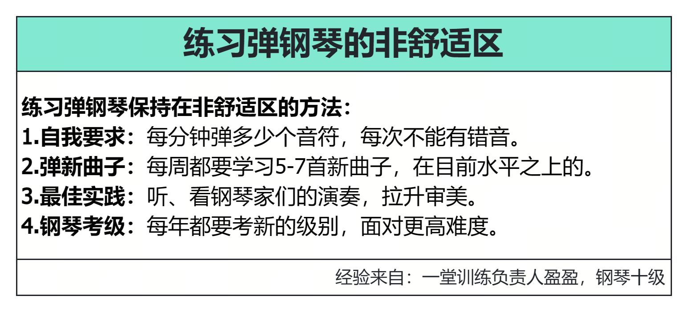

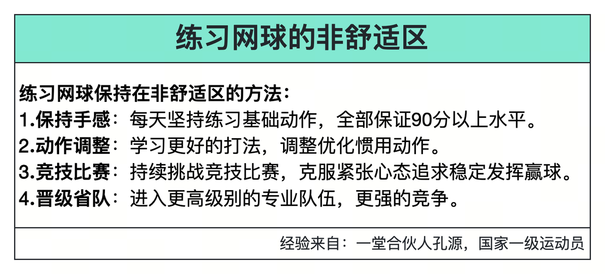

