### 第三要素：及时反馈

**【思考🙋🏻‍♀️】**对于一个练习来说，【及时反馈】重要吗？必要吗？为什么？

——————

**极其必要**：反馈能够帮你**理解姿势对错**，该怎么调整，从而避免在错误的路上一路狂奔。

当年去健身，我自己做各种有氧无氧练习，一个私教一直在旁边说服我，一个个抛卖点（动力），我都忍住了，无动于衷。最后他说了一句话，我直接付了几千块钱下单了，你们猜他说了什么？

————

> 姿势一定要对啊，要学会用力，不然容易拉伤，更糟糕的是，上次一个学员自己练，练得不对称，一块肌肉大一块肌肉小....

我脑补了一个画面，有点吓人，于是花了三四千块钱==。

我们磨课时候，发现有两个大的卡点：

我的老板，领导平时很忙，给我的反馈很少啊。

而且常常他言简意赅，只给评价，不给反馈。

- **评价：**最后的结果好坏。
- **反馈：**过程姿势好坏，下一次的调整。

我该怎么办呢？

给你一个核心建议吧：

我们要积极主动要反馈，不要指望领导事无巨细地讲给你听。

举个例子，我管一堂，相对比较话多&有耐心了，但我也会避免"话痨似的"一直强调，我不知道我的信息到了你这里，你有什么困扰。

如果你想练习，请你主动管我要反馈。

比如教研团队的春萍同学，加入一堂后，有一个很好的工作习惯，她喜欢说：
1. 次周复盘："你当时怎么想的啊，能说说你的思考过程吗？"
2. 磨课结束："你是怎么提炼这张图的？用了什么方法吗？"
3. 做课结束："我刚才没法同步记笔记，我是忽略了什么原则吗？"
4. ....

如果你觉得你的信息不够，那就主动索取反馈吧。

这种情况还是好的，更常见的情况是，没有专家给你反馈：

理想情况是有一个教练，像私教一样，在旁边指点你。但是我们绝大多数的时候，都没有教练啊，怎么办？

每次线下活动，我讲刻意练习，讲到这环节，一堆人都在很苦恼：现实世界，没有厉害的人带我啊，身边没人给我反馈，我没法练习啊。

我也想要一个身边的专家/高手，能够带我，手把手的给我指导，带我成长，一点点给我建议。

**【提问🙋🏻‍♀️】**先请大家思考一个很底层的问题：**反馈的本质是什么？图什么？**

————

**【划重点💡】**反馈的本质是：**反馈不是为了评价，而是寻找差距（GAP）。**

- 这个动作做对了，下次继续坚持。
- 这个动作做错了，下次换个方式。
- 这个动作做忘了，下次记得要做。
- 这个动作不够好，下次再跳一跳。

理解了这个本质，这几年一堂内部，在努力用各种方式在寻找GAP：

最近两年，一堂内部在尝试用三个方式，在大规模增加反馈速度和质量：

**【反馈技巧1💡】版本对比**：通过对比BeforeAfter，对比差距来讲。

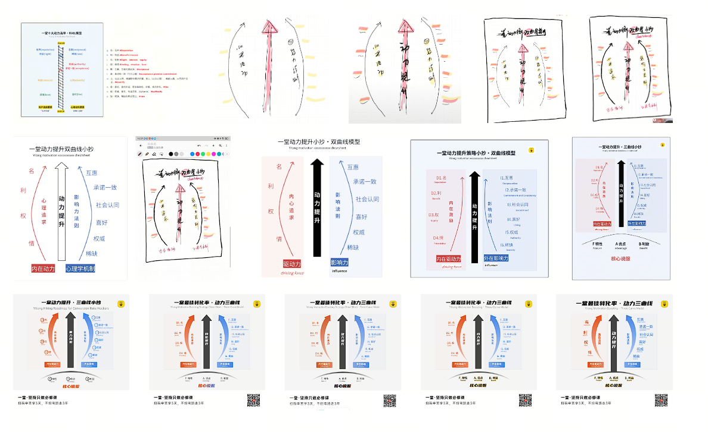

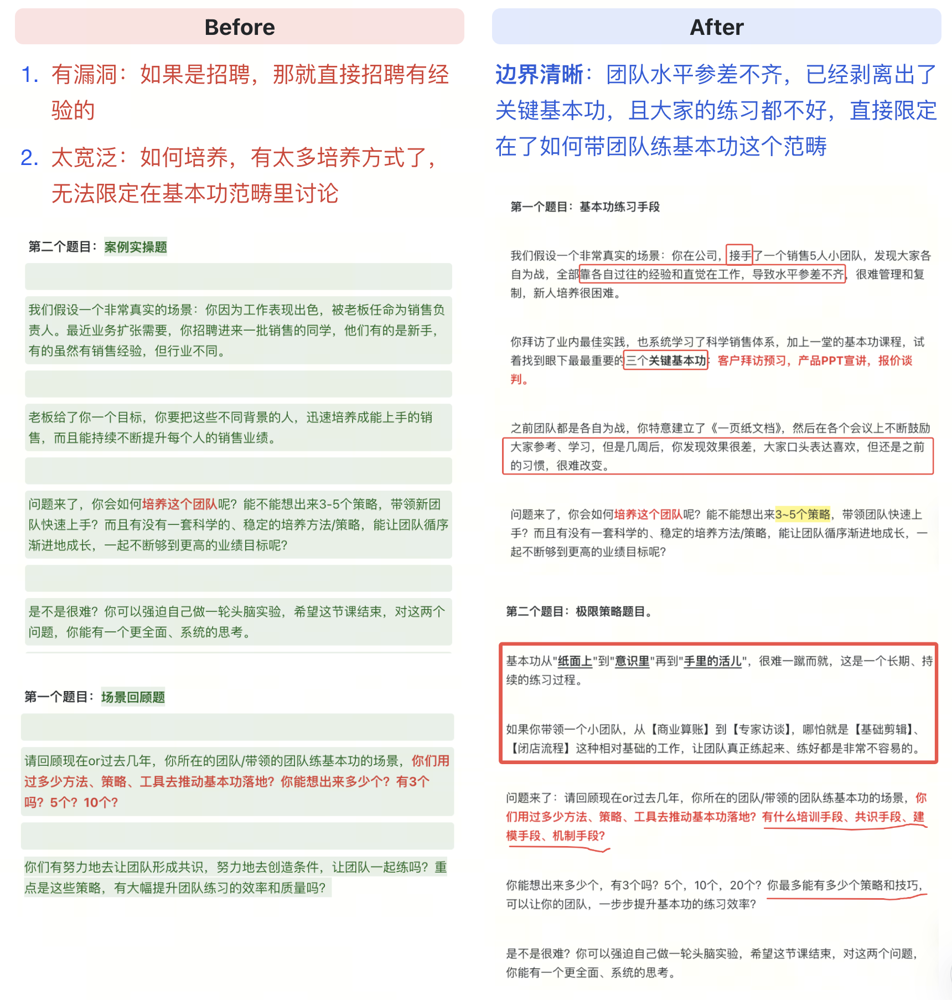

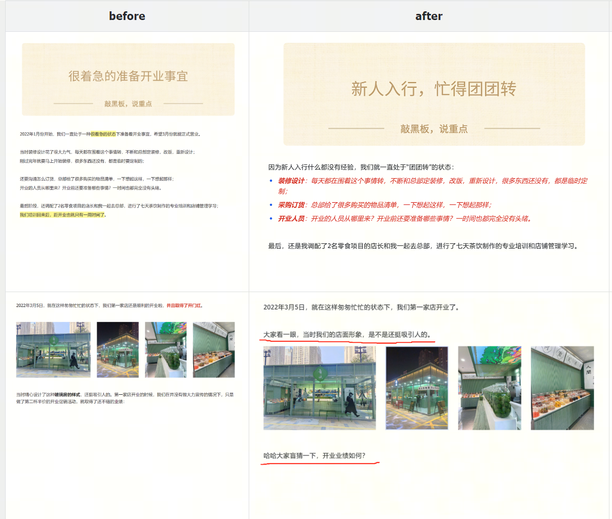

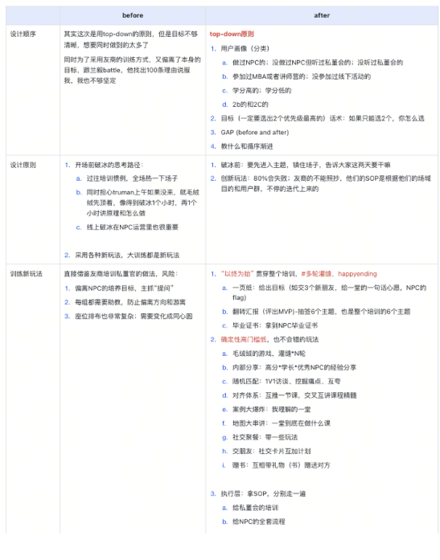

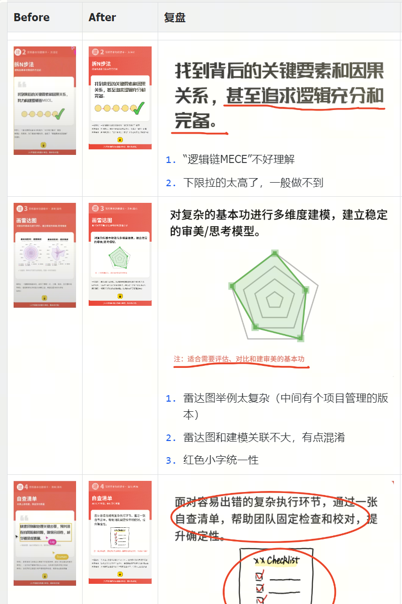

**【反馈技巧2💡】同伴反馈**：多人练习时候，可以交叉给建议和反馈。

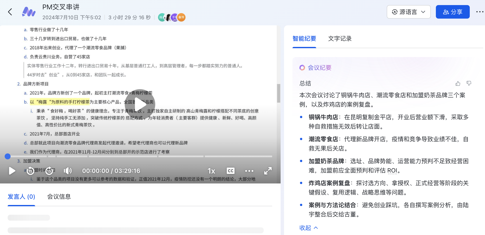

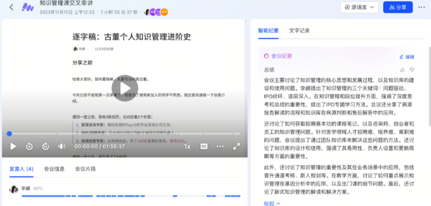

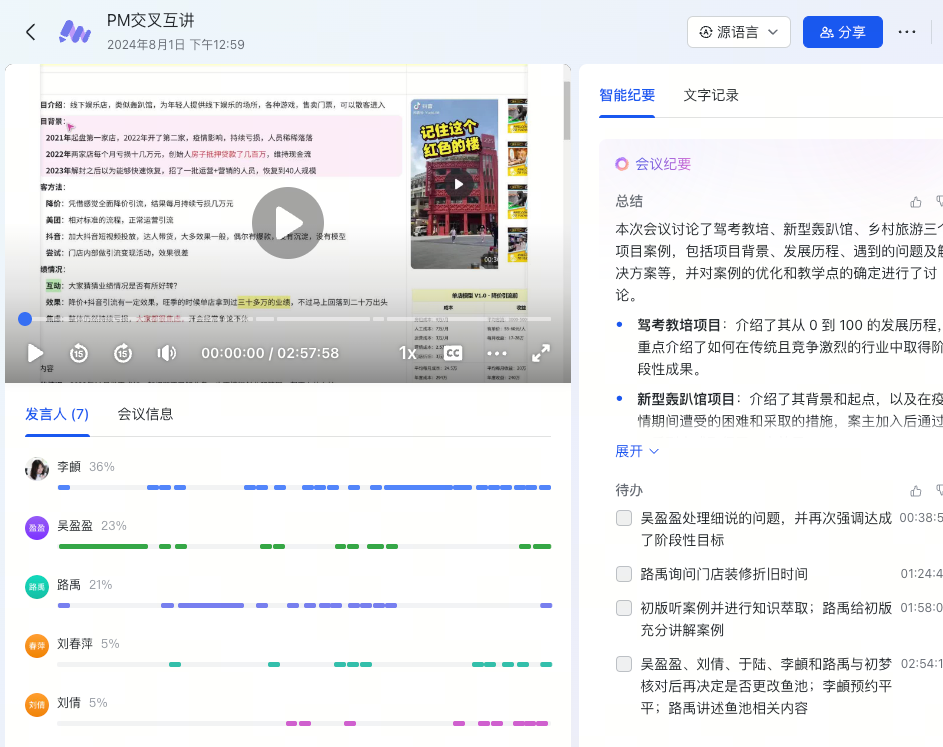

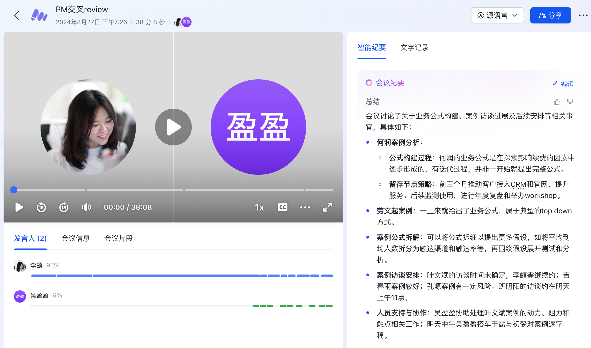

**【反馈技巧3💡】最佳实践池子**：用"扔进一堆标杆案例"里的方式，自己分析反馈。

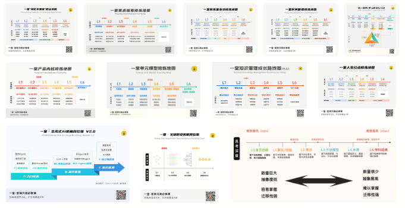

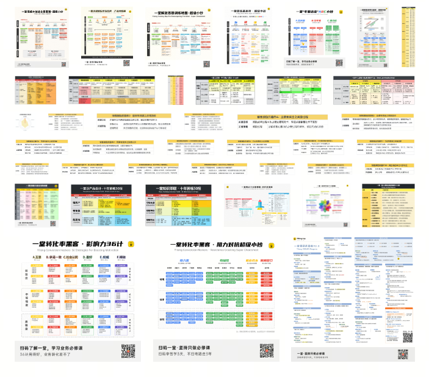

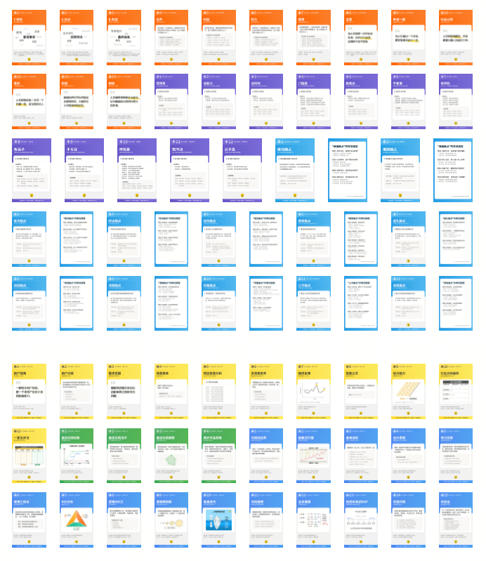

哈哈，据说当年富兰克林当年练习写作也是类似的方法：

> 《刻意练习：如何从新手到大师》书中提到：富兰克林年轻时希望提高自己的写作水平，但没有人教他怎么练习。一次偶然机会看到一个叫**《观察家》**的杂志，发现文章质量很高。于是他选择了自己喜欢的几篇文章，自己写一遍，再和这些文章进行对比，纠正自己写的版本。

我们研究团队，做了一个超级小抄：

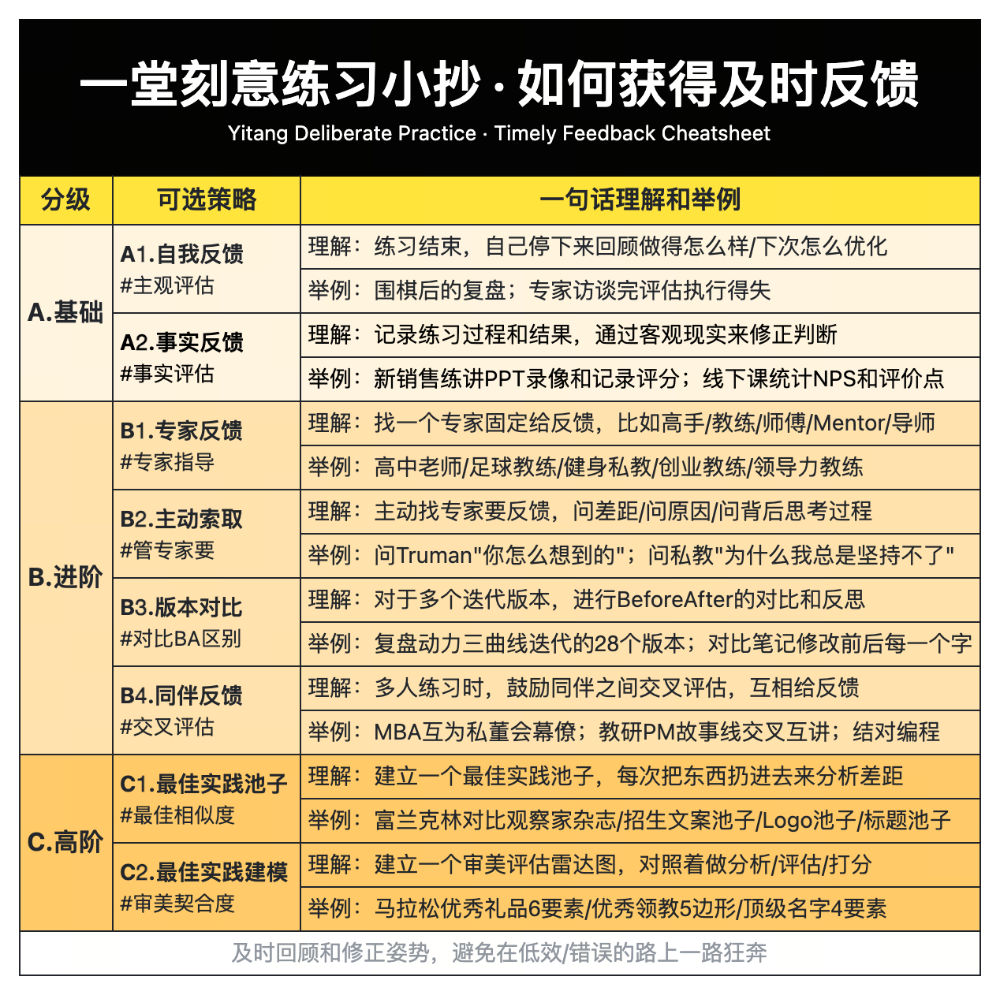

为了做课，我们搜集了内部一些获得反馈的方法，如果你感兴趣，可以参考：

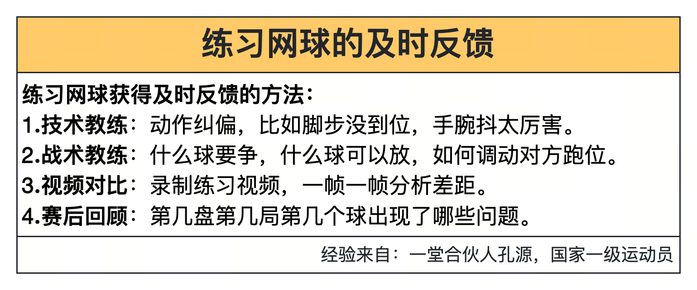

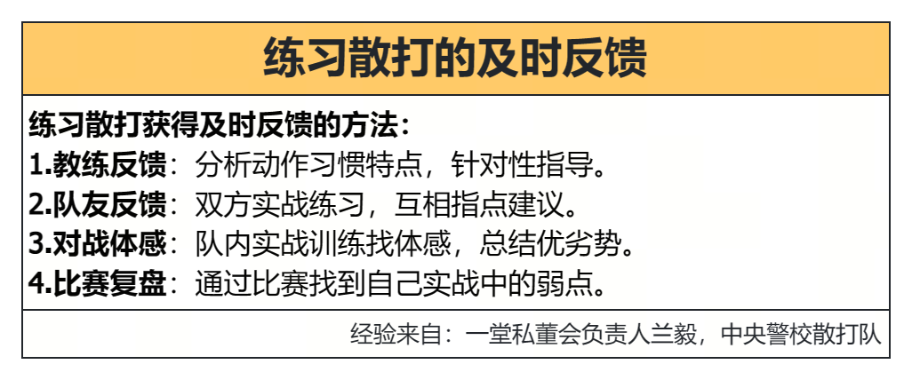

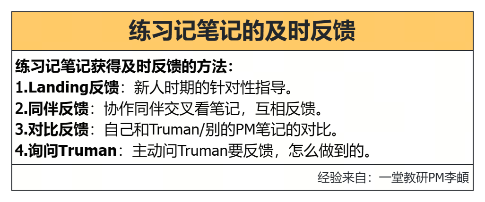

