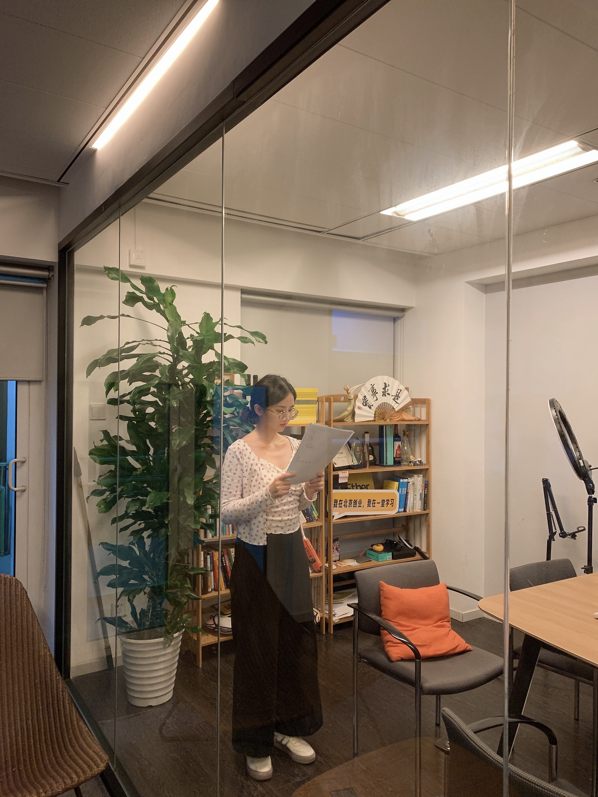
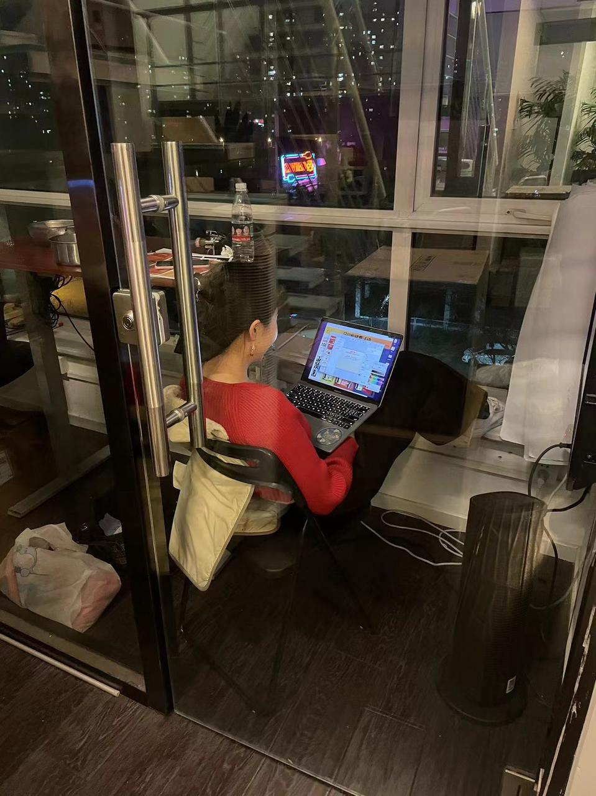
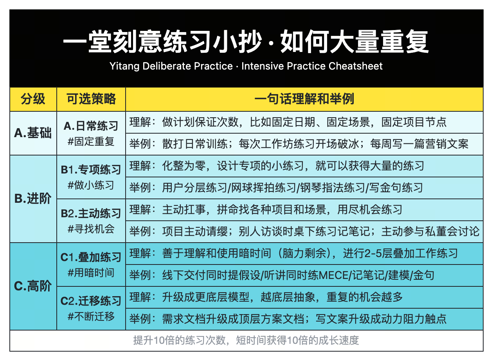
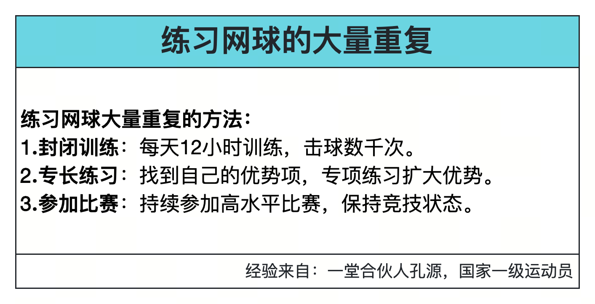
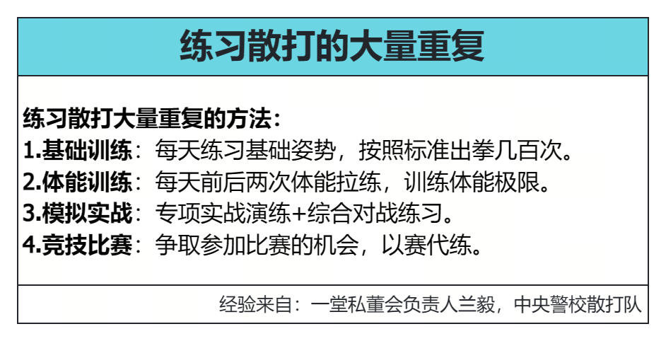
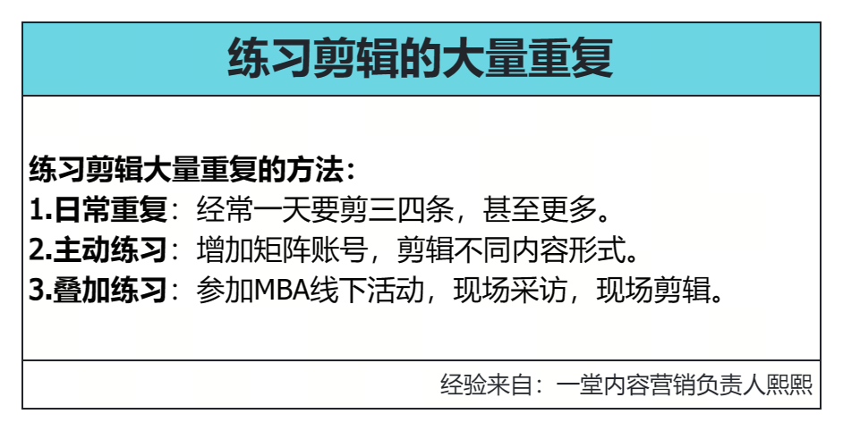

### 第四要素：大量重复

哈哈哈，终于到最后一个了，这个问的有些废话，大量重复重要么？必要么？

————

就像转化率三段轮里面的触点一样，重复是那个**循环次数**，重复数量上去了，对于最终的练习结果是立竿见影的。

但是，看似最可控，往往也是很多人容易忽略的。

所以，灵魂拷问：你最想锻炼的核心能力，你练习的次数足够多么？如何数量加倍？

**【提问🙋🏻‍♀️】**先提一个问题，听课和讲课，算不算重复练习？（比如听课作业xN，内部分享xN）
1. 都不算吧
2. 听课不算，讲课算
3. 听课算，讲课不算
4. 都能算吧

————

答案是：**不知道，看情况。**

注意，重复是为了具体的实操能力展开的：

- 默认听课，写心得，记笔记，分享都不算刻意练习（实操为目标）
- 听和讲可以提升【套路】的理解程度，但不算重复练习。

提醒大家注意：知行合一很重要，多写复盘&推演作业，少写心得作业。

> 岸边看游泳，不能算练游泳：）

好有了这个基础，我们做一个有趣的互动：

很多人都说想跟我看齐，修炼产品能力，但大家的数量得跟上啊。

**【猜猜🙋🏻‍♀️】**记笔记，我大概做了多少次？（10年）

**【猜猜🙋🏻‍♀️】**逐字稿这个基本功，我用了多少次？（5年）

**【猜猜🙋🏻‍♀️】**灵感闪现，我大概做了多少次？（2年）

————

大概的数量：笔记x1500次，逐字稿x500篇，灵感闪现200轮。

其中本职工作大概只占到30-50%，有大量的工作都是我自己给自己找的练习机会。

> 如果其他条件一样，我的循环次数比你多5~10倍，能力比你强一倍，很公平吧==。

**【案例💡】**还有一个例子，在我讲了《逐字稿》的课之后，很多人才意识到，公开发言、讲课和说话也能刻意练习。

但是大家猜一下，整个一堂其实掌握『逐字稿』能力，**刻意练习最透的人是谁？**

__

伍月班主任，第一次上直播，你猜练习了多少遍？

> 刚刚加入一堂时候，学习同行实践，严格写逐字稿，

> 后面复盘时候说，两周时间，改几十遍，摄像头前练习200+遍，不断重复就变成一个合格的班主任了。

大家可以想想，如果你想掌握一个技能，总结了一堆技巧，看了一堆最佳实践，拿了一堆反馈，**但就是不练**，你们的水平跟愿意去练习的同学，**最后会差多少？**

上次在MBA进阶营，我记得同组有人问屠玉峰大哥：

> 你的五步法分析能力好厉害，是怎么练出来的？

他就给了一个简单答案：

> 找各种机会去拆，2年之内，你拆/讨论100个画布，自然就会了。

是啊，100次拆解/讨论，可能绝大多数学员10年，50年都凑不够这个数量。所以说，**重复和勤奋**是这里面最容易控制的部分。

磨课时候，我们发现了两个卡点：

我也想来练习五步法，ROI，动力阻力，平时没什么机会啊？一个项目就几个月，下次练习早就凉了，没有项目让我练啊。

你们有这个困扰么？**怎么破？**

————

我最近经常说一个口头禅：**也没人拦着你啊。**

在教研内部，我经常跟大家讲，别找机会少的借口，公司遍地都是机会，没人拦着你啊。

比如，的确每周只有一个课题+一个主要PM，但如果你愿意主动练习，每周至少能有10个机会：
1. 主动脑暴：自己**灵感闪现**一轮过往的经验、案例和困扰啊。
2. 桌下练习：不是你的课，你也可以同步偷偷做一份**大纲设计**，参考学习。
3. 同步笔记：Truman**记笔记**的时候，你可以自己独立记，然后对比差异。
4. 主动扛事：主动扛一部分**逐字稿**，帮助完成一部分内容。
5. 固定重复：每次内测课，不管最后会不会采纳，主动写一份**招生文案**。
6. 同步提炼：磨课的时候，努力拉满，**提炼方法论**，做到自己能力上限。
7. 练习包装：围绕方法论的内容逻辑，努力先**画一版线框图**，训练自己的包装能力。
8. 访谈推演：Truman做**专家访谈**的时候，同步想如果是你，你会怎么挖掘提问。
9. 练习解读：围绕每节课的方法论，主动想出**十层解读**，大量做加法练习。
10. 迁移练习：每次做卡牌设计，回到**泛产品设计**的基本功上，去做练习。

我带了这么多教研和GAP的同学，是不是愿意练一目了然：**有些人开会就在那呆着，而有些人已经把记笔记、MECE、灵感闪现、访谈基本功练了好几轮了。**

所以，练习不能是被动任务驱动，而是靠主动练习驱动，主动去寻找各种潜在的机会，主动练习。

最后一个卡点：

太忙了啊，项目都做不完，没时间练习，怎么办？

————

核心策略有三个：**融入日常，拆解小练习，叠加时间。**

教研团队做了一个超级小抄：

为了做课，我们搜集了内部一些增加重复次数的方法，如果你感兴趣，可以参考：

