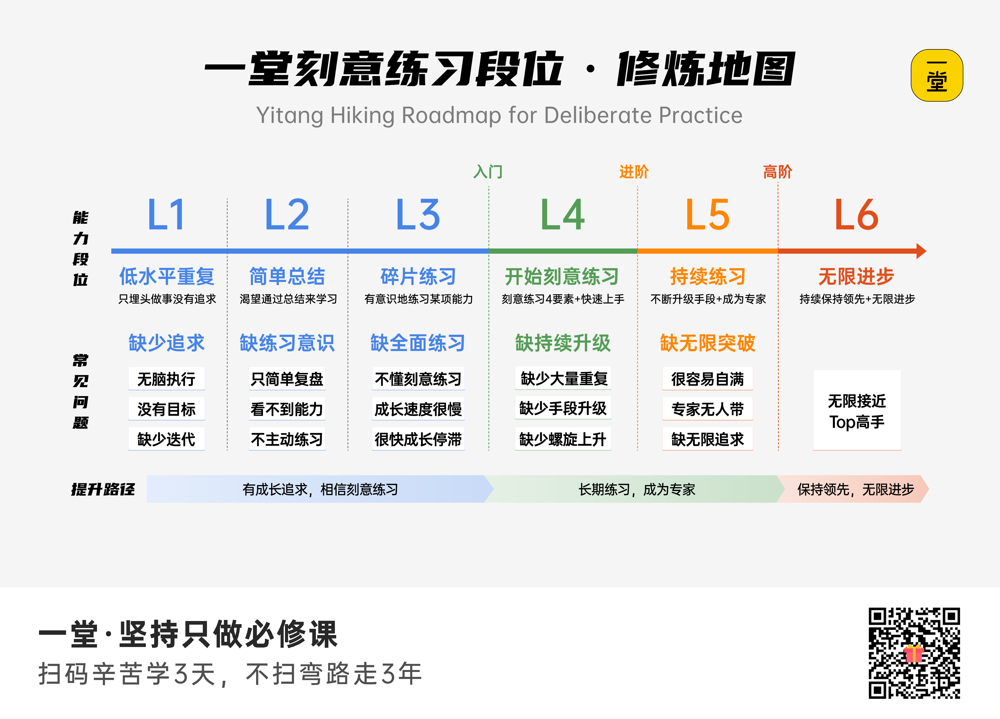
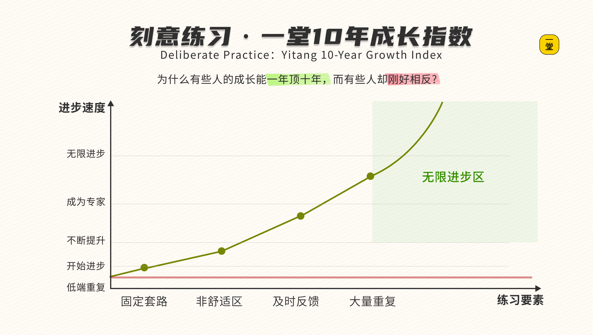
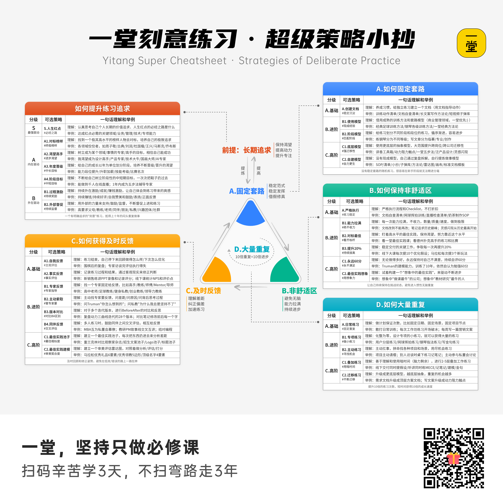
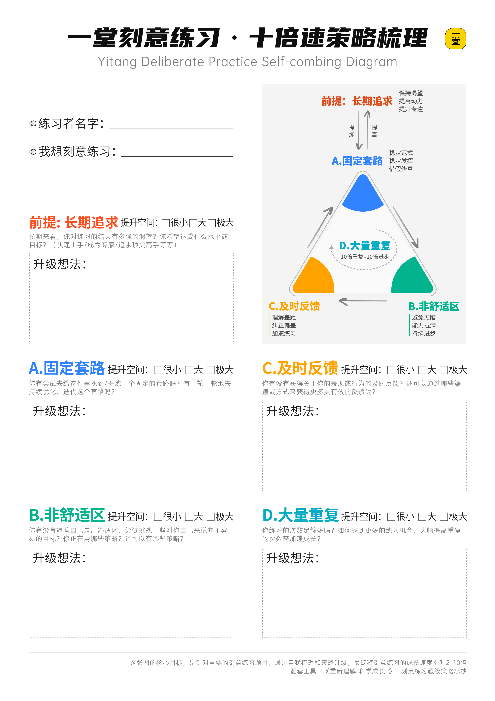
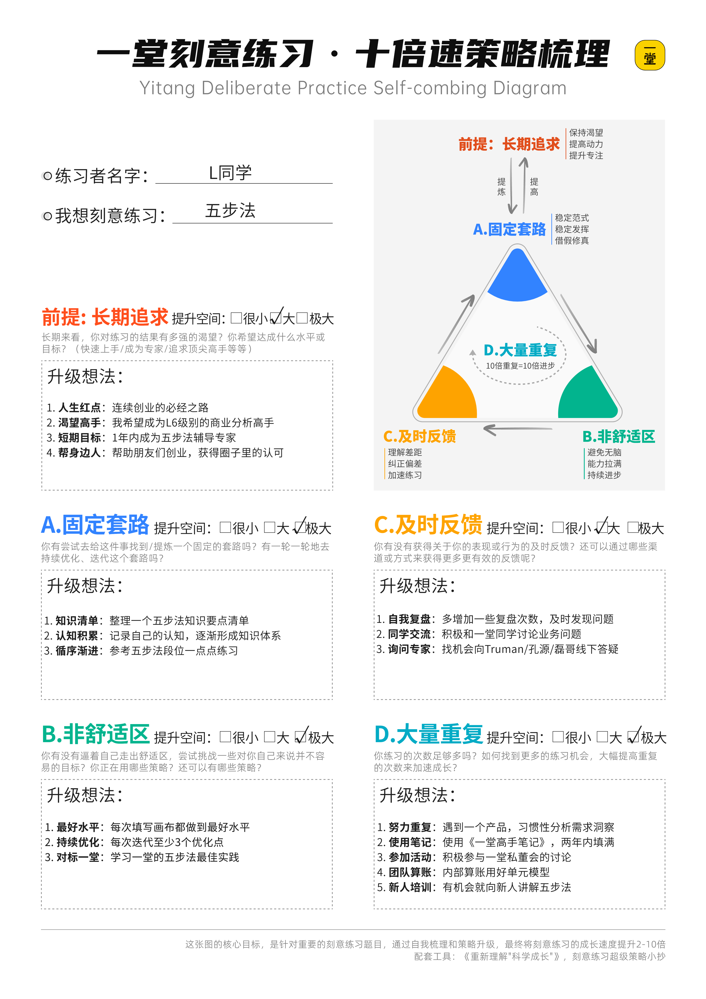
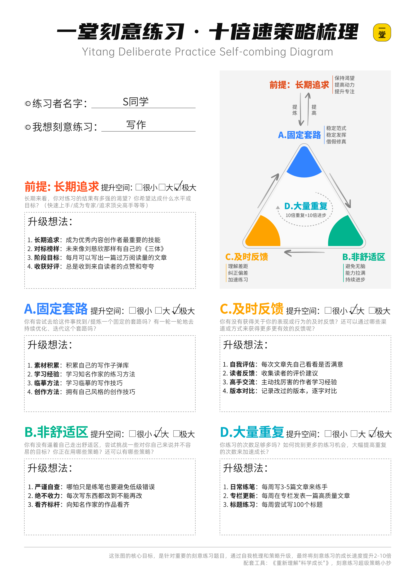
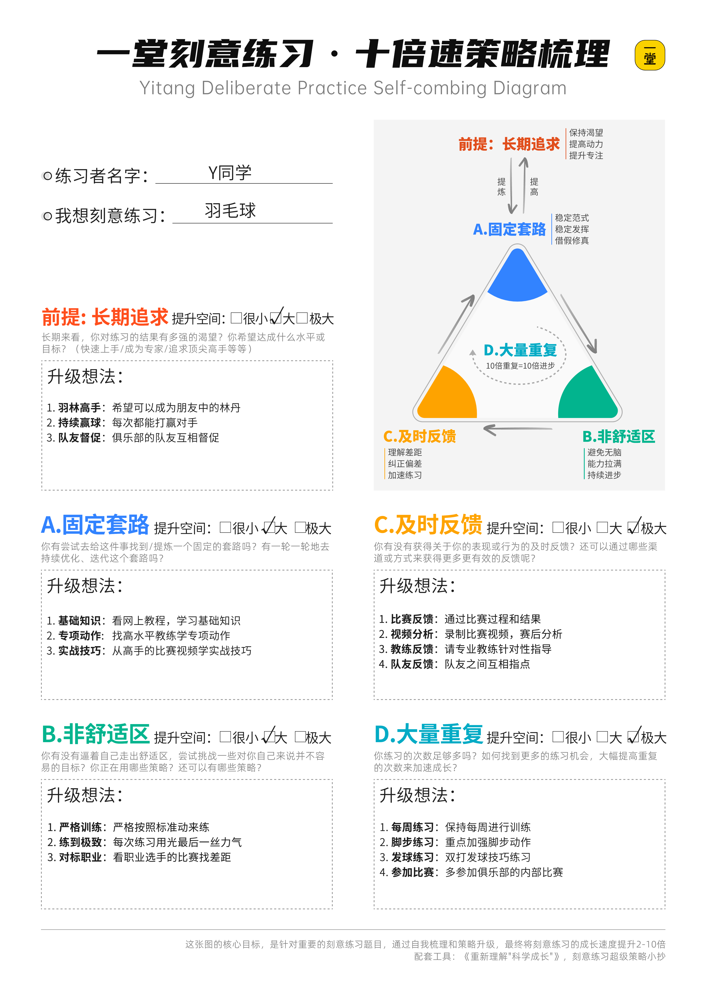
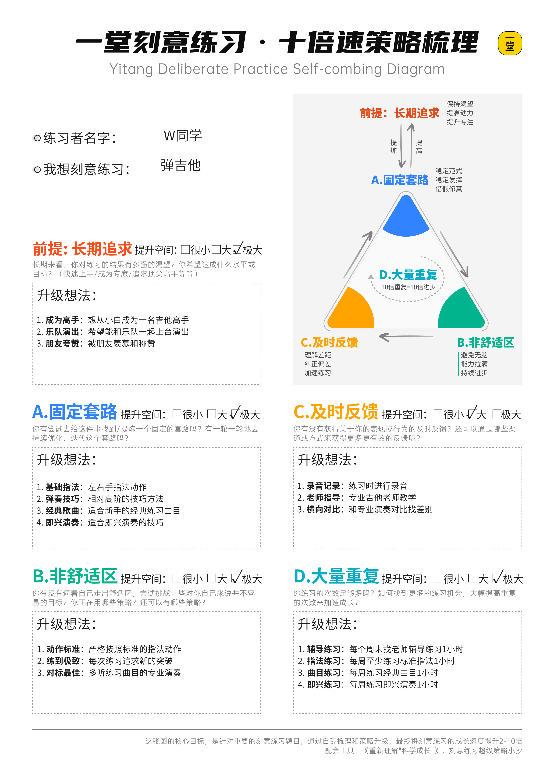

## 开始训练：拥有你的十倍速进步

最后一个课题，我们来讲讲，这节课的"**核心理念**"到底是什么？

为什么开篇，我说，这节课是我对于大家最恨铁不成钢的一门课？

### 信心工具：相信成长而非天赋

第一次接触《刻意练习》，我也很颠覆，很违背我的常识。

真的大量的高手，都是练出来的吗？

身边人厉害，到底依赖的是天赋还是努力？

优秀的团队，到底是人厉害还是训练出来的？

到现在，我在刻意练习的路上走了8年，我练了几十个题目，也有几个练出了业内相对Top级别的水准，甚至当年我认为极度依赖天赋的（商业分析&商业直觉&产品Sense&创新方法），我竟然已经初步拥有，而且把它变成课程，公开交付了。

8年以后，我终于可以说这句心灵鸡汤了：**以大多数人的努力程度之低，根本轮不到拼天赋。**

至少到目前为止，我目光所及的身边所有工作，没有什么是依赖天赋才能做的，基本上靠长期的刻意练习、科学的笃定的训练，成为一个进阶专家问题都不太大。

我最近在公司里面说了一句话：

> 我不相信天才，我相信一切都可以被练习；

> 如果非要相信“天才”的话，那我希望我们都成为"**刻意练习的天才**"。

如何修炼呢？我们给大家准备了一个自我测评和修炼地图：

我曾经画了一个图，这张图很形象解读了什么叫做科学的"**一年顶十年**"：

我们绝大多数人都是普通人，没有所谓"一出生就NB的天赋"，也没有"持续拼八字"的绝佳运气，我们最好找一个**长期的、稳定的、不依赖运气**的方向，然后长期积累，然后把事情做成。

今天我讲了10个卡点：1w小时太吓人，能力太多了，套路太多太没用，套路太少太稀缺，习惯性练习，缺少非舒适手段，专家反馈少，没人给反馈，练习机会少，太忙没空练。

每一个难题都很大，每一个很反人性，每一个都很辛苦，都容易把我卡死住。

但好消息是，刻意练习给了我们绝佳的机会：只要我们努力避免卡住，让自己长期“**拼命待在无限进步区**”，凑齐四个要素，然后按照最正确、最科学的姿势一直练下去。

早期可能不显眼，但一年后，三年后，五年后你抬头再看，你身边已经极少有能竞争的对手了，他们早就停在某一个位置，不能寸进了。

### 策略工具：你的武器库

具体怎么提升呢？今天我们给了大家一张方法论框架，以及5张策略小抄。如果把这些组合放在一起，会怎么样呢？

> 注意：这张图打印A4勉强凑合能用（费眼），建议A3尺寸，看着还行，贴大海报很爽。

如果你相信刻意练习，如果你想不断优化自己的练习，你90-99%的提升策略，基本都在这个超级武器库里了。

### 提升工具：梳理清单

哈哈，最后送给大家一个惊喜吧，我曾经内部辅导&优化过很多的人的练习姿势，这一次，我尝试把我辅导的过程，封装成了一个：**《十倍速策略梳理画布》**

如果你真的想提升某一个练习的速度，**想提升2-10倍**，你可以停下来，**花15-30分钟**，认真回顾并且把这张表填满（借用上面的超级武器库），然后贴在墙上，努力知行合一。

同样的时间投入，通过更科学的练习方法，你的成长速度提升2-10倍，就有了很高的确定性。

我们做了一些填写的Demo，大家可以收藏，自行参考：

最后送给大家一句话话吧，作为这节课的升华收尾：

坚持科学的长期刻意练习，未来一定会美好到我们现在设想不到的样子。

同学们，加油吧~~！