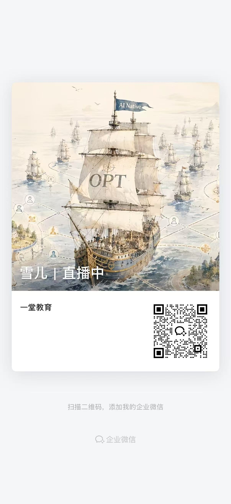
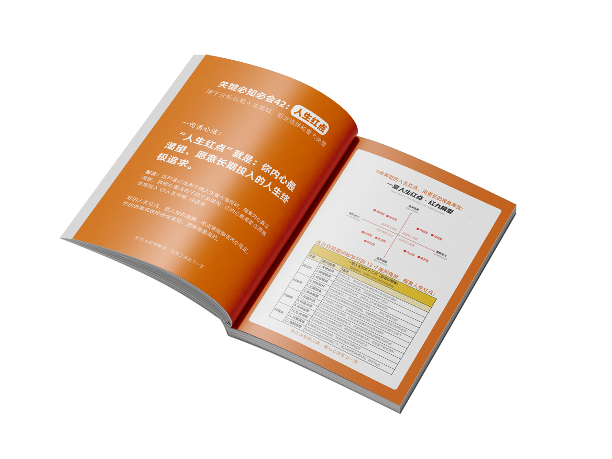
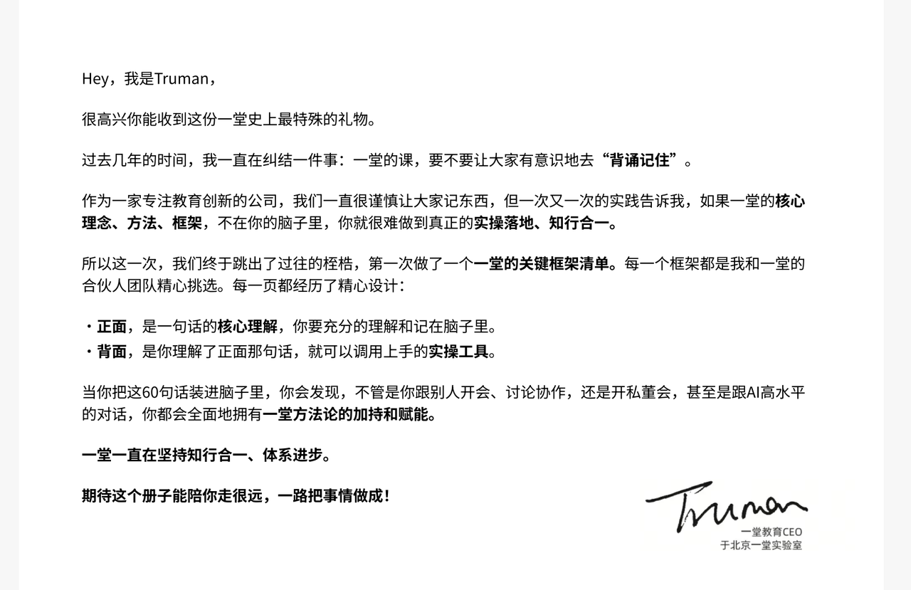

## 全力出击，三个月后见！

好啦！最后最后，在启航之际，我想送给大家三句话：

**第一句：先出发，再升级。**你不需要等所有东西准备好，才开始第一次尝试。先让第一个 Skill 跑起来、先让第一个Partner 工作起来，先让第一个 AI 员工承担一个小任务。

船开出去之后，你才会知道风从哪里来，哪里需要调整，哪里值得继续加速。

**第二句：把卡点变成航标。**这三个月，你一定会遇到各种各样的卡点，大航海不是为了让大家一直处在舒适区。

你可能会发现，自己的 Prompt 不好用，AI 员工总是跑偏，资料不够完整，工作流接不起来，团队讨论也可能出现分歧。你会遇到：不知道怎么拆任务、不知道怎么写上下文、不知道怎么验收结果、不知道该不该自动化、不知道团队如何协作。

但请大家记住：**卡点不是你掉队的证明，而是你正在进入新海域的证据。**每一次返工、失败和推翻，都会帮你看见一块原来没有写在海图上的礁石。

把它记录下来，把它复盘清楚，把它变成下一次的规则、模板、检查清单和经验，当别人还在重复踩同一个坑的时候，你已经把这个坑变成了自己的航标。

**第三句：一个人只能微微点火，一群人把火烧成航线。**这三个月，你可以是一人战队，但你身边还有一起航行的同学，有愿意分享经验的专家，也有你正在训练、正在组织、正在逐步变得可靠的 AI 船员。

把你的问题带上船，把你的经验带上船，把那些还没有想明白的东西也带上船，你帮助别人解决一个问题，别人也可能在你卡住的时候，给你一个新的方向。**慢慢地，一个人的尝试，会变成一群人的方法；一个人的经验，会变成整个船队可以复用的资产；一条原本只有你自己看见的路，最后会变成大家都能继续走下去的航线。**

所以，这次大航海，我们不需要已经准备完美的人。我们希望调动那些：愿意先出发的人，愿意在卡点里继续调整的人，愿意把自己的经验贡献出来，也愿意和 AI 一起重新学习工作范式的人。

**船已经离岸了，从今天开始，我们一起认真验证一件事：当我们开始像带团队一样带 AI，像建设组织一样建设上下文、流程与资产，一个人的工作方式，究竟可以发生多大的变化。**

**接下来三个月，让我们一边航行，一边造船；一边解决问题，一边搭建自己的 AI 团队。**

> **先出发，再升级；把卡点变成航标；一个人点火，一群人把火烧成航线。**

请大家记住：
1. AI 不是只用来回答问题的，它可以开始参与工作。
2. 知识不是只用来收藏的，它可以被组织、调用和复用。
3. 团队也不一定要从很多人开始，它可以先从一个人和几个 AI 角色开始。

三个月很短，它可能不足以让每个人一步进入理想中的 AI Native 状态，但三个月也足够长。足够我们：

> - 完成第一次封装

> - 训练第一个稳定角色

> - 搭出第一条工作流

> - 留下一批真正可以复用的 AI 资产

> - 认识一群未来还会继续同行的人

所以，从今天起：**2026 AI 大航海，正式扬帆启航！**祝所有船员：**航程顺利，持续实践。三个月以后，我们不只是回到岸上，而是每个人身边，都多了一支真正开始工作的 AI 团队。**

**【承诺🙋】**正式启航了：**一定靠岸，我们终点见！**

最后最后，请船员们 **务必添加 **雪儿微信，这是AI 大航海**项目组官方账号**。专门用来提醒大家新的资料、任务、作业截止。

后续三个月，请大家务必留意雪儿发来的信息，不要错过重要通知。这会是航海期间非常重要的信息通道：

另外，还没有进群的同学，也可以扫描下方二维码加入**专属 AI 大航海群**。还没进群的同学也不用担心，我们明天也会陆续邀请大家加入～

好啦，最后多提一句：AI 大航海正式离港，所有大航海同学，条件允许的情况下，大家可以先把YAI、CLI装进你的工作系统。

上周六，我们给大家交付了一节足够硬核的必修课《一堂YAI第一课》，给大家系统汇报这半年一堂的AI探索，以及我们看到的**AI for Business**的一些最佳实践体系。

这两年在编程、设计、营销已经有AI的全面参与了，但是在商业决策、创业、复杂管理上的渗透率还很低，这节课我系统给大家讲了如何让AI真正进入复杂的高水平决策，完成AI原生的进化。

这一期既是课，也是一堂最重要的AI 产品发布会，也是很多同学未来5年AI新征程一个很重要的拐点和击穿。酝酿了半年，终于把我们 8 年以来，积累的所有课程、方法论和大量真实商业案例，变成了你可以直接调用的知识库和Partner，再通过笔记和CLI，接入你的工作循环！

这是一堂这一年闯过的三关：

这是我们的Partner列表：

♥️ 有了一堂CLI，你的各个Agent都可以调用一堂的体系，积累你的学习资产！还没听过的同学，可以趁这两周热身启动期，补一补～

👉【文稿】https://yitang.top/fs-doc/217da0c5f7d334b601c53526ed06f90d/MZFMd7mYPofbJ2xQhdEcS3Xrnvd

👉【回放】https://air.yitang.top/live/8dBvIUUHF2

👉【作业】https://yitang.top/homework/cLIm6aabc5d2b454/edit

⏰ 回放、文稿及作业截至：**本周日（9.27）晚24点**

hhh分享一下我熬了一个通宵Vibe的YAI订阅落地页：

为了降低决策和试错成本，我们最终采用的是“**月度订阅制**”，每月支付小额订阅费，自动订阅，如果某一天你后悔了/有更好选择，你可以直接取消订阅，下一个月就不扣款了。

作为一个产品驱动的公司，我极力避免把一堂变成了一个渠道、流量驱动的卖Tokens公司，我们坚定选择了**价值定价**（而非成本定价）。

**通过一个健康较高的利润，独立养活自己，然后投入到“AI研究建模”的飞轮里，不断推高上限，研发Partner，最终带来大家实现商业管理领域的真正AGI实现。**

所以，我很早就跟大家打过招呼了，我们定价会很贵很贵，肯定比豆包、通用LLM贵很多。之前我的定价预期是：**大概是一个实习生的工资，来帮你、你的团队、你的Agent完成每个月的全面升级。**

最后决定，早期用户还是给一个巨大折扣吧，先把种子用户培养起来。

最后定的月套餐价格，不需要实习生20多天工资，分别是三档：**1天，3天，7天。**

除了用量倍数差异，特别注意质变点：**思考版**可以使用CLI，**决策版**笔记基本自由使用，**领航版**基本实现高强度CLI自由，基本都够用，且一些高阶CLI实验功能开放领航版先试用。

♥️ 特别说明：暂时承诺6个月不涨价，随着Partner逐步完善，综合消耗额度持续上涨，随着CLI逐步升级，后期可能会涨价，涨价政策到时通知。

> 暂时第一版不支持升级，请大家直接买你们比较高的那个版本就好了。

**福利🎁1：**注意首月还有限时折扣，作为大家第一次订阅的福利折扣。

套餐越高，折扣越大，分别是：**91折，86折、77折。**

> 首月折扣，第二个月就是按正常价格来算。

**福利🎁2：**前1000个订阅成功的用户(¥109/¥119)，送你+1件堂三角，续费不舍得割舍的同学，你们回头可以再预约一件你喜欢的，自己留着，送好朋友，都是极好的礼品。

**福利🎁3：**如果你购买了决策版（¥259/¥299），我让班班额外给你寄一套**“大地图”+“K60”**吧，这是YAI磨合和练习口喷的神器，脑子里装着地图，

用20%的篇幅涵盖了一堂80%最高频的模型，并且增加了“极简解释”+”完整使用“，并且足够小足够薄，可以带在身上，很适合拿着这个和YAI对话，练习口喷基本功hh。

哈哈，最高档没有特别福利，也不需要，如果你想充分使用一堂YAI和“CLI打通一切”，且价格不敏感，那就不用纠结，不必算小账，买所有价格最贵的。

1. 情况1：你现在是业务一号位，管理人超过10人以上。
2. 情况2：每个月AI综合投入早就超过5000了。
3. 情况3：初步打算用一堂升级你的AI团队专业性。

一个实习生一周的工资，换你的整个AI团队科学x体系不止一倍，这个账怎么算都值得！

🔗支付订阅入口：https://yitang.top/promotion/yai

📖YAI使用指南：https://yitanger.feishu.cn/wiki/WPJWwKwI3iUCzqkGUzvc6i5MnNg
📝一堂CLI指南：https://yitanger.feishu.cn/wiki/XoFcwMmotigm7Ikv4RQc9TfQn0g