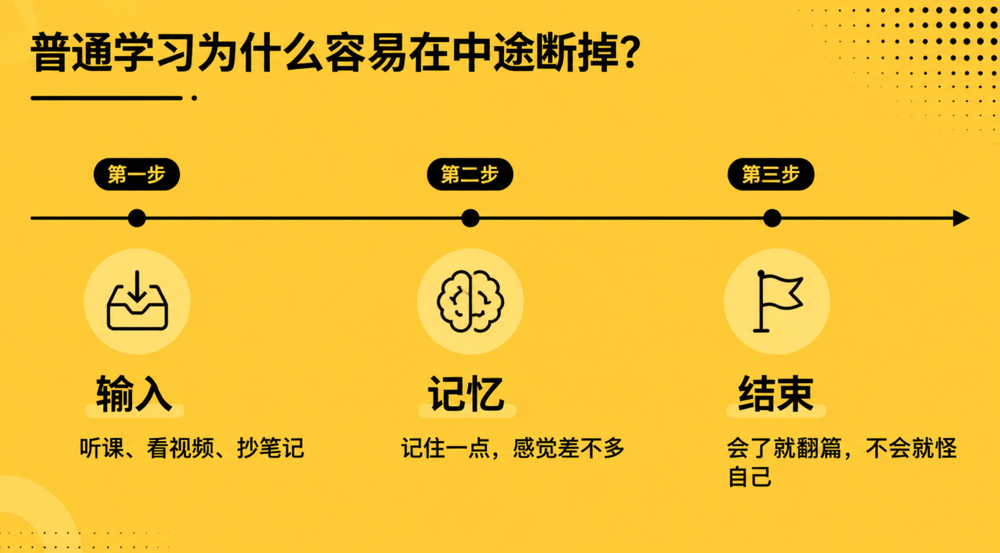
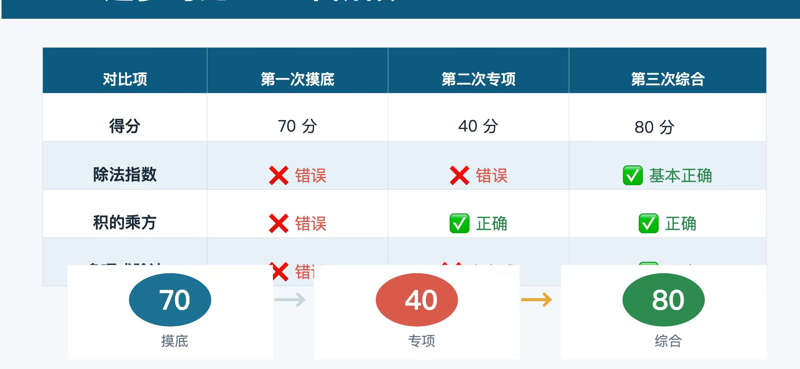
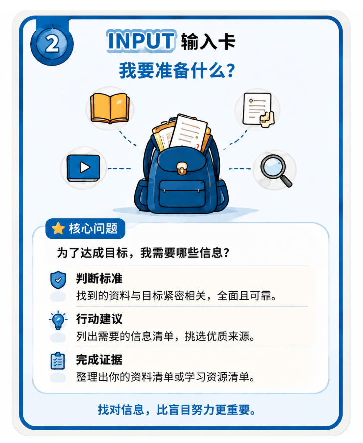
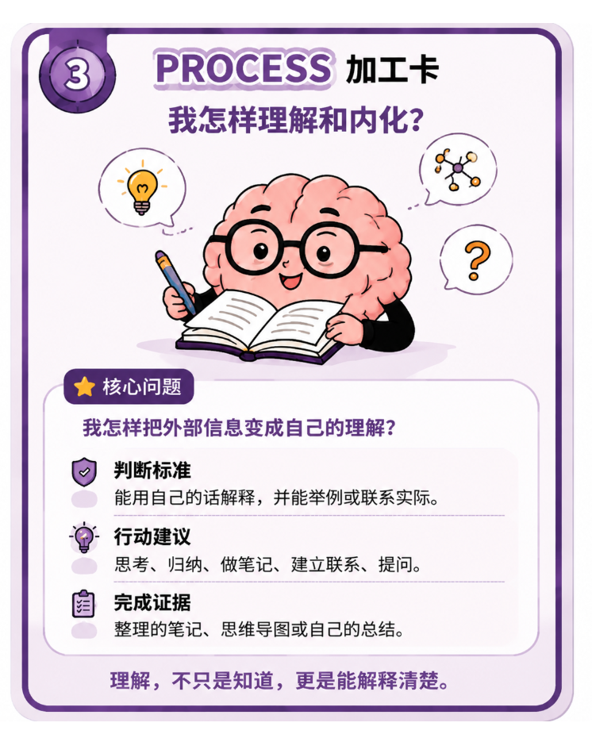
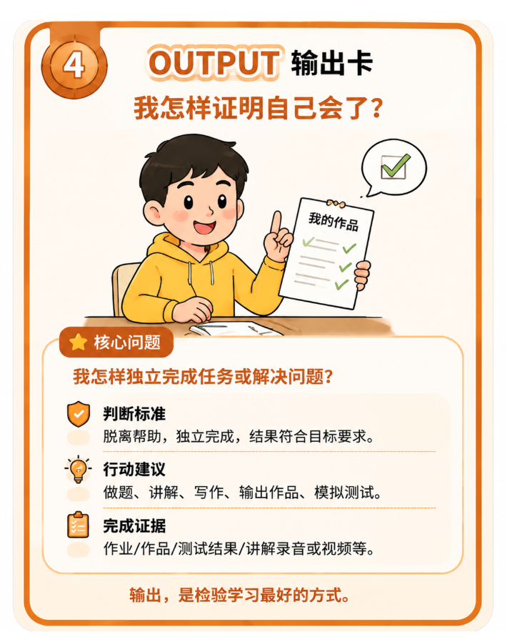
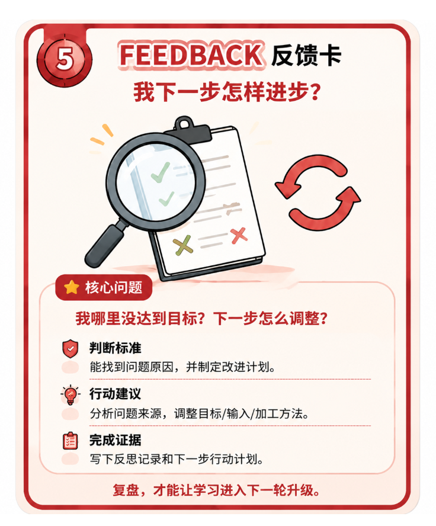
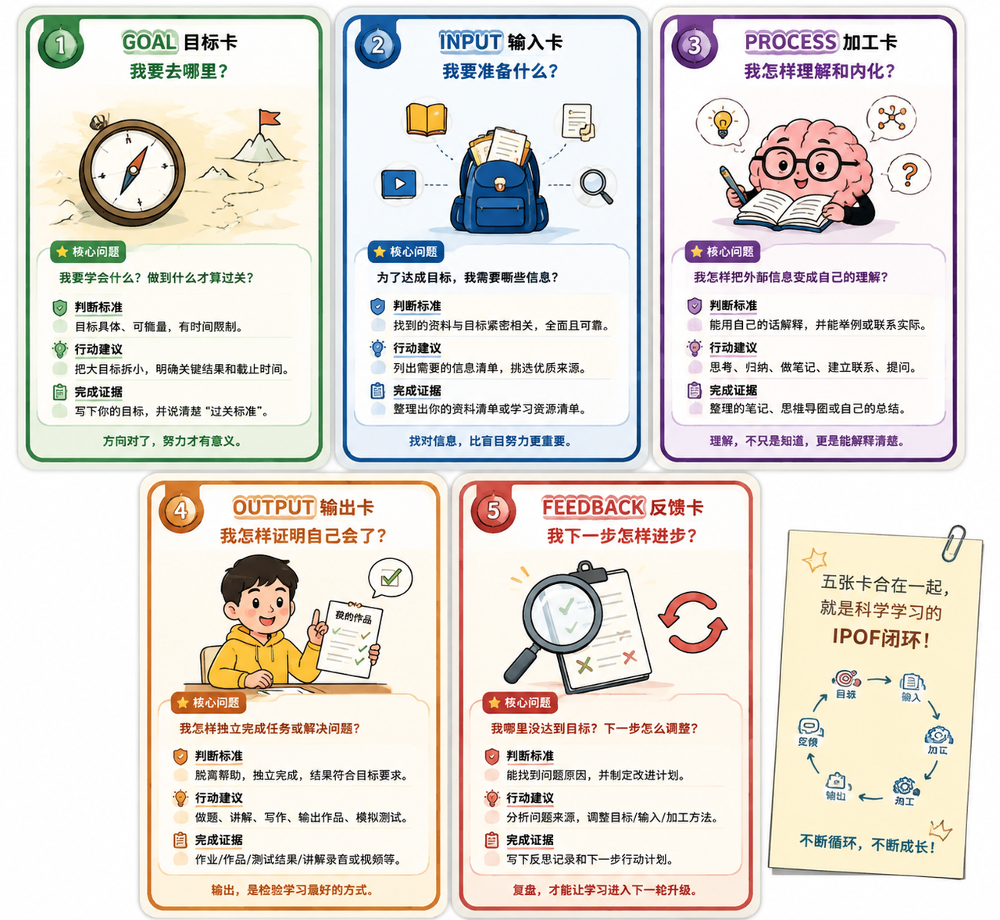
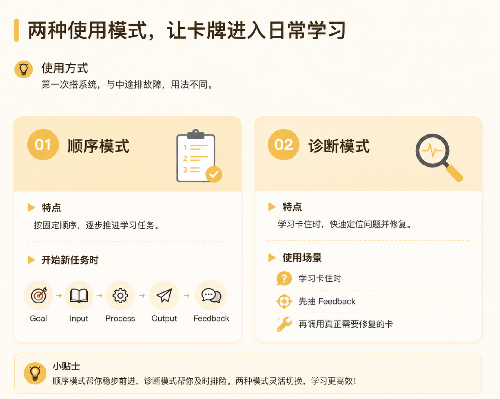
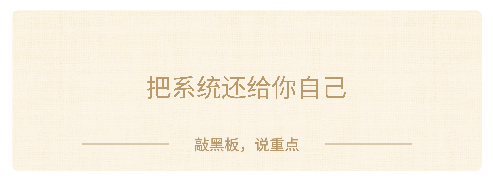

回放：https://yitang.top/homework/j6TG6a7c5839d7dc/edit

### **Part 1：建立期待**

各位家长和孩子们晚上好

陈思洁 CJ ｜ AI教育探索者

我深耕教育8年，站在AI时代开始重新思考“孩子到底应该如何学习”。

过去8年，我既做过头部教育平台的课程产品，

也创业做过青少年学习力项目，并联合创办个性化教育咨询公司，

长期参与孩子从学习能力诊断、学业规划到成长陪伴的全过程。

曾担任：

头部教育平台内容制作人

K12教育项目负责人

青少年学习力项目创业者

个性化教育咨询公司联创人

**目前专注探索 AI 如何赋能个性化教育，帮助孩子建立面向未来的学习能力。**

这些经历让我越来越意识到：

未来孩子真正需要的，不只是学会更多知识，

而是学会如何学习，拥有自主成长和解决问题的能力。

**所以今天这节课，我希望用五张「学习卡」帮助大家建立一套科学的学习系统，**

**让孩子不只是“学会一道题”，而是逐渐学会“如何学习”。**

**我特别喜欢一句话：“你的每一个行动，都在为你想成为的那个人投票。”**

今晚的内容可能有点烧脑，但当你选择来到这里，并坚持听下去的话，

你已经为那个更想成为的自己，投下了一票。

好，课程正式开始！

我们先来解决一个在学习中几乎每个人都遇到过、但很少有人认真想过的问题。

**我明明听懂了，为什么还是不会？**

先别急着回答，回想一下：你有没有过这样的经历？

老师讲一道题，你在下面一边点头一边想：**「哦，这个我懂了。」**

结果过两天遇到一道差不多的题——又不会了。

或者，一节网课看完，你觉得老师讲得特别清楚。

可一关掉视频，让你自己动手，突然就卡住了：第一步到底该做什么？

 **【🙋互动】**聊天框打一个数字：

> - 打「1」：我经常听懂了，但自己不会做；

> - 打「2」：我花了很多时间，却不知道问题在哪；

> - 打「3」：我已经有一套比较稳定的学习方法。

很多时候，问题不是我们不够努力。

而是我们误以为，学习只要投入足够多的时间——听得够多、练得够多、刷得够多，成绩自然就会提升。

但其实，**学习不是一件“埋头苦干就一定有效”的事情，它背后有一套可以理解、可以调整的方法。  **

今天，我们就用五张学习卡，把学习这件事拆开来看。

最后，你带走的不是几个听过就忘的知识点，而是**一套真正属于自己的学习系统。**

### **Part 2：学习实验——我真的学会了吗？**

不过，在我介绍这套系统之前，我们不讲理论，先做一个小实验。接下来播放一个视频，请认真看，视频结束后，我会问大家几个问题。

📹 Knots - How to tie a Bowline Knot. - 360p 393kbps.mp4

好，视频看完了。

刚才这个视频讲的是**如何打布林结。**

布林结被称为“绳结之王”，在航海、户外、救援，甚至日常生活中都有广泛应用。

现在我们来做一个小测试。

**【🙋互动】第一个问题：**如果现在给你一根绳子，你觉得自己能不能独立打出这个结？

请在回答：「能」或者「不能」。「能」的扣1 或者「不能」扣2

好，接下来进入第二个挑战。

**不允许重新观看视频。**

请你凭记忆，写出刚才打布林结的 3—5 个关键步骤。

如果现在真的给你一根绳子，你能不能一定打出来？

关键判断，你其实还没有掌握。

这说明一个问题：**看懂 ≠ 学会了**

**学习中最大的误区，就是把“看懂”误认为“掌握”。**

视频可以让你看到步骤，但只有经过自己的理解和实践，知识才会真正变成能力。

**什么才叫真正学会？**

> - 关掉视频，你还能独立完成；

> - 面对新的情况，你还能调整应用；

> - 甚至，你还能把它讲清楚，教给别人。

这时候，知识才真正属于你。

这就是学习的三个不同层次：

**第一层：知道**

我接触过这个东西。

比如：“我看过布林结的视频，知道它是一种绳结。”

这一层获得的是**信息**，**信息通常来自外界。**

**第二层：理解**

我知道为什么。

比如：“我知道为什么这个结构能够固定，为什么这样绕可以形成稳定的绳环。”

这一层，是你**开始建立自己的认知模型。**

**第三层：掌握**

我能够独立应用。

我不仅会打这个结，还能在不同情况下判断什么时候使用它，甚至能够教会别人。

所以，请大家记住今天这句话，可以多琢磨，你会发现它很有意思：

**【💡划重点】能力，是经过实践验证后的理解。**

### **Part 3：IPO 全景图——一次完整学习要过哪五关？**

现在回到刚才的问题：同样看一个视频，为什么有人真的学会了，有人却只是「看过」？

差别不在谁盯屏幕盯得更认真，而在于：看完之后，他们走过的学习流程不一样。

**我们回想一下，**我们刚才做了什么？

打开视频，认真看，努力记。

然后大脑里很容易冒出一句话：**「我都看懂了，我应该会了吧？」**

有没有感觉很熟悉？

很多同学平时就是这样学——老师讲，我听。老师布置作业，我做。然后结束。

这个流程有没有用？当然有用。但它的问题是：中间少过了几道关。

一次真正高效的学习，至少要经过五个环节：

> **Goal 目标（ 定目标）**

> ↓

> **Input** **输入（找信息）**

> ↓

> **Process** **处理（深加工）**

> ↓

> **Output 输出（做验证）**

> ↓

> **Feedback** **反馈（会复盘）**

> ↓

> **新的goal（开启循环）**

**【💡划重点】Goal → Input → Process → Output → Feedback → 新的 Goal**

这就是今天的核心模型——**科学学习 IPO 闭环。**

大家先看全图，不用急着背：

五个英文词先放一边。它们其实只是在帮我们依次回答五个问题：

**环节**

**要回答的问题**

**Goal 目标**

我要学会什么？做到什么才算过关？

**Input 输入**

为了过关，我究竟缺什么信息？

**Process 加工**

怎样把外部信息变成自己的理解？

**Output 输出**

怎样证明我能脱离帮助独立完成？

**Feedback 反馈**

没有过关，问题出在哪一环？

很多同学理解的反馈，可能只是看分数、看对错，或者接受老师的一句评价。

但真正有效的反馈，不只是告诉你“结果怎么样”，

更重要的是帮助你找到“为什么没有达到目标”。

它会告诉你：

是目标定得不清楚？

是输入的信息不够？

还是知识还没有真正加工成自己的理解？  

找到问题之后，我们就能调整下一轮的 Goal、

补充新的 Input，或者重新优化 Process，然后进入下一次学习循环。

**Feedback 不是终点，而是下一轮学习的起点。**

**大家注意：**  

这五个环节不是五个独立的方法，而是一套不断循环的学习系统。  

它也是很多高效学习方法背后的共同逻辑，是元学习能力的重要体现——也就是学会如何学习，

能够根据不同的学习任务，**主动设计和优化自己的学习过程。**  

学会这套系统，你学的不只是某一门学科的方法，而是**一套面对任何新知识，都知道该怎么学的方法，一套可以迁移到不同学科的学习框架。**

所以，今天我们不是为了背下来这五个英文单词。

因为如果只是记住：Goal 是目标，Input 是输入……考试可能会忘，生活中也用不起来。

真正重要的是——你要学会用这套系统，**去检查自己的学习过程。**

这套系统第一次看可能会觉得有点复杂

**所以，我把它拆成了五张“学习卡”。**

每一张卡，就像学习路上的一个检查站，帮助你搞清楚一个关键问题：

> **第一张卡：目标卡——我要去哪里？**如果方向都不清楚，努力可能只是绕圈子。

> **第二张卡：输入卡——我需要准备什么？**学习不是把所有东西都塞进脑子，而是找到真正需要的信息。

> **第三张卡：加工卡——我怎么把别人的知识变成自己的？**看懂、听懂，只是开始，真正理解才是关键。

> **第四张卡：输出卡——我怎么证明自己真的会了？**不靠感觉判断，而是通过行动验证。

> **第五张卡：反馈卡——我下一步该怎么进步？**找到问题，调整方法，然后进入下一轮学习。

五张卡放在一起，就是一套完整的学习系统。

接下来，我们会带着这五张卡，去帮助一个和你们年龄相仿的学生解决真实的学习问题。

电脑前在看的同学们可以拿出一张纸，上面可以写上**「学习系统一页纸」**

待会你可以一边听、一边对照，记下：

我的学习卡在哪一环？我下一步应该怎么调整？

### **Part 4：五张学习卡——搭建一套能运行的学习系统**

接下来，我们不讲理论，直接进入一个真实案例。

这是我今年暑假正在一对一辅导的一名深圳初二学生——小林（匿名）。  

先说明一下：这两周的辅导，我没有给他补大量知识，也没有按照传统方式刷题、讲题。  

我做的事情只有一件：**陪着他把这套学习系统真正跑起来，把它变成每天学习的固定流程和习惯。**

两周时间，他的数学成绩从原来的 60 分左右提升到 75 分左右（满分100）；
物理由 23 分提升到 42 分（满分70）。  

当然，**成绩提升不是因为某一个技巧，而是因为他的学习过程开始发生变化。**

今天，我们就把这个真实过程完整还原，一起来帮帮小林吧！

**小林为什么总在同一个地方出错？**

接下来，请出今天的主人公——小林。

小林不是一个不爱学习的孩子，相反还挺努力！

刚接手这个case时，他刚刚结束期末考试，我和他盘他的学习情况时，他说：「老师，我上课听了，作业也写了，错题也订正了。订正时我都能看懂，可是下次遇到相似的问题，我还是会错。」

临近初三，他压力非常大

这个暑假，他就自己定了一个计划：

每天学习三小时，多看网课，多做题，把成绩提上去。

这个计划听起来怎么样？很努力，对吧？

但大家想一想：**如果学习流程一点都没变，只是把时间加长，会发生什么？**

很可能，他只是把原来的问题重复了更多遍。

所以今天，你们不是旁观者。你们都是小林的学习教练。

每到一个环节，我们会先看他哪里做错了，再解锁一张卡，帮助他完成一个具体产物。

同时，请你在**「学习系统一页纸」**上写下一个自己的真实问题。

数学、英语、语文、物理都可以。

只要它是一个你反复学、反复忘，或者总在同一个地方出错的问题，就可以拿来用。

**第一张：Goal 目标卡——我要过哪一关？**

 **【💡思考】**小林原来的目标是：「暑假把成绩提上去。」

这个目标有什么问题？

它当然表达了一个愿望。但它没有告诉小林：明天具体做什么？做到什么程度，才算真的完成？

所以目标不能只是一句鼓励自己的话。

**它必须是一条能检查的过关标准。**

现在解锁第一张卡。

**核心问题：我要过哪一关？**

> - 我要解决哪个具体问题？

> - 什么表现能证明我已经学会？

> - 我准备什么时候验收？

大家不要一上来就写「我要学好数学」或者「我要提高英语」。

这个太大了，一般你是接不住的。

先从试卷、作业和日常学习里，**抓一个反复出现的小问题。**

例如，我在辅导小林的过程中发现他已经连续三次在同一类题上出错。

薄弱点：积的乘方、整式除法、多项式除单项式

他可以把目标写成：

「本周解决这个反复出错的题型。周日不看答案，独立完成10道同类新题，并能说清每一步为什么。」

来，我们一起检查一下。这个目标里有什么？

> - 具体对象：反复出错的题型；

> - 过关表现：独立完成、解释原因；

> - 验收时间：本周日。

**课堂任务：** 请在一页纸上写下你的 Goal。

写完以后，用目标卡检查三遍：

> - 具体吗？

> - 能验收吗？

> - 有时间吗？

三问里只要有一问答不上来，就说明目标还不够清楚，继续把它缩小。

**第二张：Input 输入卡——我究竟缺什么信息？**

Goal 确定以后，小林马上准备搜教学视频、买练习册。  先别急着夸他积极。  

因为他漏问了一个特别关键的问题：  **我究竟缺什么？**

很多同学一遇到问题，第一反应就是：找更多视频、买更多资料、刷更多题。  但**资料越多，学习效果不一定越好。  **

如果你连自己缺什么都不知道，再多信息也只是从眼前经过，并没有真正解决问题。

所以，**学习的第一步不是急着找资料，而是先找到自己的“信息缺口”。**

**核心问题：为了达到目标，我究竟缺什么信息？**

我们可以从四个方向检查：

> **① 概念缺口：我是不是连基础知识都没有理解？**比如公式不知道是什么意思，概念无法解释。

> **② 方法缺口：我知道知识点，但不知道怎么用。**比如看到一道题，不知道第一步应该做什么。

> **③ 示例缺口：我缺少一个参考案例。**比如不知道优秀答案是什么样，不知道标准过程应该如何展开。

> **④ 反馈缺口：我不知道自己哪里错了。**比如错题做过很多次，但不知道错误背后的原因。

假设小林检查后发现：

> - 课本概念他能说出来；

> - 标准例题也能看懂；

但遇到新题时，不知道应该先判断什么。

那大家帮他判断一下：他缺的是更多课程吗？

不是。

他真正缺的是：**如何识别题型、如何找到关键条件、如何选择第一步。**

这**属于“方法缺口”。**

找到缺口以后，小林才开始选择输入来源。

不同的问题，需要不同的输入方式：

> - **从教材中学：**找概念、定义、公式和基础规律。

> - **从案例中学：**看别人是如何分析问题、解决问题的。

> - **从老师或高手中学：**学习经验、思路和关键判断。

> - **从实践中学：**通过做题、实验、项目，把知识真正用起来。

> - **从工具中学：**利用 AI、搜索工具等，快速找到答案、获得反馈。

所以，课本、视频、老师、同学、AI，都只是输入的渠道。

真正重要的不是：**“我要找多少资料。”**

而是**：“哪一种输入，能够精准解决我现在的缺口？”**

找对缺口，再选择输入，学习效率才会真正提升。

**课堂任务：** 在一页纸上写：我现在最缺的信息是：________。我准备从________找到它。

写完以后自己检查一下。如果你写的还是「多看视频」「多做题」，那还不算。因为你写的是动作，不是缺口。

**第三张：Process 加工卡——这些信息变成我的了吗？**

刚才我们帮小林完成了 Input 输入卡。

他知道了自己的问题在哪里，也找到了适合自己的学习资源。

但是大家想一想：**找到资料，就代表学会了吗？**

当然不是。

因为输入进来的信息，只是**学习的“原材料”。**就像买回来食材，不代表一道菜已经做好；

把知识放进眼睛和耳朵，也不代表它已经变成你的能力。

真正的学习，还需要一个关键过程：**加工。**

小林找到了一份讲解视频。

他看得特别认真，还把标准答案一字不落地抄进了错题本。

大家判断一下：到这里，他算学完了吗？

还没有。

因为他只是**完成了一次“信息搬运”：**把屏幕上的内容，搬到了自己的笔记本上。

但知识有没有进入自己的理解体系？还需要进一步加工。

**核心问题：这些信息，真的变成我的理解了吗？**

加工不是简单重复，而是让大脑重新组织信息。

你可以通过四个动作检查：

> **① 拆：**它由哪些关键部分组成？把复杂内容拆开，找到其中的结构和规律。

> **② 译：**我能不能不用原话解释？离开课本和答案，我还能用自己的话讲明白吗？

> **③ 连：**它和我以前学过的什么有关？新知识不是孤立的，要和已有知识建立连接。

> **④ 变：**条件改变以后，我还能判断吗？题目、情境发生变化，我还能不能灵活应用？

现在，让小林先放下答案，不要继续抄。他拿出一张白纸，真正完成四件事：

> **① 拆：把一道题拆开看**
小林先不急着做题，而是看看：**这道题到底分哪几步？最容易错在哪一步？**
把一整道题拆开以后，他会更清楚自己到底卡在哪里。

> **② 译：用自己的话讲一遍**
不只是背公式，而是让小林自己说：**这一步为什么要这么做？**

> **③ 连：想想以前学过什么**
比如小林在“多项式除以单项式”上反复出错，

> 就让他往前找：**这道题还用到了哪些以前学过的知识？**
他会发现，里面还会用到乘方、除法等前面的知识。

> 这样他就知道，自己错的不一定只是这一道题，也可能是前面的基础没有连起来。

> **④ 变：把题目稍微改一改**
比如小林原来会做一道“多项式除以单项式”，

> 那我们就把**数字换一下、正负号换一下，或者多加一项**，再让他做。
如果题目稍微一变，他还是知道怎么做、为什么这么做，

> 就说明他是真的理解了，而不是只记住了原来那道题。

可能有人会问：“老师，这不就是数学题的方法吗？”不是。

这是一套通用的信息加工方式。比如：

**学习语文，比如理解一首诗**

> - **拆**：这首诗写了哪些景物？人物在做什么？表达了什么情绪？

> - **译**：不用翻译书，用自己的话讲讲这首诗写了什么。

> - **连**：联系作者当时的经历，想想他为什么会有这样的情绪。

> - **变**：如果把诗里的“秋风、落叶”换成“春风、鲜花”，原来的情绪还一样吗？为什么？

简单一句话总结：

拆，是把题看清楚；

译，是把道理讲明白；

连，是把新旧知识接起来；

变，是看看题目变了还会不会。

最重要的不是记住“拆、译、连、变”这四个字。

而是：**每一次学习，都要让大脑主动加工一次，而不是只是接收一次。**

**课堂任务：** 从你的真实学习问题中任选一个动作：

> - 画出结构；

> - 用自己的话解释；

> - 写出它和旧知识的联系；

> - 改变一个条件，预测结果。

把结果写在一页纸上。

最后看一眼你留下来的东西。如果仍然只是课本原句和标准答案，那 Process 还没有真正发生。

**第四张：Output 输出卡——我能脱离帮助完成吗？**

完成 Process 之后，小林很有信心地说：“老师，这次我真的懂了。”大家相信他吗？

可以相信。但是，还不能马上给他盖章。

因为“我感觉懂了”，只是自己的感觉，还不能证明真的掌握。

真正的学习，需要一个验证过程：**把脑子里的理解，通过行动表现出来。**

这就是 Output 输出。

**核心问题：我能脱离帮助完成吗？**

一个知识是否真正掌握，可以通过三个层次来判断：

**第一层：复现**

脱离资料，我能不能把学过的内容重新做出来？比如：

> - 独立完成一道题；

> - 写出知识结构；

> - 复述关键步骤。

**第二层：解释**

我能不能说清楚“为什么这样做”？比如：

> - 解释公式为什么成立；

> - 说明解题步骤背后的原因；

> - 用自己的话讲明白。

**第三层：迁移**

条件变化、新情境出现，我还能不能应用？比如：

> - 换一道类似但不同的题；

> - 换一个场景解决问题；

> - 根据新条件调整方法。

大家发现了吗？

这三个层次，其实对应我们前面讲过的学习层次：**知道 → 理解 → 掌握**

小林的 Goal 是：

“能够独立完成10道同类型新题，并且解释关键步骤。”

那他的 Output 就必须和 Goal 对齐。

所以，他需要完成：

> ① 合上答案和笔记，不看提示独立完成任务；  

> ② 写出自己的解题过程；  

> ③ 解释关键步骤为什么这样做；  

> ④ 改变一个条件，判断原来的方法是否还能使用。

当然，这里提醒大家：**输出不一定只有“讲给别人听”。讲解只是验证理解的一种方式。**

不同学习任务，可以选择不同的输出方式：

**输出方式1：简单复现**

适合检查基础掌握：

> - 做一道练习题；

> - 背诵一段内容；

> - 还原一个步骤。

**输出方式2：整理总结**

适合检查理解：

> - 制作思维导图；

> - 写专题笔记；

> - 总结规律和方法。

**输出方式3：解释分享**

适合检查深度理解：

> - 给同学讲一遍；

> - 写一篇学习总结；

> - 用自己的话表达观点。

**输出方式4：创造应用**

适合检查迁移能力：

> - 解决一个真实问题；

> - 完成一个作品；

> - 设计一个方案。

所以，**Output 的核心原则只有八个字：撤掉帮助，留下表现。**

**什么叫撤掉帮助？**

> - 合上答案；

> - 关掉视频；

> - 不看提示。

**什么叫留下表现？**

> - 做出答案；

> - 完成作品；

> - 讲清思路；

> - 或者在真实情境中解决问题。

**课堂任务：** 在一页纸上写下你的验收方式：

到验收时间，我会在不看________的情况下，完成________。

写完以后，把它和前面的 Goal 连起来看：这个 Output 真的能证明你的 Goal 已经达成吗？

如果不能，两边就要重新对齐。

**第五张：Feedback 反馈卡——问题究竟出在哪一环？**

到这里，小林已经完成了一轮学习闭环：

> - 他明确了目标；

> - 找到了需要的信息；

> - 加工成自己的理解；

> - 也通过输出进行了验证。

但是，一个真正高效的学习者，还需要最后一步：**检查这一轮学习哪里做得好，哪里还需要调整。**

这就是** Feedback 反馈。**

好，时间来到周日。

小林开始进行一周学习成果验收。

10道新题中：

> - 第一题，他独立完成并且做对了；

> - 第五题，他刚开始就卡住，不知道从哪里入手；

> - 第八题，他做到一半，发现最开始的条件判断错了。

如果换作以前，小林可能会给自己什么反馈？

> - “我还是不行。”

> - “我太粗心了。”

> - “这周是不是白学了？”

这些话听起来很熟悉，对不对？

但问题是：它们只是在评价结果，却没有告诉自己：**下一步到底应该改哪里？**

**核心问题：我卡在哪一个环节？下一步应该调整什么？**

反馈不是简单判断“对或者错”，而是帮助我们找到问题来源。

如果：

> - **不知道自己要达到什么标准**→ 回到 Goal，重新明确目标。

> - **不知道自己缺什么知识或信息**→ 回到 Input，补充关键输入。

> - **知道知识，但无法解释、迁移和变化应用**→ 回到 Process，重新加工理解。

> - **理解了，但脱离帮助仍然无法完成**→ 加强 Output，通过练习验证。

> - **已经能够完成**→ 增加延迟检测，确认能力是否真正稳定。

现在，我们不用“我行不行”来评价小林。

而是用五张学习卡，像检查系统一样，定位问题。

小林分析后发现：

> - 第二题刚开始就卡住，原因是没有识别出关键条件，所以需要补充 Input。

> - 第三题做到一半出错，原因是没有考虑条件变化，所以需要回到 Process，加强理解和迁移。

> - 第一题已经能够独立完成，这说明他的学习系统正在产生真实效果，可以记录为一次能力提升。

**【💡划重点】Feedback不是评价，而是定位问题。**

**课堂任务：** 在一页纸上写下：

我最可能卡在________环。
下一轮我准备先做________。
我已经取得的一个进步是________。

**五张牌组成一套系统**

现在再看小林。他手里不再只有一份**「每天学习三小时」**的计划。

他已经有了一套真正可以跑起来的系统。

> - **Goal：** 先写清要过哪一关。

> - **Input：** 先找缺口，再找资料。

> - **Process：** 用拆、译、连、变重组信息。

> - **Output：** 撤掉帮助，用表现证明掌握。

> - **Feedback：** 定位卡点，决定下一轮补哪一环。

这五张牌不是五个孤立技巧。它有两种用法。

> - 第一种：你刚开始一项学习任务，就按照 Goal、Input、Process、Output、Feedback 的顺序走一遍。

> - 第二种：你已经学到一半，却卡住了，也不知道问题在哪。这个时候先抽 Feedback 卡，让它带你回到真正需要修复的那一环。

大家现在用手指告诉我：

> - 如果「根本不知道要做到什么程度」，应该回到哪一张卡？——对，Goal。

> - 如果「看答案都会，一合上答案就不会」，先重点检查哪一张？——对，Output；

同时再看看前面的 Process 有没有真的发生。

### **Part 5：把系统还给你自己**

好，最后我们回头看一下：今天你不是只听了一节课，而是完成了三件事：
> 1. 通过布林结实验发现“看懂不等于学会”；
> 2. 看到了 IPO 学习系统的完整地图；
> 3. 解锁了五张学习卡，并用它们搭建了自己的第一轮学习系统。

现在，请把你的**「学习系统一页纸」**拿到面前。

我来读问题，你来逐项检查。每一项如果能回答，就打一个勾；答不上来的，不做标记，提醒自己课后补上。

如果暂时有一项填不出来，也没关系。你不需要第一次就把它填得完美。

**一套真正属于你的学习系统，不是今天写完以后就永远不变。它会在一次次 Feedback 里，慢慢变得更适合你。**

**下次学习卡住时，不要先问：**

> - “我是不是不够聪明？”

> - “我是不是不够努力？”

**先问：我卡在哪一环？**

**【🙋互动】**最后，请大家在聊天框里只发一个词：

Goal、Input、Process、Output 或 Feedback。你觉得自己过去最容易跳过的是哪一环？

这五张卡不是今天听完就放在这里的知识点。

它们是你以后每次学习时，都可以拿出来使用的工具。

当你不再把学习当成黑箱，不再用“我就是不行”解释一切，你会发现：你不是学不好。

你**只是需要找到系统中没有运行好的那一环。**

**课后作业：**

选择一个一周内需要解决的真实学习问题，完整运行一轮 IPO。验收结束后，使用 Feedback 卡记录：

> - 哪一环有效；

> - 哪一环需要修复；

> - 下一轮的新 Goal；

> - 一条已经发生的进步。

好，感谢大家的用心学习，下课！