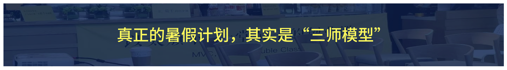

## Part1 Truman的学习建议

hello，大家好啊，我是 Truman。

万众期待，终于到了这一天，欢迎大家正式进入一堂 × 探月「**暑假新实验**」的活动。

全国各个城市中小学陆续开始进入期末和放假，从今天起，我们会正式启动“线上学习阶段”，每一周开始有陆续的一堂资深同学、教育专家、K12老师、教育从业者给大家陆续讲课。

今天呢，作为活动开头，我来给大家做一个开营寄语吧，给整个活动定一个调子。

今天篇幅不长，大概半个小时左右，我希望帮你们提个醒，帮后面的老师铺垫一下，也帮你们的孩子们提前磨合一下，减少一些后面无谓的阻力和摩擦。

今天，我想讲的，归纳起来，就是八个字：**守住底线，期待惊喜。**

这次我们反着来讲，我们先讲“期待惊喜”吧。

### 期待惊喜

我先请大家思考一个问题：如果我的孩子来听课，如果真的听懂了一些，有一些全新启发，你希望真正的积极改变是什么呢？

是变聪明一点，成绩变好了？

是突然成熟了，懂成年人的人情世故了？

是开始有赚钱意识，想自己当老板了？

**不不不，这些，都是不是这次“暑期学习计划”真正的目的。**

我想先请大家，想象一个画面。

可能就是这个暑假的一个普通晚上。孩子和你商量，学校同学约他参加一个七天的夏令营，他挺想去，但这一次不想只凭“大家都去”“看起来很好玩”就做决定。

过去聊夏令营，家里可能很快就进入两种模式：

- 一种是**家长拍板**：“这个挺好，对升学也有帮助，去吧。”
- 另一种是**直接否定**：“太贵了，宣传都是包装，别浪费钱。”

而孩子孩子要么听话服从，要么头脑一热就争辩。

家长觉得自己在为孩子负责，孩子觉得父母根本没有认真听自己说。

但这一次，讨论多了**一张很粗糙的 ROI 画布。**

他像个靠谱的成年人一样，开始独立思考了。

他刚听完科学决策课，做了一次完整的 ROI 分析：

> 他可能会讲收益：“这个夏令营有一个 AI 项目，我确实感兴趣；有两个同学也去，我可能会认识一些新的朋友；而且我以前没自己离家七天，这次也许能练一练独立。”

> 可能会讲到成本：“报名费是一部分。还会占掉七天时间，我原来想做的游戏小项目可能要暂停。回来以后离开学也很近，作息可能来不及调整。这些应该都算成本，对吧？”

> 甚至可能会讲风险：“我现在看到的都是招生介绍。课程是不是真的像宣传里那么好，我不知道；每天到底有多少时间在做项目、多少时间只是在参观，我也不知道；我只认识一个学长去过，但还没问他。”

最后他可能去了，也可能没去。其实，选哪个并不是这个画面里最重要的事。

最重要的是，孩子第一次没有把父母当成**审批人**，也没有把自己当成**等待安排的人**。他带着自己的思考，把父母当作值得邀请的**决策伙伴**；父母也没有抢走方向盘，而是把经验、担心、长期视角和真实约束放到桌面上，帮助孩子把选择看得更完整。

**你的孩子，开始用成人最优秀的理性决策思维，开始独立思考了。**

大家感受一下，如果这个暑假，家里真的出现过一次这样的对话，你会不会觉得特别美好？

这样的画面或许远远不止“ROI”一个场景：

> 可能是孩子第一次主动跟你讨论人生要追求的最终意义是什么；

> 第一次认真问你，你的公司到底靠什么赚钱；

> 第一次主动问你，妈妈我的这块时间效率好低，你帮我重新试试这个新的假设如何；

> 第一次看到一个流浪猫，不只是单纯怜悯，而是跟你讨论如何调研一下别的小区解题的最佳实践；

> 第一次看到一款游戏，不只说好不好玩，而是和你分析它为什么免费、又靠什么让大家不断付费；

> 第一次在打球受挫时候，不只是垂头丧气，而是积极去网上搜教程、升级刻意练习的套路；

> ……

我们准备了3个方向，最多15个课题，每一个课题都或许一次点燃的机会：

> 说明：不同年级分布不均，只覆盖了其中部分课题，由老师选择而定。

我们成年人工作了很多年，走了很多弯路，跌跌撞撞很多年才学会的“**关键道理**”，

我们的孩子或许提前几年、十几年就能接触到、记在心里，

然后带着这些道理再去学习、读书、迎接各种各样的难题，

**会不会是一个很好的画面：）**

不要太功利，不必太短期注意，就是开放心态，去拥抱可能性；

让孩子们能早很多很多年，看到未来世界真正的运行规律。

好啦，这就是期待惊喜的部分，我们来讲第二个关键词。

### 守住底线

关于底线，我想特别拜托大家两件事，这是这次活动可以平稳落地的关键。

#### 划重点1：维护完美课堂

作为一个创新实验，我们早就预料到，这个实验注定是困难重重，难以完满的。

尤其是我们采用了“公益共建”的方式，没有收大家的一分钱，也没有支付老师一分钱。

我们的老师来自五湖四海，有一堂城市主理人，有北京四中的代课老师，有AI教育创新的探索者，有多个孩子的妈妈，还有一堂内部的员工。

大家愿意来讲课，完全是来自**对教育的使命**和**对一堂的热爱。**

尤其是考虑到大家对于一堂过往一贯的课程信任，所以，为了教学活动正常进行，请大家尽量尽量尽量降低预期，不要类比几万的夏令营，也不要对比Top级别的1v1个性化服务；

这个课堂和以往的所有课堂都不一样：**面向孩子和家长。**

这个课堂我们直播间是第一次做，毫无经验。

所以我们一直很担心课堂的秩序失控和讲师无助。

如果中途出现了一些不稳定和意料之外，也希望大家多给我们一些耐心和鼓掌。

只要我们流程可控，讲师心态不崩，一切意外都是微不足道的摩擦。

一旦出现任何问题，大家自发戴起袖箍，成为**志愿者**，一起维护秩序，解决问题，替我们的孩子们维护一个优秀的课堂。

**如此，好么？**

进入哪个课堂，你就是那个课堂的完美学生：

如果你们进入初中课堂，你就立刻化身12岁初中生；

如果你进入小学课堂，那就立刻化身为9岁的小学生；

如果你进入了大学课堂，那你就立刻化身为20岁的大学生。

忘掉过往，忘掉以往学习，忘掉模型，

跟着一起享受穿越回学生时代一起听课的感觉。

**如此，好么？**

不只潜水，你还要积极成为贡献者：

如果太冷，我们就积极互动，提升课堂氛围；

如果太闹，我们就稍微提醒下认真听课，不要跑题；

如果被误会，你们就讲讲我们这次实验的初心和追求。

......

**如此，好么？**

#### 划重点2：帮助孩子学习

第二个担心，就是课程太难，太抽象，孩子很认真努力，但是听不懂。

这应该不是小概率事件，超越年龄的提前进步，往往就是非常难的。

**【抢答🙋‍♂️】**所以，大家觉得该怎么办呢？能解决么？

————

我开始很焦虑，非常担心这个事情，后来我们内部同事（也替孩子报了名）看出来了，一句话就点破了我的焦虑：

> 不用过度担心啊，发现孩子遇到问题卡住了，就是最好的带着孩子进步的契机啊。

> 这本身就是一个很棒的“沟通窗口期”啊。

> 我们平时哪儿有机会跟孩子讨论“人生红点”“需求”“刻意练习”这个课题啊～

是啊，有道理，孩子想学，学了，遇到问题了卡点了，才是最好的教育机会啊。

于是，我们内部决定升级玩法，正式邀请所有家长晋升为“**最佳家庭教练**”

不管学了一节课还是全套课，不管是进步还是卡住，这些都是极其难得的机会啊：你的孩子开始思考人生红点、AI分工、一堂五步法、需求洞察、产品设计了。

你不再是那个报名缴费后撒手不管的爸爸妈妈，

而是一个“**我很懂/可以给你辅导**”的理想家庭教练啊～！

先别被“**最佳**”两个字吓到啊。它不是家长比赛，也不是要求你变成教育专家，更不是让你把一堂的15门课全部学会，然后回家重新给孩子讲一遍。

所谓家庭教练，是孩子真的遇到困扰和问题的时候，你没有完全缺席，你愿意坐到桌子旁边。

你可以贡献成年人走过的路、踩过的坑、没有写在课本里的现实约束；也愿意承认，有些新世界孩子可能比你更熟，有些问题你也没有标准答案。

最好的状态不是谁教育谁，而是两代人把各自看到的那张地图摊在一起，继续找路。

**我们面对的是上千个孩子，而你面对的只有眼前这一个孩子。**你知道Ta最近为什么纠结，什么话题Ta现在还无法真正理解，什么时候Ta陷入了困顿和焦虑需要答疑，什么时候Ta刚刚解题成功，需要立刻欢呼鼓励。

这是一种任何人，任何公共课程都无法替代的优势。

我们再回到刚才那个画面。

一个孩子为什么会突然拿着 ROI 画布走到餐桌前？难道就是听完一节科学决策课，马上顿悟了，立刻变成了一个科学决策高手？

当然不是。一个孩子真正发生改变，往往要走过好几步。

我们来尝试推演一下这个过程，注意每一步都是进步，每一步都值得关注。

这个孩子过去面对夏令营，可能只有几个朴素判断：我想不想去，同学去不去，爸爸妈妈同不同意，价格贵不贵。

然后有一天，他在课程里第一次听到：真实世界里的决策，往往没有标准答案；一个选择可以被拆成收益、成本、风险、信息和检查点；ROI 也不只是一道算术题，它还需要宽度、深度和长期视角。

他不一定全部听懂，但他第一次看见：**原来选择不是只能靠感觉，也不是只能听大人的。**

**这一步叫看见。**

他可能会想：“兴趣班、夏令营这种事也能做 ROI 吗？感受又不能精确计算，怎么算？如果我特别想去，是不是分析也没有用？”

注意，这些疑问不是课程失败了。

恰恰相反，过去他从来不会问这些问题。现在，无论是认同、怀疑、听不懂，还是觉得老师讲得不完全对，**这个新概念已经进入了他的语言世界。**

**这一步叫好奇。**

课结束以后，他转头看到了桌上的夏令营介绍。

原来 ROI 不是成年人开会时才用的词。原来眼前就有一个自己真的在意、真的需要决定的问题。

抽象方法和真实生活第一次连上了。

**这一步叫“与我有关”。到了这里，兴趣才真正有机会发生。**

孩子不需要马上掌握一整套科学决策系统。

他可能只是拿一张白纸，凭记忆画了几个格子。格子不完整，成本漏了两项，风险写得很幼稚，甚至把“我就是想去”也写进了收益里。

但没关系。**他第一次把脑子里一团模糊的感觉放到了纸上。**

**这一步叫最小行动。**

这张纸拿到餐桌上以后，父母**没有笑他**，也没有说“你这算的根本不对”。

你们真的坐下来，沿着他的分析继续讨论。孩子发现，自己写出来的东西可以帮助家里把话说清楚；**父母也愿意认真听他的理由。**

这个正反馈不一定是最后让他去了夏令营。更重要的正反馈可能是：**我的思考值得被认真对待；这个方法真的能帮我把问题讲清楚；我不是只能等待别人替我做决定。**

下一次选社团，他又试着拆了一次；下一次想换手机，他开始主动算使用周期和机会成本；再后来，他看到父母要做职业选择，甚至会问：“你这次最看重的长期收益是什么？最大的风险又是什么？”

**方法不再只属于那节课，它慢慢变成孩子理解世界的一种习惯。**

他开始自己观察、自己提问、自己分析、自己行动、自己复盘。

**这才叫正向飞轮。**

孩子的进步需要耐心，每一步都值得鼓掌：

孩子的成长，不是听完一节课以后突然切换了一个版本。它更像一颗种子，先进入语言世界，再进入真实问题，最后在一次行动、一次对话和一次反馈里慢慢长出来。

我自己对这件事为什么这么有执念，和我的成长经历有很大关系。

我小时候，姐姐、姐夫比我早走过几个学习阶段。小学的时候，我就会听他们聊中学；到了中学，又会听他们聊大学、工作，聊政治、教育和电影。

我印象特别深，大概高一的时候，有一个很普通的周末，我们一起看凤凰卫视《一虎一席谈》。那一期讨论的是：私塾模式培养的“**天才**”，**到底是教育的本质，还是教育的扭曲？**

我们三个人聊到很晚很晚，一直在掰扯教育的本质、高考的意义、一个人为什么要学习。

这些东西，没有让我第二天突然多考二十分。但是很多年以后我回头看，恰恰是这些看起来“**不务正业**”的对话，让我早几年看见了更大的世界，也构成了我最早的一套坐标系。

更重要的是，他们没有因为我年纪小，就只允许我坐在旁边听正确答案。他们会认真问我：“**你怎么看？你为什么这么想？**”我的判断当然很幼稚，有时甚至完全不对。但我可以把它完整说出来，可以被追问，也可以在新的信息面前修改。

我姐姐、姐夫当时未必知道自己在做家庭教练。他们没有布置观后感，没有要求我总结三个知识点，也没有把每次聊天都变成一堂课。他们只是愿意把真实世界的问题放到我面前，把我当成一个正在学习思考的人，陪我多想一会儿。

所以我一直相信：

**早一点看见未来，不一定立刻改变成绩，但很可能改变一个孩子心里的坐标系。**

而一个家庭最稀缺的教育资源，有时候不是父母知道多少答案，而是家里有没有一张桌子，允许两代人坐在同一个问题前，共同理解世界。

### 成为你孩子的教练

讲到这里，我们再看课程和家长的分工，就会非常清楚。

线上课程会努力推动前三步：

- 让孩子看到一个课本之外的世界；
- 让他产生疑问和好奇；
- 让一个陌生的方法，第一次和自己的生活发生关系。

讲师们会努力把课讲得深入浅出，有场景、有案例、有互动，也尽量让孩子听完以后能完成一个小动作。但从“我觉得有点意思”，走到“我愿意真的把它用在自己的问题上”，中间有一道很重要的坎。这个地方，单靠一对多的线上课程很难完成。

讲师面对上千个孩子，很难知道某一个孩子在哪句话上突然停了一下；哪一个案例让他想起了自己的经历；他说“没意思”，到底是真的没有兴趣、暂时没听懂，还是担心自己做不好。但家长有机会看到。

有时候，孩子听完只说了一句：“我觉得那个 ROI 有点道理，但很多东西根本算不清。”

这不是“没学会”。这可能是他第一次开始认真思考，科学决策和真实世界之间到底有什么距离。

有时候，孩子会说：“需求洞察不就是猜别人想要什么吗？”

这也不是应该立刻纠正的错误答案。你可以问：“你为什么觉得是猜？课程里有没有哪一句让你觉得不只是猜？”

有时候，孩子什么都没说，只是在几天后买东西时突然问：“我是真的需要，还是只是被广告说动了？”

那颗种子可能已经从课程走进了生活。

所以我们现在再来管理预期，就不会像给大家泼冷水。

- 一节课不能直接制造正向飞轮，但它可以打开第一扇窗。
- 家长不能替孩子发生改变，但可以让一次好奇不轻易消失。
- 一个暑假不一定让孩子脱胎换骨，但可以让家庭多出几次过去从来没有发生过的真实对话。

我们最容易犯的错误，**是用第六步的标准，去否定一个刚走到第二步的孩子。**

孩子只是说“我没听懂”，家长已经在问“那你为什么不会用”；孩子刚产生一点兴趣，家长马上要求他制定三个月计划；孩子第一次尝试画一张不成熟的表，家长一看漏洞很多，直接替他重做一份。这时候，我们以为自己在加速，实际上很可能把刚刚冒出来的好奇心压了回去。

**教育需要耐心，不是因为我们对结果没有要求，而是因为我们知道结果真正怎样发生。**

这个夏天，我们期待大家孩子们线上学习以后，会有很多和开篇那个美好画面类似的镜头：

大家有没有发现？

**这些画面真正令人向往的，不是孩子会说多少商业和管理的大词。**

**而是他开始愿意把自己正在面对的真实问题带回家。**

他知道，父母不是只会给答案、做审批、看结果的人；父母有经验、有现实视角，也愿意认真听完一个还不成熟的想法。

父母也会发现，孩子不只是一个等待被安排的人。他正在形成自己的判断，甚至有一天，他也可以反过来帮助我们看见过去习以为常的盲区。

**课程让家庭多了一套共同语言。**过去只能说“你要懂事”“你要自律”“你听我的”，以后可能可以一起讨论需求、收益、成本、风险、关键假设、反馈和长期复利。

这不是把家庭变成会议室。恰恰相反，它是在很多原本只剩情绪和权力的地方，重新放回一点好奇、理由和共同探索。

具体怎么做呢？

但是大家也不要太有压力，接下来这个暑假，家长不需要给自己增加一套复杂任务。

不是每门课都要陪，不是每节课都要复盘，更不是十五个课题全部学完以后，再回家逐一验收。

先记住三个动作就够了。

孩子带回来的第一句话，往往是不完整的。

> “我觉得那个 ROI 挺有意思，但也不一定算得清。”

> “老师说要先研究需求，我觉得很多时候根本问不出来。”

> “AI 写得比我好，那我还学什么？”

> ……

这个时候，先不要急着判断他听懂没有，也不要马上讲你的答案，可以问：

> “你是怎么想到这个问题的？”

> “你现在最拿不准的是哪一块？”

> “这里面有没有一件事，和你最近的生活特别像？”

> ……

**接住话题的意思，是让孩子知道：一个还没想清楚的问题，也值得被认真讨论。**

家庭教练不是只负责点头，也不是假装父母没有经验，家长可以坦诚表达自己的判断、担心和边界。区别只是，我们尽量把结论背后的理由也拿出来。

- 少一点“反正我不同意”，多一点“我真正担心的是这个风险”。
- 少一点“我都是为了你好”，多一点“这是我走过的路，但你的情况可能不完全一样”。
- 少一点“社会就是这样”，多一点“我在工作中看到过三个例子，其中一个成功，两个失败”。

父母最珍贵的贡献，不是永远正确，而是把十几年、几十年的真实经验，变成孩子可以理解、质疑和继续验证的一份信息。

很多真实问题，聊一次也没有答案，那就不要急着把谈话变成判决，可以一起问：

> “我们现在还缺什么信息？”

> “可以问谁？”

> “能不能先做一个小实验？”

> “什么时候回来再看一次？”

报不报兴趣班，可以先试听；要不要参加夏令营，可以先问往届参与者；一个学习计划是否适合，可以先跑一周；对一个专业有没有兴趣，可以先看课程、访谈真实从业者。

**共同验证不是父母替孩子把事情做完，而是让讨论和真实世界发生接触。**

同时，请大家守住四条边界：

**不重讲课程，不逼问总结，不替孩子决定，不把每一次对话都变成教育。**

孩子有时只是想分享一个游戏，不一定每次都需要被分析商业模式；有时只是想休息，也不需要立刻进入时间管理；有时明确说不想聊，家庭教练也要知道什么时候退后。

“最佳”不是做得最多，而是在该回应的时候回应，在该退后的时候退后。

哈哈终于可以宣布了：

之前我们讲过，如果暑假期间你的孩子写作业可以顺利完课，我们会奖励一个“荣誉奖牌”和“暑期进步证书”。

> 暂定规则是：至少修10个学分，约2-3份作业。

哈哈，这一期我们决定加码，同步给你发一张：**“优秀家庭教练”证书。**

你的陪伴、你的帮忙、你的支持同样值得被看见～！

### 最后的期待

最后，我再把预期完整说清楚：

- 不是每一个孩子都会拿着一张 ROI 画布走到你的面前；
- 不是每一门课都会适合每一个孩子；
- 不是每一个概念都能一次听懂；
- 也不是每一次好奇都会马上变成行动
- ……

**如果孩子明显抗拒、持续痛苦，可以换一门课、换一个时间、降低一点难度，甚至先停一停。**

**我们不希望大家把这次学习变成新的家庭排名，也不希望“家庭教练”变成家长新的内疚来源。**

但与此同时，我们也**不要因为变化很小，就错过它：**

一个暑假，我们不承诺让孩子脱胎换骨。但我们可以努力创造更多机会，让一个新概念进入他的语言，让一次好奇被家庭接住，让两代人围绕一个真实问题坐到一起。

我越来越觉得，父母可以给孩子的东西，大概有两类：

**一类是现成的答案、资源和道路。**这些东西当然很重要。但未来变化越来越快，我们今天替孩子准备好的答案，十年以后未必还成立。

**另一类，是面对未知世界时，怎样提问、怎样寻找信息、怎样听不同意见、怎样做选择、怎样验证和复盘。**

这种传递，不是资源传承，更接近一种认知传承。

**也许很多年以后**，孩子面临一个真正重要的选择，他还是会打电话给你。

但那时，他不是问：“爸爸妈妈，我到底应该选哪个？”

而是说：“我已经做了一版分析。我最看重的是这些，最大的风险是这些，还有两个关键假设没有验证。你们能不能帮我挑战一下，我还有什么没有看见？”

我觉得，那可能就是**家庭教练特别幸福的一个时刻**：你没有替孩子走完人生，但你曾经陪他练习过，怎样理解道路、选择道路，并且承担自己的选择。

所以线上课程负责把窗打开，让孩子看见、好奇，发现这件事和自己有关。

家庭教练负责接住孩子带回来的问题，贡献真实世界的视角，再陪他一起验证。

而我们所有人的最终目标，是慢慢退后，让孩子能够自己观察、自己判断、自己行动，让他的成长飞轮真正由自己转起来。

接下来这个暑假，大家不用急着成为一个完美的家长。

当孩子主动提到课程里的任何一句话时，不先问“你听懂了吗”，也不急着告诉他应该怎么做。

你可以问：**“这里面有没有一件事，你想和我一起讨论？”**

也许，一段全新的家庭对话，就从这句话开始。

**我们一起，做孩子最好的家庭教练。**

好啦，最后最后总结一句话：**守住底线，期待惊喜。**

希望大家在这第0期的学习里，感受到从未有过的同频和快乐～！