## Part2 探月老师的介绍

大家好，我是Mark，来自探月学校。我在探月主要负责校企合作，参与了Moonshot48的设计和组织，同时负责我们去年开始的「一小步」项目中的科技创业课程。

今天我想用半小时，和大家讲清楚这次活动到底在做什么，为什么要先进行线上学习，再邀请一部分学生进入线下黑客松，以及我们究竟想看见怎样的学生。

在正式开始之前，我想先做一个小调查。

当你看到/听到“黑客松”这三个字的时候，你脑子里出现的是什么画面？

是一个戴着帽子的人，在黑暗的房间里飞快敲代码？

还是一群编程高手，带着电脑，连续奋战超过20个小时？

或者是一群学生，最后站在台上，展示一个特别酷、特别完整的产品？

线上参加的同学，可以在评论区里打一个词。家长也可以打。

你们听到“黑客松”，第一反应是什么？

### 黑客松到底是什么？

📹 🏯第一期·黑客松剪辑视频-3.11 北京场.mp4

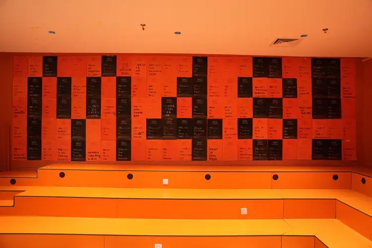

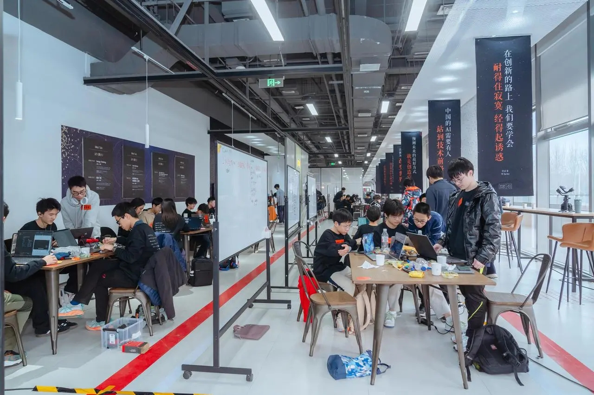

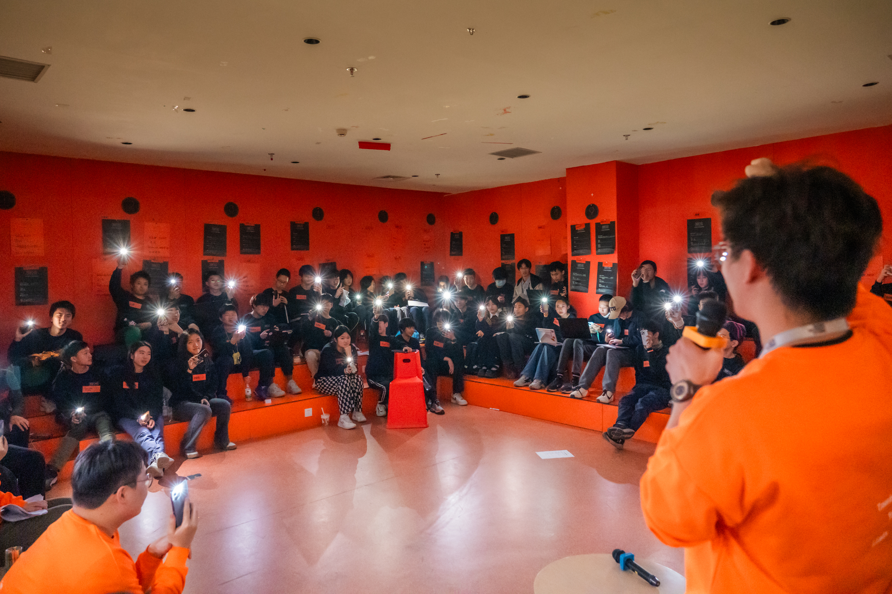

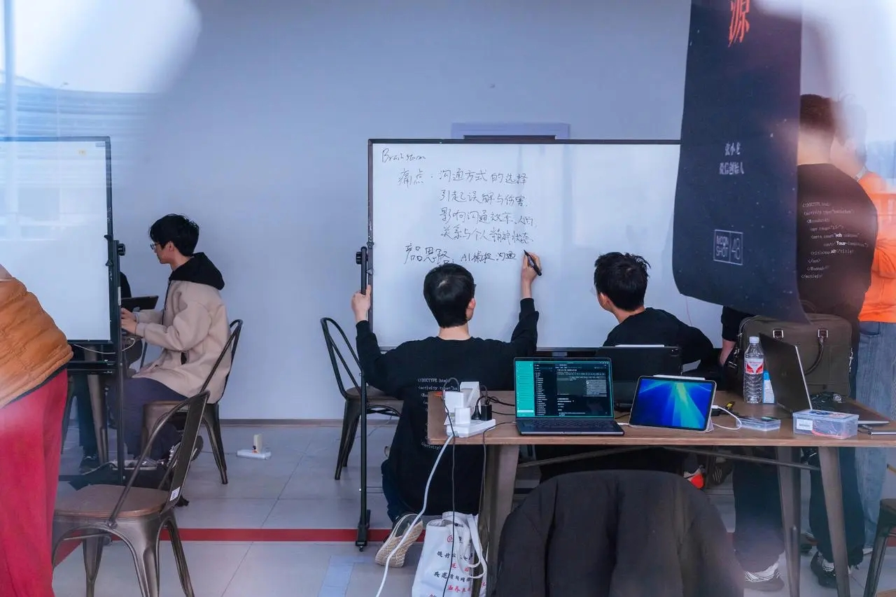

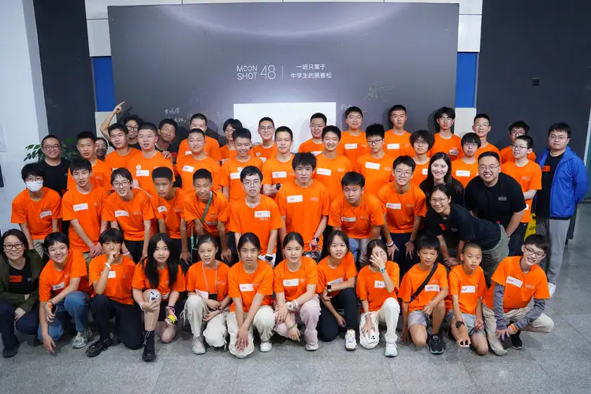

我猜大家的答案里，会有几个词：编程、AI、比赛、创业、熬夜、做产品。

这些答案都碰到了一部分，但又都不完全。

所以今天的一开始，我想先消除一个最常见的误解。

**Moonshot48黑客松，不是一场编程高手的选拔赛。**

它也不是让一群学生在48小时里，假装自己已经是一名成熟的创业者。

我们真正想做的，是创造一个环境。

在这个环境里，他们会面对一个没有标准答案的问题。

他们需要理解一个真实的人，跟伙伴协作，使用工具，提出一个暂时的判断，做出第一版，再根据反馈修改。

所以，黑客松里真正要**“hack”的**，不是一台电脑。

而是**一个真实世界里，大家已经习以为常、但又没有被很好解决的问题**。

过去一年半的时间里，我们已经办了 5 场黑客松。总共超过** **1000 名学生报名，500 多个学生和我们深聊过，最终有 250 多个学生真正来到现场。

到了这里，他们参加的已经不只是一个活动。48 小时里，他们得把一个模糊的念头一步步推成一个说得清、做得出、经得起追问的产品原型。

这里我们有一些有趣的案例：

- 有一个男生，因为总被妈妈吐槽不会拍照，做了一个教人怎样把照片拍得更好看的Figart AI。
- 有一个关注渐冻症患者的团队，尝试开发更适合渐冻症患者使用的输入方式。
- 还有几个此前几乎没有硬件经验的参与者，为老年人设计和制作智能拐杖
- ……

这些项目最后呈现出来的形式很不一样，有的是软件，有的是AI应用，有的是硬件。但它们有一个共同点：**都不是从“我想用什么技术”开始，而是从“我观察到了什么具体问题”开始。**

同时我们也有一些很有意思的发现：

- 第一场还有古法编程，到了后面AI已经变成几乎所有团队都会使用的基础工具。做出原型的速度越来越快，技术本身的门槛也在迅速下降。
- 队员背景和能力差异比较大的团队，更容易碰撞出令人眼前一亮的产出
- 在我们有限的几场活动数据中，组内成员平均年龄与最终小组的得分，呈**负相关**
- 女孩子领导的小组得分普遍较高
- ……

这些现象至少说明了一件事：在这样的真实挑战里，决定一个团队能走多远的，不只是会不会写代码、年龄有多大、参加过多少比赛。

更重要的是，他能不能理解人，能不能提出问题，能不能和别人合作，以及当现实和自己的判断不一致时，能不能继续调整。

这也是我们为什么要做这件事。

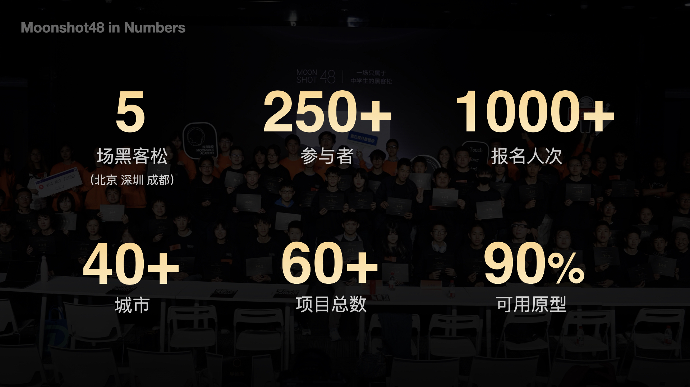

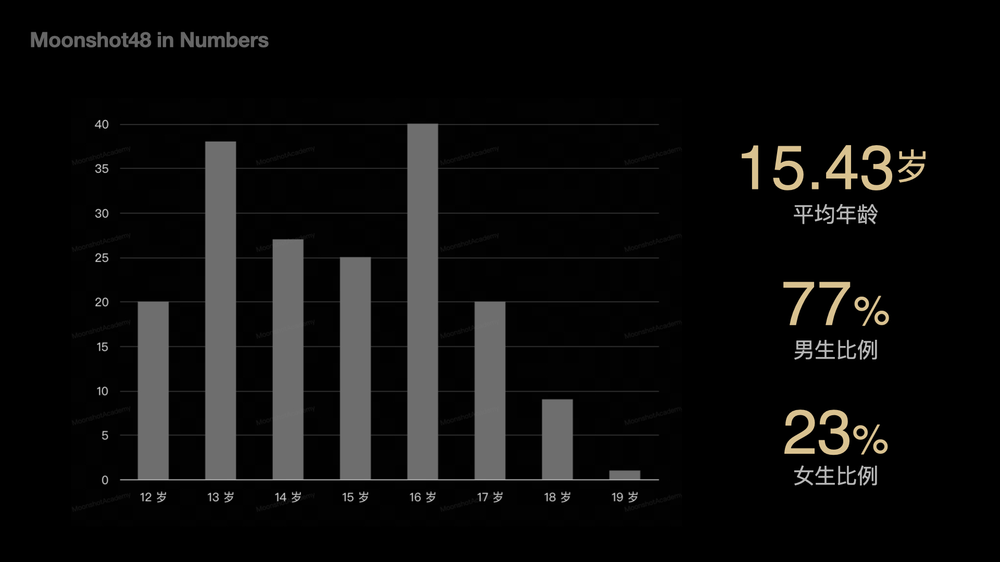

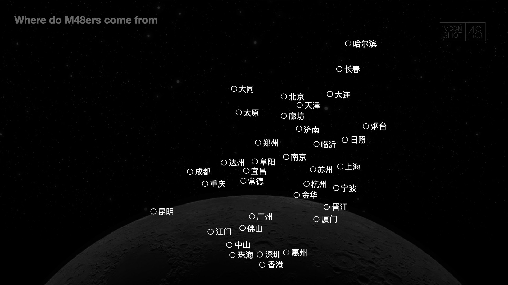

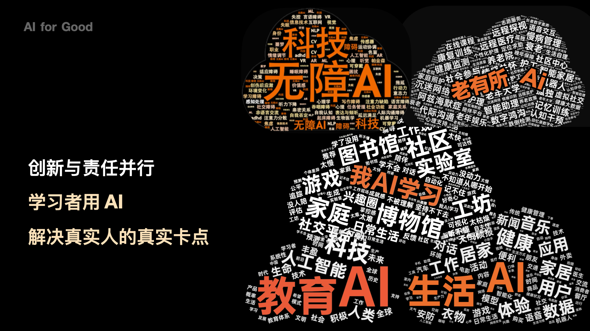

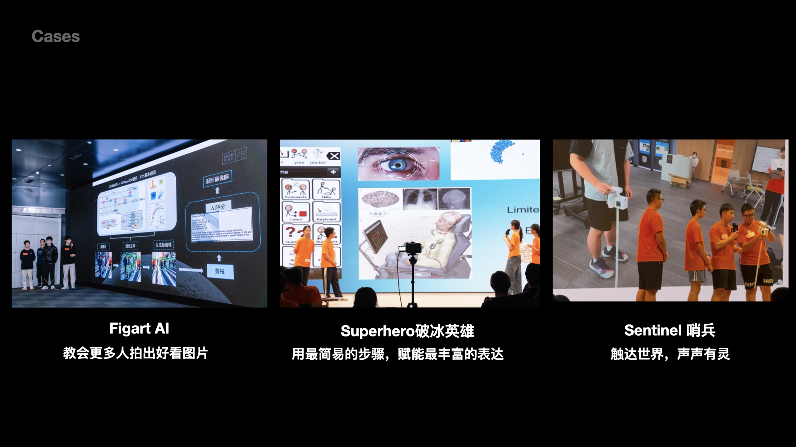

> 也借这个机会，先把很多家长关心的选拔标准说清楚。

> Moonshot48 不会只看会不会编程，也不会只看最后的作品是不是足够炫酷。我们更想寻找“三心少年”：有同理心、好奇心和进取心。  

> 有同理心，意味着他愿意走出自己的想象，去理解一个具体的人，在一个具体场景里到底遇到了什么困难；有好奇心，意味着他不满足于“我觉得”，而是会继续追问、观察、访谈，寻找真实的证据；有进取心，意味着当第一次尝试没有成功、第一版做得不够好时，他不会立刻放弃，而是愿意根据反馈继续调整。

> 同时，我们也会关注参与者怎样与人合作。能不能听见不同意见，讲清自己的判断，承担具体任务，也能在卡住的时候主动求助，和伙伴一起把事情往前推进。

> 所以，请不要把线上学习理解成一场提前“卷成品”的比赛。我们不是在找现在最像创业者的学生，而是在找愿意理解别人、持续提问、动手尝试，并且能够在反馈中不断成长的人。

> 具体的选拔流程、提交材料和时间节点，我们和一堂的伙伴也会在后面完整说明。

### **为什么要做这件事？**

因为AI正在改变年轻人参与真实世界的方式。

过去，很多事情要先学很久，积累足够多的知识和技能，才有机会真正开始做。今天，借助生成式人工智能，一个十几岁的少年已经可以快速查资料、写代码、做设计、搭原型，把一个想法变成可以被看见、被测试的东西。

所以我们相信：

**在生成式人工智能的支持下，20岁以内的年轻人，在人类历史上第一次有机会成为多数领域的领头羊。**

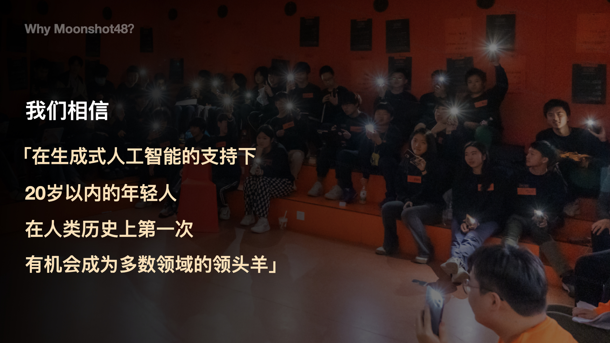

但有了更强的工具，并不意味着自然就会成为领头羊。

> AI可以帮你写代码，却不能替你判断，这段代码解决的问题到底有没有人关心；

> 可以帮你生成访谈提纲，却不能替你真正理解一个人的处境；

> 可以帮你做出漂亮的方案，却不能替你回答：为什么要做这件事，你的证据是什么，失败以后准备怎么改。

所以，当“做出东西”的门槛越来越低，真正拉开差距的，反而是这些能力：

能不能发现一个值得解决的问题，

理解一个具体的人，

在信息不完整时作出判断，

和不同的人合作，

并根据真实反馈不断调整。

所以，在探月，我们一直非常关心一种素养：思维习惯。

我们把它简单地说成：**当一个问题没有标准答案的时候，一个年轻人能不能开始行动。**

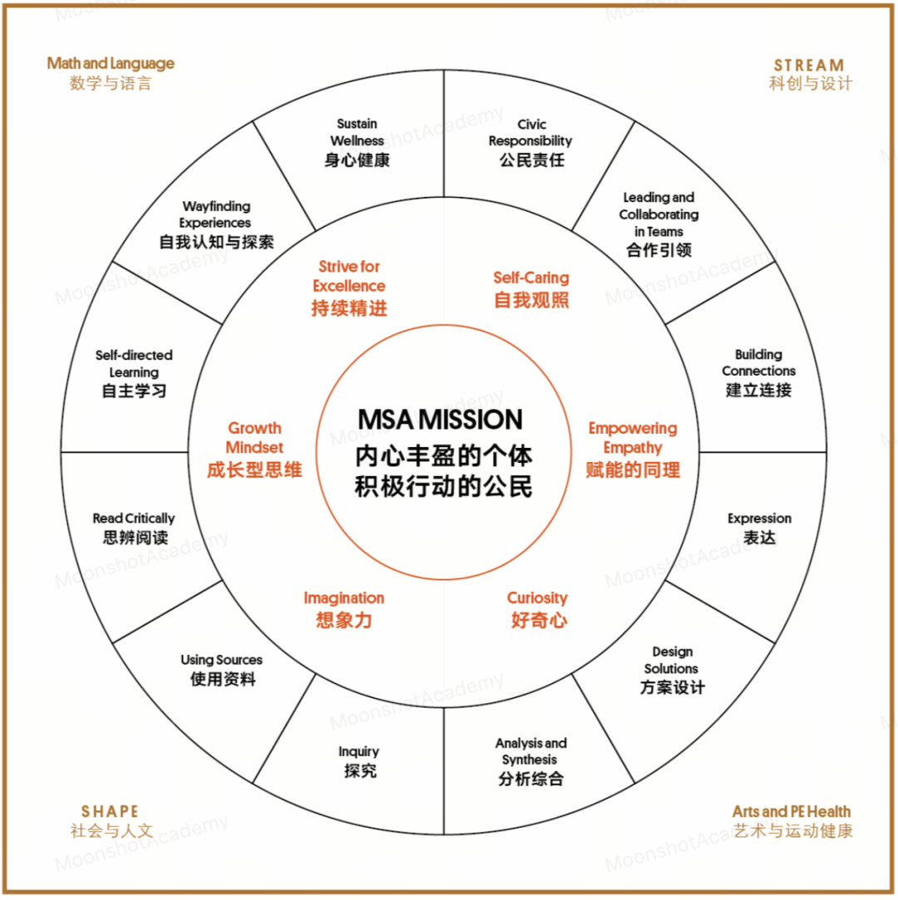

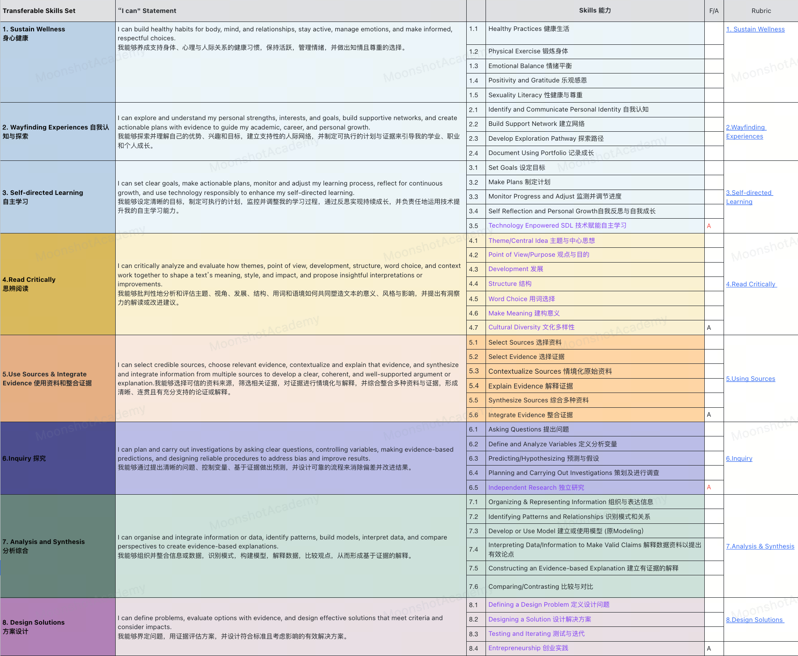

思维习惯不可能在两天里速成。它需要在不同的场景中反复练习、反复反馈，才会慢慢成为一个人自然的工作方式。

黑客松更像一个引子，把这些平时不容易被看见的东西，在有限的时间里，集中地呈现出来。

在48小时里，学生和家长可能第一次清楚地看到：原来真正困难的，不只是把产品做出来；还有怎样找到问题、怎样理解别人、怎样作出取舍，以及第一版失败以后怎样继续。

它不一定在两天里给出答案，但可以让我们开始开始思考：

**在AI时代，我们到底该学什么？是要更熟练地使用工具，还是也要逐渐形成驾驭工具、判断方向的能力？**

所以，黑客松不是思维习惯培养的终点，而是一个开始。

也正因为两天远远不够，我们才希望通过前面的线上学习，让大家先理解和练习一些基本动作；再通过线下黑客松，让这些问题真实地发生；活动结束以后，也能把这次经历带回到之后更长期的学习和成长中。

### **为什么是一堂和探月？**

合作，其实并不是从黑客松才开始的。

在「一小步」开学的第一课，我们就带着学习者去一堂，完成了一次极限挑战。

那次挑战给学习者的，不是一套先讲完、再照着操作的方法。大家是在时间有限、信息不完整、团队需要快速磨合的情况下，边做、边发现问题、边调整。

对我们来说，那不仅是一场活动，也让我们看到，一堂和探月在学习方式上有一个很重要的共识：

真正有价值的学习，不能只停在“我听懂了”，而要让学习者进入真实任务，作出选择，承担结果，再从反馈里继续学习。

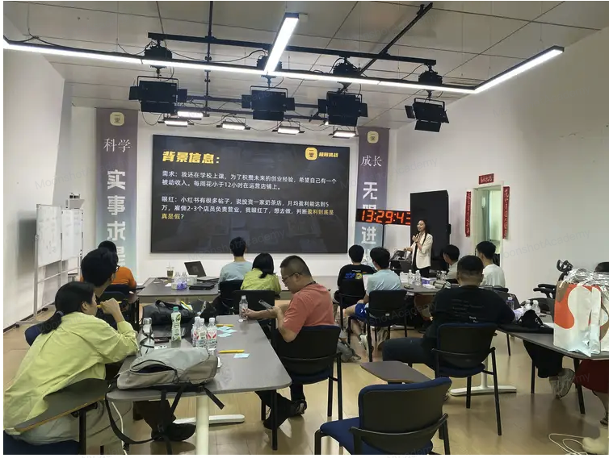

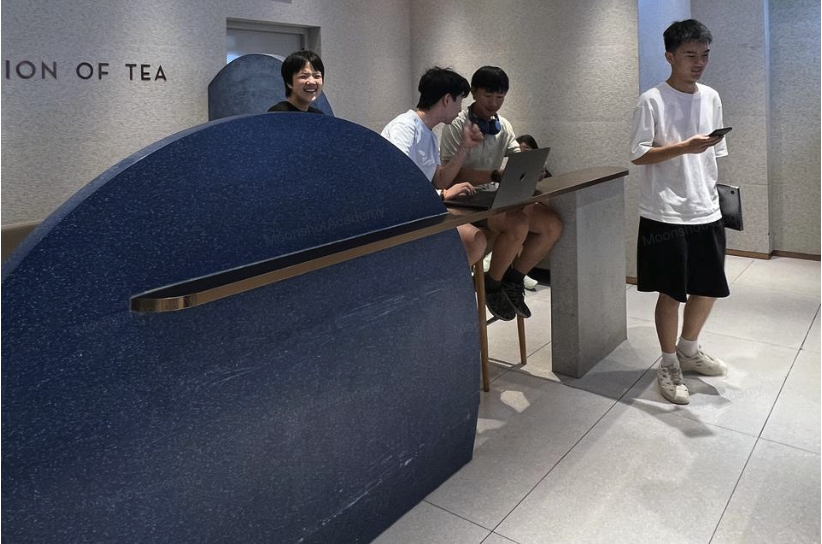

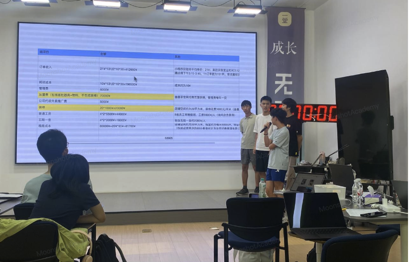

后来，我们也参加了一堂的线下MBA课程。

对我个人来说，在设计「一小步」科技创业课程的过程中，一堂的很多课程内容和学习设计，也给了我不少启发。

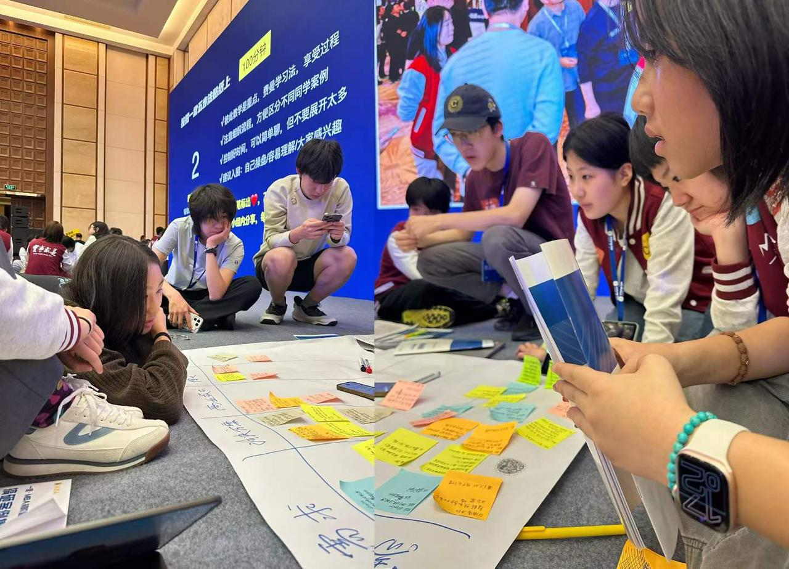

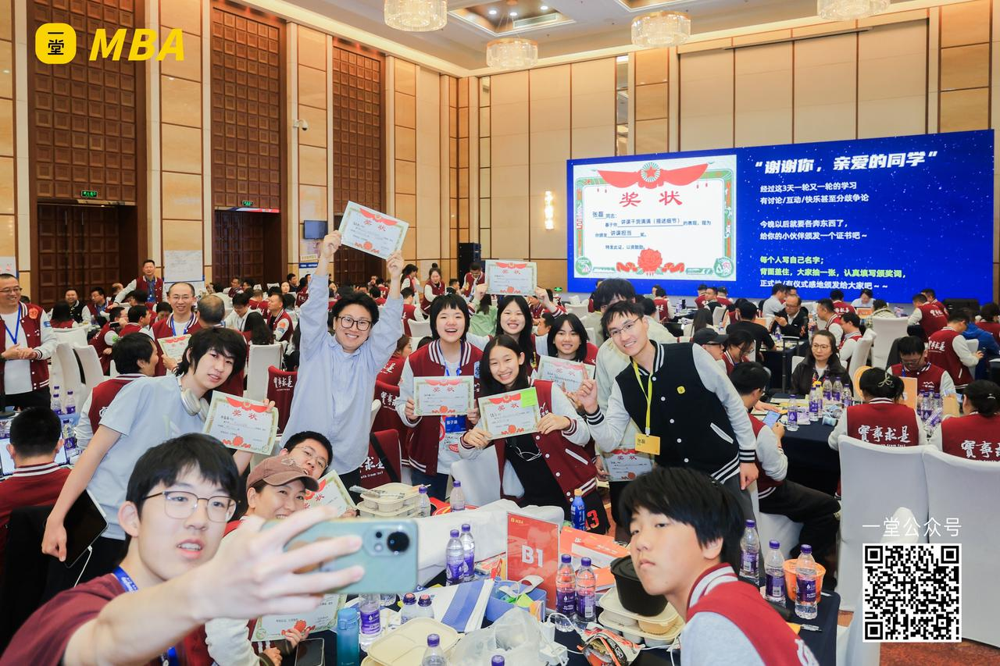

所以，这次一堂和探月一起做黑客松，并不是临时把课程和活动拼在一起。

更像是过去这些合作的一次自然延伸。

过去这些年，一堂和探月都在探索同一个问题：

**怎样让创新教育，不只停留在“听懂一个方法”，而是真正变成能够使用的能力？**

我们做过课程。

做过线下训练。

做过极限挑战。

也做过项目制学习、创新工作坊，以及限定时间内的真实任务。

在这些探索里，我们反复看到过两种情况。

第一种情况，是学生知道很多概念。

他知道什么叫用户需求。

知道什么叫原型。

知道什么叫测试和迭代。

甚至可以非常熟练地把这些词解释给别人听。

但当他真的面对一个用户的时候，他还是不知道该问什么。

对方说了一句：“我觉得有一点麻烦。”

学生立刻说：“那我给你做一个App。”

这个过程很像医生还没有问症状，就已经开始开药了。

他学会了很多名词，却还没有学会怎样在真实情境里使用。

这就是第一种断裂：

> **知道方法，不等于能够使用方法。**

第二种情况，是活动现场特别热闹。

学生们非常投入。

桌子上摆满便利贴，电脑屏幕上开着几十个窗口。

最后也做出了一个看起来不错的作品。

大家合影、领奖、发朋友圈。

但是活动结束以后，你再问他：

“这次你到底学会了什么？”

他可能说：

“学会了团队合作。”

再追问一句：

“具体学会了什么？下一次你准备怎么做？”

他就不太说得出来了。

这就是第二种断裂：

> **经历了一次，不等于形成了能力。**

所以，这次合作**不是**一堂负责上课，探月负责办比赛。

**不是**两个组织各自完成一段任务，再把它们拼在一起。

我们真正想做的是，**把一段系统学习和一次真实挑战接起来。**

一堂的课程体系，帮助学生建立共同语言，理解基本方法，并通过一个个小任务进行练习。

探月的线下黑客松，则提供真实的问题、真实的时间限制、真实的团队协作和真实的现场反馈。

线上阶段，帮助学生把动作学会。

线下阶段，看这些动作能不能真的发生。

所以，整场活动最核心的逻辑是：

**先共同学习，再真实行动。不是比谁的起点更高，而是看谁能在不确定中继续向前。**

### 为什么要线上学习？

接下来，我想专门讲线上学习。

因为我知道，不少家长和学生心里会有一个非常现实的问题：

“所以我参加线上学习，最终的目的，是不是就是为了进入线下黑客松？”

进入线下，当然可能是很多人的目标。

但如果我们把线上课程只理解成一场海选，或者一套赛前辅导，它的价值就被严重缩小了。

这里我要非常明确地说：

**不是只有最后进入线下的人，这段学习才算有意义。**

虽然线下的空间和活动容量注定有限的。

但理解真实问题、学习创新方法、完成一次行动的机会，不应该只属于最后入选的少数人。

所以，这次一堂和探月合作的初心，是面向**所有**对这件事感兴趣的家长和学生。

无论最终是否进入线下，线上学习本身都应该是一段相对完整、有价值的经历。

为什么？我想从三个层面来讲：

---

#### 价值一：建立共同语言

第一个价值，是建立共同语言。

如果大家到了线下现场，我们还需要用几个小时讲：

> 什么叫用户？

> 什么叫需求？

> 什么叫证据？

> 什么叫原型？

> 为什么第一版不需要完整？

那线下真正行动和协作的时间，就会被大量挤压。

线上阶段，很像正式比赛之前的基本训练。

我们不会到了球赛第一分钟，才开始学怎么运球、怎么传球、怎么和队友配合。

线上课程会帮助大家提前理解一些基本动作。

比如：

> 一个宽泛的话题，不等于一个可以解决的问题。

> “老年人生活不方便”，是一个话题。

> “独居老人经常错过社区活动报名”，才开始接近一个具体问题。

再比如：

> 自己的感觉，不等于证据。

> “我觉得大家肯定需要”，不算证据。

> 有人愿意接受访谈、展示自己的行为、尝试你的原型，才开始形成证据。

还有：

> 原型不等于完整产品。

> 它可以是一张纸上的界面，一段模拟对话，一个可以点击的流程，甚至只是一段用来验证关键环节的视频。

所以，线上学习的第一个作用，是让大家到了现场之后，可以迅速进入行动，而不是还停留在概念解释里。

---

#### 价值二：允许学生在低风险环境里失败

第二个价值，是提供一个相对低风险的练习环境。

线下黑客松的节奏很快，时间有限，队友刚刚认识，任务又不熟悉。

如果学生此前从来没有访谈过别人，从来没有做过原型，也从来没有把自己的想法交给真实用户测试，那么到了现场，他很容易陷入一种状态：很忙，但不知道自己为什么忙。

线上阶段可以让学生慢一点。

> 第一次访谈没有问好，可以回头看记录，重新调整。

> 第一次方案做得太大，可以把问题缩小。

> 第一次使用AI，只得到一堆看起来正确、实际上没有什么用的内容，可以重新修改提示词，也可以重新判断这件事到底该不该使用AI。

> 第一版原型做得很粗糙，也没有关系。

> 甚至第一版被别人直接否定，也没有关系。

因为创新的真正起点，往往不是“我第一次就想对了”。

而是：**我愿意尽早发现自己哪里想错了。**

---

#### 价值三：一次活动可以点燃，课程体系才能沉淀

第三个价值，是帮助学生把一次体验，变成可以迁移的能力。

一次活动可能很燃。

一个学生在现场做出了作品，第一次上台表达，第一次和陌生队友共同完成任务。

这种峰值体验非常珍贵。

但只有体验还不够。

学生需要慢慢形成一条面对陌生问题时，可以反复使用的路径：

> 观察一个具体的人。

> 提出问题。

> 寻找证据。

> 形成一个暂时的判断。

> 做出最小版本。

> 获得反馈。

> 修改。

> 再试一次。

这套动作，未来不只能用于黑客松。

它也可以用于科研、公益项目、校园改造、创业，甚至用于日常生活中任何一个没有明确答案的问题。

这是一堂课程体系真正希望带给学生的价值。

不是只教会大家完成这一次活动。

而是逐渐形成一种可以带走的方法。

---