### 核心方法：泛产品设计四步法


那具体怎么做呢？我把一套叫“泛产品设计”的方法论，翻译成了四个你们能做的动作，就是**明确任务、看齐高手、多出几招、打磨通关，**是不是像在玩角色扮演游戏？我们看看如果你要设计一个班徽，每个动作具体都是怎么操作的。
> 1. **明确任务**——先搞清“我们班是谁”；
> 2. **看齐高手**——再去看看班徽、校徽或者学校的纪念章这个方向，最好的设计长什么样、好在哪；
> 3. **多出几招**——可以利用AI绘图工具出几版草稿，大家投票选方向；
> 4. **打磨通关**——最后大家根据反馈，精确修改，达到大家满意的成品。


**“泛产品设计”**这套课程的内容其实非常多，大家也不要担心，我们这堂课的90 分钟我只带你们学习最基本的这四个动作，让同学们可以短时间内对“泛产品设计”有一个初步的了解，让自己在“设计”这方面的能力有一个提升。下面我们一个一个动作详细展开讲。

#### 第一步：明确任务


**先“明确任务”。这一步一定不碰 AI，先碰人。**

**【🙋提问】**我问大家：班徽做出来，是给谁看的？是同学、老师、其他班、也可能是运动会或者足球比赛的观众，对不对。

————————

没错，**班徽不是你的个人头像，而是全班共同使用的公共作品**。**所以首先要搞清楚的就是，谁是观众，谁是使用你这个作品的人。**

这一步，我要给大家亮今天的技能卡。它来自**“泛产品设计”**这门课程的技能库，里面一共三十六张技能卡（就好比你游戏里面抽卡获得的技能，这些可都不是那些N和R这些普卡，都是SR以上的级别的，还有SSR和UR的）。

> 因为今天我们这个课程只有90分钟，所以我们只挑最配最符合我们今天主题、一学就会用的九张技能卡出来，其余的还放在“卡池”，同学们如果对这门课程感兴趣，以后有机会再从这个卡池里抽卡，更加深入地学习。

**⭐️第一张技能卡，叫【换位读心】（对应【用户视角】）**。

> **方法就是一句话：你需要一秒把自己变成使用或者看你做出来的这个东西的人。**


之前我们说的LEO同学做的班徽为什么翻车？**因为他一直站在“我觉得帅”的视角，没变成“同桌”的视角。**

班徽是给全班用的，你设计的时候，脑子要跳到同桌、跳到老师身上看一眼。你们班里的同学和老师都是活生生的人，每个人都有自己的独特的想法，**本班同学第一、老师第二、外班第三，你一定要优先满足务最该用到这个东西的人。**

**⭐️第二张，叫【魔法沙盘】（对应【场景推演】）。**这里面有一个金句，大家一定要记住，以后用这个句型去分析问题：


**（谁）在（什么情况下）遇到了（什么样问题）？**

是不是有点不好理解？没关系，我们还是用班徽这个同学们都有可能遇到的事情来讲解。

> - **谁：**你们班的全体同学和老师

> - **什么情况下：**运动会上，运动员入场时引导员举的班徽，同学们在看台上加油时候用的手持班徽，同学们衣服上佩戴的班徽（吧唧大小）……

> - **什么样的问题：**醒目，好看，代表班级的特点（别人看一眼就知道你们班）


**⭐️第三，也是今天最关键的——【寻宝之镐】：我们班，到底特别在哪？**


**【🙋互动】**现在，我们在评论区进行一个大的互动。同学们在评论区打字，用一个词形容你们班。

> 不要写“很好”“很棒”这种很虚的词，一定要具体。比如：热闹、敢冲、脑洞大、爱运动、团结、温暖。评论区，打出来！

————————

崔老师帮你们归个类，班徽特点一般分四种：

> - **性格：**比如热闹、勇敢、幽默；

> - **能力：**比如运动强、画画强、表达强；

> - **氛围：**比如团结、互助、敢挑战；

> - **愿望：**比如更自律、更像一个团队。

**【💡思考】**现在，同学们从出现最多的词里挑 2-3 个，写一句话，什么话呢？我给你们一个填空题：

> 我们班最重要的特点是 ___，___；那么班徽应该让人感觉有 ___，___，可以用 ___，___来表现。

我示范一句：如果我们班最重要的特点是**爱运动、团结**，那么班徽应该让人感觉**有速度、有配合、有冲劲**，可以用**跑道、接力棒、围成一圈的星星**来表现。

> 打字快的同学可以在评论区用这个句式，写一句你们班的设计思路。

————————

不过，同学们如果在真正挖掘你们班特点的时候的时候，可能会遇到一个麻烦：让大家举手说特点，可能“唰”一下冒出来十几个——“热闹、团结、脑洞大、爱运动、勇敢、温暖、数学好、连打游戏都强……”。**意见多不是坏事，说明你们班真有很有特点。但是班徽就那么大，不可能把什么都画上去。遇到这种情况我们怎么办？**

这里教你们一个特别好用的方法，我们的技能库里面有一张技能卡叫做**【万象罗盘】**。听起来可能比较抽象，但是它的核心就八个字：**先做加法，再做减法**。


> - **加法，**就是先把所有人的想法都收进来，有人说“我们班爱打游戏”，记上；有人说“我们班超团结”，也记上。不急着否定任何人，全都找张纸记下来，内容越多越好。

> - **减法，**是从里面挑出“全班同学都点头”的那几个。什么叫大家都认可？就是你说出来，没人反对，还都拍腿说“对对对就是我们班”。一般最后会留下两三个最核心的——比如“爱运动 + 团结 + 脑洞大”，而其中那个最“是我们班”的，就是你班徽的魂儿。


这里大家一定记住一句话：**加法要敢放，减法要敢砍。** 先开脑洞、再收回来，最后聚焦到全班共同认可的班级特点，只有这样，下一步看齐高手、然后让 AI协助出图，方向才不会歪。

**好的，至此，同学们是不是已经把“我们班是谁”挖出来了。**

我再帮大家梳理一下——通过**【换位读心】**，**【魔法沙盘】**，**【寻宝之镐】**和**【万象罗盘】**这几技能，最后全班只留一至两个代表你们班的东西，那就是班徽的“魂儿”：它是那颗围成一圈的星星，还是扬帆远航的帆船？这个“魂儿”，确定下来就要坚持，一直坚持到完成班徽的设计。

#### 第二步：看齐高手


上一步我们已经搞清楚了“我们班是谁”，但还不能着急让 AI 出图。为什么？因为大家可能还没“好班徽”的标准。没有标准，AI 画出什么你都只能凭感觉去判断这个行还是不行。

这一步，我要在给大家两处一张技能卡——**【收集秘籍】。**


> **这个技能的一句话心法：先看顶级的好设计，你的审美天花板才会被拉高。**

做班徽前，先去搜一圈真正好的设计：

> - 优秀校徽（比如一些百年名校的校徽、知名中学的班徽）

> - 纪念章（体育赛事奖牌、游戏公会徽章、城市文旅徽章）

> - 好社团的徽章

给大家看几个例子


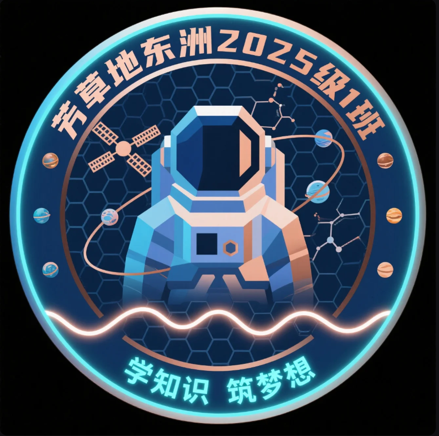

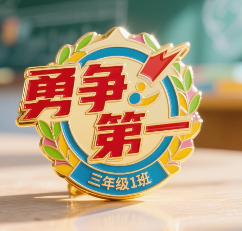

光看不够，这一步要干三件事，它们其实也都是技能卡，**今天我当作“向高手看齐”的方法交给你：**

**⭐️第一，收集秘籍（对应【最佳实践池子】）**：建一个你自己的“班徽灵感池”

> 收藏 100个你觉得最棒的设计，按风格归类，比如队徽风、极简几何风、手绘风、复古徽章风。把好作品放一起反复比，你的眼光就练出来了。

**⭐️第二，鉴宝之眼（对应【最佳实践建模】）**：我们需要从几个方面给好作品打分，比如

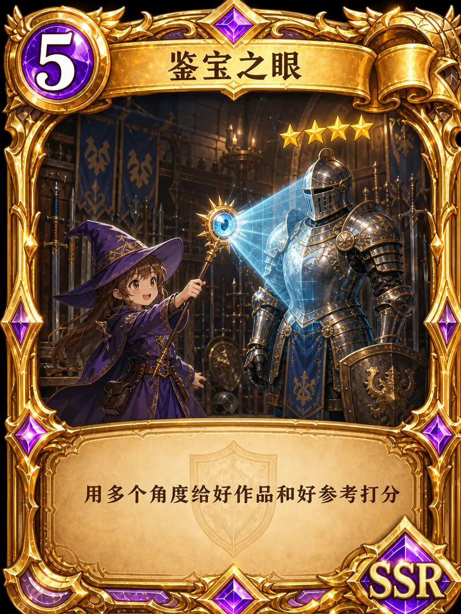

> - **辨识度**（一眼认出是哪个班）

> - **代表性**（代表了群体特质）

> - **简洁度**（缩小到头像还清楚）

> - **美感**（颜色搭配和构图）

下次你看一个班徽，不只会说“好看”，还能说清“它好在哪”。我们可以建一个表格，来记录这些打分。

**灵感池子和打分**（如果同学们自己觉得不会打分，也可以让AI来协助，把你收集的好看徽章喂给豆包或者deepseek，然后让他从下面几个角度去打分）

**最佳实践**

**辨识度**

**代表性**

**简洁度**

**美感**

**综合**

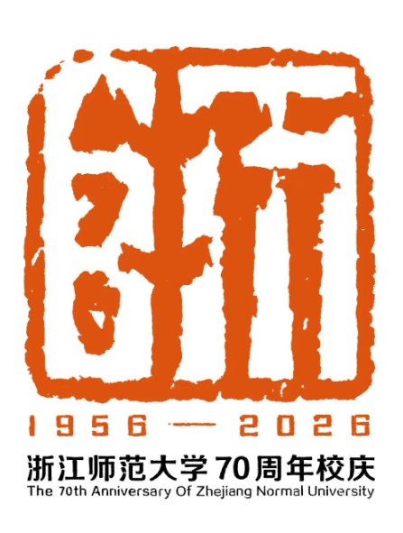

9

10

9

9

**37**

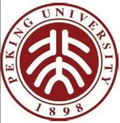

10

10

10

8

**38**


8

8

6

9

**31**

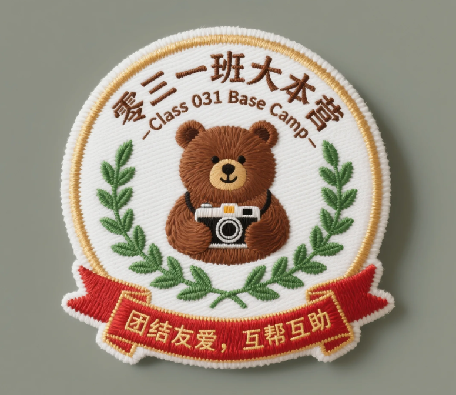

8

9

7

8

**32**

**⭐️第三，最美设想（对应【美好作品想象】）**：如果一时找不到完美对标，或者看了很多设计都觉得不喜欢，那么就大胆想象：

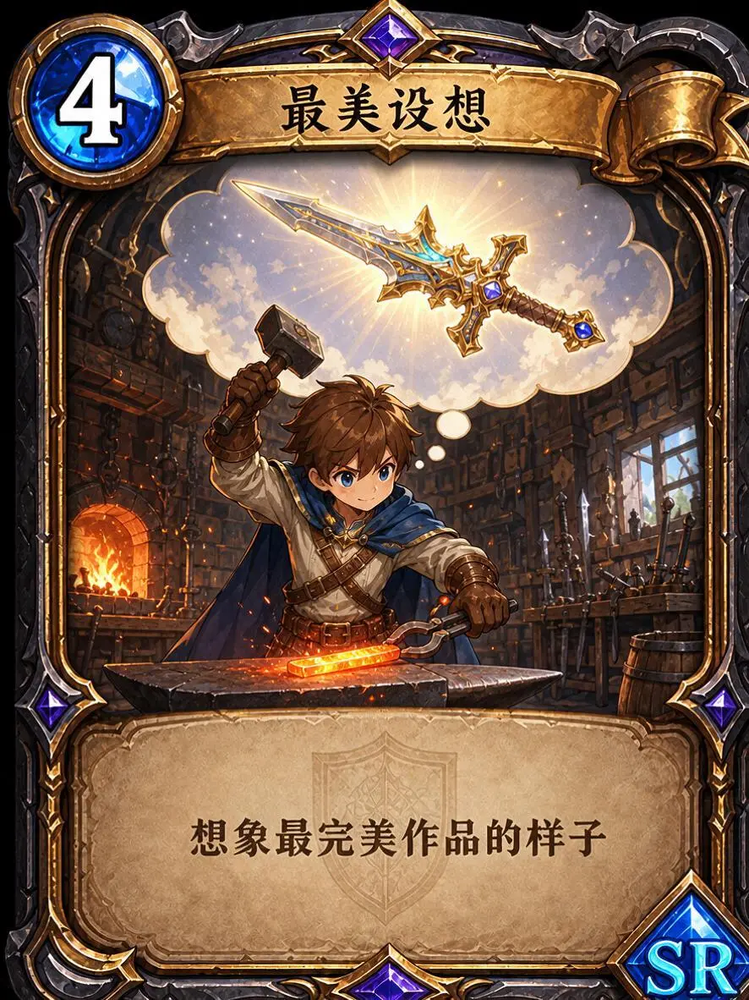

> 最完美的班徽，同学拿到手是什么反应？贴在班服上多神气？把这画面在脑子里演一遍，你的标准就立起来了。

**【🙋互动】**现在，我们再来一个互动：同学们可以尝试把自己想象中最完美的班徽是什么样达到评论区。

漂亮！你们已经把“好班徽”的标准立起来了。带着这份灵感池和评价标准，我们进行下一步。

#### 第三步：多出几招

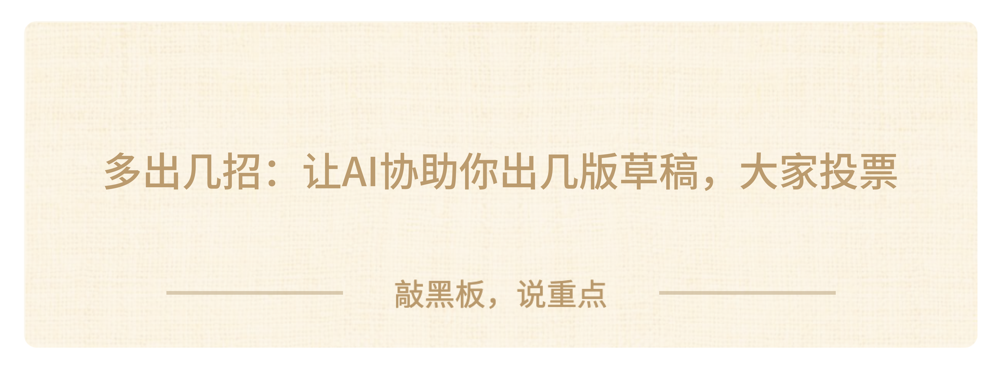

同学们，前面基本步骤，我们明确了“我们是谁”，又看清楚了“好班徽”长啥样，我们是不是可以开始设计了。对，可以开始设计了，但也先别着急。

**【🙋提问】**在这里我先问同学们一个问题，如果你来设计班徽，就用传统的纸张和水笔（起稿，调整，上色），画出一个班徽需要多长时间？

————————

**可能同学得用1天，有的用2-3个小时。**那么我们花了这么长时间，给别的同学或者老师看，征求他们意见，如果他们提出修改，或者说再画一个其他风格的，那是不是还需要花很长时间来完成？**大家有没有什么方法来提高这个步骤的效率？**

没错，这时候就该AI登场了，一定记住一句话——**用AI绝对不是第一步，而是最后一步**。**前面你做了找用户、找场景、找特点、写可能性、建灵感池，经过前面这些步骤之后，才知道让AI画什么。**

其实AIGC工具已经发展很多年了，可能有的同学用AI画图已经非常熟练了，但是我也发现给问题，有些同学让AI做班徽的设计，上来就跟AI说：“帮我设计一个很酷的班徽”。**在这里问问同学们，问题出在哪？**

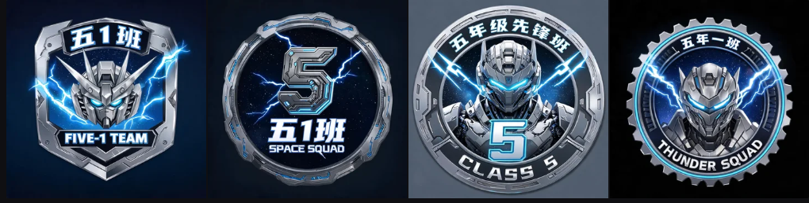

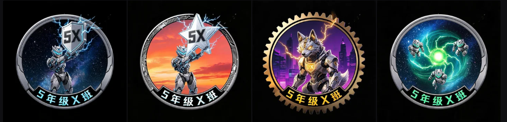

对，刚才那句话（在AI领域里的术语叫做**提示词**）并没告诉 AI：**给谁、在哪用、你们班有什么突出的特点和优点。缺少了这些信息，AI工具只能根据它理解的“酷”给你出一张图。**

**我们第一步深挖的班级特点，再加上建好的灵感池，就是给 AI用的说明书。**看崔老师的提示词怎么写的：

```
给五一班设计一个班徽，使用场景是运动会入场仪式手举牌子和校服胸前佩戴的徽章。班级关键词是“脑洞大，爱创新”，所以要体现活力和灵感方面的元素。需要三个风格的班徽、
```

⚠️**注意！！！我要的是 3 版，不是 1 版。因为——草图不是最终答案，草图是用来给别人看获取反馈的。**

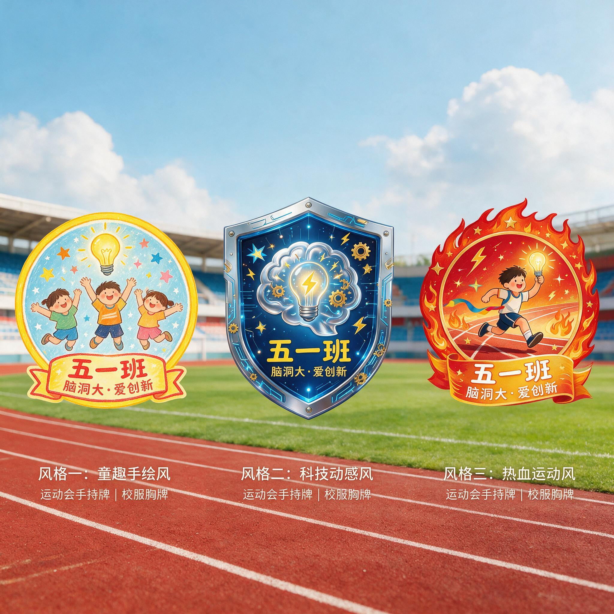


在这一步怎么能得到比较好的效果哦？再大家亮一张技能牌——**【神兵宝库】（对应【善用佳软】）**。

> **我们可以多尝试一些AIGC的生图工具，**比如豆包，即梦AI，LibTV这些，因为这些软件自己的绘图能力（不同的绘画模型）也都不尽相同，所以出来的效果不一样，同学们有条件的最好都用一下，比较结果。


下面就是老师用完全一样的提示词在不同软件里面画出来的班徽，大家看看，是不是区别还挺大的。

**绘图模型**

**生成结果**

**评价**

即梦 图片5.0 pro

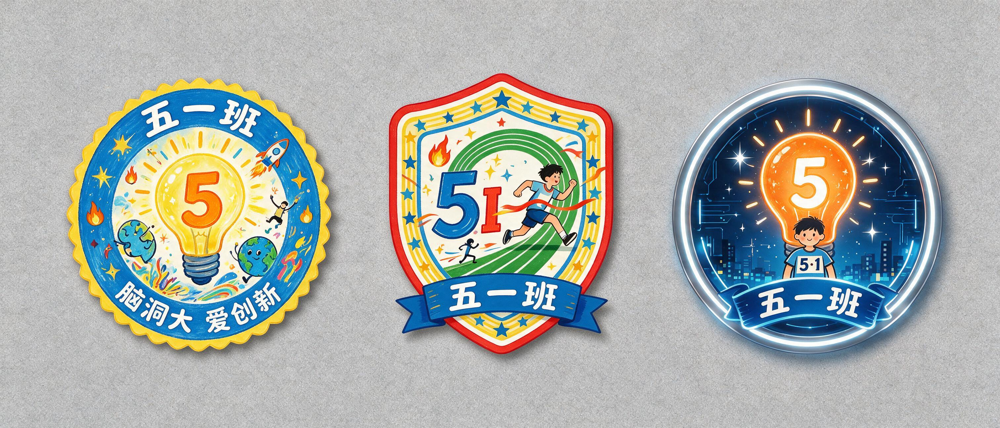

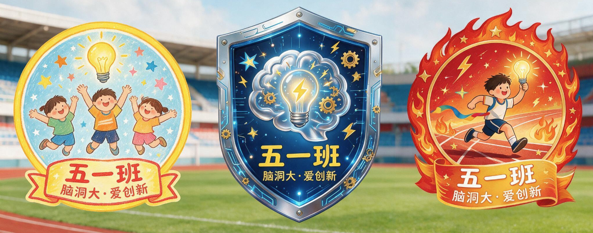

豆包

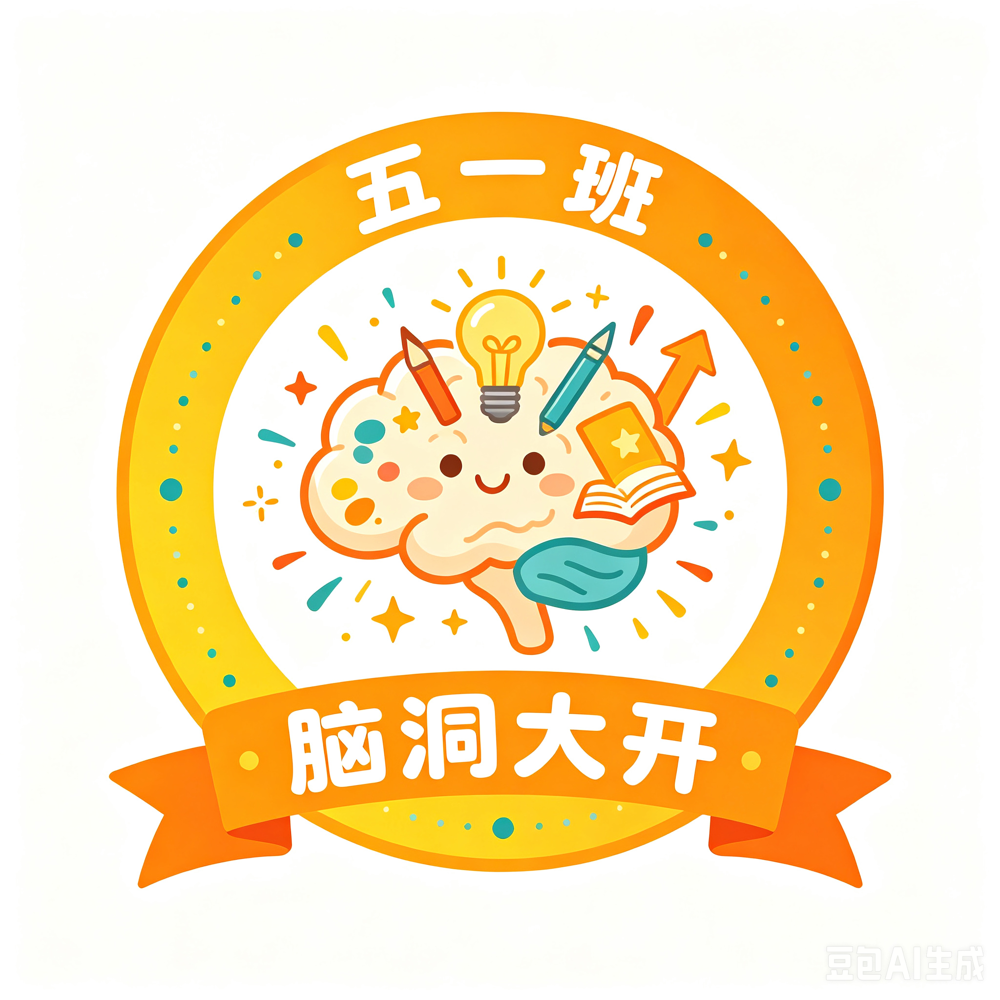

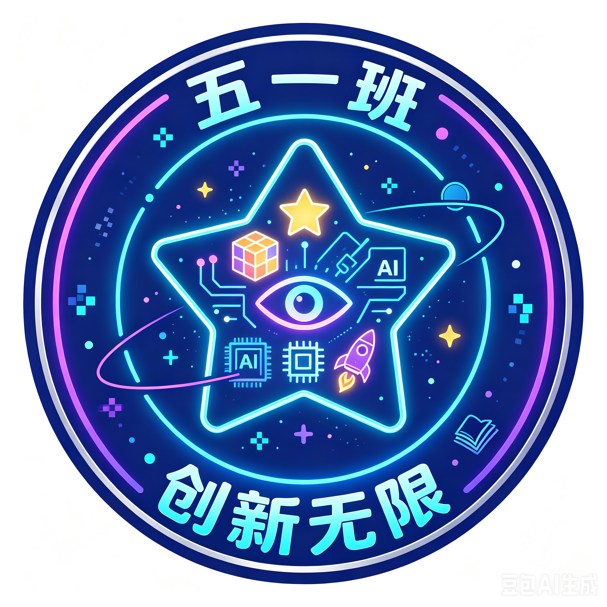

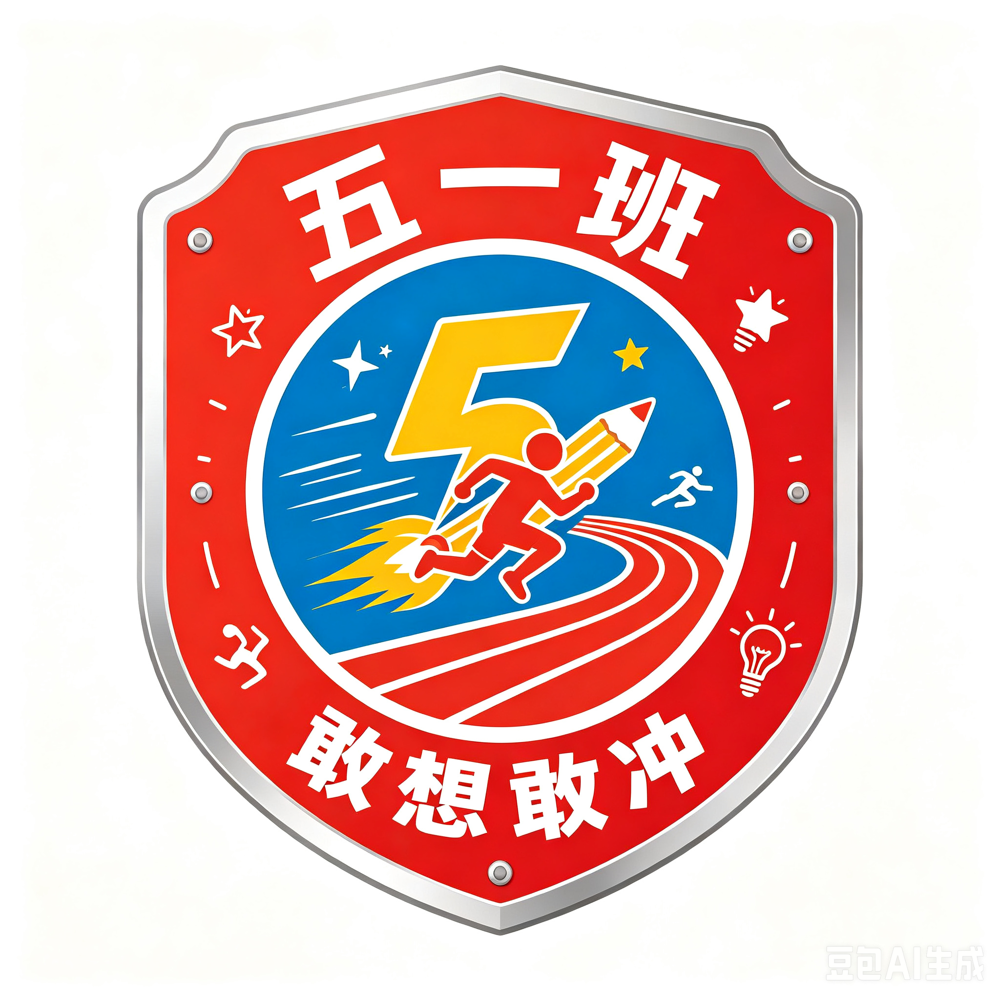

GPT image 2

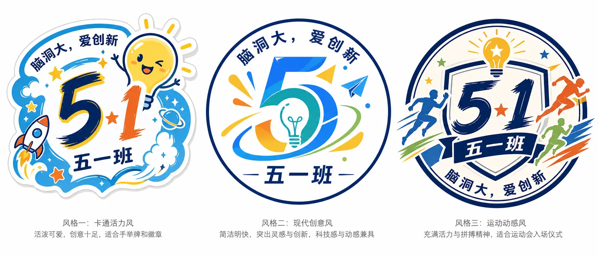

Nano banana pro

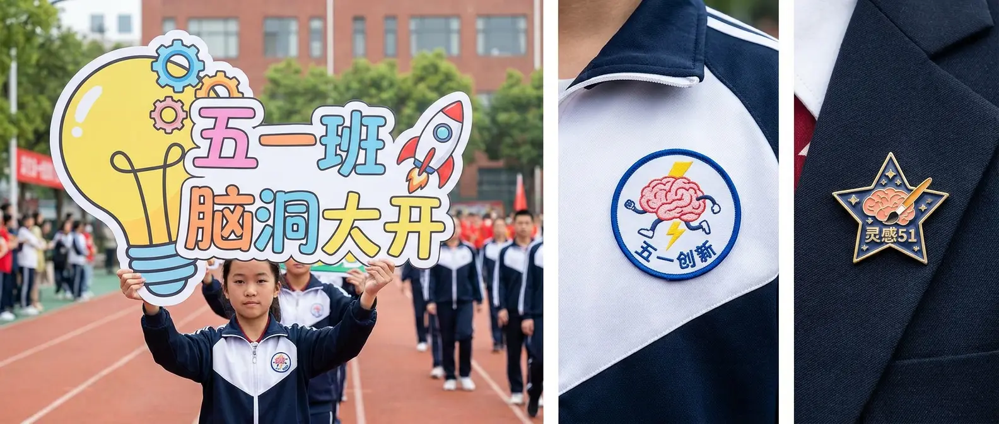

Nano banana 2

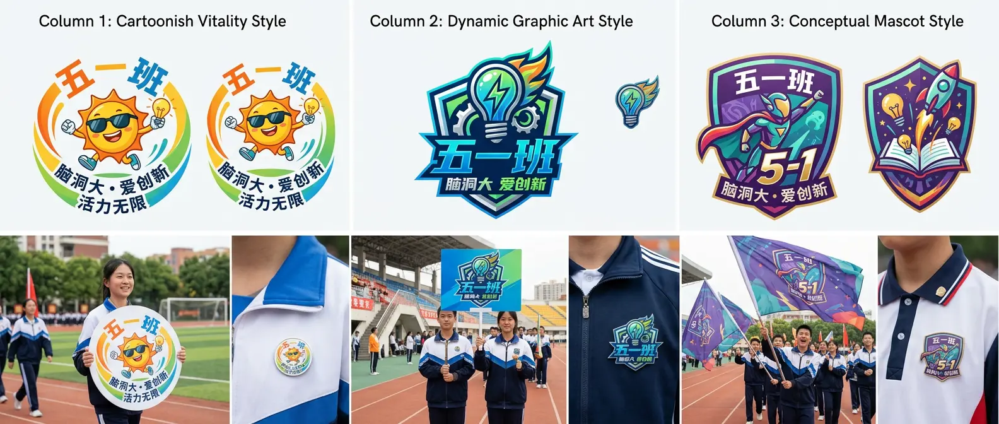

Midjourney niji 7

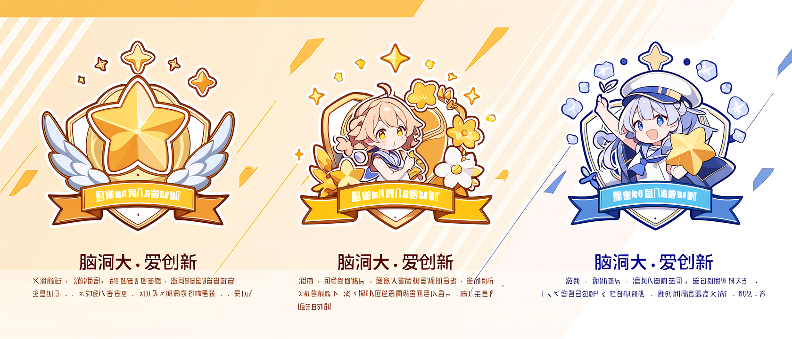

Midjourney v8.2

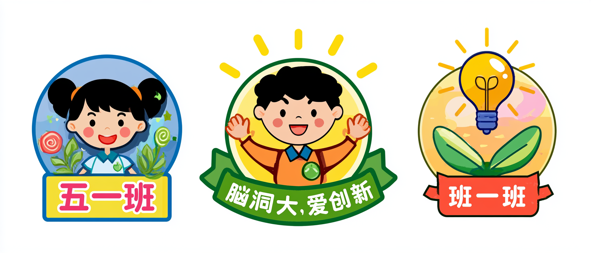

而且——上一步我们建立的灵感池现在可以派上用场了：我们在给AI的提示词里，除了用户、场景、关键词，再贴 1-2 个灵感池里的例子说“参考这种风格”，AI 出的草稿审美立刻不一样。**这就是为什么前面“找参考”这一步不能省：没有好作品的积累，出的草稿再怎么修改提示词可能也缺一些审美。**

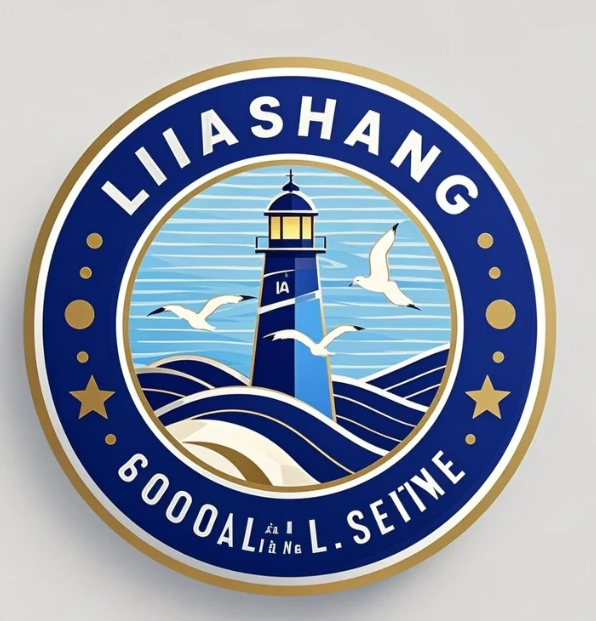

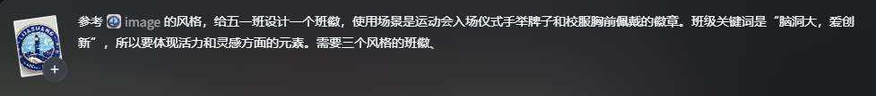

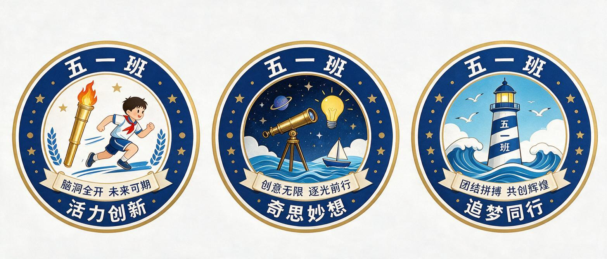

出来了。

> - 1 号运动风

> - 2 号科学风

> - 3 号航海风

**【🙋互动】**现在，该你们当评委——如果只能选一个方向继续精修，你选几号？评论区扣 1、2 或 3。理由只写一句：因为它最能表现 ___。

————————

这一步叫**【多出几招】**——

> 不是画出最终作品，**是用低成本（时间）和高效率去出成果，用投票验证**，千万别一个人闷头做所谓的最终版。

这点可能对初中同学尤其有用：你们做社团海报、项目展示，也一样，**因为有了AI工具的辅助，先让AI出几版让别人反馈，这样就可以对作品进行快速调整，别一上来就死磕最终稿。**

#### 

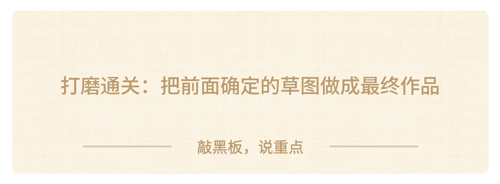

上一步我们把班徽的方向和大致方案定了，还不是最终版。同学刚才投票时也提了意见——

> - 有人说“星星再多一颗更好”

> - 有人说“颜色再亮一点”

> - 或者几版里最好的元素拼起来

一张班徽，从来不是“出几版、选一版”就完了，它要在草稿上反复打磨才能成。这就进入最后一步：**打磨通关。**

**“打磨通关”**并不是选定一个草稿就完事，或者说选一个草稿稍微调整一下，而是：**拿着第三步那几版草稿，一轮一轮地改，直到把它打磨成全班都认的最终作品。**

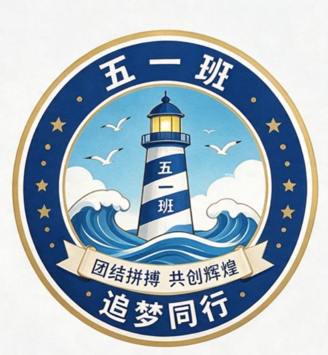

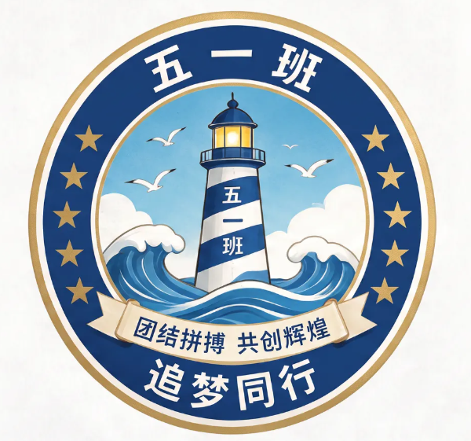

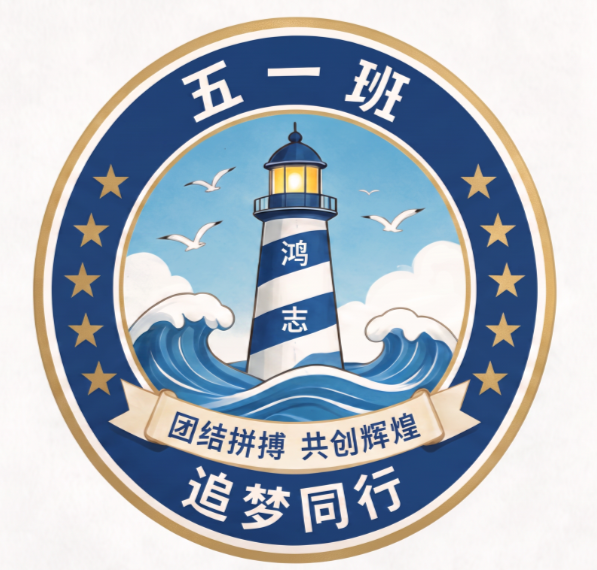

————————

同学们。**从我们课程开始LEO同学的班会被质疑“为什么画成这样”，到现在的“这个真的像我们班”——并不是 AI 多厉害，是在做设计先理解了人，再让AI 帮你来做。**

这也正是我们“出 3 版先投票”、而不是埋头做 1 版的原因——**打磨也是一轮一轮验证，反复调整优化，完成最后的作品。**

这里还要提醒大家，打磨时锁住班徽的“魂儿”，

> - 每加一个元素就问“还是我们班吗”，不是就砍；

> - 关于“同学喜欢啥”的各种可能性，用加法-减法-验证去试；

改完要**贴在真实校服上、缩到头像看**，别只在电脑大图自我陶醉。就是我们要清楚我们作品的**“内核和边界”。 **这也是今天给大家的最后一张技能卡**【初心结界】**


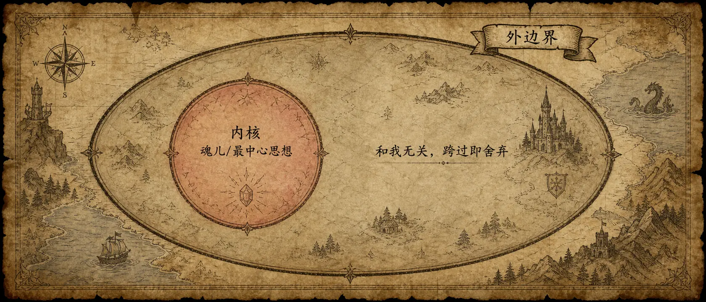