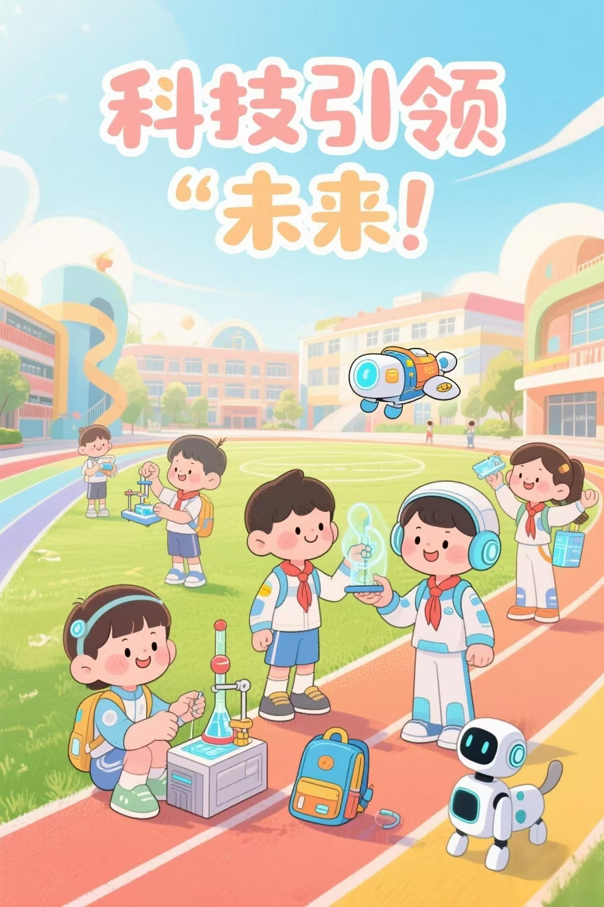
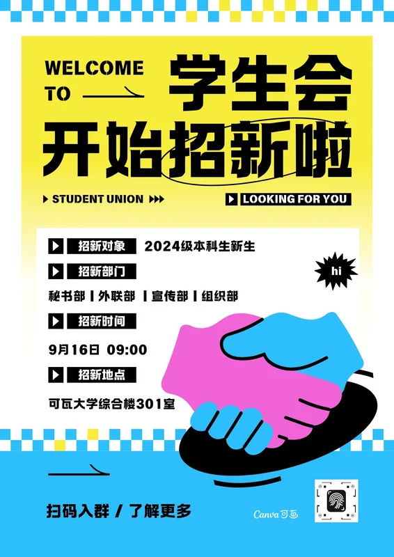
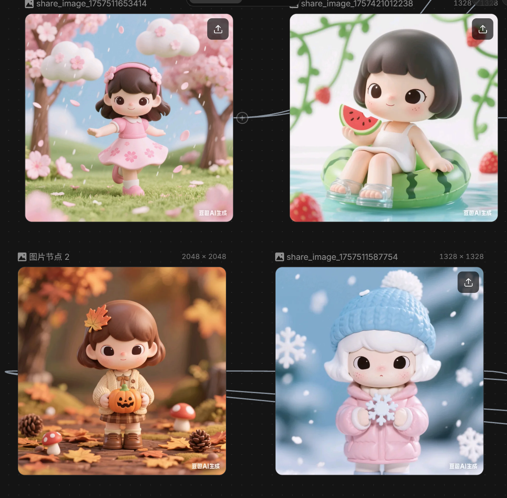
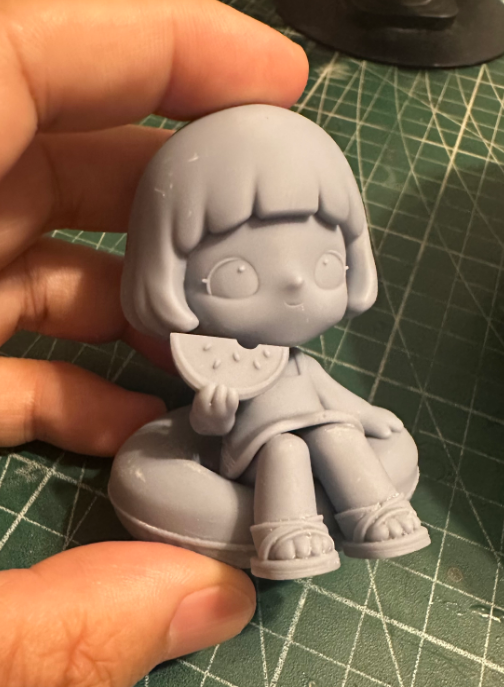
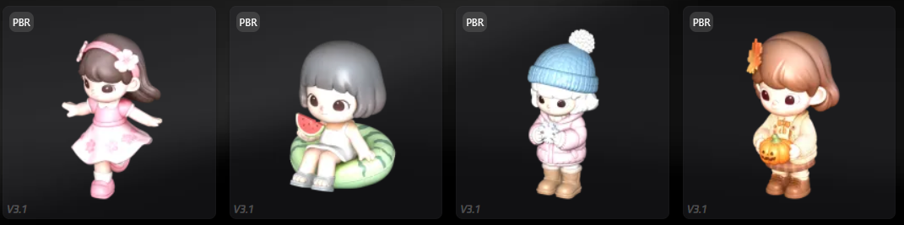

### 触类旁通：其他类设计的四步法样例

**产品（孩子交付物）**

**分类**

**① 明确任务**

**② 看齐高手**

**③ 多出几招**

**④ 打磨通关**

**案例展示**

**活动海报**

平面宣传

给全校同学看；要“一眼看懂**活动内容，时间和地点 **+ **觉得好玩想来**”。

看学校里疯传的好海报、电影宣发图、游戏活动 banner，归纳“**大字标题 + 主视觉 + 利益点**”结构。

出 3 版（热血漫画风 / 清爽信息风 / 梗图幽默风），可以找别的班，别的年级同学来投票选。

根据反馈调标题、换主图、补二维码，缩成手机缩略图看清不清。

**跳蚤市场盲盒（抽卡）**

实物商品

给逛市场的小伙伴买；要“花小钱买惊喜、拆开不亏”。班级要借盲盒秀创意 + 凑班费。

看泡泡玛特 / 书店盲盒 / 手工博主开箱，归纳“统一外盒 + 随机小物 + 拆袋仪式感”。

设计 3 版主题（班级吉祥物 / 学科梗 / 校园传说），每版列里面可能装的 5 样小物，投票选。

做样品找 3 同学试拆看惊不惊喜，改外盒图案和里面搭配，直到“想再买一个”。

**课本剧**

表演活动

给全班 + 家长看，要“把课文演活、大家看得懂又觉得有意思”——最容易跑偏成“我们想演哪个角色”，其实得先想观众能不能一眼看懂。

看经典课本剧 / 话剧片段，归纳“挑最出戏的高潮片段 + 角色加反差 + 道具少但精准”，学怎么把无聊课文变好玩（AI 也能帮出角色设定图、写改编台词）。

出 3 版大纲（忠于原著 / 搞笑改编 / 现代穿越）投票选，顺便分角色。但是要注意不能脱离课文的中心思想。

真排练，找 3 个没参演的同学当观众试看，问“哪段没懂、谁演得不像”，改台词走位，直到台下有人笑有人懂。

**校园角落改造提案**

文字方案

给班主任 + 学校负责人看；提案要解决同学或老师的具体问题。比如要“批准把荒地角落进行改造”，他们要可行 / 安全 / 不添乱 / 有教育意义。

看别校学生提案、少先队实践案例、优秀汇报 PPT，归纳“问题 + 方案 + 预算 + 收益”四段式。

写 3 版草案（实用菜园 / 打卡拍照角 / 流浪猫窝），各附一张草图，班上投票选方向。

补细节（谁维护 / 钱从哪来 / 安全怎么保），找 3 个老师同学试读提意见，改到“挑不出大毛病能交上去”。