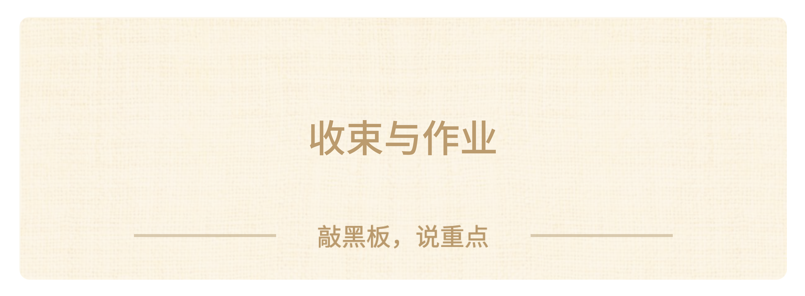
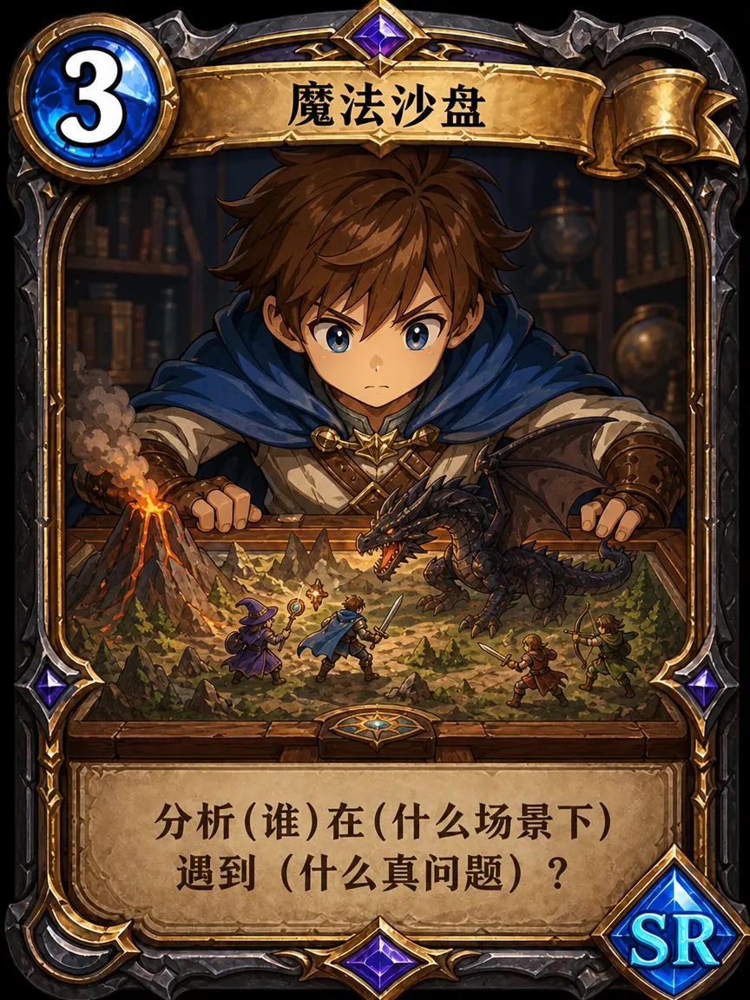
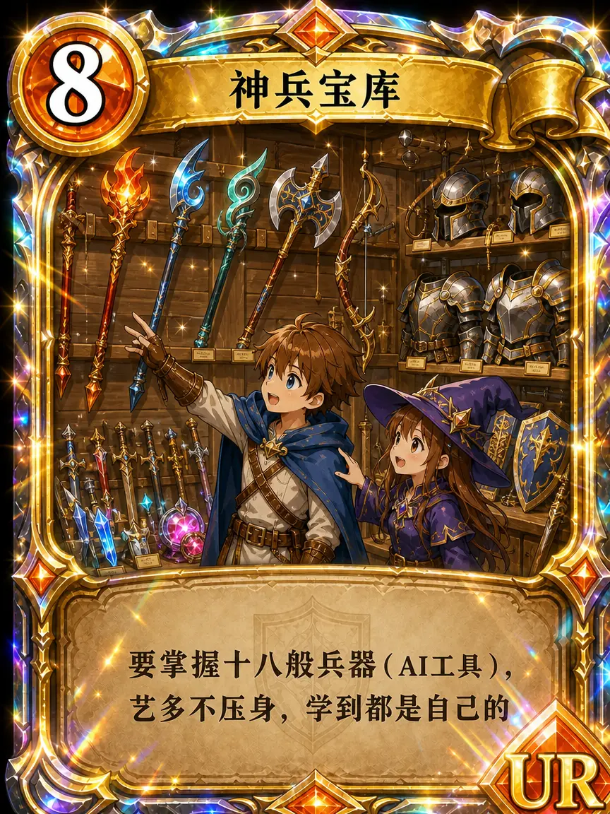
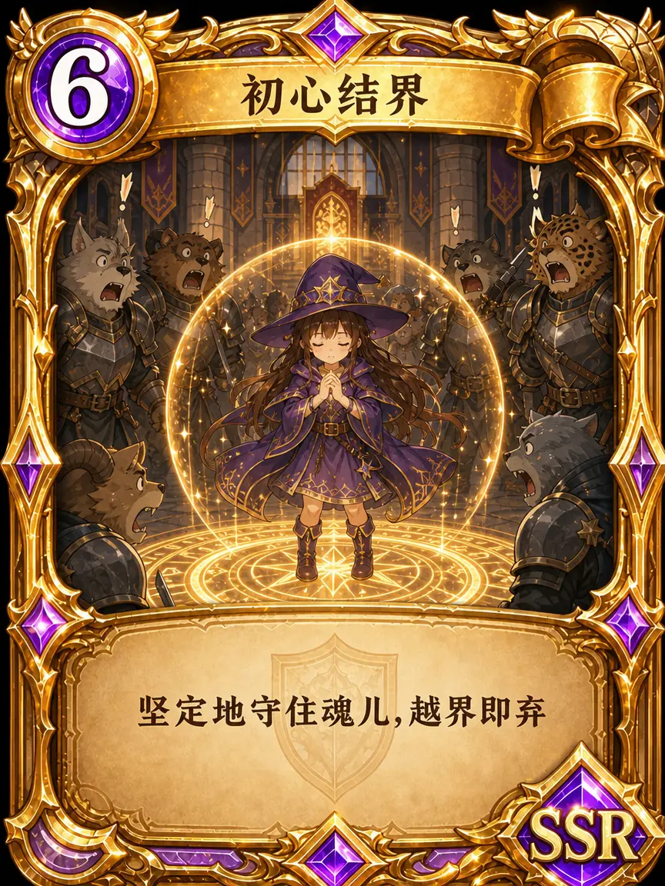
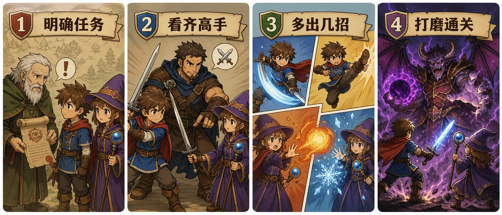

### 收尾：什么才是好设计？

这么快就要下课了，让我们回开头的三个班徽。还记得你选了左边，中间的，还是右边吗？现在我会问你一个更准的问题——**好设计不是“我觉得酷”，“我觉得可爱”，也不是“大家都说好看”，而是让需要使用它的人，觉得“我要的就是这个”。**

今天我希望大家带走三件东西：

> - 第一，重新定义产品——交付给别人的东西，都是产品；

> - 第二，记住四步法——**明确任务、看齐高手、多出几招、打磨通关**；

> - 第三，钉死一句话——用 AI 做出别人想要的东西。

还有，就是今天这些SR,SSR和UR的技能卡——**换位读心**让我们站在使用者的角度来思考、**魔法沙盘**让我们挖掘出使用者遇到的真问题、**收集秘籍**让我们见识到真正好的设计提高自己的审美、**神兵宝库**让我们掌握多种AI技能、**结界初心**保证我们不会偏离做设计最初的目的——它们刚好串起**明确任务、看齐高手、多出几招、打磨通关**这几个步骤，你只要随身带着这些技能卡，下次做设计就不会翻车。

**【🙋互动】**那么今天课程的内容，

> - 如果你懂了，请在评论区扣1，

> - 如果你想挑战更难的产品设计，请在评论区扣2。

————————

那我给大家留一下这节课课程的作业练习，分成必做和挑战两类：
1. **必做（基础）**：用三步法给自己的班级/小组做一枚班徽，填完《AI 班徽产品设计卡》

> ① 班徽给谁看？

> ② 出现在哪里？

> ③ 3 个班级关键词

> ④ 一句设计假设 

> ⑤ 生成/手绘 2-3 个草图方向 

> ⑥ 找至少 3 位同学或家人投票

> ⑦ 根据反馈改一版
2. **选做（迁移）**：把班徽方法迁移成一张「班级活动海报」（套用“谁看完要做什么”）。
3. **挑战（迁移）**：采访一位家人/朋友“你喜欢什么”，用调研思维为 TA 做一份小设计（礼物/卡片/封面）。
4. **作品集（高阶）**：准备在社区跳蚤市场上卖的吧唧

> 用户调研 → 设计创意 → AI 草图 1/2/3 → 投票和反馈 → 修改前后对比 → 确定方案。

好的，作业也留完了，同学们，我们今天的课程就到这里！谢谢大家，再见！