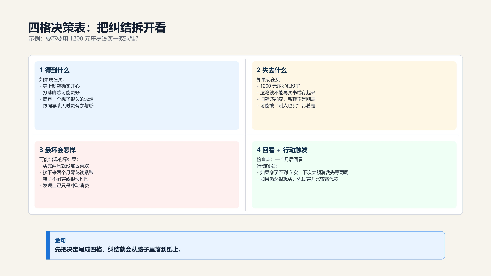
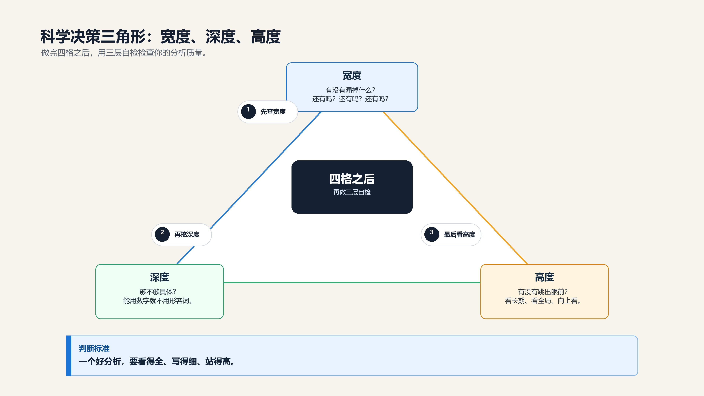

### **三、四格决策表 + 科学决策三角形**

今天这节课结束之后，你能做到五件事。而且——等一下你会用评论区文字版四格，当场练一次：

> - 第一，面对一个选择，不再是脑子里想，而是拿出纸写下来。

> - 第二，能列出至少两个选项。

> - 第三，能说出每个选项的**得到、失去、最坏会怎样。**

> - 第四，能设置一个检查点——不只写“**什么时候回来看**”，还会写“**如果发现什么情况就怎么调整”。**

> - 第五，能区分“别人的建议”和“自己的判断”。

五件事，你等一下当场做到。我会从评论区选几条文字版四格来点评。

**【💡划重点】**注意，我不是要你听完觉得“这个方法不错”。那不够。一个方法如果没有在现场用过，它就还不是你的。它只是你听过的一段话。所以后面我会逼你把它写出来。你写得不完美没关系，写得慢也没关系，重要的是你第一次亲手完成这个动作。只要你完成一次，下次真正纠结的时候，你就知道该从哪里开始。

#### **核心工具：四格决策表**

今天你只需要带走一个工具。就是这个。拿出一张纸，画一个十字，分成四个格子。

> - 左上角：**得到什么**。

> - 右上角：**失去什么**。

> - 左下角：**最坏会怎样**。

> - 右下角：**什么时候回来看**——以及，**如果发现不对，怎么办。**

就这四个格子。

四格决策表：带示例填写的工具图。

来，现场填一次。1200块的球鞋。

> - 左上角——**得到什么**：“穿上新鞋确实开心”、“打球脚感更好”、“满足了一个念想”

> - 右上角——**失去什么**：“1200块没了”、“这1200块还能干什么？（两个月更好的食堂、三本想看的书、攒着暑假用）”、“旧鞋还能穿，新鞋不是刚需”

> - 左下角——**最坏会怎样**：“买了之后发现没那么喜欢（这种事你应该不陌生）”、“接下来两个月零花钱紧张”、“鞋子质量不好或很快过时”

> - 右下角——**什么时候回来看** + **行动触发**条件：“一个月后，看看穿了几次”、“如果一个月穿了不到5次，下次买大额物品前强制自己等两周再决定”

球鞋案例：把一个具体选择填进四格。

填完了。但在你看结论之前，先做一件事。**问自己：我刚才写的东西，有没有骗自己？**比如“穿上新鞋打球脚感更好”——真的吗？现在的球鞋差到影响你打球了吗？还是在给“我想买”找一个更合理的理由？

**【💡划重点】诚实，是科学决策的前提。**骗自己，是世界上最容易的事。骗完之后再做决策，是世界上最蠢的事。好，如果你确认没骗自己，现在你看着这张纸——跟刚才在脑子里纠结的时候相比，是不是清楚多了？

诚实自检：先确认自己没有骗自己。

四格决策表做的事情很简单：把脑子里乱飞的想法，放到纸上的四个格子里。放进去之后，全貌就出来了。这里有一个很重要的细节：**四个格子不是为了让你立刻得到一个标准答案，而是为了让你看见自己到底在想什么。**很多人纠结，不是因为没有答案，而是因为连问题都没摆清楚。

> - 当你把“得到”写出来，你会知道自己到底在期待什么；

> - 把“失去”写出来，你会知道自己要付出什么；

> - 把“最坏”写出来，你会知道自己最害怕什么；

> - 把“回看和触发条件”写出来，你会知道这不是一次赌命，而是可以调整的选择。

好比收拾房间——衣服满地都是的时候你觉得乱得不行。但分成上衣、裤子、要洗的、不要的四堆，突然就清楚了。

#### **关键追问：“还有吗？还有吗？还有吗？”**

填完四个格子之后，大多数人觉得“差不多了”。但一堂的课程里反复强调一个心态——**“默认我会丢掉很多要素”**。你以为你列全了？你一定漏了东西。每个人都会漏。所以填完之后，你必须追问自己三遍：“**还有吗？还有吗？还有吗？”**

比如买鞋

> - 你列了“穿上开心”“打球脚感好”。但“开心”能持续多久？两天？两周？两个月后你还开心吗？你漏了“**愉悦感的持续时间”。**

> - 你列了“1200块”。但你漏了——这1200块如果省下来，一年后加上利息和零花钱积累，可能变成2000块——你漏了**“钱的时间价值”。**

> - 你列了“旧鞋还能穿”。但你漏了——如果你不买新鞋，旧鞋再多穿半年，这半年的“将就感”——这**是一种情绪成本。**

**还有吗？还有吗？还有吗？**

这三个追问，是四格决策表的灵魂。没有追问，四格只是半成品。很多同学第一次填四格，会填得很快，三分钟就写完了。写完之后感觉自己很厉害。但真正的训练从这里才开始。你要盯着每一个格子继续问：**还有吗？还有我不愿意承认的吗？还有我不想面对的吗？**

**【💡划重点】尤其是“失去什么”和“最坏会怎样”这两个格子，最容易被写得很轻。**因为人天然喜欢证明自己想要的东西是对的。你越想买，越容易少写失去；你越想报名，越容易少写风险；你越想退出，越容易少写退出后的代价。所以“**还有吗**”不是一句口号，**它是在帮你对抗自己的偏心。你越诚实，四格越有用；你越想糊弄它，它就越像一张装饰性的表格。**

**【🙋提问】**好，先停一下。你现在脑子里想一个你最近做过的选择——随便什么都行，中午吃什么、昨天买了什么、周末去了哪里——试着在脑子里快速列三条得到、三条失去。不用写，脑子过一遍就行。30秒。

————————

好，**有没有发现——就算不动笔，光是“逼自己列三条”这个动作，就能让你发现之前没注意到的东西？**这就是“写下来”的力量。只不过等一下我们要把它真的写到纸上。

#### **科学决策三角形：做完四格后的三层自检**

现在我要给你一个更完整的视角。这个视角来自一堂课程里的核心框架：**科学决策三角形**。你填完四格决策表之后，用三个维度检查你的分析质量。这三个维度是：**宽度**、**深度**、**高度**。

**🔹第一层：宽度——你有没有漏掉什么？**

这就是我们刚才讲的**“还有吗？还有吗？还有吗？”**。一堂有一整套盲区清单，我把适合你们的部分提炼出来。你不需要背，你只需要每次填完四格之后，对着这四个格子问自己：

> - 我是不是只想到了钱？有没有漏掉时间成本？（比如买鞋不只是1200块，还有你花在挑选、对比、下单上的时间）

> - 我是不是只想到了自己？有没有漏掉对别人的影响？（比如买鞋花光零花钱，接下来跟同学出去玩可能就得省着花）

> - 我是不是只想到了眼前？有没有漏掉长期影响？（比如这双鞋一年后你还穿吗？）

> - 我是不是只想到了物质？有没有漏掉情绪和关系？（比如买了之后开心多久？不买会不会一直惦记？）

**宽度自检的核心就一句话：我是不是只想到了一个方面？换个角度看。**

**🔹第二层：深度——你写的东西够不够具体？**

> - 不要写“花时间”，写“花多少时间”。

> - 不要写“可能有用”，写“大概有多大用，在什么情况下有用”。

> - 不要写“有点贵”，写“占我每月零花钱的百分之多少”。

一堂课程里把这个叫“定量思维”。对你们来说，做到一条就够了：**能用数字就不用形容词**。比如你不是写“暑假补习班有点贵”，而是写“补习班8000块，占我家一个月收入的百分之多少”。你不是写“竞赛备赛花时间”，而是写“每周10小时，一个学期200小时”。

**深度自检的核心就一句话：你写的每一条，能换成数字吗？能的话，换掉。**

**🔹第三层：高度——你有没有看到更大的图景？**

三个问题问自己：

**第一个，长期视角：** 这个选择在一年后、三年后会怎样？买手机，买的时候很开心，三个月后你可能就没感觉了，但1200块已经没了。选科，选的时候觉得“物理好就业”，但三年后你坐在大学教室里学一个你不喜欢的专业，你会不会想起今天的选择？

**第二个，机会成本：** 同样的时间或钱，如果不做这件事，最好的替代选项是什么？ 不是“省下来了”，而是“省下来之后能干什么最好的事”。暑假两个月，如果不打工，最好的替代选项是补习？还是休息？还是学一个技能？

**第三个，时间窗口：** 这个选择有没有截止日期？过了一个时间节点，选项就变了或者没了？竞赛报名有截止日期。选科有提交日期。有些机会，错过了今年就只能等明年，甚至永远不会再来。

**高度自检的核心就一句话：跳出眼前，站远一点看——一年后、三年后，这件事还重要吗？**

很多同学做决定的时候，视角会被眼前的情绪压得很低。今天开心不开心，今天有没有面子，今天会不会被别人笑，今天爸妈会不会骂我，这些当然重要，但它们不是全部。

高度不是让你假装成熟，也不是让你每个小选择都想十年。高度的意思是：当一个选择真的会影响你比较久的时候，你要提醒自己把镜头拉远一点。你不是只看今天的舒服和不舒服，你还要看未来的自己会不会感谢现在的你。所以

> - **宽度**解决“有没有漏”

> - **深度**解决“够不够细”

> - **高度**解决“站得够不够远”。

三层合在一起，你的分析才不是一张随手填的表，而是一张可以支撑判断的表。

科学决策三角形：事实、价值、后果三层自检。

好，三角形讲完了。现在做一个快速练习。你看着刚才买鞋的四格决策表——**用宽度/深度/高度扫一眼。**

> - 宽度：有没有漏掉什么？（比如情绪成本、社交影响）

> - 深度：你写的东西够具体吗？（比如“开心”能换成“大概开心一周”吗？）

> - 高度：一年后这双鞋你还穿吗？1200块如果不买鞋，最好的替代用途是什么？

快速扫一眼就行。有没有发现什么你之前漏掉的？你会发现，三角形不是另一个复杂工具，它只是帮你回头检查四格。四格负责把内容放出来，三角形负责问：你放得全不全，写得细不细，看得远不远。如果你以后时间很紧，就先画四格；如果这件事比较重要，就再用三角形扫一遍。不要把工具用复杂了。工具越简单，你越可能真的用起来。

好，有人可能发现了——“最坏会怎样”里你写了“鞋子质量不好”，但你有没有想过“鞋子质量好但你不喜欢了”？这也是一种可能的“最坏”。你看，扫一遍总能发现新东西。

#### **区分“建议”和“信息”——60秒微练习**

在进入工具进阶之前，先做一个非常重要的训练。很多同学决策失误，不是因为分析能力不行，而是因为把别人的建议当成了答案。来，听下面三句话，**判断哪句是“信息”，哪句被当成了“答案”**

> - 第一句： “我表哥选了物理，现在在华为上班，年薪40万。所以你也应该选物理。”

> - 第二句： “我表哥选了物理，在华为上班。这说明物理类的就业上限可以很高。但这是他的路径。你需要了解他的高考分数、大学、专业方向、个人能力，再判断这条路径适不适合你。”

> - 第三句： “我同学选了历史，现在很后悔。所以选历史没前途。”

你发现了吗？第一句和第三句，是把一个人的经验直接当成了你的答案。第二句，是把一个人的经验当成一条信息，还需要更多信息才能做判断。

**区分标准是什么？**信息是“他发生了什么”，答案是“你应该怎么做”。别人只能给你前者，后者必须你自己分析。下次你听到“你应该选物理”“你应该报那个班”“你应该买那个”，在心里问自己一句话：这是他的结论，还是我的分析？你**可以尊重每一个给建议的人，但不要把建议直接当答案**。爸妈有爸妈的经验，老师有老师的视角，同学有同学的处境，专家有专家的模型。它们都可能有价值，但它们不是你本人。

正确的用法是：**把这些建议拆开，放回你的四格里**。比如爸妈说“选物理好找工作”，这不是答案，这是一个信息点，可以放到“得到什么”里继续追问：好找工作体现在哪里？哪些专业真的需要物理？我的物理基础能不能支撑？当你这样做的时候，你不是不听建议，而是把建议变成材料。材料越多，你的判断可能越稳；但最后做判断的人，必须是你自己。

#### **升级工具总览：一个核心 + 三种叠加**

**【💡划重点】**好，现在我给你一个总览。今天你只需要带走一个核心工具：**四格决策表**。 80%的日常选择用它就够了。但如果你遇到更复杂、更重要的选择，有三种叠加用法——你今天听听就好，将来用得上。

> - 叠加一：冷静清单法。 当“得到/失去”太粗略，把它展开成一张详细清单。一条一条列，把情绪关在门外，像会计做账一样。

> - 叠加二：故事推演法。 当需要看到过程而不只是结果，像导演一样在脑子里把整个过程演一遍。不是问“选A好不好”，而是问“选了A之后，接下来会发生什么？然后呢？然后呢？”

> - 叠加三：找人查。 做完分析准备拍板之前，找过来人、反对者或AI工具帮你看一眼。自己看自己的分析，就像自己给自己剪头发——总有看不到的角度。

越重要的决策，叠加越多。但底层永远是四个格子：**得到、失去、最坏、回看+行动触发。**

**【🙋互动】**好，停一下。我给你讲一个真实的故事。我有一个朋友——好吧，这个朋友就是我自己。我当年选大学的时候，列了一张巨大的表格，用了今天教你的所有方法，分析得可认真了。打分、加权、排序、找人检查——全做了。最后你猜怎么着？

————————

**我选了一个完全不在表格里的学校。**为什么？因为我女朋友去了那个学校。

这是一个**反面案例**——**说明科学决策最大的敌人不是分析能力不足，而是情绪**。但这个故事也说明一个道理：就算你做了科学决策又被情绪打脸了，你至少知道自己为什么被打脸。 这比“我也不知道怎么选了那个学校”要强一百倍。而且——复盘的时候我至少知道：哦，我当时的决策被“不想异地恋”这个情绪干扰了。下次做重大决策的时候，我知道要特别注意情绪因素。

**好的决策不保证成功，但保证你不糊涂。**好了，轻松完。接下来是实战案例。