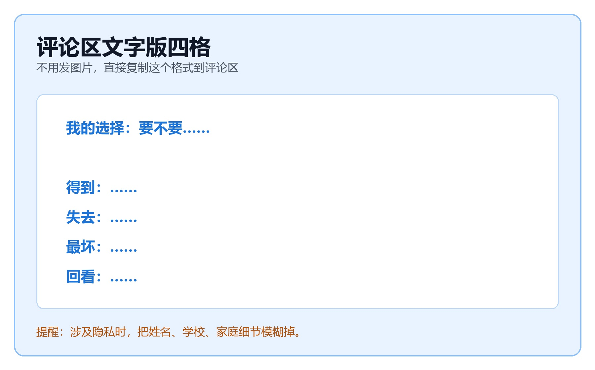

### **五、你现在就做：评论区文字版四格**

好，轮到你了。前面你一直在听我讲，现在换成你自己动手。因为我们是线上直播，今天不需要发图片，也不要上传纸上的表。你只需要在评论区发文字。

如果你的选择涉及隐私，比如真实姓名、学校、家庭收入、具体关系，不要直接发出来。你可以换成一个更小、更安全的选择，也可以把细节模糊掉。

今天的目标不是公开你的隐私，而是让你真的练一次“把纠结拆成四格”。

#### **第一步：先发一句话**

我给你90秒，先做第一步：在评论区发一句话，写下你最近正在纠结的一个选择。格式很简单：我的选择：要不要……

> - 比如：我的选择：要不要报名演讲比赛？

> - 比如：我的选择：周末先复习数学，还是去同学生日？

你先不要急着解释理由。第一步，只要把选择说清楚。一个说不清楚的问题，是没办法被分析的。

#### **第二步：再发四行文字**

- 得到：……
- 失去：……
- 最坏：……
- 回看：……

每一行不用写很多，先写关键词就行。比如得到写两三个关键词，失去写两三个关键词，最坏写一个你最担心的情况，回看写一个时间点。如果评论区太快，你也可以先在手机备忘录里写完，再复制到评论区。

#### **第三步：发之前做三秒钟诚实自检**

发出来之前，先停三秒，看着你写的四行，问自己一个问题：**这里面有没有哪一句是在给自己找借口？**比如你写“买这个东西是为了学习”，那你诚实一点问自己：它真的主要用于学习吗？还是学习只是一个比较好听的理由？

**诚实，是科学决策的前提。**

**【🙋互动】我会从评论区选几条文字来点评。**接下来我会从评论区选2到3条文字版四格来点评。我不会要求你发图片，也不会要求你把很私人的细节讲出来。我们只看这个四格本身：**有没有写全、有没有写具体、有没有写回看的时间点**。点评的时候，我会用刚才的三角形：**宽度够不够全，深度够不够具体，高度有没有跳出眼前。**

**评论区常见问题，我会这样改**

> - 如果你只写了“得到”，没有写“失去”，我会提醒你：这不是决策，这是愿望清单。

> - 如果你写得很泛，比如“有帮助”“有风险”“可能不好”，我会提醒你：能不能换成更具体的数字、时间或场景？

> - 如果你没有写回看，我会提醒你：这个决定什么时候回来检查？如果发现不对，你准备怎么调整？

**一个好分析，要看得全、写得细、站得高。**