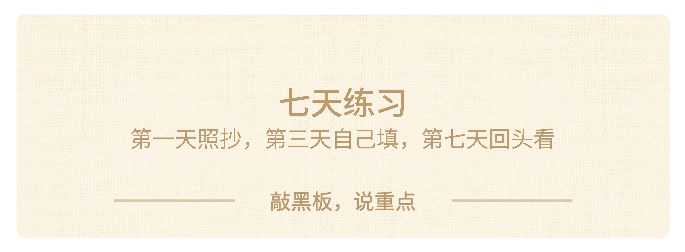

### **六、把方法带走**

如果你的评论没有被选中，也没关系。只要你刚才真的写了，那你已经完成了今天最重要的动作。

你看看刚才评论区里那些四行文字。十分钟前，这些选择可能还在脑子里绕来绕去，像一团乱麻。现在，它被拆成了得到、失去、最坏、回看四个部分，至少已经能被看见、被检查、被讨论。**这就是方法的价值。它不保证你立刻做出完美选择，但它会让你从“我也不知道为什么纠结”变成“我知道自己在权衡什么”**。只要这一步发生了，你就已经比原来清醒很多。

七天练习：从照抄到自己填，再到回头看。

#### **七天练习：从照抄到回看**

最后，一个课后练习，三个台阶。这个练习不需要复杂材料，也不需要别人监督。你只需要一张纸，或者手机备忘录。

> - **第一天：照抄。**找一个你已经做完的选择，比如昨天买的东西、上周做的决定、最近一次报名或放弃的活动，用四格决策表拆一遍。因为结果已经知道了，你可以检验：当时如果填了这个表，会不会做不一样的选择？这一步没有压力，只是练“拆”的动作。

> - **第三天：自己填。**找一个正在纠结的小选择，比如明天午饭吃什么、周末先写哪科作业、要不要参加一个活动，花90秒填一次四格。小问题最适合练方法，因为它成本低、反馈快，不会让你一开始就被压力压住。

> - **第七天：回头看。**把第一天和第三天填的表拿出来。看看当时写的“得到”和“失去”有没有被验证；当时写的“最坏”发生了吗；当时设的“回看”你有没有真的回来检查。

如果不知道从哪里开始，就从“明天午饭吃什么”开始拆。A食堂还是B食堂？各有什么得到和失去？**最坏会怎样**？花90秒。简单到不可能失败。

你不要小看这种很小的练习。**真正有用的方法，都是从小场景里练熟的。**你不可能第一次使用四格决策表，就直接拿它解决人生大事。你要先在买东西、安排周末、选择任务这些小问题里练到顺手。练熟以后，当真正重要的选择出现，比如选科、选专业、选城市、选一段关系，你就不会完全靠情绪硬扛。你会知道：**先把选择写成一句话，再拆成四格，再追问还有吗，再用宽度、深度、高度检查。**

#### **下次纠结，就打开备忘录**

下次你在手机上纠结，不管是刷购物App、看选科攻略，还是在群里问别人“我该选哪个”，先停下来。打开备忘录，写四行：得到、失去、最坏、回看。

你会发现，大多数时候你根本不需要马上问别人。**你自己先拆一遍，答案就会清楚很多**。即使最后你仍然要问爸妈、老师、同学或专家，你问出来的问题也会更具体。你不是把选择权交出去，而是带着自己的分析去获取信息。

这也是今天最想让你带走的东西：**不是某一个具体选择的答案，而是一个触发动作。纠结的时候，停下来，画四个格子**。你以后不一定每次都完整走完所有步骤。小选择可以快一点，大选择可以慢一点。但只要你脑子里出现这条线，你就不会像以前一样，被情绪推着走，被别人带着走，被一时冲动牵着走。

我们再把今天的动作连成一条线。

> - 第一步，承认自己在纠结，不要假装没事。

> - 第二步，把选择写成一句话。

> - 第三步，画四个格子：得到、失去、最坏、**回看。**

> - 第四步，追问三遍**还有吗**。

> - 第五步，用**宽度**、**深度**、**高度**检查。

> - 第六步，做一个可以**回看**的决定。

这六步听起来很多，但真正做起来并不复杂。最难的不是写表，而是愿意慢半拍。很多错误的选择，都是在最慌、最急、最想立刻摆脱不舒服的时候做出来的。你越想马上找一个答案，越要提醒自己：先把问题写下来。

慢半拍不是拖延。拖延是不面对问题，慢半拍是认真面对问题。拖延会让你越来越乱，慢半拍会让你越来越清楚。你不是为了显得理性才写四格，你是为了让未来的自己知道：**我当时不是随便选的，我看过得到，也看过失去，看过最坏，也给自己留下了回看的机会。**

这会给你一种很重要的底气。哪怕结果没有完全如愿，你也能复盘：是我漏了信息，还是低估了风险？是我没有诚实，还是环境后来变了？下一次我可以改哪一步？一个人真正的进步，不是永远选对，而是每一次选择之后，都能比上一次更清楚一点。

这就是科学决策真正要给你的东西。清醒不是天生的，清醒是可以训练出来的。第一次填四格，可能会写得很浅；第一次追问“**还有吗**”，可能真的想不出来；第一次做**回看**，可能会忘记。没关系。**能力不是靠一次完美完成练出来的，而是靠一次一次重复练出来的。**

今天这张表，可能只是一个很小的开始。但如果你从今天起，每个月认真拆一个选择，一年就是十二次。十年之后，你手里不是十二张纸，而是一套越来越成熟的判断系统。那时候你再面对更大的选择，就不会只靠运气。**所以不要小看这四个格子。它看起来简单，但它背后训练的是诚实、耐心、复盘和承担后果的能力。这些能力，会比某一次具体选择的结果更重要。**

最后我想把选择权交还给你。别人可以提醒你，帮助你，给你经验，但没有人能替你完整承担后果。**真正长大的标志，不是再也不犯错，而是你开始愿意用更清醒的方式做选择，并且愿意为自己的选择负责。**

你们现在还很年轻，未来会遇到很多比买鞋、选社团、安排暑假更复杂的事。那些事情可能没有标准答案，也没有一个人能百分之百保证你不会后悔。但只要你拥有一套能反复使用的方法，你就不会完全被不确定性吞掉。当别人还在说“随便吧”“看运气吧”“大家都这么选”的时候，**你可以慢一点，把问题写下来。慢这半拍，不是犹豫，而是清醒。你不是拒绝行动，你是在让自己的行动更有依据。**

也许今天你只是在纸上画了一个很简单的十字，但这个十字会提醒你：**任何复杂选择，都可以先被拆开；任何强烈情绪，都可以先被看见；任何别人的建议，都可以先变成信息，再进入你的判断。**

**别人的建议是信息，不是答案。**

**诚实是科学决策的前提。**

**纠结的时候，停下来，画四个格子。**

谢谢大家，下课。