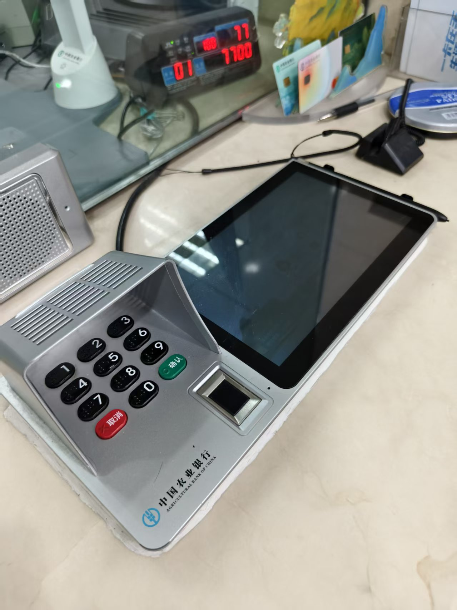

## 回放：https://air.yitang.top/live/Oikqzhoac2

大家好啊，你们可以叫我马易。一堂的同学都喜欢叫我马老师。

特别高兴能来今天做这个分享。我也没想到，离开学校这么久了，还能有机会给在校学生分享商业内容。

本来以为来听的大部分都是同学，后来发现还有不少是一堂的家长们。无论如何，我们今天还是希望以一个**面向在校学生的方式，以学生为主要听众的方式**，跟大家分享一些内容。

因为考虑真实环境，我们下一步可能真的会去学校里交付一些给学生的课程，那么我们还是实事求是地模拟、实事求是地训练。面向学生的内容会比面向成人的内容信息**密度低一点，互动性强一点，故事性强一点。**

做一下自我介绍：

> - 服务企业级、产品级、产业级AI相关业务

> - 解决AI 业务落地、增长，组织AI化升级，培训、陪跑

> - 已经服务支付宝、微软、华为、联想、SAP、麒麟信安等

> - 帮助微软用AI实现300%销售增长，7个初创项目从0增长到行业第一

> - 服务 AI 落地项目规模超 1000 亿

这是大部分同学知道我的身份，其实在**教育领域，我还有过一点点经历：**

> - 一堂北京中心主理人，一堂AI训战营教练

> - VOI云教室产品全国第一，教育触控一体机全国第一

> - 为5万间教室搭建信息化，服务中国30%的学生

**【🙋互动】**我们先来做一个统计，请屏幕前的同学们：
> 1. 高中生以及高中生以下的同学打 1
> 2. 大学生打 2
> 3. 家长请打 3

再强调一遍，考虑到“探月”同学们的情况，大部分还是在高中及高中以下。那么我们今天面向的主要群体，可能是以高中以下的学生为主，当然也会兼顾大学生，以及在座的各位家长和“一堂”的其他同学。

希望听完今天的分享，同学们能有所收获，主要有两点：

- **第一点：希望真的能掌握更好的学习方法，去提升自己的成绩。**
- **第二点：在未来的商业当中，从今天开始就能逐渐培养自己的商业感知，去锻炼这种学习的能力，为未来自己的商业之路做好铺垫。**

先跟大家分享一个真实的故事，也是我人生中特别不愿意提起的故事：在我的高中阶段，我的同学们是如何欺负我的。

我们学校有那种学习特别好的学霸，我们自己学校都管叫神仙。他的学习能有多好呢？给大家讲一下我们高中时候的案例。

**第一个案例：**

> 我上高二的时候，我们高一有一批新生。其中一个学生，高一上学期数学竞赛全国第一，保送清华，他不去，他说：“我要学物理，我要去北大。”

> 高一下学期，数学竞赛又拿了第一，这时候他可以去北大学物理了，他说：“不行，现在生物好，我要去学生物。”就这种孩子，每年都能当第一，每年都能被保送。等到高考的时候，他基本上要么是大状元，要么就是小状元。清华、北大这种学校，在他们的世界里完全就可以随便挑。

**第二个案例：**

> 还有一个就是我同桌和我一个关系最好的哥们儿。刚才说的那个可能比较远，他跟我有一年的年龄差。这两个家伙学习好到什么程度呢？

> 我们学校的数学卷子还特别难，有的时候达到一定奥赛的程度。他们把数学卷子放在那里，从来不动手，只能坐那块看，就是两个眼睛直勾勾地盯着那张卷子看。就看谁能把答案给写出来。看谁先能把整张卷子答案做出来。

> 可以想象，我坐在他俩旁边，我的心理阴影面积有多大。我们是同班的，而且我跟他俩关系好，天天连吃饭都在一起吃。**哇，那个对我的打击真的太可怕了！**

> 他俩一个现在是中建的核心技术工程师，一个是华盛顿大学的教授（现在我也不知道他干什么，反正我刚毕业不久的时候，他已经在华盛顿大学当了教授）。虽然我也是学物理的，他发到朋友圈的那些物理专业名词，我根本听不懂。

**你们身边有这样的同学吗？你们受他们的影响也大吗？**在这样的环境里长大的，很多学习方法都是照这样的学霸学来的。
1. **思考题1：**先问大家一个问题，如果你想在考试时拿一个特别好的成绩，你应该去参考谁的方法，或者是谁的知识能力或者解题能力呢？
2. **思考题2：**如果在座的同学们，假设你们都进入40岁甚至50岁这个年龄，那么，你想对今年不到20岁的自己说什么？你们想交给20岁的自己，最重要的一件事或者最重要的一个能力是什么？** 也想问在座的各位家长：可能你们想交给你儿子或者女儿最重要的能力是什么？**

**【💡划重点】这里我使用了“交给”的“交”，没有使用“教育”的“教”。**它的核心问题是：假设你能够把这个能力非常确定性地传授下去，你只需要考虑这个能力就行了，不用去考虑传授的方法和承担的能力。

**【🙋互动】**一两分钟时间，这个问题稍微有点难，也稍微有点哲学的味道。欢迎大家深度思考一下，把答案写到评论区。
3. **思考题3：**这道题是出给屏幕前的所有家长们的：请问如果想让你的孩子确定性地提高成绩，除了给孩子报补课班，让孩子去熬夜，你还有什么样的方法？**（这道题极难，也是极有用的，相信很多家长都被这道题难住了。）**