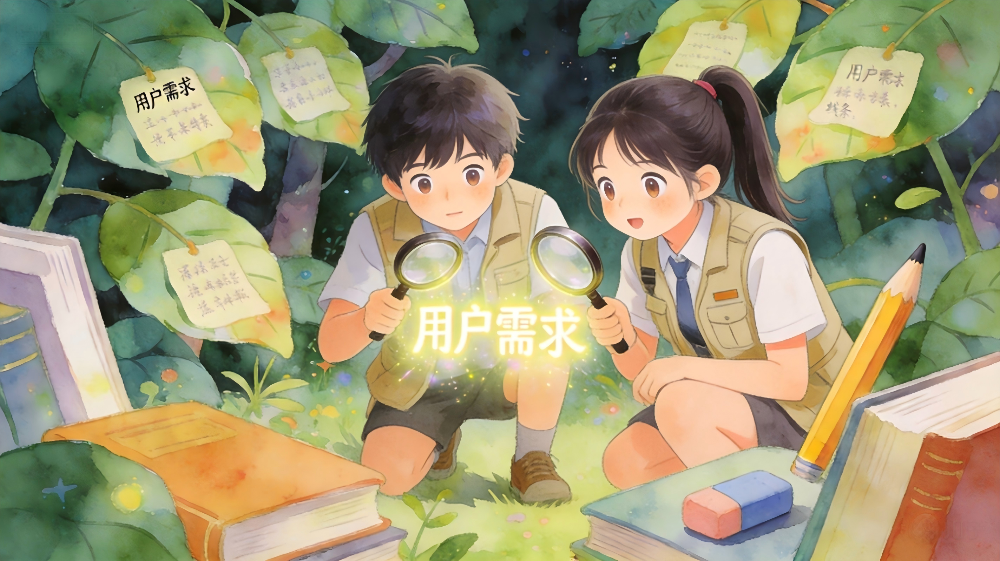

回放入口：https://air.yitang.top/live/EXIRc1BIgz

各位同学好，我是**谭雪明**，大家可以叫我**“老谭”**。

> - 我是一名**深耕教育领域**的**社会创业者**

> - 我用**15年**的时间，去到过全国**32个省级行政区**的城乡学校和社区，面对不同地域、不同年龄段、不同生活环境的孩子和家长，他们有一些跟屏幕前的你们很相似，有一些跟你们可能很不同，但**大家心底都有一份渴望成长、希望创造的蓬勃生命力**。

> - 在这15年里，我主讲超过**千场**主题课程，我们自主研发的各种公益课程，全国范围内服务超**五百万人次**的儿童青少年。

今天，我的任务是，协助大家，**化身侦探**，用大约60分钟的时间，从自己身上找到**商业世界的线索**，并且一点点剥开**需求的真相**。

为了让我们一起进入状态，**大家可以在评论区CALL“我愿意”**，成为这节课的**学委**，在过程中，你如果发现了任何对你有启发、有价值的线索，可以是一个词、一句话、一个感受，都可以及时发在评论区。

来，为了更好地进入角色，老谭邀请大家先闭上眼睛。

接下来，我会描述一个画面，请你根据我的描述，让自己进入到画面当中，并且尝试跟我一起，找到画面中解题的线索。

