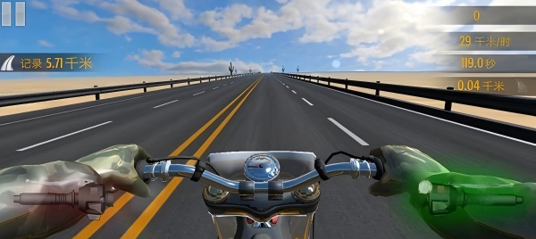
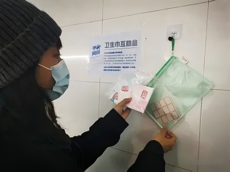
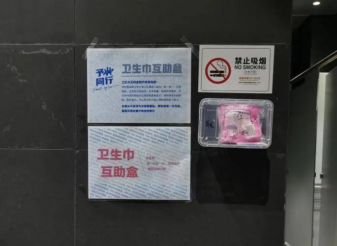
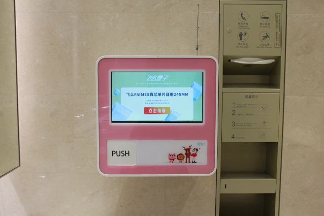

## 四、从L2到L3的风景：“推+评”是关键

好，现在我们渐渐从L2走进L3，正式打开“推”这件武器。

### 关卡3：推演体验节点

**“推”是干什么的？**

- “拆”说清楚了“谁”，区分了用户和非用户
- ”推”要说清楚“场景”，这个用户在真实使用过程中，经历了什么？卡在哪了？

**我们需要推演用户使用过程中的心态和决策逻辑，站在用户的视角，一步一步走完整个使用过程**，可能会发现我们原本想不到的卡点。

**就像玩游戏时候的“第一人称视角”一样。**

我们用一个案例体验一下：

2020年，有一个大学生发起了一个**“卫生巾互助盒”**的公益项目，她把互助盒放在女性卫生间的外面，倡导大家**“拿一片放一片”**。谁突然来了月经忘带卫生巾，就从盒子里取一片应急，下次自己带一片放回去。

这个想法很快传遍了几百所学校。**因为需求是真的——很多女生都遇到过翻遍书包找不到卫生巾的瞬间**。

但是，一年多以后，**大部分学校的互助盒消失了。为什么？**

————————

**发挥我们侦探推演线索的时刻到了！**

我们来一起推一下：**假设一个女生，突然来了月经，忘带卫生巾。她看到卫生间外面有个互助盒。**

> - 第一步：她走过去，打开盒子。

> - 第二步：她拿起一片卫生巾。

> - 第三步：她看了看——没有密封包装，看不清是哪个牌子。

> - 第四步：心理动态-她不知道是谁放的，她不知道放了多久，**她犹豫了——这个敢用吗？**

> - 第五步：她放回去了，去找同学借。

你看，发起人只推到了第一步和第二步：**有需求、能拿到**。但她没有推到第三、第四步。

**为什么第四步她会犹豫，卡住了？**

——————————

**因为“安全卫生”这层需求没有被满足。**

推演的价值就在这里：**在行动之前，你就发现了卡点。**而不是等互助盒消失了、一年以后才回来找原因。

但这个项目，确实发现了真实的需求，于是，那些活下来的互助盒长什么样？

- 有的学校出经费接管，密封袋装，定期维护。
- 还有的学校直接装了自动贩卖机。

**不管哪种解法，共同点是：推演发现的卡点和需求，被接住了。**

用“推”迈过L3的门槛，现在我们要用“评”这件武器，帮助我们深入啦！

### 关卡4：三维评估框架

推演完了，你发现了卡点。但还有一个问题——**这个需求值不值得做？**

一堂有一个评估框架，三个维度：**高频、普适、刚需。**

#### **维度一 频次：这个场景多久发生一次？**

对中学生而言

> - 体育锻炼是每天都需要的

> - 正式的体育课是以周为单位的

> - 学校运动会一学期只举办一次。

如果你是提供运动器材的

> - 是中学生日常生活化的锻炼就能用上

> - 还是只能在体育课上由老师指导

> - 亦或要到运动会时才需要

这种需求的频次差距会非常大。

**频次越高，需求越活：你不用等人想起，它自己就来了。**

#### **维度二 普遍：不只是我一个人这样吧？**

你以为只有你坐在书桌前崩溃？

全国几千万初中生，每天可能都有几万人在同一时刻面临同一张卷子的同一道辅助线感到无所适从。

**你们的崩溃是同一种崩溃。**

**但“不只我这样”不能靠猜，你要去验证。**

**【侦探来过关】**

**以下哪个最像在“验证不只我这样”，而不是“我感觉不只我这样”？**

A. 我课间问了5个同学，记下了每个人觉得最难的题型

B. 在朋友圈发了“谁觉得数学作业太难了？”，收到15个赞

C. 听说隔壁班也有人在抱怨数学难

——————————

**答案是A。**

> - B是社交验证——点赞不等于真的觉得难，有人可能只是顺手点了一下，这样的验证容易出现偏差。

> - C是道听途说——“听说”不算数，得真的去调查确认才算数。

> - A才是收集证据——问了人、记了结果。不是拍脑袋，是问一圈、记下来。**但还是有瑕疵，因为5个同学的样本量还是太少了一些。**

**【🙋互动】**各位侦探，可以在评论区打出来**：你们班有没有一个共同的痛点？不是只有你一个人觉得麻烦、不方便的那种。**

——————————

好，我之前有听到一些同学分享过，说**“课间太短来不及上厕所”**，还有说**“中午食堂排队太久”**等等。

**如果我们现在要验证“课间太短”是不是一个真实、普遍的需求——你会怎么做？**

> - 问问不同班级、不同年级的同学。

> - 记录实际课间可自由行动时间。

> - 观察是不是只有你们学校这样。

> - 观察看看这个问题，大家目前都是怎么应对的。

> - ……

**【💡划重点】**需求侦探就是这么工作的：我们不停留在抱怨，我们**从抱怨中看到可能的需求（假设）**，然后去收集信息、分析信息，尝试确认**这个需求是不是客观的、真实的、普遍的**，这就是我们验证假设的过程。

#### 维度三 刚性：愿意为此付出什么？

**不要只看大家怎么说，重点要看大家怎么做。**

用行动投出的票才是真的票。

**四个档：不用（白给都不用）→免费才用→收费也用→加钱也抢着用。**

频次、普遍、刚性三个维度相乘，就是你的需求方向。

不是每个需求都是“**高频+普适+刚需**”全占，很多时候**能占两个就不错了**。

**关键是推演完之后，你知道这个需求在哪个位置。**

**现在，我们看看从L2到L3，我们从“推”字诀里也拿到了两大宝藏工具：**
1. 推演体验节点，站在用户的视角，一步一步走完整个使用过程，提前发现卡点。。
2. 三维评估框架，从商业的角度来判断这个需求值不值得做。