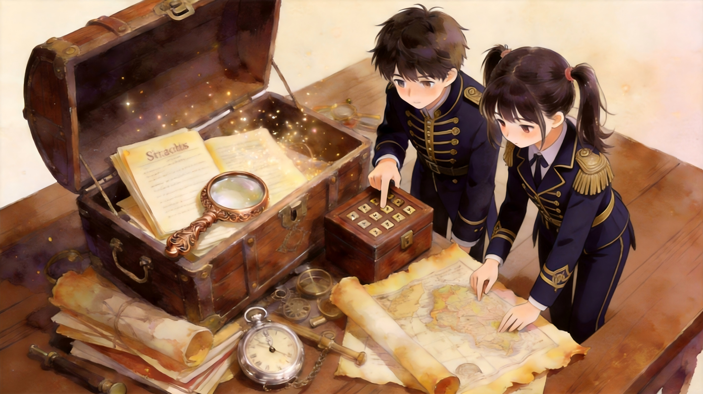
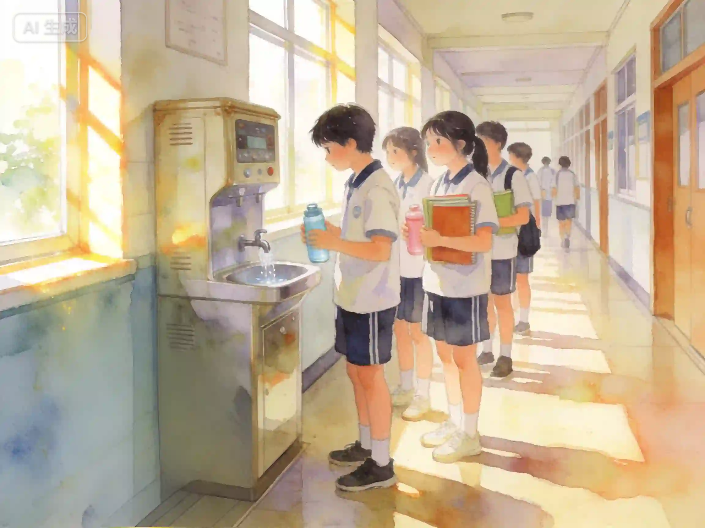
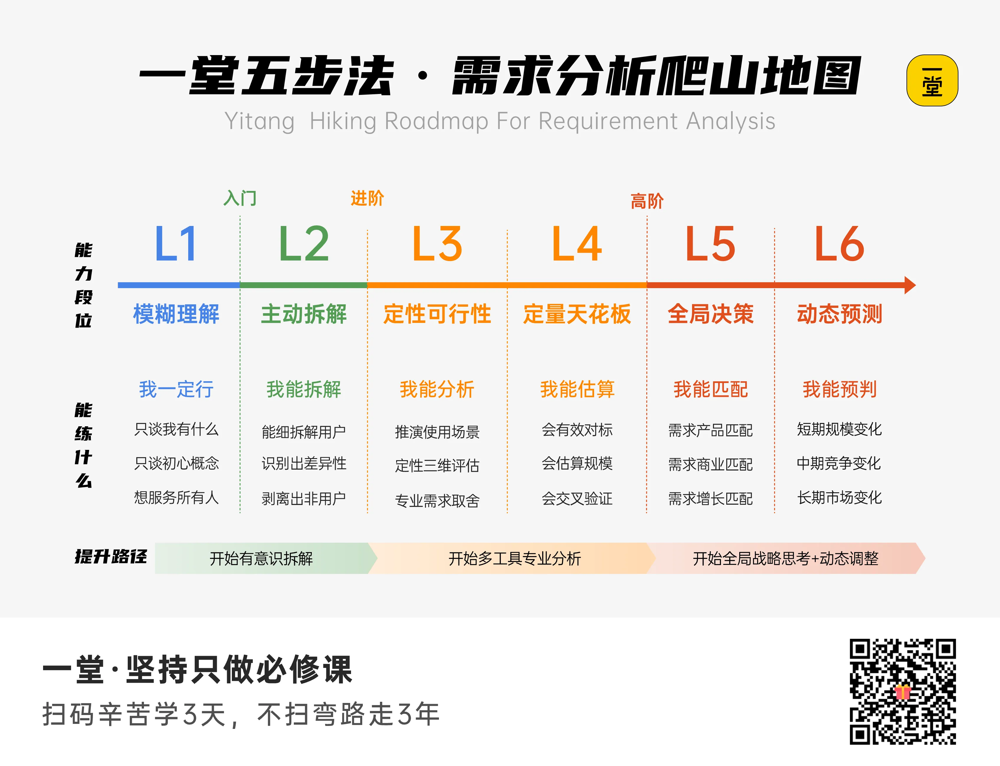

## 六、回顾总结

侦探之旅接近尾声，我们来一起整理一下，**今天我们的收获——不仅有需求侦探的宝藏工具，更有几个宝藏问句。**

- **手段≠需求：**“我在做什么？我为什么要做这个？”
- **用户 VS 非用户：**“有谁是不需要的？”
- **推演体验节点：**“除了这个，TA还在乎什么？”
- **三维评估框架：**“不只我自己这样吧？”“怎么验证？”
- **需求的完整描述：谁 × 在什么场景下 × 被什么问题卡住了。**

来，最后一道，终极挑战，今天的**【侦探通关题】**。

**开学第一周，小方发现班里饮水机总在早读前排长队。她做了四件事：**
> 1. 先想：“不是同学磨蹭，是大家同一时间都要接水”
> 2. 然后想：“带保温杯的同学根本不用排，排的是忘带水杯的”
> 3. 自己走了一遍接水流程：走到饮水机→排队→轮到自己→接水→水太烫→等凉→回座位
> 4. 数了每天排队人数和高峰时段

**这四步，分别对应今天学的哪个知识点？**

A. ①手段≠需求 ②推演体验节点 ③用户和非用户 ④三维评估

B. ①手段≠需求 ②用户和非用户 ③推演体验节点 ④三维评估

C. ①用户和非用户 ②手段≠需求 ③三维评估 ④推演体验节点

D. ①推演体验节点 ②三维评估 ③手段≠需求 ④用户和非用户

——————————

**答案是B。**

- “不是同学磨蹭，是大家同一时间接水”——区分了表面手段和真实问题。**拆·手段≠需求。**
- “带保温杯的不排，排的是忘带水杯的”——多砍了一刀，找到了真正的用户，剥离了非用户。**拆·用户和非用户。**
- 走了一遍接水流程，发现“等水凉”这一步——推演使用过程，发现意想不到的卡点。**推·推演体验节点。**
- 数了人数和高峰时段——评估频次和规模。**推·三维评估。**

小方最后去找班主任说：“早读前忘带水杯的同学排队等太久，建议加一个接水时段。”——**用户×场景×问题**。

**拆两刀、推一步、评三维，三要素收束。这就是一个需求侦探的完整工作流。**

好，我们回到那张段位图。

上这节课之前，你可能在L1——只看到表面的“好烦””不想写”。

**现在你已经见识过L2和L3的风景，站在需求分析入门的门槛上：**

- 你知道了可以拆开手段和需求，剥离用户和非用户；
- 你体验了如何推演用户真实场景，判断需求值不值得做。

今天我们的时间有限，因此只能粗粗领略一番。

**L2和L3更深、更广的风景，还需要你不断在生活中去体验、思考、挖掘。**

**而L4到L6，是你未来慢慢爬山的地图。今天你拿到了登山杖。**

