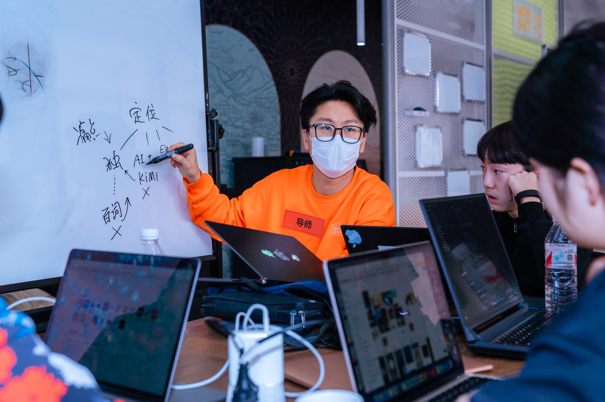

## 回放：https://air.yitang.top/live/FJXGD_9gPx

#### 课程信息：

- 课程受众：高中生（可能会有初中生）
- 时间：2026.07.22 ｜ 40 分钟线上课程

#### 课程目标：

让同学们听完课能意识到**「需求要拆解」**并**记住一个原则、脚手架，**最好能**迁移到后续线下黑客松比赛中**
(注重互动；少教一点：只教一个方法论 / 原则 / 内核、给一个脚手架）

#### **资料：**

一堂原课程视频：五步法进阶1：重新理解“需求原点”，文稿：五步法进阶1：重新理解“需求原点”

**讲师小帆简介：**

- 前互联网公司体验设计专家与设计管理
- 曾负责公司孵化产品设计师，并经历产品从千人日活至 500 万日活
- 连续创业，负责多个产品从 0 到 1 的产品设计与探索
- 现任探月学校设计老师，教授体验设计、设计思维

**曾参与5届探月 M48 黑客松担任产品设计导师**

