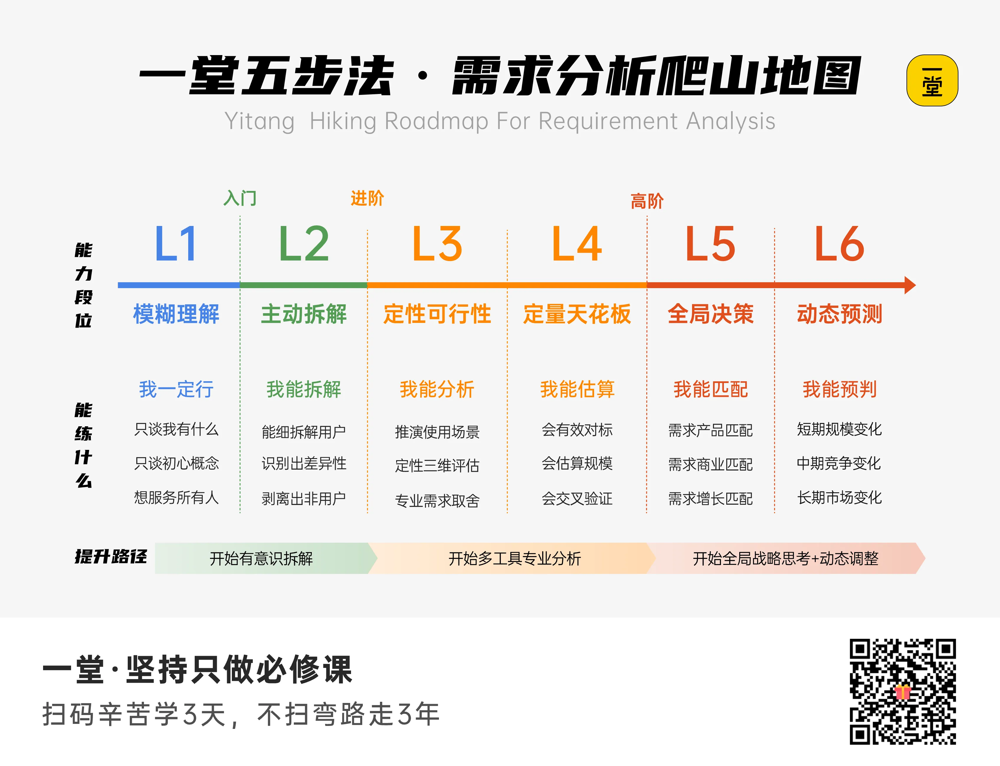

## **三、拆解需求的方法（进阶版）**

### **🌟 需求分析表：拆、推、评、算、看**
 ( 有这个思维就行，很多操作可以 AI 做 / 桌面调研 / 专家访谈... )

**步骤**

**需要回答的问题**

**怎么找答案、拿证据**

**最终产出**

**拆**

把需求拆解的更具体

- **谁**遇到了问题？他是什么身份、年龄、能力和状态？
- 问题在**什么时候**、什么地方发生？是在家、学校、医院、路上，还是某个具体动作中？
- 他当时**想完成什么**？“想打开房门”“想找到选课规则”“想按时吃药”......
- 他具体**卡在哪里**？是哪一步做不了、容易出错？

 找1—3位真实用户，问他“最近一次遇到这个问题是什么时候”

尽量观察他实际怎么做。

 一句话说清：**谁，在什么场景，遇到了什么具体问题。**

**推**

找原因

- 这个问题**为什么会发生**？是能力不足、信息不清楚、环境限制、流程太复杂，还是害怕犯错？
- 用户**现在怎么解决**？自己忍着、找别人帮忙、换一种方式，还是干脆放弃？
- **现有办法哪里不好**？是太贵、太慢、太麻烦、不稳定，还是只有特定情况下才能使用？（如果没有我们的产品，用户真的解决不了吗？）

让用户复盘整个过程，多问几次“为什么”，了解他现在怎么解决、哪里还不好用。

“你当时为什么没有继续？”“你一般会找谁帮忙？”“这个办法最麻烦的地方是什么？”......

 一条原因链：**现象 → 原因 → 现有办法 → 现有办法的缺口。**

**评**

这个需求是不是值得做

- 它**多久**发生一次？每天、每周，还是一年一次？
- 有**多严重**？只是稍微不方便，还是会浪费很多时间、金钱，甚至带来安全风险？用户在不在意？他有没有寻找办法或付出成本？这个问题在用户所有问题里排第几？
- 用户**愿意改变习惯**吗？他会不会下载新App、学习新操作、佩戴设备或支付费用？

问清楚问题多久发生一次、后果多严重。

用户是否主动找过办法、愿不愿意尝试新方案。

 一个需求判断：**强需求 / 待验证 / 弱需求。**

算

把“经常”“有价值”变成数据

- 数据：有多少用户觉得困扰 / 有这个需求？（不是“全国有多少老人”，而是“多少使用助行器、独自居住，并且需要自己开门的老人”。）
- 数据：问题发生多少次？每人每天几次？一年总共多少次？我们实际能接触到多少用户？黑客松期间能不能找到他们测试？
- 数据：做出产品后，有多少人会尝试？又有多少人会持续使用？
- 数据：方案到底创造了什么价值？减少几分钟、减少多少次错误、降低多少成本，还是让任务完成率提高？

用访谈、问卷、观察或公开数据做粗略估算。

不要求绝对准确，但要有依据。

 一张简单估算表，加一个**可以验证的效果指标**。

**看**

**把项目放进整个真实系统里**

**谁是真正的使用者？老人、学生、老师、家长还是工作人员？谁决定要不要使用？使用者和决策者可能不是同一个人。谁付出成本？谁花钱、花时间、学习操作、负责维护？方案会不会给其他人增加麻烦？例如增加老师工作量、泄露隐私、制造安全风险。我们的团队真的有能力完成和测试吗？能否接触用户？能否获得场地和权限？黑客松结束后谁维护？**

**列出谁使用、谁决定、谁付出成本、谁维护。**

**检查安全、隐私和执行难度。**

 一张项目闭环图：**谁使用、谁受益、谁负责、有什么风险。**

#### **以上来自 「一堂五步法 · 需求分析爬山地图」**

---