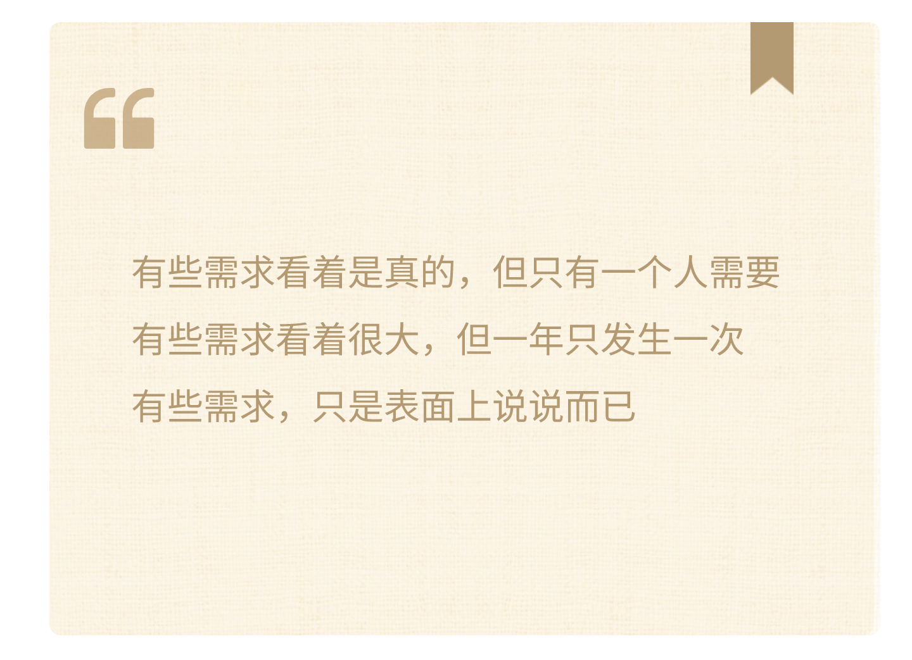
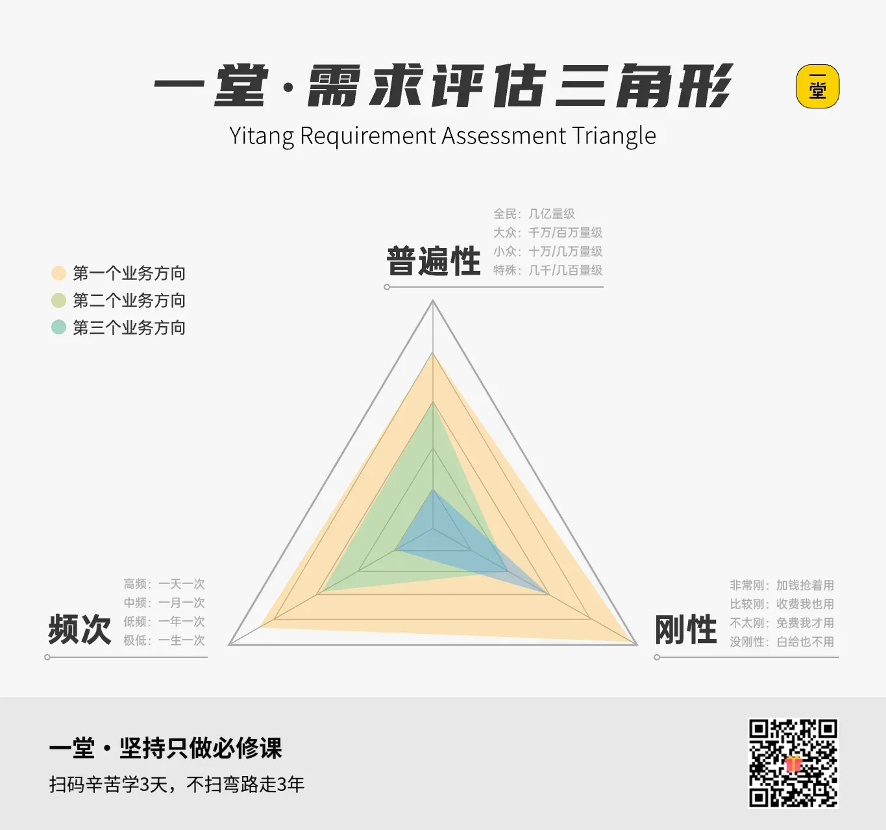

### D同学：夜市摆摊

先来看D同学。

她想：全校二十几个班都有人摆摊，操场就那么大，顾客就那么多。与其在校园里挤，不如去一个人更多的地方。

这个想法也得到了妈妈的支持，愿意陪她去尝试探索一下。

于是，D同学选择了不参加校园内的，而是去校外摆摊。

#### 她做了什么？

校外？那地方可就大了，去哪儿摆好呢？卖什么呢？

——哦，对，可以在家门口的公园那，人可多了！可以卖漂亮的小夜灯和气球！

她脑中已经产生了这样的画面：

当她和妈妈分享了自己的想法，妈妈提醒了句：“那边都是什么人？也和你一样喜欢漂亮小夜灯吗？”

这救命提醒，才让小D没有踩前面同学一样的坑。

那该卖什么呢？——不知道，那就先去观察和思考。

第一天晚上，她坐在家附近公园门口的石墩上，从六点待到八点半，拿着本子记录。

发现了三件事：

> - 晚上七点半到八点半人最多，带孩子的年轻父母是主力

> - 公园门口最近的售水机在一公里外

> - 几乎每个路过的孩子都拽着家长衣角说过同一句话：“我想喝水”

第二天晚上，她站在冰淇淋摊旁边观察了四十分钟，数了每单卖什么、多少钱。

第三天，她去批发市场进了货

- 两箱矿泉水
- 一箱常温饮料
- 一袋发光手腕带
- 几个泡泡棒

当天晚上七点，她的摊位在公园门口支起来了。

还用纸板上写了三行字：“公益义卖 · 为班级募资”，“冰水3元 · 发光手环8元”，“谢谢叔叔阿姨支持”。

**【🙋预测】**你觉得D同学这摊儿，最后会怎么样？

① 大卖，场景选对了需求不一样

② 一般，校外人生地不熟不好卖

③ 不好说，看运气

扣个**数字。**

#### 结果怎么样？

第一单比预想来得快。

一个满头是汗的小男孩拽着爸爸跑过来：“爸爸我要喝水！”爸爸看了一眼冰水——3块钱一瓶，扫码就买了。看到发光手环，男孩眼睛直了，又买了一个。

晚上八点，人最多的时候。摊位前排了四五个孩子——要冰水的、要饮料的、对发光手环着迷的。

泡泡棒成了爆品。一个小孩吹泡泡，追着泡泡跑，吸引了更多小孩过来。

晚上九点半收摊。回到家，D同学把钱袋倒在桌上——除开进货成本，**净利润 312元！！！**

#### 对比一下

**【🙋提问】**设想一下——

D同学卖的冰水、发光手环、泡泡棒，哪一样都不稀奇。

要是把她摊上任何一件拿到校内义卖，还会如此火爆吗？

——————

肯定不会。校内到处都是饮水机，谁专门买水？发光手环？同学觉得“有点幼稚”。泡泡棒？操场上一吹，风一吹就没了。

**【🙋提问】**那再设想一下——

A同学卖的旧玩具、旧书、用过的文具，也都是很普通的东西。

要是A同学也像D一样，把东西带去夜市摆摊，会怎么样呢？也会如此火爆吗？

大概率也不会。夜市的人不是来淘二手货的。

问题来了：**D卖得好的关键，真的只是“换了地方”吗？**

不只是。她真正做对的是——**先观察场景，再根据场景选品**。

> - 她看见公园门口孩子渴了没水喝，才进冰水。

> - 她看见孩子喜欢发光的东西，才进手环。

> - 她看见小孩追着泡泡跑，才进泡泡棒。

**她真正做对的是——先观察场景，再根据场景选品。**

**她的选品，是专门为“夜市”这个场景配的。**

场景变了，需求变了，选品也得跟着变。**不是只要换了地方就行，得换对东西。**

#### 小结

D同学做对了一件事——**她先看人，再决定卖什么。**

她是在家里拍脑袋想象要卖什么吗？

不，她去了现场，蹲了三天，看见了真实的人、真实的动作、真实的话。

其实，她观察中，一直在思考的问题，可以归纳为这三个：

> - 这里人多不多？——多（普遍性）

> - 他们多久来一次？——每晚（频次）

> - 他们到底想要什么？——渴了要水、孩子要玩（刚性）

真正的需求，就藏在这三个问题背后。弄清楚了，自然选品更大概率受欢迎。

**有些需求看着是真的，但只有一个人需要。**

**有些需求看着很大，但一年只发生一次。**

**有些需求，只是表面上说说而已。**

这三个问题，就对应关键的需求思考模型，

叫**“需求评估三角”**：

- **（普遍性）很多人需要吗？**
- **（频次）经常发生吗？**
- **（刚性）真的很想要吗？**

**需求提问三连：很多人需要吗？经常发生吗？真的很想要吗？**

这个需求评估三角，就是你的“好点子”探测仪。

来，检验一下，扣数字——

**【🔍诊断】**如果义卖摆摊上，卖“**手工折纸千纸鹤**”，卖的不好，大概率是因为：

① 不是很多人想要，只有一小部分人觉得好看

② 不经常有人买，大家不会天天买千纸鹤

③ 确实很多人想要，但真的没那么想买

扣个**数字**。

_________

答案是③。

千纸鹤好看吗？好看的。很多人觉得好看吗？可能还挺多的。

但“觉得好看”和“真的掏钱买”是两回事。千纸鹤在一堆选择里，**刚性排最后**。

**【🔍诊断】**有人觉得“在班级里卖定制姓名贴”不太合适，是因为：

① 不是很多人需要，只有少数同学想要

② 同学们不经常买姓名贴

③ 姓名贴确实很多人想要，但没那么想买

扣个**数字。**

_______________

答案是①。

姓名贴对某些同学来说确实有用，但班里真正需要的人并不多。**普遍性不够**，需求量太小。

**【🔍诊断】**有人觉得“在学校门口卖圣诞树装饰”不是个好主意，是因为：

① 不是很多人需要圣诞树装饰

② 圣诞树装饰一年只卖一次，平时根本没人买

③ 圣诞树装饰确实好看，但大家没真的那么想买

扣个**数字**。

_______________

答案是②。圣诞节每年一次，频次太低了。花时间进货、摆摊，结果一年只能卖一回。**频次不够，**不值得投入太多精力。

看，D同学的成功，不是偶然吧！

**这三个维度她可是都考虑齐了——**

- （普遍性）很多人需要吗？
- （频次）经常发生吗？
- （刚性）真的很想要吗？

三个都强，自然更大概率实现目标。

好，四个同学的义卖活动讲完了。

咱们把ABCD四位同学邀请到一起来复盘一下。