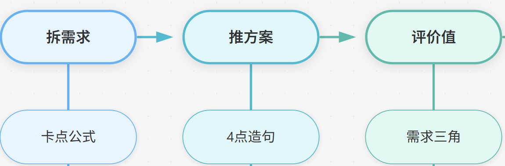

### **    需求  =   谁 + 在什么场景 + 卡在什么麻烦**

**【💡思考】**回头看四位同学的问题，各自卡在哪儿？

A没问过“谁要”，B没问过“在什么场景用”，C没问过“卡在哪”。只有D全问了。

一起用“卡点公式”代入新问题的思考：

**【🙋互动】你同桌最近数学成绩下滑，你想帮帮他。按“卡点公式”，怎么做更好？**

① 把自己整理的“数学错题本”直接给他，说“你看这个，很有用”

② 先问问他：最近哪类题错最多？考试时是时间不够还是不会做？卡在哪一步？

③ 去网上找一份“学霸数学笔记”打印给他

扣个**数字。**

答案是②。

①和③都是“我觉得这个对你有用”——和A同学犯了一样的错。

②才是先拆卡点，找到了，帮他的方法自然就有了。

这个需求是：谁（同桌）+ 什么场景（做数学题时）+ 卡在哪（某类题不会/时间不够）。

再比如——选班干部

**【🙋互动】**班里要选新班长，你想推荐一个人。以下哪个做法更靠谱？

① 推荐你最好的朋友——反正你了解他

② 先想清楚：班级现在最需要班长解决什么麻烦？是纪律？是活动组织？还是同学关系？谁在这些方面最擅长？

③ 问班主任“您觉得谁合适”

扣个**数字。**

答案是②。

①是“我喜欢”（A模式），

③是“别人告诉我答案”。

②才是先拆班级的“卡点”：

这个需求是：谁（班级同学）+ 场景（日常管理/活动组织）+ 卡在哪（纪律乱/活动没人组织）。

把“卡在哪”搞清楚了，才知道什么样的人适合当班长。

#### 第2招：推方案

拆出卡点之后，怎么推导出方案？就是怎么解决呢？

- 方案 = 针对卡点，提供一个“让这件事变简单”的路径

核心是——卡点即线索。用户卡在哪，你的方案就从哪入手。

公式很简单：

**推方案-4点造句 **

**（谁）**在**（什么场景）**下，卡在**（什么麻烦）**，需要一个**（什么样的帮助）**

代入案例理解——

你想给妈妈一个惊喜，主动做家务。

先拆卡点：

谁（妈妈）+ 什么场景（下班回家累的时候）+ 卡在哪（最烦拖地/做饭）

增加为4点：

谁（妈妈）+ 什么场景（下班回家累的时候）+ 卡在哪（最烦拖地/做饭）+需要一个（回家就能歇着的状态）

方案自然就出来了：帮她做完最累的那件家务。

**【🙋互动】**所以下面哪个做法是经过“卡点→方案”推导的？

① 把家里所有东西重新整理一遍——按你自己的想法重新摆

② 先想想妈妈平时最烦哪个家务，然后帮她做掉

③ 做一顿饭——虽然你只会煮泡面

扣个**数字。**

答案是②。①是“按自己的想法来”（A模式），③是“我会什么就做什么”（B模式）。②才是从卡点出发推方案。

再比如——小组手抄报分工。

先拆卡点：

谁（老师）+ 什么场景（批改手抄报时）+ 卡在哪（内容不完整/排版乱，影响打分）

方案呢？（需要什么帮助）

自然就有了：谁对内容最熟就负责内容，谁审美最好就负责排版，确保核心环节不出错。

**【🙋互动】**那哪个安排最符合“从卡点推方案”？

① 你喜欢写字就写字，你同桌喜欢画画就画画

② 先想清楚：老师最看重什么？内容完整还是排版美观？哪个环节出错最影响得分？然后按这个分工

③ 每人做一部分，最后拼起来

扣个**数字**。

答案是②。①是“按兴趣分”（B模式），③是“图省事”。

②才是从卡点出发推方案——**想清楚“卡在哪”，分工才有依据。**

**想清楚“卡在哪”，分工才有依据。**

#### 第3招：评价值

**评价值-需求三角 **

- 很多人需要吗？（普遍性）
-  经常发生吗？（频次）
-  真的很想要吗？（刚性）

这个在分析小D同学已经讲过，我们换个例子来理解。

有人提议去学校运动会当天卖应援手幅，根据“需求三角”粗略评估一下，值得做吗？

- 普遍性高（很多人想要）
- 刚性高（当天不买就没气氛）
- 频次低（一年一次）

→偶尔一次值得做，没法持续做。

再换个场景——推荐学习方法

**【🙋互动】**你想帮全班同学提升成绩，最符合“需求三角”的思考方式是哪个？

① 把自己的学习方法整理成“学霸秘籍”发给全班——你觉得很有用

② 先观察：大部分同学最头疼的是哪科？是基础知识不牢还是不会做题？这个学习方法解决了哪个具体的、高频的、让人头疼的问题？

③ 去网上找“清北学霸学习方法大全”复制一份发群里

扣个**数字**。

答案是②。

①是“我觉得好”（A模式）

③是“网上的东西搬过来用”（C模式）

②才是用三角评估：

- 普遍性（多少人需要这个方法）
-  频次（这个问题多久出现一次）
- 刚性（不解决会怎样）

筛一遍，才知道推荐哪个学习方法最有效。

#### **小结**

用这三层来看ABCD同学，我们又会更深入一层：

人物

核心行为

底层问题（拆推评维度）

对应公式漏洞

最终结果

A 自嗨选品

凭个人喜好选闲置

**不会拆需求**，用自我感受替代用户卡点

未使用【**卡点公式**】

18元（惨败）

B 原创创意

闷头做酷炫产品

**不会细分用户**，推错方案，人群不匹配

未做【用户画圈】，**三角刚性不足**

45元（亏损）

C 照搬数据

全网爆款直接照搬

**不会场景拆解**，错误评判需求价值

脱离【现场场景】，**三角判断失效**

压货、微利

D 现场观察

先观察卡点再落地

拆得准、推得对、评得稳，三步全对

卡点公式+需求三角+三问全落地

312元（完胜）

发现没有？

ABCD的差距，本质上是“拆、推、评”每一步的差距。

A一步没做，B做了一步漏一步，C做了两步错一步，D三步全对。

所以结果天差地别。

#### 这三招，不只是商业

这套方法，放到任何“为别人做一件事”的场景里都好用：

- 选礼物——先拆：谁收礼物？什么场合？TA最近念叨过什么？
- 策划活动——先问：给谁办的？什么时候？不去会怎样？
- 帮人解决问题——先筛：多少人卡在这？多久卡一次？不解决会怎样？

**真的能经常这样思考，那你可就太了不起了！**

其实，大人的世界，也就是这样运转的。

我们身边那些优秀的产品、贴心的设计，背后都经历过这样的思考过程。