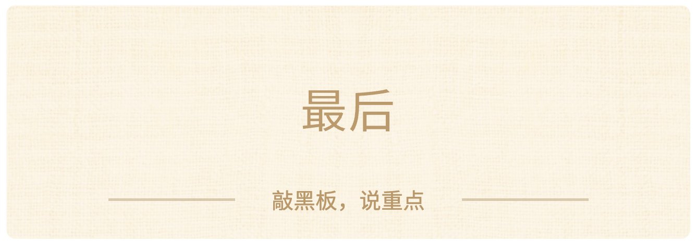

### 最后

好，回到刚上课时我跟你们说的那句话——

**今天这节课，表面上是讨论怎么摆摊更赚钱。实际上——**

现在上完了。你觉得你学到的是什么？

评论区，用一句话告诉我。

我看到了……

**从今天起，你做任何一件事，都可以在动手之前多问一句：**

**“他真正需要什么？”**

给朋友选礼物，先别冲进商店——停顿一秒，想想他是哪种人。

策划班级活动，先别急着喊“玩狼人杀”——先想想社恐的同学站在哪里。

推荐学习方法，先别开口“你试试我这个”——先看他卡在哪一步。

**只要你从今天开始，在动手之前多问了那一句：**

**你就和进直播间之前不一样了。**

好，今天的课就到这里了，谢谢大家的积极互动。