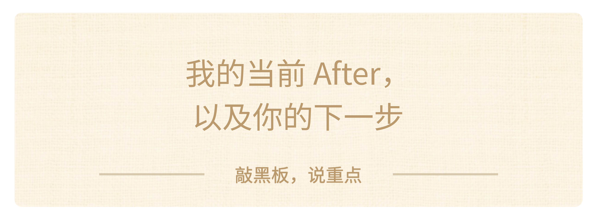

### 我的当前 After，以及你的下一步

那我现在找到红点了吗？我的回答是：我没有拿到一个永远不变的标准答案，但我已经形成了一版清晰的红点假设，并开始用现实行动验证它。

我反复确认下来的线索是：

> - 我愿意花时间把复杂技术学深；

> - 我喜欢亲手把想法做成真正能用的东西；

> - 我在意它能不能解决真实问题、帮助到人；

> - 我希望能够参与决定方向，并留下看得见的成果。

给大家上课，看起来和做机器人很不一样，但它们有一个共同点。

做产品，是把复杂技术变成能解决问题的东西；做教育，是把复杂但重要的知识讲清楚，帮助别人理解和行动。两件事都在让复杂的东西真正帮助到人。

所以，这次上课也是我的一次**“做一件事”**的探索：

先把它做出来，再感受自己是否投入，看看它是否真的帮助到了大家，也听听大家的反馈。

**【🙋互动】**今天你拿到了两套工具：一套是向内取的十二问，一套是向外求的三件事。

课程结束后，你想先用哪一个？
> 1. 继续用十二问问自己，再攒几条线索；
> 2. 看一个领域；
> 3. 问一个人；
> 4. 做一件事。

先输入数字就行。等一下我们会把你选的这一个，落成一句这周真能执行的话。

**[练习 4｜把它变成七天内做得完的一件事]**

现在就把刚才那个数字，变成一句能够执行的话。

一句能执行的话，要能回答三件事：**做什么？什么时候做？做完会留下什么看得见的东西？**

对照一下：

> - 「我要多了解一下机器人」——不合格，没有时间，也不知道做完留下什么。

> - 「这周六下午，问一下我表哥他们专业平时都在学什么，记在备忘录里」——合格。

小航那一句是这样的：这周记录爷爷三次用手机卡在哪，再画一版更清楚的界面给他试。

现在写你自己的那一句，给你 90 秒。写完读一遍，看三件事齐不齐。不用发给我。但请把它放在你自己看得见的地方——备忘录置顶，或者写在书桌前。七天以后你会知道一件今天不知道的事，这就够了。