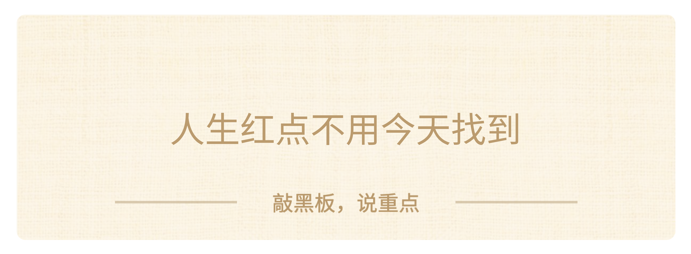

### 人生红点不用今天找到

最后，

人生红点不用今天找到，但可以今天开始找。

让我们一起在评论区留下一句话。

**【🙋互动】**请打出：

> 今天开始找！

**高考结果会影响你当前能走的路径，但不会替你定义一生。**不知道，并不可怕。

**【💡划重点】**重要的是，你知道自己现在在哪里，也知道下一步可以问什么、看什么、尝试什么。

请收藏今天的飞书文档。修炼地图、十二问和人生访谈模板都放在文档里，你可以课后复制到自己的文档。

你可以在高考成绩公布后、进入下一阶段第一周，或者每个学期结束时，再把它翻出来看一次。

我不是来让你复制我的答案。我只是想把自己三十多岁才开始使用的方法，提前交给你。

我希望，高考以后，你别只沿着一张成绩单走。

愿你有勇气去看、去问、去做，让每一次选择都更靠近自己想去的方向，走出一条属于自己的路。

谢谢大家。