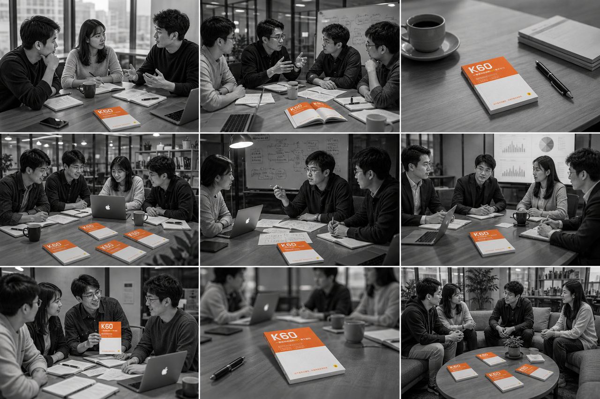

## 正式发布：首批创始订阅者启动

我们定价产生了非常大的困扰。

一方面，为了尽量保证YAI未来可以独立发展，不只是一堂课程的"增值Feature"，这样才能有独立的资源投入，独立的团队支撑，而不是“顺带着做”。

另一方面，我们希望延续一堂会员的学习节奏，不打乱大家的周五学习节奏，可以尽量参与到Partner的使用和体验。

**怎么平衡呢？**

__

先别急，我先宣布两个福利吧，

**🎁福利1：**会员每个月赠送少量体验额度，大概0.3倍率，可以支持知识库简单对话，或者1-2轮深度Partner研究。如果你就是每个月极低概率用一下，不付费也没问题。

新人注册只会赠送一次体验机会，在籍会员每个月都会赠送少量体验额度。

如果你只是极低概率偶尔用一次，基本勉强够用。

**🎁福利2：**每周五内测课，如果当周发布了**全新Partner**，我们会大概率启动“**本周限免**”政策，单周内在网页上使用这个Partner免费且不记录额度。

如果你是纯“教育版”会员，没打算部署一堂AI，只是单纯想提升和学习；

基本每周给你赠送额度，免费用，基本不影响你当周的学习。

**恭喜大家，只要大家会员在籍，每个月都会拥有这个福利。**

**（说明：非在籍会员完全没有特权）**

ok，下面准备好了么？准备好尝鲜、抢先、付费的同学？

为了降低决策和试错成本，我们本期采用的是“**月度订阅制**”，每月支付小额订阅费，自动订阅，如果某一天你后悔了/有更好选择，你可以直接取消订阅，下一个月就不扣款了。

我简单说下我们的定价策略：作为一个产品驱动的公司，我极力避免把一堂变成了一个渠道、流量驱动的卖Tokens公司，我们坚定选择了**价值定价**（而非成本定价）。

**通过一个健康较高的利润，独立养活自己，然后投入到“AI研究建模”的飞轮里，不断推高上限，研发Partner，最终带来大家实现商业管理领域的真正AGI实现。**

所以，我很早就跟大家打过招呼了，我们定价会很贵很贵，肯定比豆包、通用LLM贵很多。

大家猜猜定价多少？使劲往高了猜？

————

我之前的定价预期是：**大概是一个实习生的工资，来帮你、你的团队、你的Agent完成每个月的全面升级。**

你们城市，一个普通的大四本科实习生，一天的基本工资多少呢？

诶，但是内部产生了很大分歧，大家说AI付费习惯还没培养起来，这种付费太超前了，大家都很担心，建议第一轮的定价尽量门槛低一些，然后按照季度涨价的策略。

**所以，怎么定价呢？**

最终我们达成共识，早期用户还是给一个巨大折扣吧，先把种子用户培养起来。

我们最后定的月套餐价格，不需要实习生20多天工资，分别是三档：**1天，3天，7天。**

我本来设想的定价是比这个高大概1-2倍，硬生生被团队压下来了。

除了用量倍数差异，特别注意质变点：**思考版**可以使用CLI，**决策版**笔记基本自由使用，**领航版**基本实现高强度CLI自由，基本都够用，且一些高阶CLI实验功能开放领航版先试用。

♥️ 特别说明：暂时承诺6个月不涨价，随着Partner逐步完善，综合消耗额度持续上涨，随着CLI逐步升级，后期可能会涨价，涨价政策到时通知。

> 暂时第一版不支持升级，请大家直接买你们比较高的那个版本就好了。

**福利🎁1：**注意首月还有限时折扣，作为大家第一次订阅的福利折扣。

套餐越高，折扣越大，分别是：**91折，86折、77折。**

> 首月折扣，第二个月就是按正常价格来算。

**福利🎁2：**前1000个订阅成功的用户(¥109/¥119)，送你+1件堂三角，续费不舍得割舍的同学，你们回头可以再预约一件你喜欢的，自己留着，送好朋友，都是极好的礼品。

**福利🎁3：**如果你购买了决策版（¥259/¥299），我让班班额外给你寄一套**“大地图”+“K60”**吧，这是YAI磨合和练习口喷的神器，脑子里装着地图，

用20%的篇幅涵盖了一堂80%最高频的模型，并且增加了“极简解释”+”完整使用“，并且足够小足够薄，可以带在身上，很适合拿着这个和YAI对话，练习口喷基本功hh。

哈哈，最高档没有特别福利，也不需要，如果你想充分使用一堂YAI和“CLI打通一切”，且价格不敏感，那就不用纠结，不必算小账，买所有价格最贵的。

1. 情况1：你现在是业务一号位，管理人超过10人以上。
2. 情况2：每个月AI综合投入早就超过5000了。
3. 情况3：初步打算用一堂升级你的AI团队专业性。

**一个实习生一周的工资，换你的整个AI团队科学x体系不止一倍。**

这个账怎么算都值得。