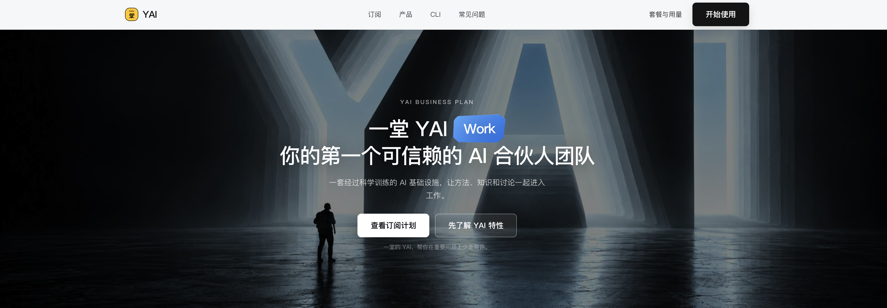
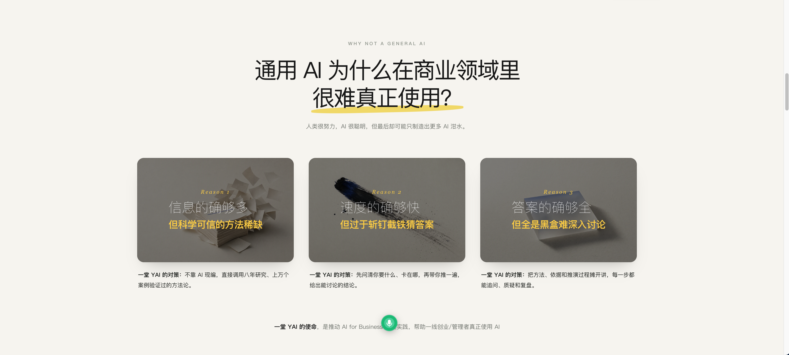
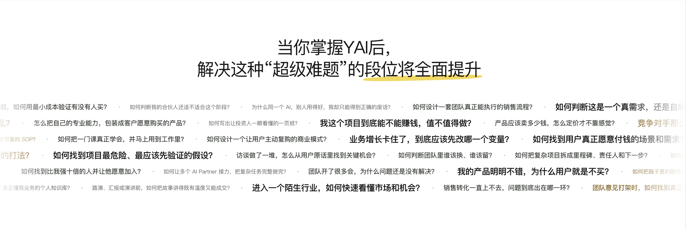
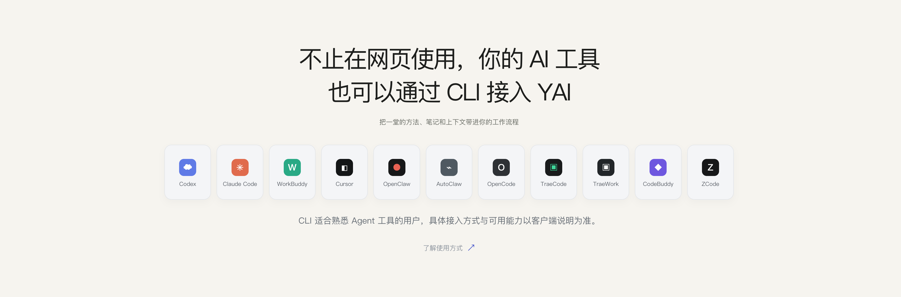
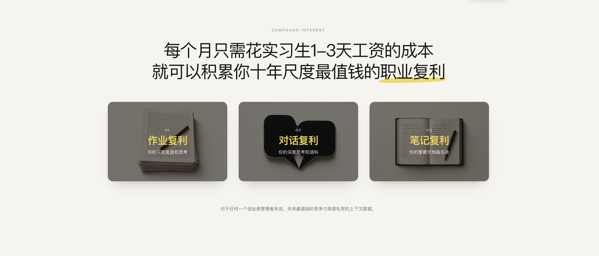
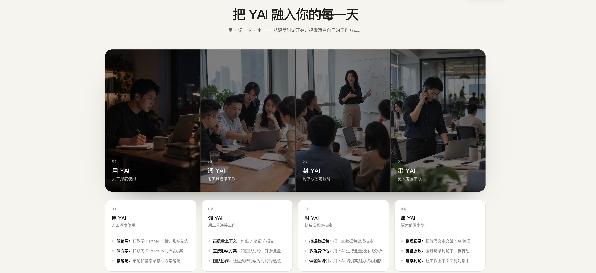

## 重新理解和回顾

### 重新理解“一堂YAI”

最后放几个图，看图说话吧：

这是一堂这一年闯过的三关：

这是我们的Partner列表：

最后晒一下我熬了一个通宵Vibe的YAI订阅落地页吧：

这是最终的AGI使命：

### 作业与Candy

这节课，我给大家留了三个作业，你可以选1个完成。当然我鼓励你听完课后，都尝试写一写。

> 🔗作业链接

> https://yitang.top/homework/cLIm6aabc5d2b454/edit?_uds=pd_doc

**第一个作业：新的启发题。**

今天，Truman讲了3次飞跃、10个必知必会：随聊随调、先训再聊、存成资产、拉满对话、全量调用、亲手封装、Agent调用、全量打通、二次封装、完美一天。

回忆一下这10个必知必会：哪些是你之前已经做到的？哪些是你过去想到，却一直没机会去做的？哪些超出了你的想象，给了你新的启发？欢迎你结合自己的经历，自由、完整地聊聊你的想法。

**第二个作业：场景探索题。**

请你大胆设想：一堂的YAI和CLI全量开放之后，你的工作和生活中会有哪些新的可能？

请结合一堂Partner和CLI的特性，试着灵感闪现提出10～50个你的场景假设。什么样的高价值场景匹配什么样的工具和工作？它们可以如何配合，创造更高的价值？

勇敢地去设想，作为未来1~2年你们的解放思想的工作基础。

**第三个作业：封装悬赏题。**

这是一道长期有效的悬赏题。欢迎你借助一堂的CLI，封装一个高水平的AI员工、AI教练，或高水平的陪伴角色。

如果你的作品有很高的推广价值，能够成为其他同学可以复制、使用的资产，欢迎提交到这道题目里，并介绍它能解决什么问题、适合谁用，以及实际使用的效果。

对于符合上述标准的优秀作品，我和一堂愿意送上一个 **5000元的奖学金红包**，鼓励你把好想法做出来，也让更多同学受益。

**【Flag🙋】**这节课做起来很辛苦，希望大家不要辜负。

来来来，希望大家一起立一个Flag（承诺），认真听课吸收，最后完成这次训练作业。

扣一句话吧：**一定作业！！ **

**🎁 作业奖励Candy**：

**《可复用提示词包》**：我们会把这节课里用到的提示词整理成一个提示词包，方便你直接上手试，也可以结合自己的场景改一改，把课上的好方法用到自己的工作里。

**《GPT6 Astra-改变人生的提示词》**：这是我们最近挖掘到的一个宝藏资源，提示词结构非常扎实，你可以试着用它来给自己的作业数据做一个洞察，应该有惊喜。

🔴一个实习生一周的工资，换你的整个AI团队科学x体系不止一倍，这个账怎么算都值得！
🔗支付订阅入口：https://yitang.top/promotion/yai

📖YAI使用指南：https://yitanger.feishu.cn/wiki/WPJWwKwI3iUCzqkGUzvc6i5MnNg
📝一堂CLI指南：https://yitanger.feishu.cn/wiki/XoFcwMmotigm7Ikv4RQc9TfQn0g