## 2. 环境准备
那要想基于AI智能体，将我们的想法快速落地实现，我们需要在自己的电脑上准备一下项目开发的基础环境。 ClaudeCode是全球领先的编程智能体，也是市场占有率最高的智能体之一。 在本次课程中，我们将全程基于ClaudeCode智能体来进行项目的设计、开发、测试。
接下来，我们就来准备一下ClaudeCode的运行环境。
### 2.1 ClaudeCode准备
由于ClaudeCode在运行时，都需要依赖于NodeJS、Git环境，所以在安装ClaudeCode之前，我们需要先安装一下NodeJS、Git。
#### 2.1.1 Git安装
- **软件介绍：git是用来进行代码管理的，claudecode也依赖git的代码管理功能。如果git没有安装，claudecode无法正常运行。**
- **下载地址：https://git-scm.com，在提供的资料文件夹中也有提供，直接使用即可**
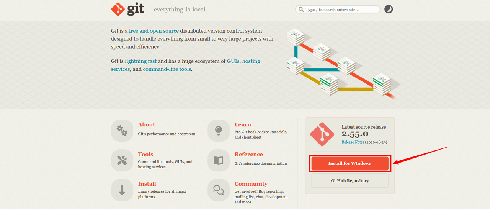
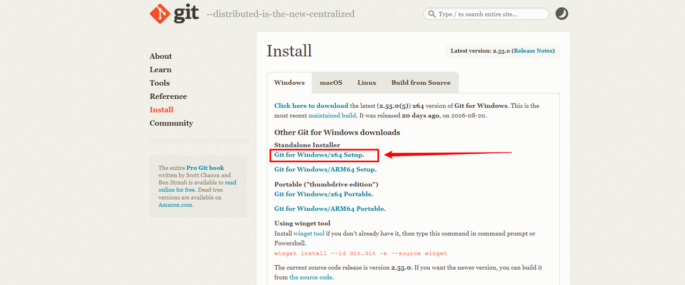
- **软件安装：傻瓜式安装直接点击下一步即可（建议把所有的软件都放在一个没有中文，不带空格的目录下，比如在D盘下，创建一个文件夹develop，然后在develop文件中再新建git文件夹，git安装此文件夹中）。**
安装完毕后，可以同时按下键盘上的windows + R键，调出运行窗口，输入cmd，打开命令行。

`输入 git --version，只需要在命令行中能输出git的版本号，就说明git已经成功安装好了。`
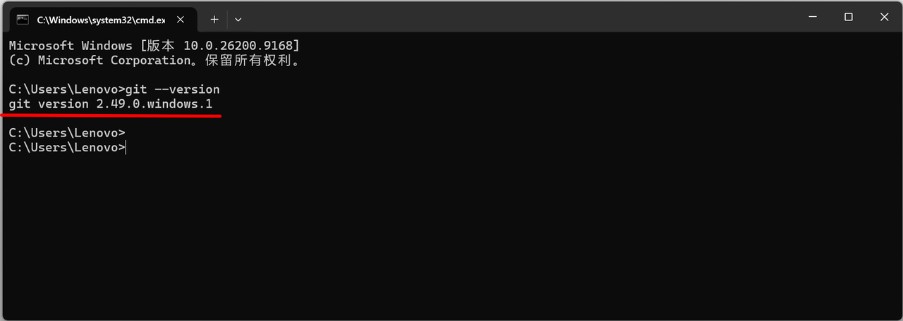
#### 2.1.2 NodeJS安装
- **软件介绍：Nodejs是claudecode的依赖环境。**

> **可以这么理解：我们平时想要玩游戏一样，玩游戏之前，要确认Windows操作系统是否正常，如果操作系统不行，游戏根本安装不了，而claudecode是依赖nodejs才能运行的，所以想要在电脑里面运行claudecode，必须要先安装Node.js环境。**
- **下载地址： https://nodejs.org/zh-cn，在提供的资料文件夹中也有提供，直接使用即可**
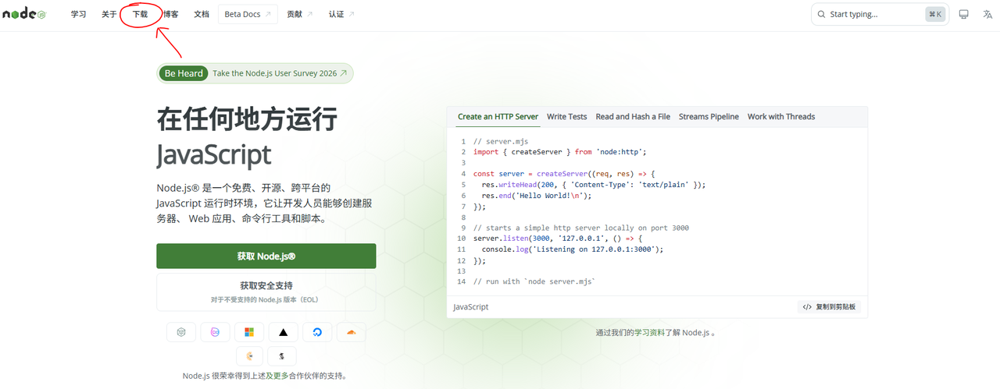
选择不同的版本
x64：一般是Windows64位的操作系统 【基本上选的就是这个版本】
x86：一般是Windows32位的操作系统（从win11开始已无32位的操作系统，32位安装包已不支持下载）
arm64：一般是给搭载 ARM架构的CPU使用的，而不是普通的 Intel/AMD的x86/x64电脑使用
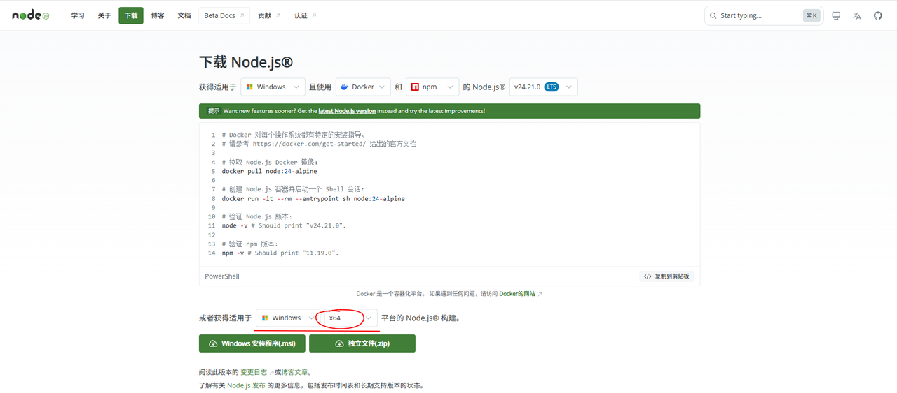
**软件安装：**
傻瓜式安装直接点击下一步，develop文件夹中，新建node文件夹，nodejs软件安装此文件夹中。
**1). 双击 msi 文件，勾选我接受**
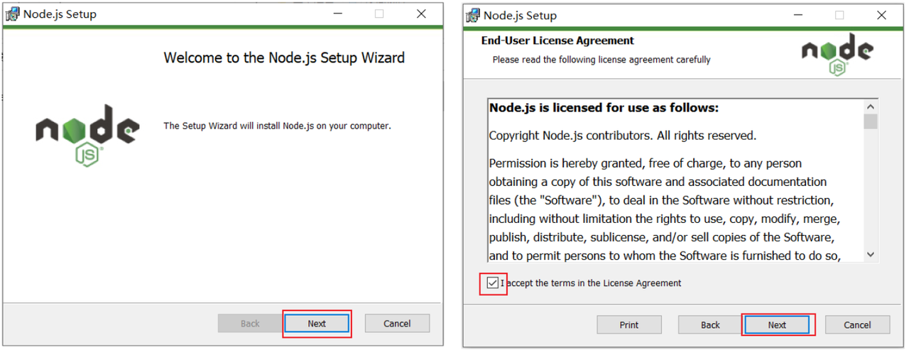
**2). 选择安装到一个，没有中文、不带空格的目录下（新建一个文件夹NodeJS）**
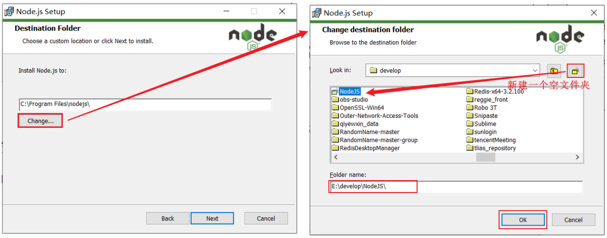
**3). 点击Next，下一步下一步的安装即可**
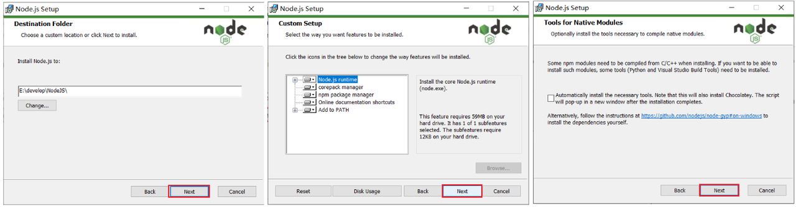
**4). 验证NodeJS的环境变量**
`NodeJS 安装完毕后，会自动配置好环境变量，我们验证一下是否安装成功，通过： node -v`
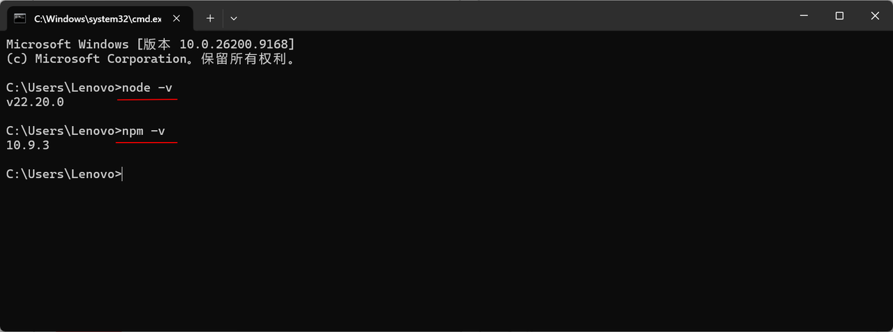

> **注：如果node或npm命令无法执行，检查npm的环境变量**
**5). 修改nodejs默认镜像下载地址，变成国内的（加速软件包的下载安装）**
```
npm config set registry https://registry.npmmirror.com​
```
#### 2.1.3 Python安装
因为ClaudeCode在运行的时候，实现了功能的代码功能后，需要对功能进行测试，基本上都会编写Python脚本，然后完成功能的自动化测试。 因此我们还需要提前准备一下Python的运行环境。

**1). 直接右键exe文件，选择 "以管理员身份运行"**
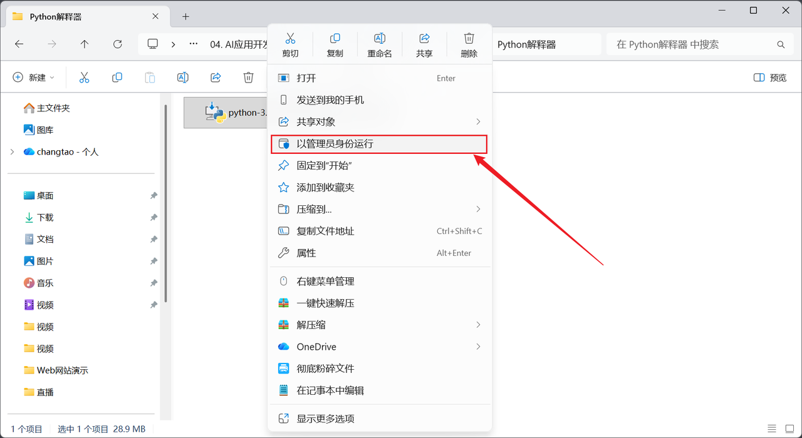
**2). 进入安装界面，记得勾选最后一项："Add python.exe to PATH"，然后选择自定义安装 "Customize installation"。**
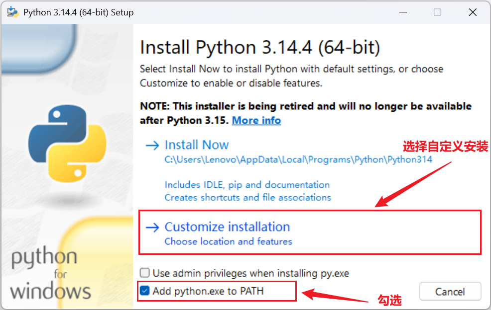
**3). 然后进入特性选择页面，什么都不用操作，直接点击 Next 下一步。**
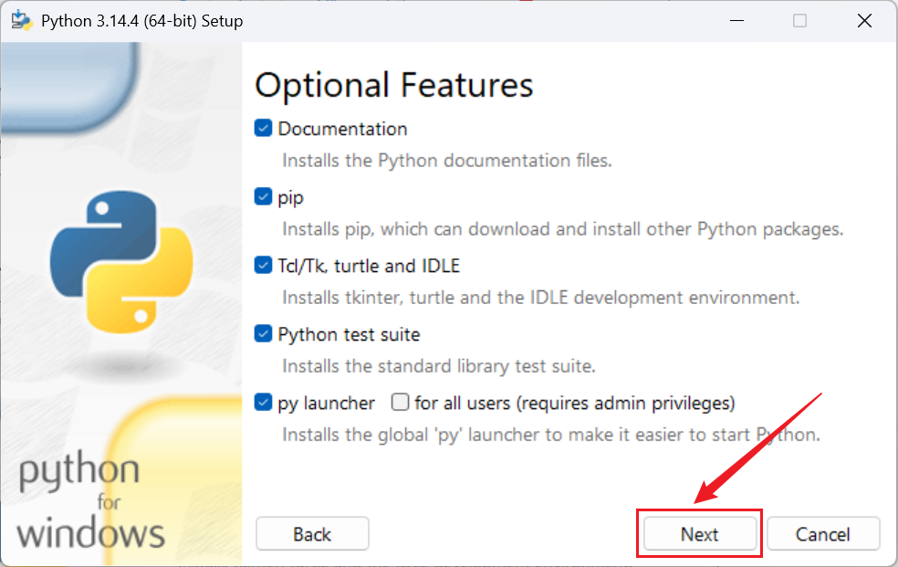
**4). 进入安装页面，在这个页面中要选择Python的安装路径**
开发类的软件尽量安装在一个没有中文，不带空格的目录下，这里呢，我将软件安装在了 D盘下的 develop 这个目录下，在这个目录下创建一个文件夹Python，用来存放python的安装文件。
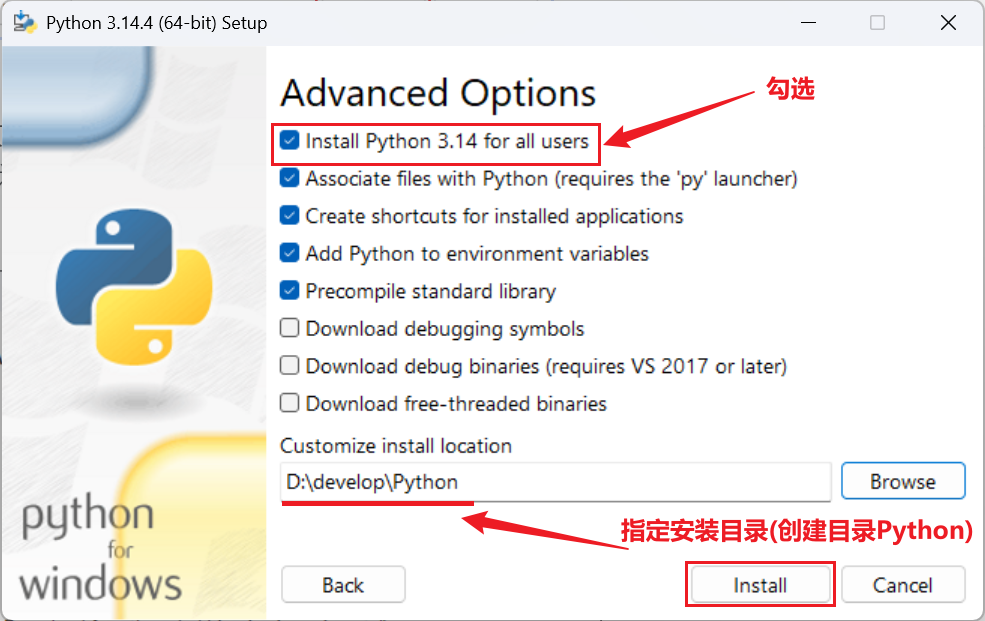
`5). 选择好了安装路径之后，直接点击 Install，就可以执行安装了。`
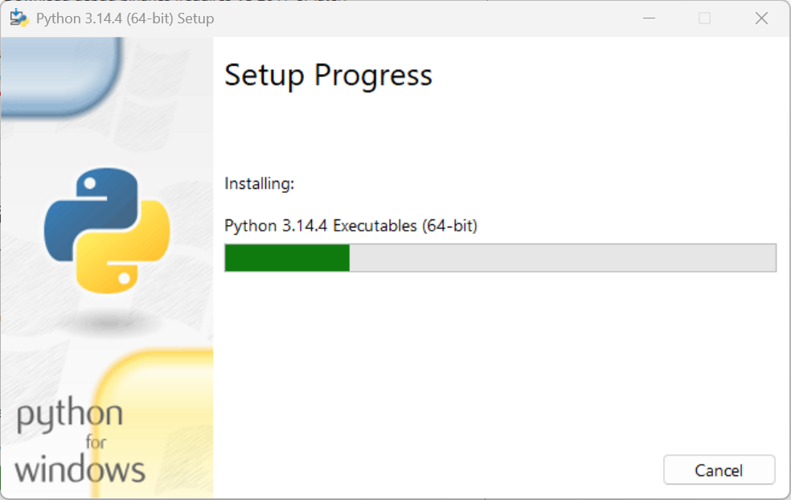
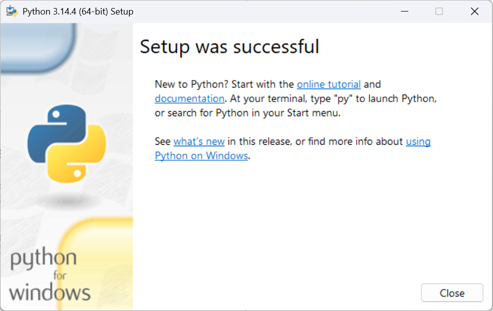
安装完毕直接点击 close。
安装完毕后，可以验证一下Python是否成功安装了。 同时按下键盘的 Win + R 两个键。

弹出运行的窗口之后，在输入框中输入 cmd，然后回车就可以打开windows上的cmd命令行。
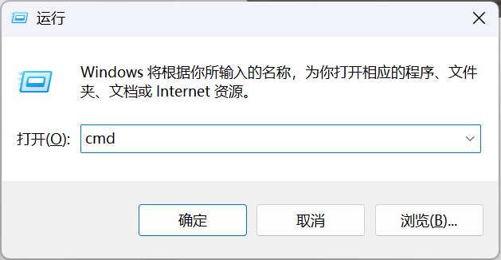
`然后直接在命令行中，输入python --version，回车之后如果能够看到python的版本为 3.14.4，就说明Python已经安装成功了。`
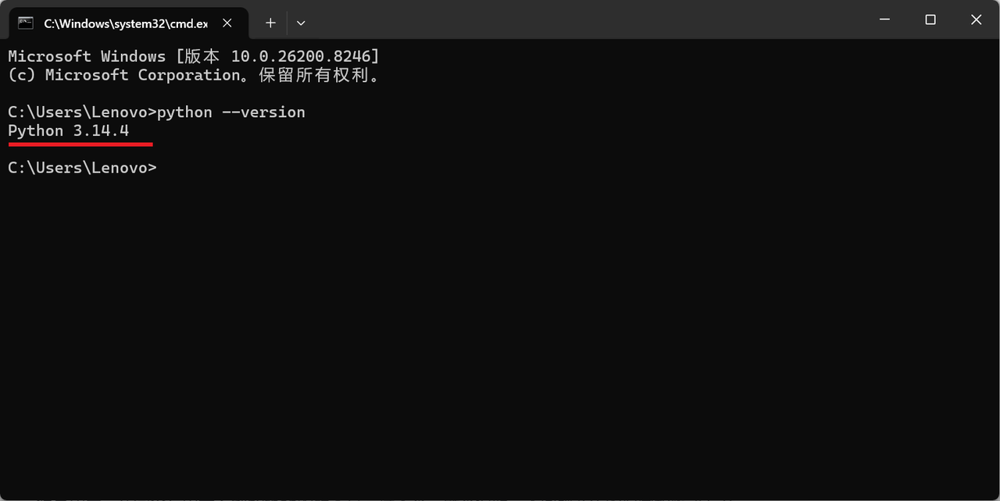
#### 2.1.4 准备AI大模型账号
我们要使用ClaudeCode这类的智能体来帮我们开发项目，完成日常的一些的工作，那就需要要在智能体中集成AI大模型，要使用AI大模型，有如下常见两种方式：
- 本地部署大模型（优点：不需要额外付费；缺点：对于本地电脑性能要求极高，部署的参数量小的模型，能力相对较弱）
- 使用云端大模型（优点：不需要自己部署，能力很强；缺点：需要按照token用量付费，或者也可以根据模型提供商的政策包月 codingplan）
那这里，我们就直接使用第二种方式，直接使用模型提供商提供的云端大模型，模型提供商有很多，比如：DeepSeek、智谱GLM、小米Mimo、月之暗面Kimi。以及很多的大模型平台，比如：阿里云百炼、硅基流动、百度千帆、字节火山引擎等等。
那在本次课程中，我们选择最为常见，性能也比较优秀的DeepSeek。接下来，我们就需要注册一下DeepSeek的账号，并申请对应的API_KEY（这个是我们个人的身份凭证）。
**官方网站：https://www.deepseek.com/**
**1). 注册账号**
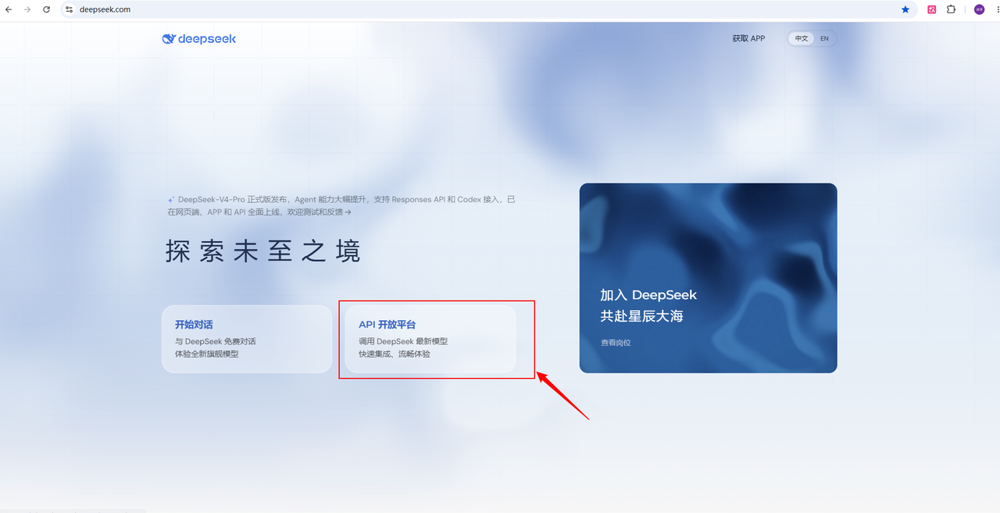
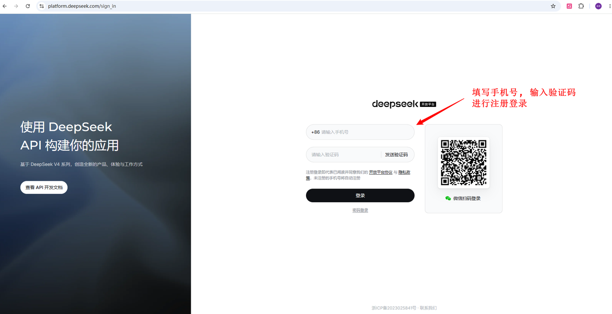
**2). 充值**
登录进入到DeepSeek的开放平台后，可以在左侧的菜单栏中找到 "充值" 菜单，点击 "充值" 之后，在后侧就可以进行账号充值了（这里可以先充值10元）。
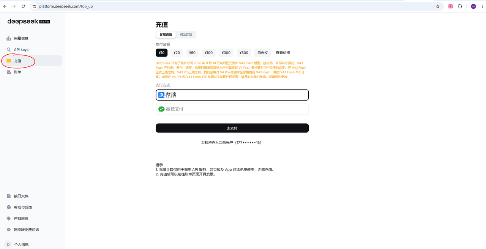
**3). 准备API_KEY**
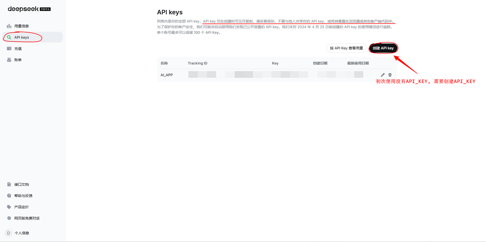
输入本次创建的API_KEY的名字 (后续如果自己的API_KEY泄露了，可以删除后，重新创建一个)
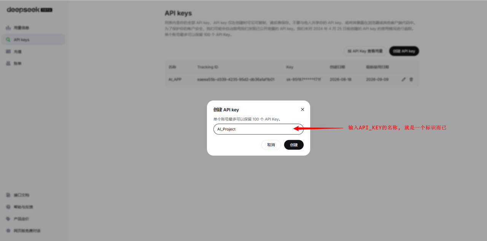
创建完API_KEY后，记得将其复制并保存起来（后面要使用哦）。
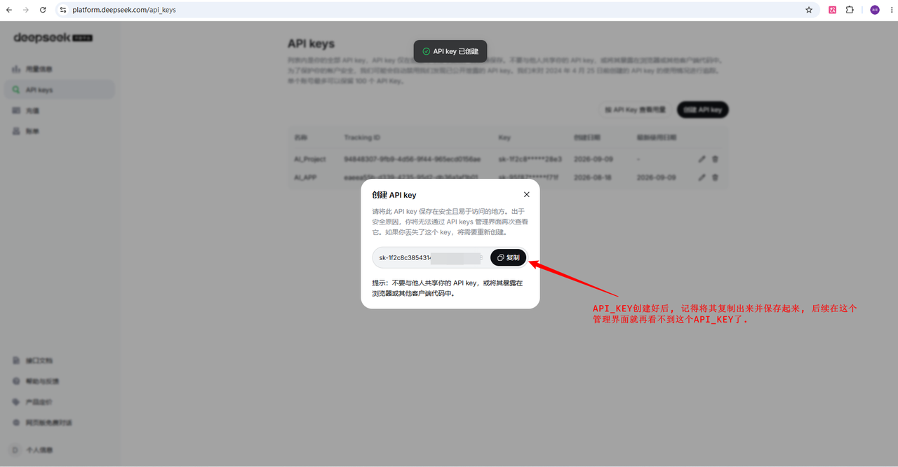

> 🌈 API_KEY创建好后，记得要将这个API_KEY复制出来并保存起来，后续在这个管理界面中将再也看不到这个API_KEY 了。
- 官方文档：https://api-docs.deepseek.com/zh-cn/

> 🌈 `最新的DeepSeek的模型名为 deepseek-flash，该模型不仅支持文本，还支持图片识别。`
#### 2.1.5 ClaudeCode安装
##### 2.1.5.1 软件安装
- **软件介绍：利用AI大模型生成代码的编程智能体。**
- **软件安装：**
**1). 以管理员身份运行cmd**
点击开始菜单，然后输入cmd，选择右侧的 "以管理员身份运行"
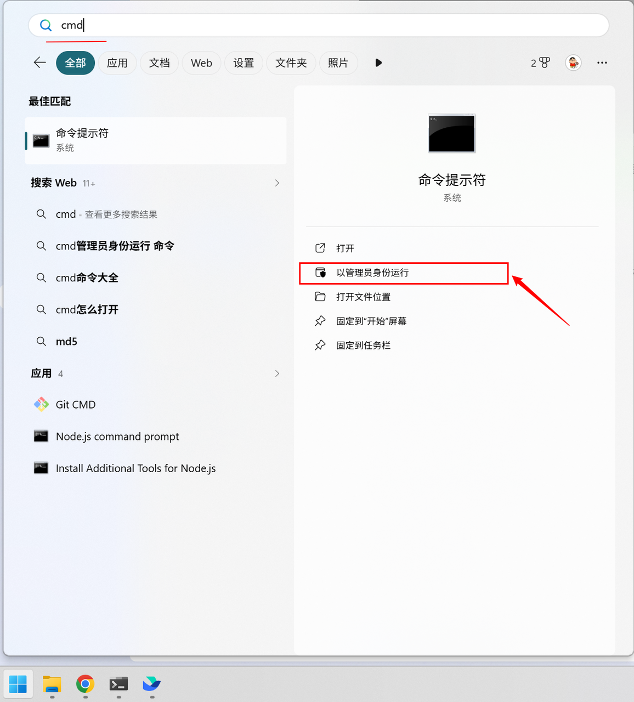
**2). 输入如下命令安装ClaudeCode**
```
npm install -g @anthropic-ai/claude-code​
```
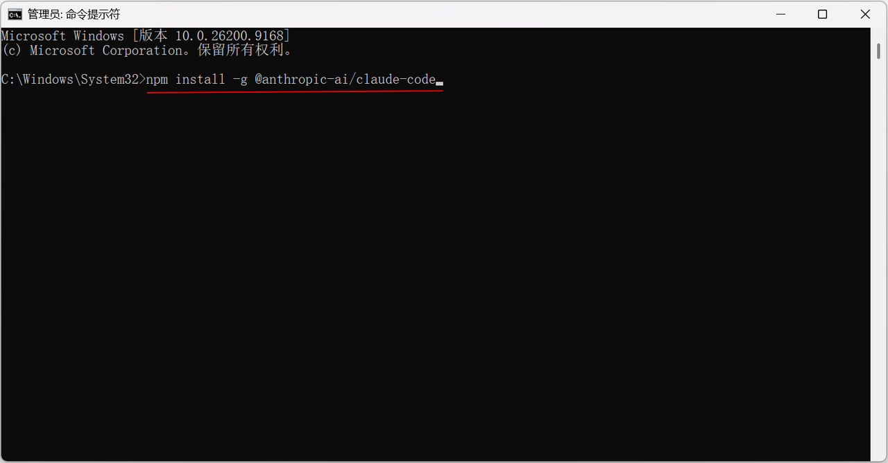
**3). 执行如下命令确认安装成功**
```
claude -v​
```
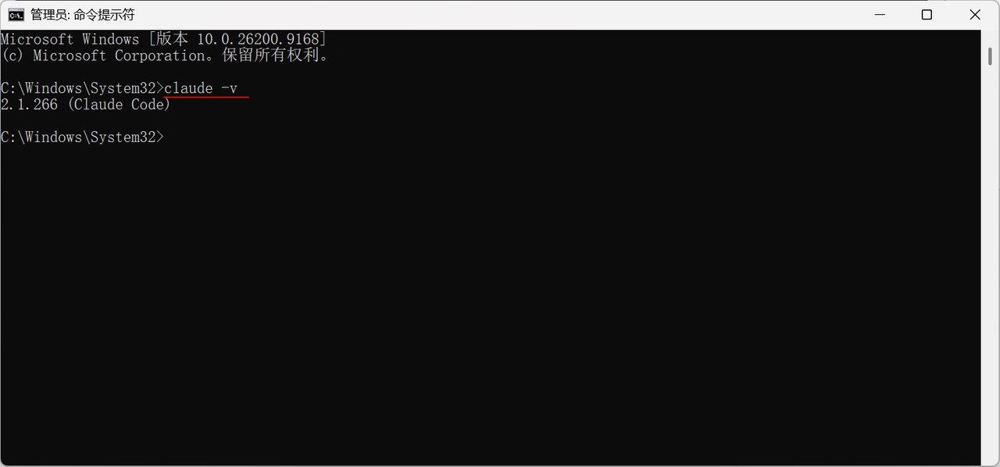
只要执行完上述命令，能查看到ClaudeCode的版本号，那就说明ClaudeCode已经安装好了。
**4). 启动ClaudeCode**
`在命令行中，输入 claude 回车，就可以启动claude。`
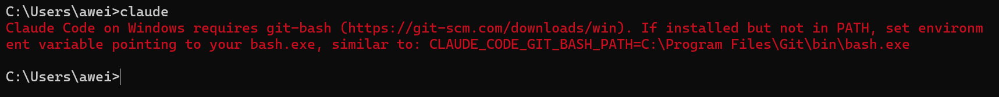

> **如果出现上述报错，请检查git是否安装成功**
**再次启动claudecode：**
1. 看到启动图标，但是还有红色报错：
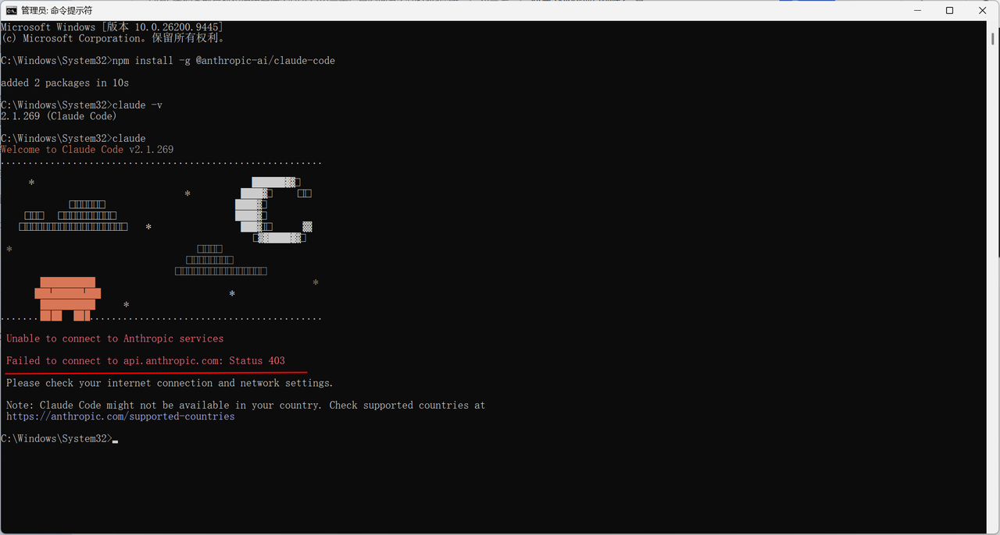
```
Unable to connect to Anthropic services​
Failed to connect to api.anthropic.com: ERR_BAD_REQUEST​
翻译：无法连接官方的服务​
```
因为claudecode屏蔽了国内的IP，在新手引导时期会检测IP，需要跳过新手引导，后续使用不受影响
2. `打开Windows操作系统的用户目录，找到.claude.json这个文件`
**举例：C:\Users\Lenovo\.claude.json，其中Lenovo是我的电脑名。**
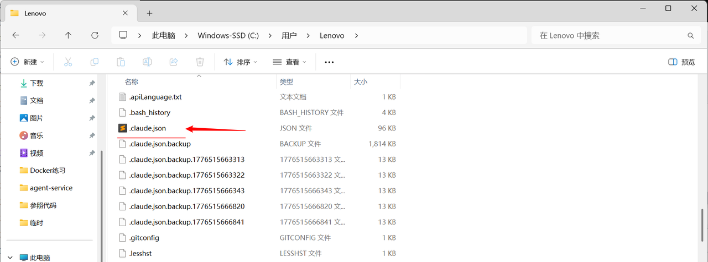
3. `使用记事本或其他的编辑工具，打开.claude.json文件 （如果没有该文件，自己新建一个）`
添加一个新设置选项："hasCompletedOnboarding": true
```
{​
  "firstStartTime": "2026-04-22T09:44:27.751Z",​
  "opusProMigrationComplete": true,​
  "sonnet1m45MigrationComplete": true,​
  "migrationVersion": 11,​
  "userID": "677827071c36d4c65d921a4ba4054c21110a0fca1adb21275aeb76a96423294e",​
  "changelogLastFetched": 1776932630556, // 这里加一个英文的逗号，跟下面的配置进行区分​
  "hasCompletedOnboarding":true          // 末尾新增选项，表示跳过新用户引导流程​
}​
```
4. `找到用户目录下的.claude文件夹，打开这个文件夹`
**举例：C:\Users\Lenovo\.claude\，其中Lenovo是我的电脑名**
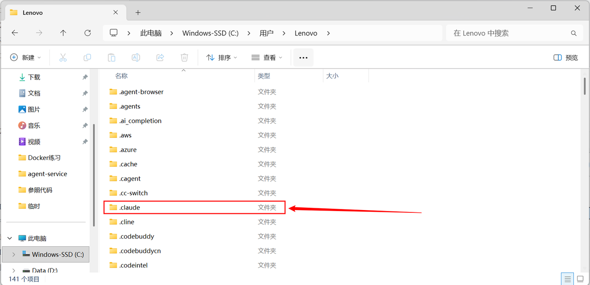
5. `打开里面的settings.json文件，如果没有该文件，自己新建一个`
把下面内容粘贴到文件当中：
```
{​
  "env": {​
    "ANTHROPIC_BASE_URL": "https://api.deepseek.com/anthropic",​
    "ANTHROPIC_AUTH_TOKEN": "sk-95f8783d49fc412fb78d3xxxxxxxxxxxxxxxxx",​
    "API_TIMEOUT_MS": "3000000",​
    "CLAUDE_CODE_DISABLE_NONESSENTIAL_TRAFFIC": "1",​
```
配置项解读：
- `ANTHROPIC_BASE_URL：大模型访问地址`
- `ANTHROPIC_AUTH_TOKEN：在注册大模型的时候保存的API_KEY`
- `API_TIMEOUT_MS：单位毫秒，超时时间`
- `CLAUDE_CODE_DISABLE_NONESSENTIAL_TRAFFIC：是否禁用非必要的网络流量，1为禁用； Claude Code 在运行时可能会发送一些非必要的请求（例如检查更新、匿名使用统计等）`
- `ANTHROPIC_MODEL：默认选择的模型`
- `ANTHROPIC_DEFAULT_SONNET_MODEL：推理任务选择的模型（较为复杂的任务，需要深度思考，比如编码，分析）`
- `ANTHROPIC_DEFAULT_OPUS_MODEL：高端复杂任务选择的模型（高端复杂任务，比如架构设计）`
- `ANTHROPIC_DEFAULT_HAIKU_MODEL：轻量级任务选择的模型（延迟低，比如自动补全，简单编辑）`
**注意：上述的ANTHROPIC_AUTH_TOKEN对应的值，就是前面我们申请的DEEPSEEK的API_KEY，须替换成自己的。**
**再次启动claudecode：**
1. 按上下箭头移动光标，选择yes，信赖这个文件夹
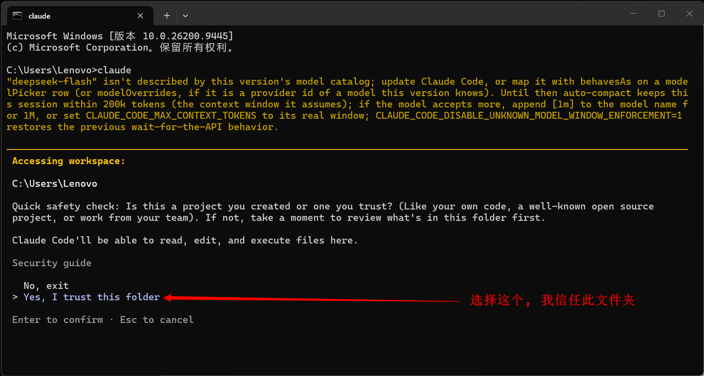
2. 你会看到claudecode已经跟大模型对接完毕
下方红色框中，就是我们claudecode底层依赖的大模型
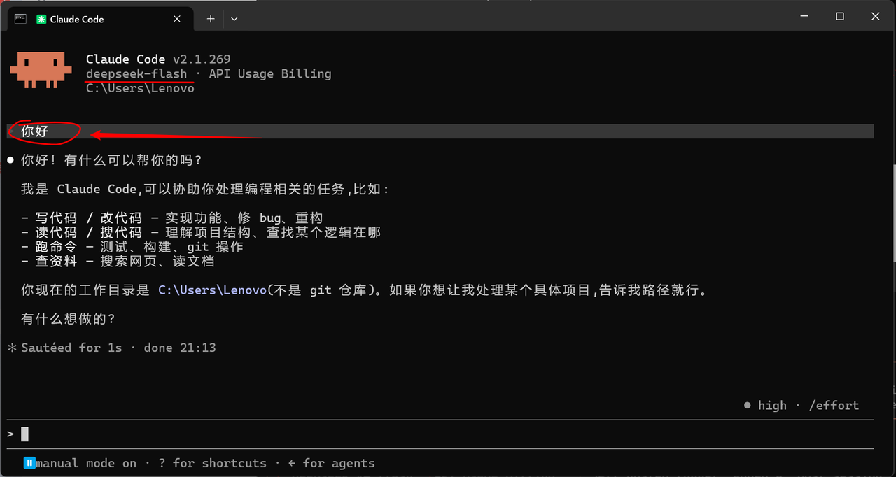
到此呢，ClaudeCode，我们就已经安装并配置完成了。
##### 2.1.5.2 三种模式
在claude code中给我们提供了常见的四种模式，这四种模式的区别在于权限不同，也称之为权限模式（Permission Modes），区别在于 AI 执行操作时是否需要你手动确认。
它们可以理解为一个从“最谨慎”到“最放手”的梯度，选择哪个取决于当前任务的敏感程度和你的信任度。
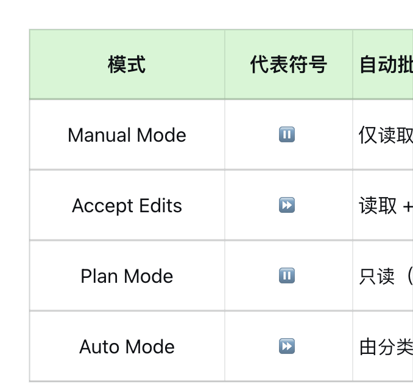
那这几种权限模式，具体该怎么选择呢？
- **不确定 / 怕出事：用 Manual Mode。**
- **日常写代码，想少点弹窗：用 Accept Edits。**
- **只想让 AI 看看，先别动手：用 Plan Mode。**
- **任务很长，信任 AI 的大方向：用 Auto Mode，但别在敏感环境里用。**
这几种模式，我们在切换时，只需要按下 shift + tab 键就可以切换了。比如，如下：
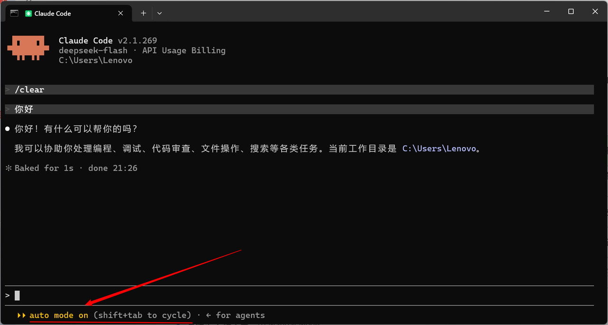
##### 2.1.5.3 常见命令
`在claude中提供了常用的命令，以便于我们可以快速操作claude code这款智能体。 命令的使用方式，就是进入claude之后，输入 /xxxx，这些命令都是以 / 开头，否则，claude code会认为你输入的是提示词。`
比如：
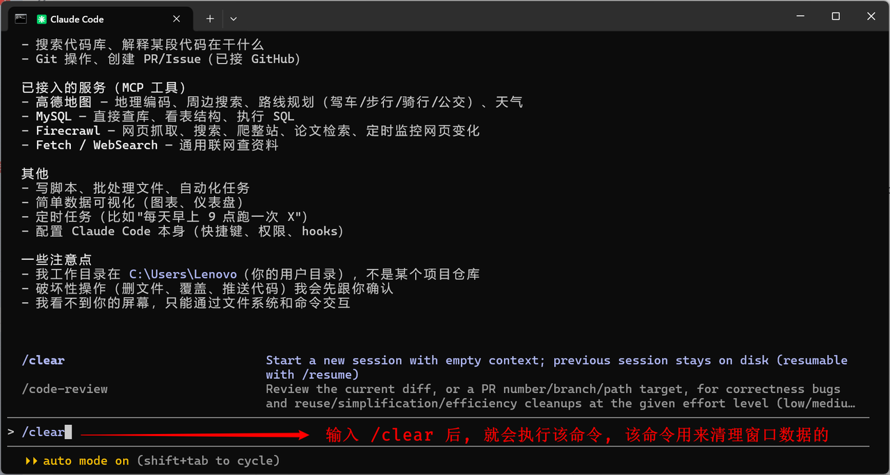
常见的命令极其作用如下：

| **命令** | **作用** | **使用场景** |
|---|---|---|
|  |  |  |
|  |  |  |
|  |  |  |
|  |  |  |

| **命令** | **作用** | **使用场景** |
|---|---|---|
| /context | 详细查看上下文中每个模块占比 | 优化 token、诊断哪里挨上下文 |
| /compact | 压缩当前对话的上下文 | 对话太长，AI开始“遗忘”早期内容时 |
| /init | 自动生成项目的 CLAUDE.md | 进入新项目后的第一件事 |
|  |  |  |
|  |  |  |
|  |  |  |
|  |  |  |
### 2.2 软件运行环境准备
#### 2.2.1 MySQL准备
**1). 解压**

下载完成后我们得到的是一个压缩包，将其解压到一个没有中文的目录下，我们就可以得到 MySQL 8.4.9 的软件本体了(就是一个文件夹)，我们可以把它放在你想安装的位置 。
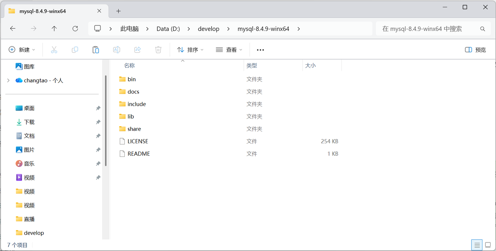
**2). 配置环境变量**

> ✅ `环境变量里面有很多选项，这里我们只用到Path这个参数。为什么在初始化的开始要添加环境变量呢？`
> `在黑框(即CMD)中输入一个可执行程序的名字，Windows会先在环境变量中的Path所指的路径中寻找一遍，如果找到了就直接执行，没找到就在当前工作目录找，如果还没找到，就报错。我们添加环境变量的目的就是能够在任意一个黑框直接调用MySQL中的相关程序而不用总是修改工作目录，大大简化了操作。`
`右键此电脑→属性，点击高级系统设置`
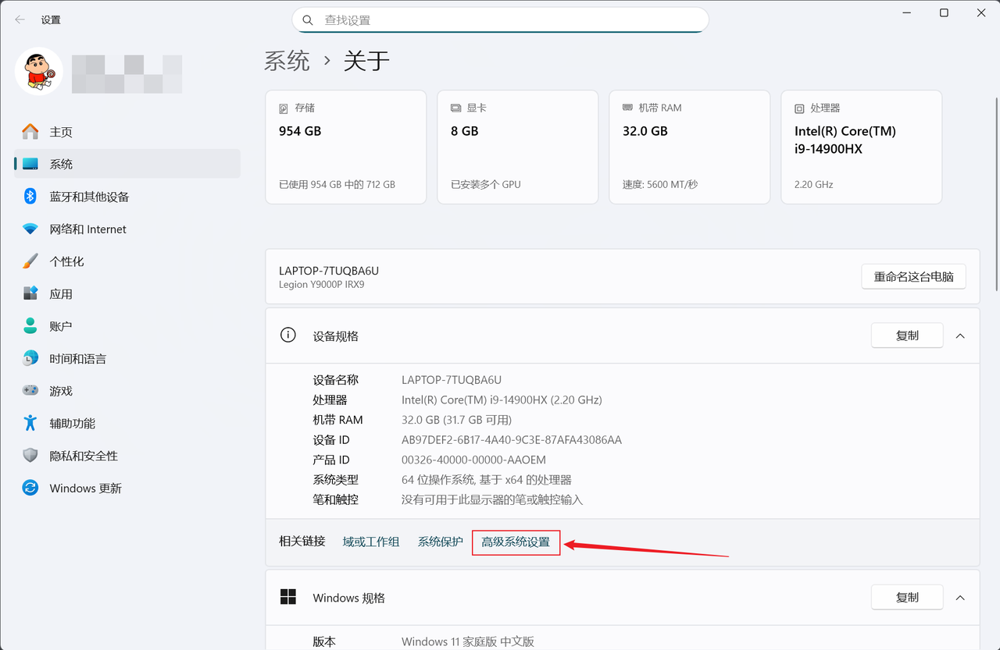
`点击环境变量`
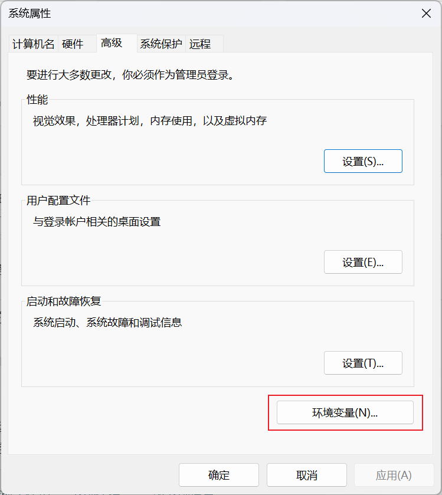
`在系统变量中找到并双击Path`
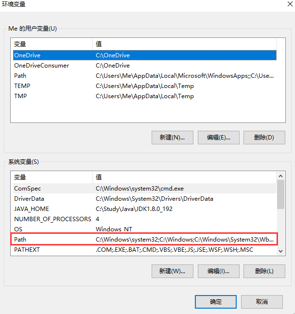
`点击新建`
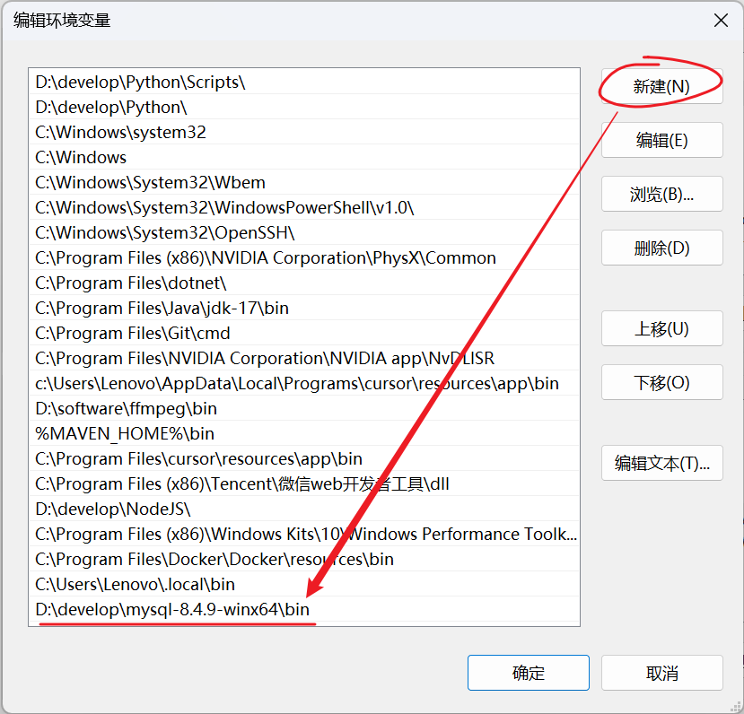
最后点击确定 。
**如何验证是否添加成功？**
`右键开始菜单(就是屏幕左下角)，选择命令提示符(管理员)，打开黑框，敲入mysql，回车。`
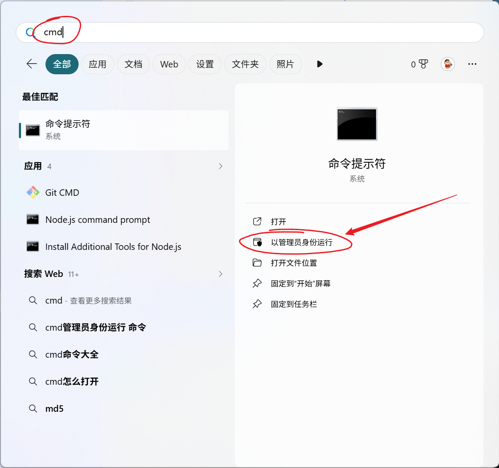
`如果提示Can't connect to MySQL server on 'localhost'则证明添加成功；`
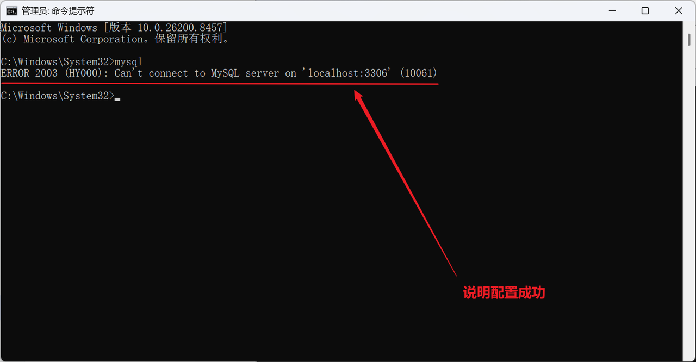
`如果提示mysql不是内部或外部命令，也不是可运行的程序或批处理文件则表示添加添加失败，请重新检查步骤并重试。`
**3). 初始化**
以管理员身份，运行命令行窗口：
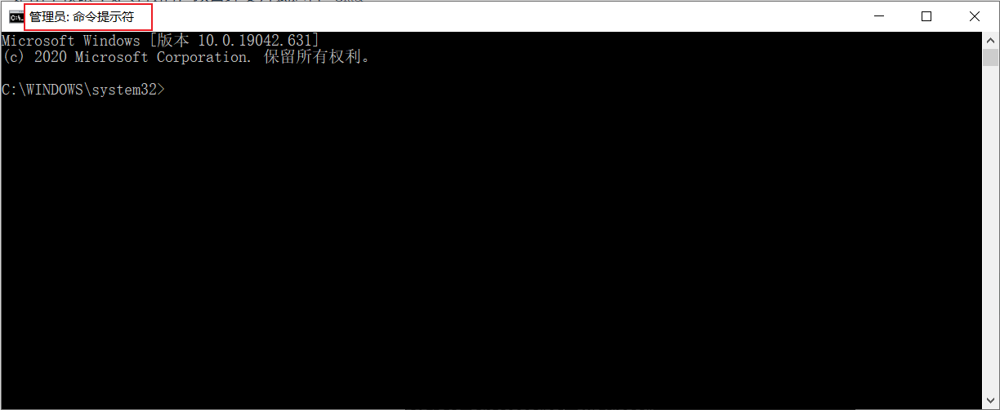
在刚才的命令行中，输入如下的指令：
```
mysqld --initialize-insecure​
```
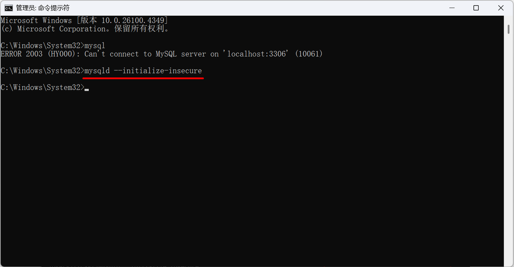
稍微等待一会，如果出现没有出现报错信息，则证明data目录初始化没有问题，此时再查看MySQL目录下已经有data目录生成。
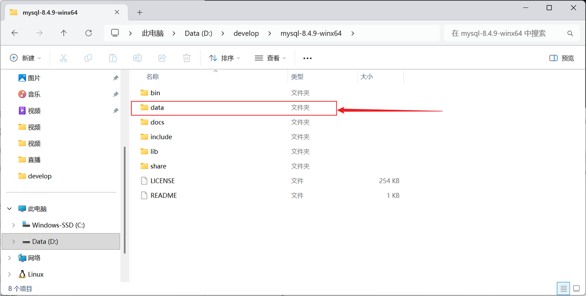
tips：如果出现如下错误
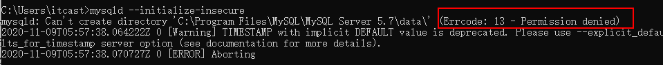
**是由于权限不足导致的，以 管理员方式运行 cmd**

**4). 注册MySQL服务**
命令行（注意必须以管理员身份启动）中，输入如下的指令，回车执行：
```
mysqld -install​
```
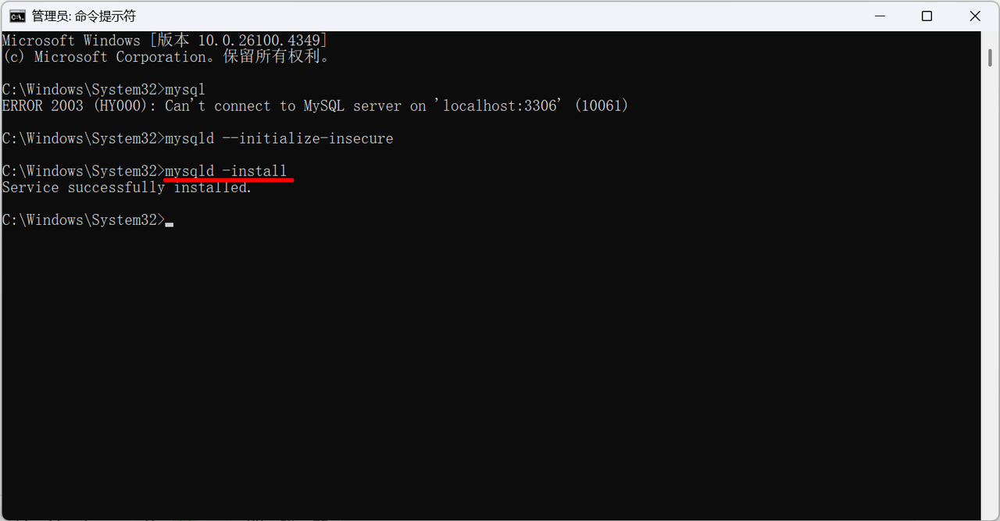
现在你的计算机上已经安装好了MySQL服务了。
**5). 启动MySQL服务**
`在黑框里敲入net start mysql，回车。`
```
net start mysql  // 启动mysql服务​
    ​
net stop mysql  // 停止mysql服务​
```
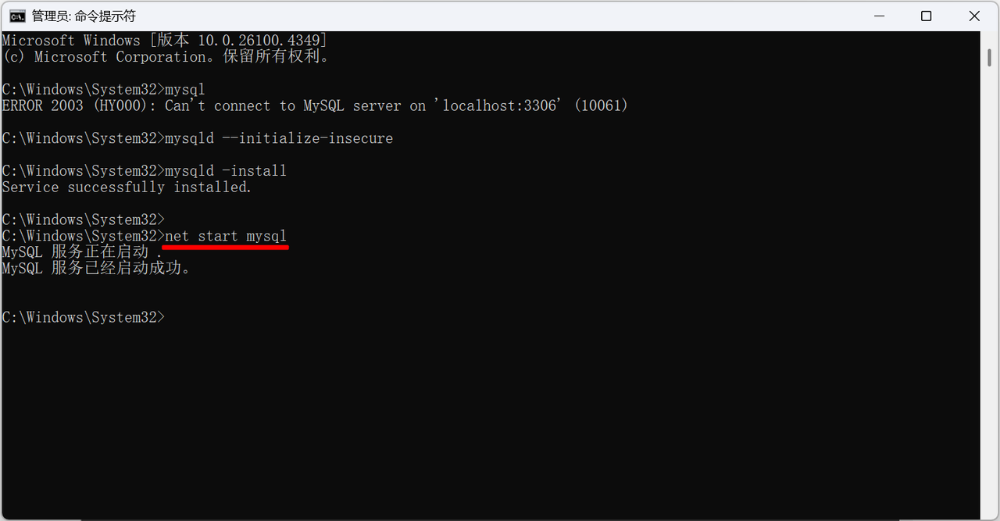
**6). 修改默认账户密码**
`在黑框里敲入mysqladmin -u root password 1234，这里的1234就是指默认管理员(即root账户)的密码，可以自行修改成你喜欢的。`
```
mysqladmin -u root password 1234​
```
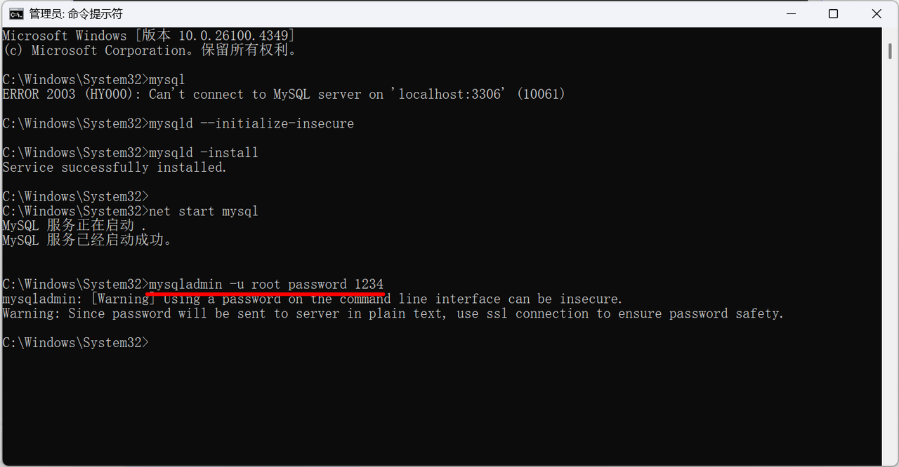
**7). 登录**
点击开始菜单，输入CMD，打开命令行，打开黑框。
`在黑框中输入，mysql -uroot -p1234，回车，出现下图且左下角为mysql>，则登录成功。`
```
mysql -uroot -p1234​
```
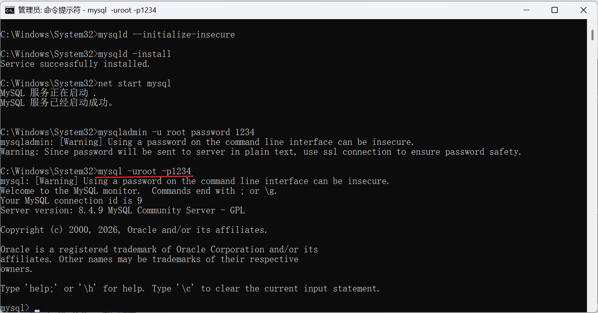
**到这里你就可以开始你的MySQL之旅了！**
退出mysql：
```
exit​
```
登录参数：
```
mysql -u用户名 -p密码 -h要连接的mysql服务器的ip地址(默认127.0.0.1) -P端口号(默认3306)​
```
#### 2.2.2 Redis准备
**1). 解压**
`将资料中提供的redis的压缩包 redis-windows-7.2.3.zip 解压到一个没有中文不带空格的目录下。`

**2). 启动**
`双击 startup.sh 启动redis数据库`

#### 2.2.3 JDK准备
JDK：是Java开发工具包，是我们服务端java程序运行时，所需要依赖的环境。

双击资料中提供的jdk的安装包文件，根据向导，下一步下一步的安装即可。

在 develop 目录下， 创建一个新目录 JDK17，安装jdk。


`安装完毕后，打开命令行，执行命令：java -version，能正常看到jdk的版本号，就说明jdk已经安装成功了。 `

#### 2.2.4 Maven准备
** Maven就是一款管理和构建java项目的工具。**
**1). 解压**

`解压 apache-maven-3.9.4-bin.zip（解压即安装），建议解压到没有中文、特殊字符的路径下。如课程中解压到 D:\develop 下。解压缩后的目录结构如下：`

**2). 配置环境变量**
Maven环境变量的配置类似于JDK环境变量配置一样。
- 在系统变量处新建一个变量MAVEN_HOME。 MAVEN_HOME环境变量的值，设置为maven的解压安装目录

- `在Path中进行配置。 PATH环境变量的值，设置为：%MAVEN_HOME%\bin`

- `打开DOS命令提示符进行验证，出现如图所示表示安装成功 。命令为：mvn -v`

