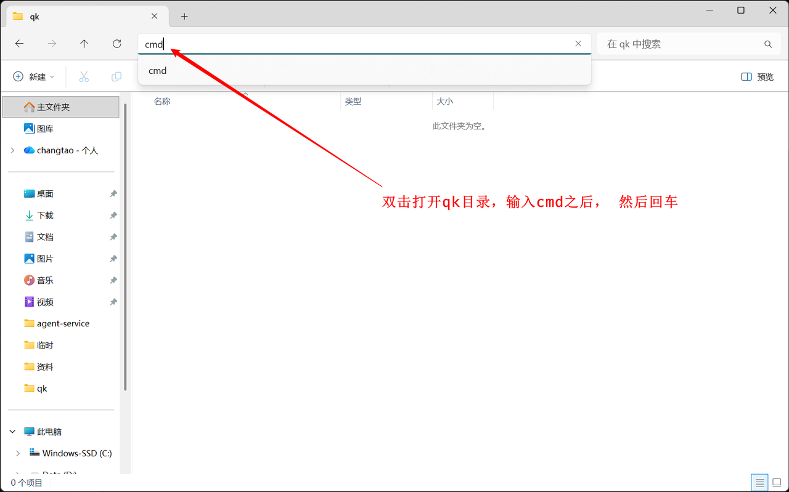
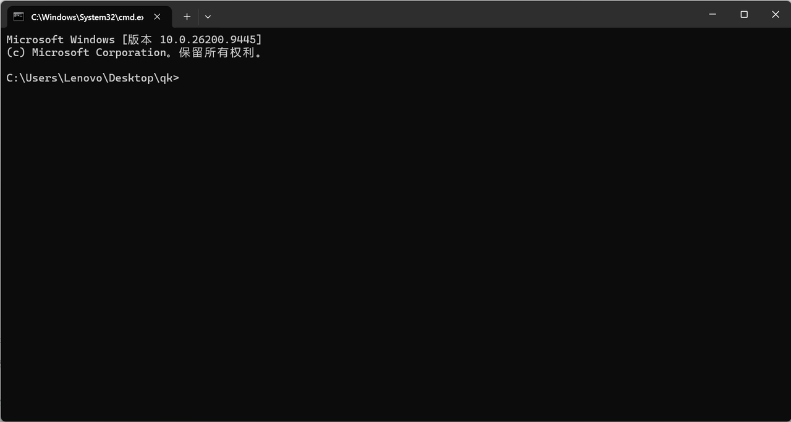
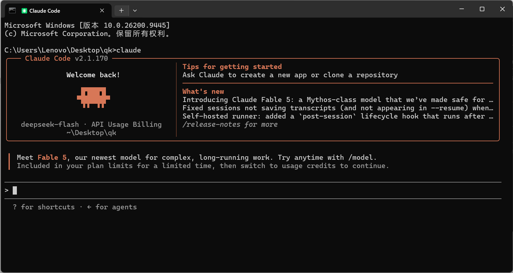
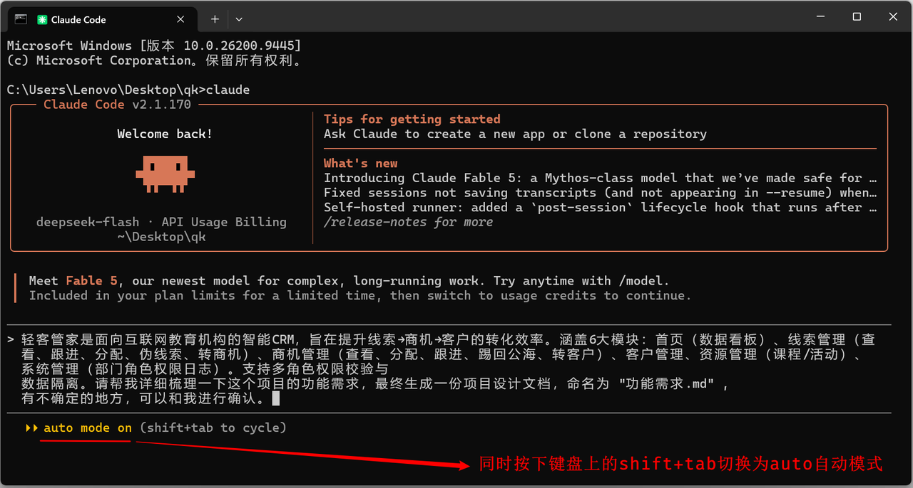
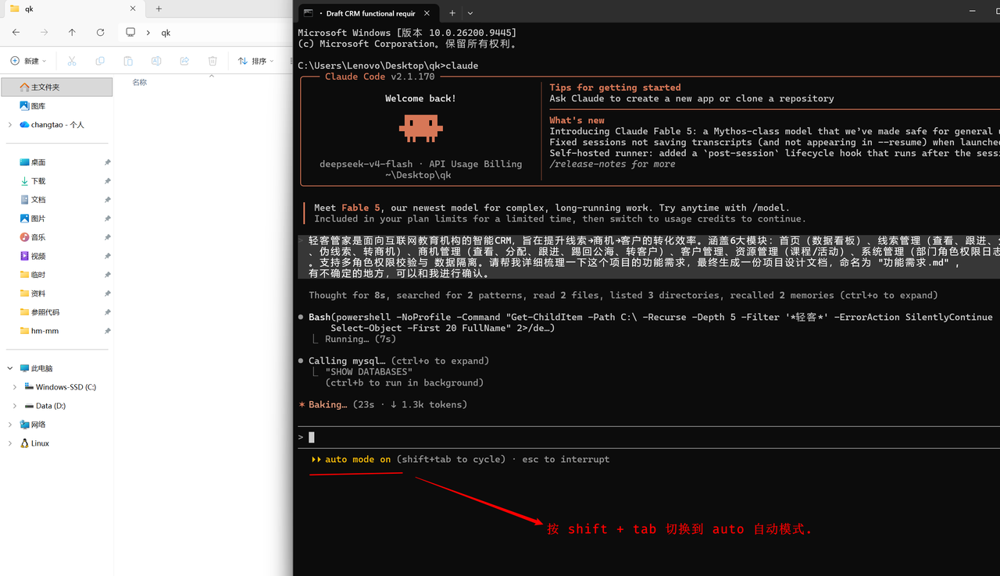
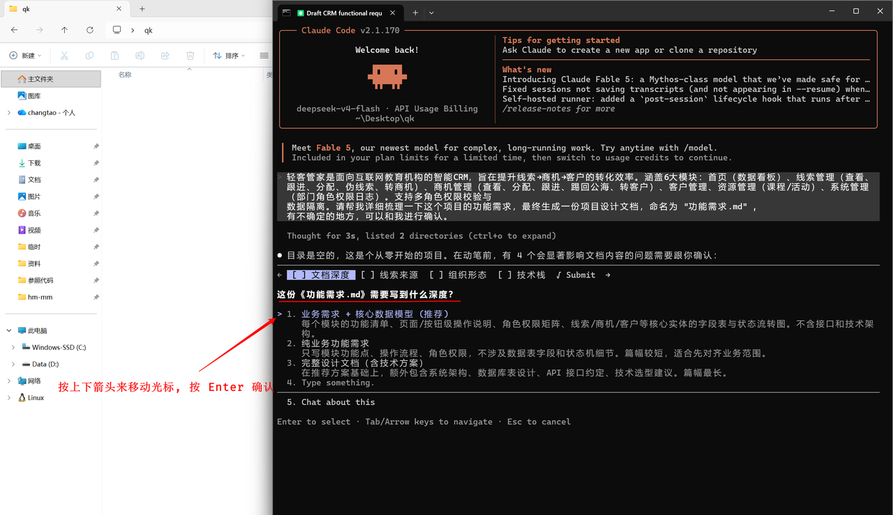
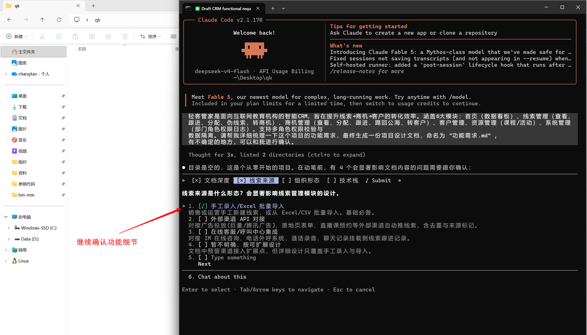
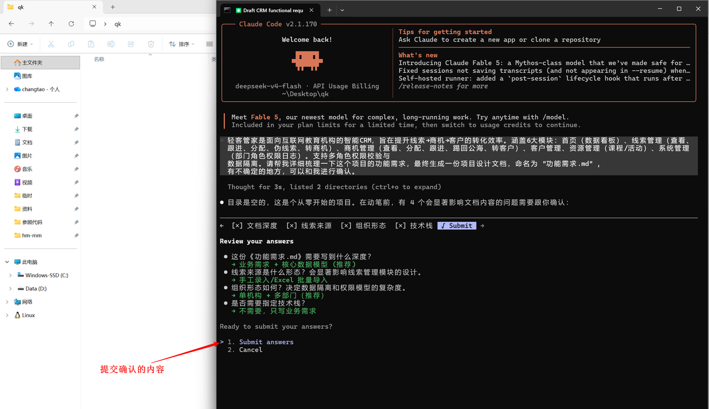
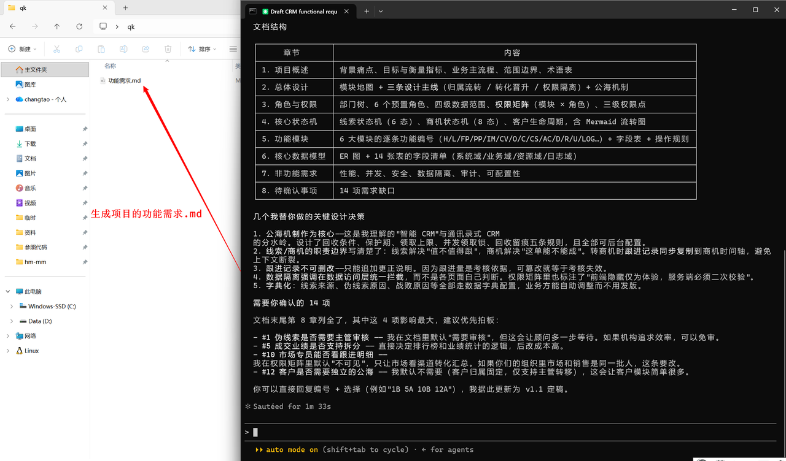
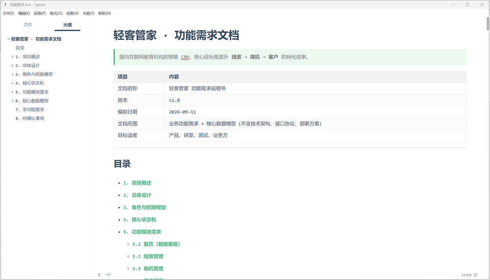

## 3. AI产品设计
当我们有一个好的idea，我们就可以把想法与ClaudeCode交流，让其帮我们一步一步的完善，并产出产品设计文档，在文档中，要理清楚功能、需求、核心业务。
`1). 在桌面上新建一个目录 qk，然后进入qk目录，在地址栏输入cmd，回车`

`2). 然后在cmd终端中，运行命令 claude 打开ClaudeCode。`

接下来，我们就可以通过Claude让其帮我们澄清并梳理需求，不合适的地方，我们再一步一步的调整，调整成最终我们需要的、能满足我们实际需求的样子。

> 🌈 **提示词:**

在ClaudeCode运行的过程中，要注意看终端的提示信息，有不清楚的地方，它会和我们进行确认，此时，我们就可以通过按键盘上的上下箭头，来控制光标所在位置，然后按Enter回车，来执行确认操作。

最终，在右侧就可以看到生成的功能需求文档。
接下来，我们就可以打开这个文档进行查看。就可以查看生成的项目功能需求文档说明，如果生成的文档哪里不合适，可以再次与ClaudeCode交互，描述自己的需求，让ClaudeCode来进行调整优化，以对齐需求。

> 📌 **提示：**
> 从一个想法，变成一个功能完善的产品规划，需要一步一步的完成、调整、优化，最后变成我们需要的样子，这其中需要进行n多轮的对话、交互、调整 ，先对齐需求，把项目的需求、功能、实现细节先梳理清楚。（并不是说，交互一两次就可以调整成满足我们需求的样子。）
