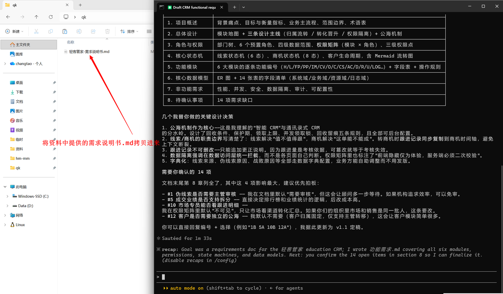
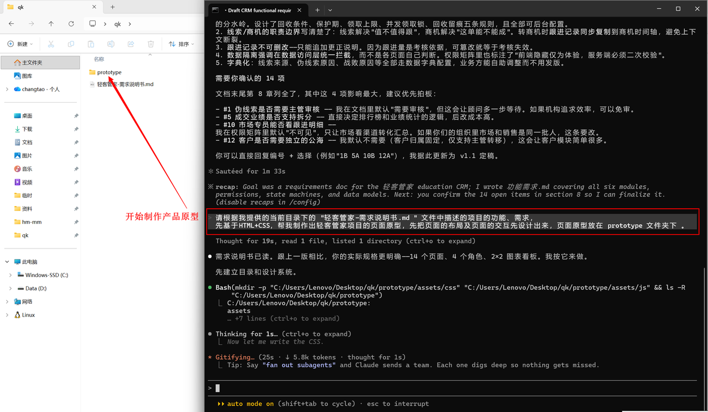
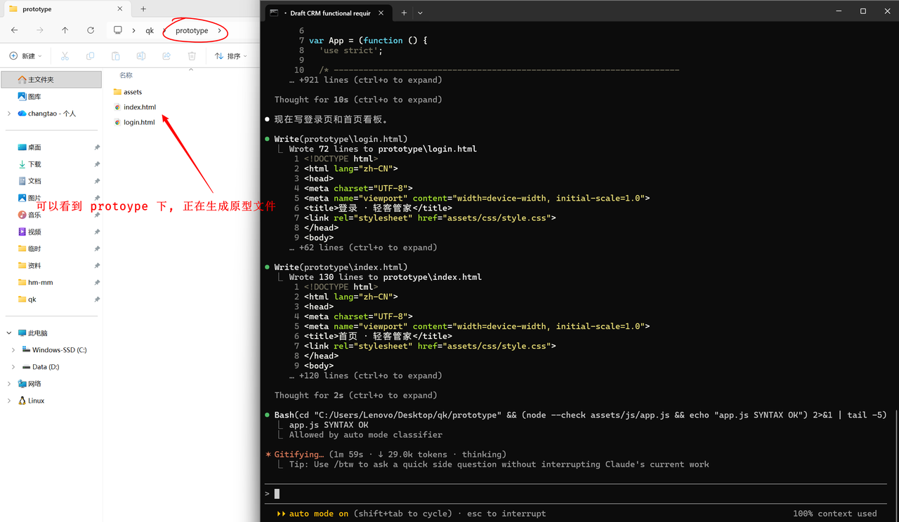
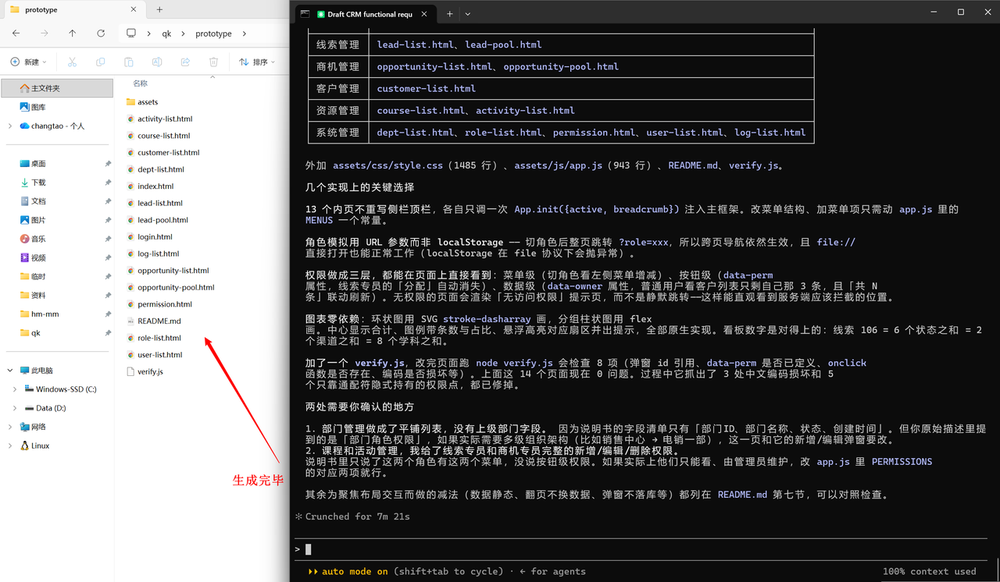
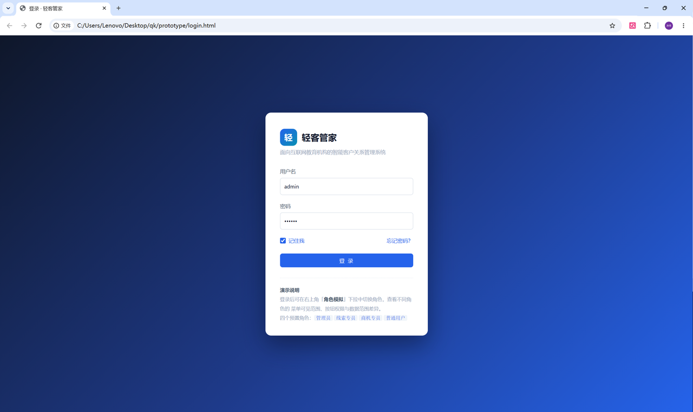
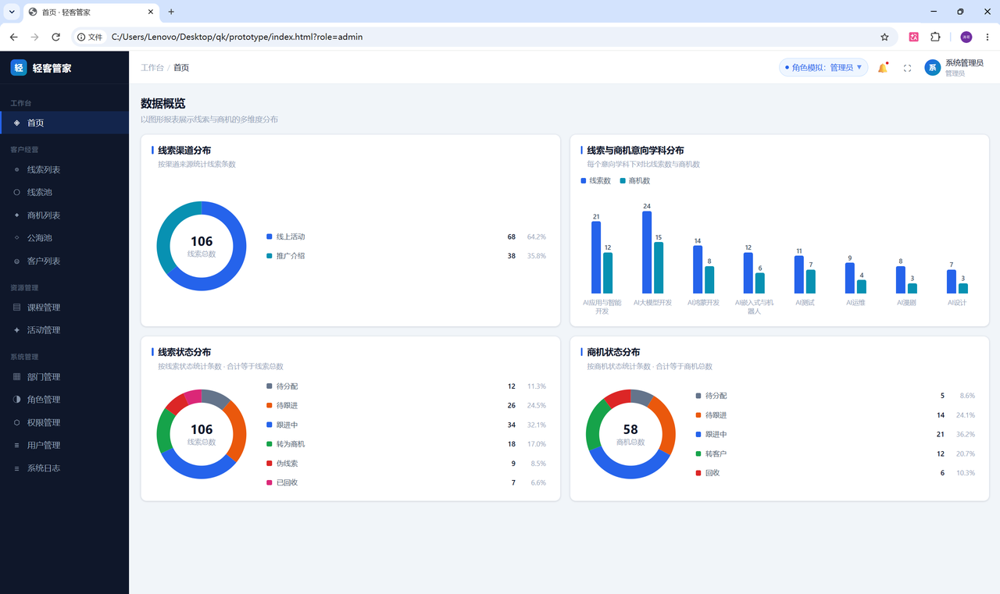

## 4. 产品原型制作
### 4.1 介绍
产品原型（产品页面原型）是一种介于 "设计稿" 和 "真实产品" 之间的产物，它是能直接跑在浏览器里的、可交互的静态界面。相比 Axure/Figma的线框图，它更接近最终形态；相比完整产品，它没有后端逻辑和数据。
**核心作用：**
- **需求具象化：文字描述天然有歧义（"线索列表支持筛选"——筛哪些？排在哪？怎么布局？），原型把抽象需求变成可争论的具体画面**
- **低成本试错：改一行 CSS 的成本 ≈ 0，改一行生产代码的成本可能牵动接口、测试、文档。问题越早发现，成本越低**
- **统一沟通语言：产品、设计、前端、后端、客户各方都能看懂同一个页面，减少"我以为你说的是……"类扯皮**
- **验证信息架构：模块如何分、菜单几级、字段多少个、表格哪些列——在原型阶段就能暴露出"字段太多塞不下"这类结构性问题**
- **可作验收基准：开发完成后"和原型一致"是可衡量的标准，减少验收阶段的返工**
- **前端可直接复用：写规范的 HTML+CSS 结构，前端开发可据此搭框架，甚至直接改造为组件，节省重复劳动**

> 🌈 **产品原型的核心作用是：在投入开发成本之前，把模糊的需求变成看得见、能讨论、可验证的具体方案，以最低成本提前暴露问题、统一各方认知。**
### 4.2 制作
产品原型，通常是由前端网页技术HTML、CSS来制作实现的，也可以配合少量的js来实现网页交互效果。 接下来，我们就通过Claude，根据资料中提供的 《轻客管家-需求说明书.md》中描述的功能需求，帮我们制作产品原型。
`1). 需要将资料中提供的 《轻客管家-需求说明书.md》文件拷贝到工作目录 qk 中。（这里可以将之前生成的产品需求文档删除掉，避免造成干扰，使用提供好的这份需求说明即可）`

2). 打开Claude，新建一个会话，选择工作目录为 qk。然后输入提示词。

> 🌈 **提示词：**
> 请根据我提供的当前目录下的 "轻客管家-需求说明书.md " 文件中描述的项目的功能、需求， 先基于HTML+CSS，帮我制作出轻客管家项目的页面原型，先把页面的布局及页面的交互先设计出来，页面原型放在 prototype 文件夹下 。

如果在与Claude交互过程中，需要与我们确认相关的信息，我们根据自己的需求，去确认即可。根据我们确认好的需求，开始生成产品原型。

> ✨ 如果一次性生成的内容太多，Claude会自动压缩上下文的体积。如果项目结构比较复杂，功能比较多，生成的时间可能会比较长，我们需要耐心等待。
### 4.3 访问
最终，生成的页面原型的页面就放在 prototype 文件夹下了，我们要想查看这个静态的原型页面，就可以直接双击通过浏览器打开查看了。

查看原型页面中的布局、功能点、交互，如果不满需求，可以在claude中基于自然语言来描述我们的需求，让claude再来调整页面原型，直到满足我们的需求为止。

> 📌 **提示：**
> 这个调整页面原型的过程，也是一个比较耗时、漫长的过程，并不是说一两次交互，AI就能生成完全满足我们心里预期的原型，页面的布局、展示、字体、菜单、功能点、交互流程，这些如果不满足，我们继续与Claude交互，让其帮我们来调整优化即可。

> 🌈 **提示：**
> 在提供的课程资料中，也提供了调整优化后的产品原型，稍后我们在进行开发时，就参照提供的优化后的产品原型即可。
