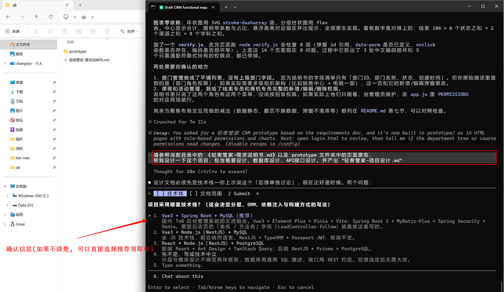
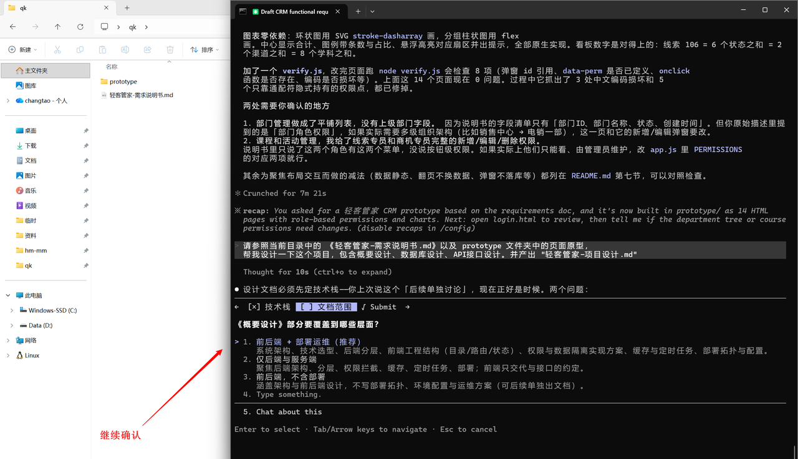
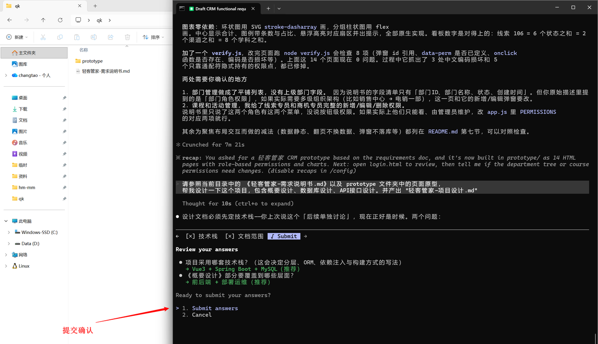
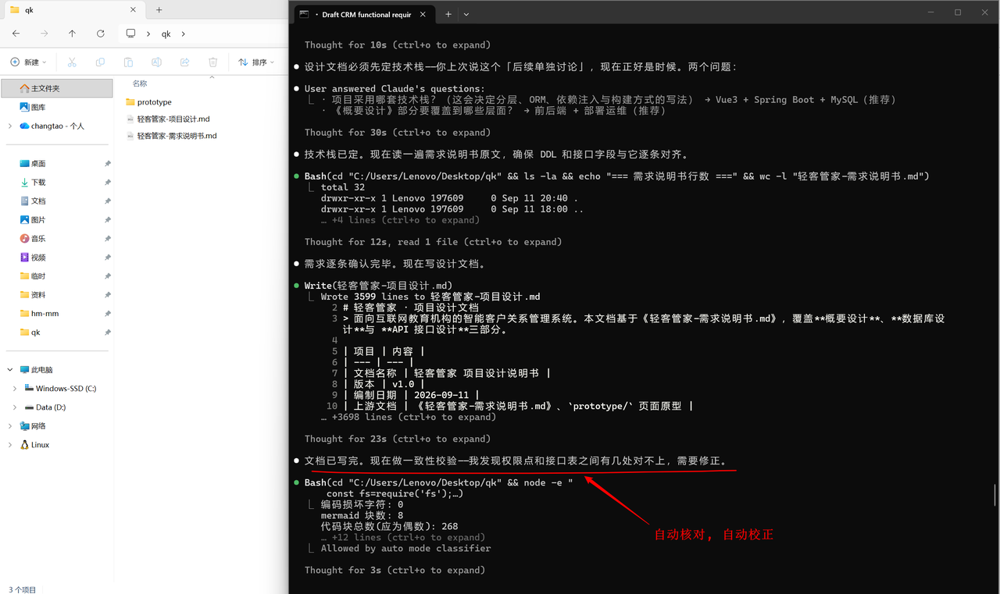
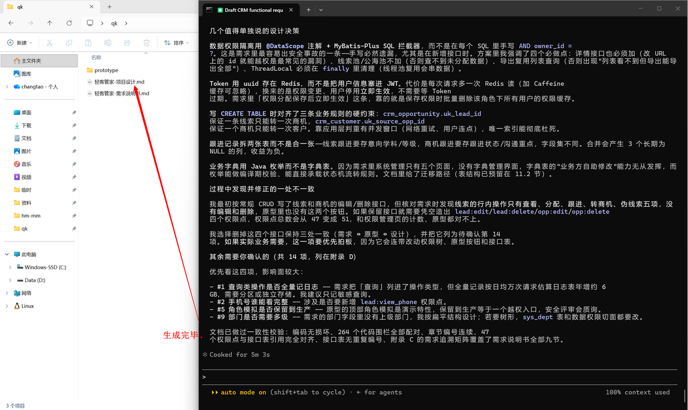
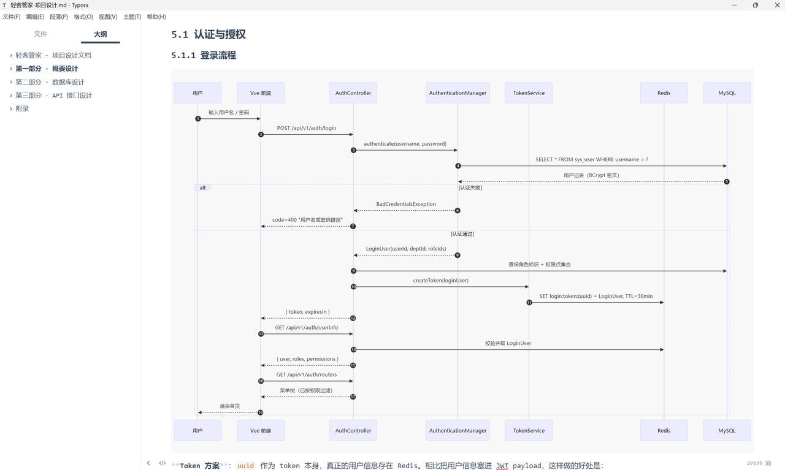

## 5. 系统设计
### 5.1 介绍
在产品原型设计好了之后，我们在进行项目的代码开发之前，还要进行系统设计，那系统设计主要是设计什么呢 ? 核心包含以下几个部分：
- 概要设计：核心内容就包含 技术选型（比如前后端分别使用什么框架）、模块划分、部署架构 等等。
- 数据库设计：分析当前这个项目涉及到哪些业务模块，每一个业务模块需要涉及哪些表结构，表中具体包含哪些字段，都是在这阶段需要设计好的。
- 接口设计：这个是前后端并行开发的前提，需要提前设计好整个项目的API清单，涉及到哪些接口，接口的详细信息，都需要规划好。

> 🌈 一定是提前把产品原型每一个模块，每一个功能点，都理清楚，对齐需求，调整好了页面原型之后，再来做系统设计。
> 因为系统设计时，在设计数据库、接口时，都是依据产品原型和需求说明来设计的，如果产品原型都有问题，设计出来的数据库 、以及接口，肯定也是存在问题的。
### 5.2 操作

> 🌈 请参照当前目录中的 《轻客管家-需求说明书.md》以及 prototype 文件夹中的页面原型， 帮我设计一下这个项目，包含概要设计、数据库设计、API接口设计。并产出 "轻客管家-项目设计.md"

> 📌 注意：由于该操作，需要设计全量的项目的详细设计，包含：技术选型、总体架构、工程结构、功能模块划分、核心业务流程、权限模型、通用设计约定、数据库设计、API接口设计等等，所以耗时可能会比较长（10分钟左右都是比较正常的）
最终生成的项目设计文档，《轻客管家-项目设计.md》如下：

> 📌 **提示：如果此次AI生成的项目设计方案，无论是技术方案还是业务流程，任何地方不满足需求，有问题，都可以再次与ClaudeCode交互，让其进行调整优化即可。（这里我们就先不调整了，等后续完成代码实现的时候，哪里有问题，我们再进行调整优化即可。）**
