## 7. 项目完善优化 (了解)
### 7.1 项目细节美化
项目的整体功能开发完毕后，接下来，我们就可以对整个项目的整体功能，进行测试，这个是比较耗时的过程，要测试每一块儿功能的正确性以及业务的合理性。
在测试的过程中，如果发现哪里的功能有问题，存在Bug，或者是页面的展示、业务逻辑、页面的风格等不满足需求，直接在ClaudeCode的终端中，继续通过自然语言描述我们的需求，然后让ClaudeCode智能体自动帮我们优化完善，直到满足我们的需求即可。
比如：目前所有页面上的按钮前面，并没有一个icon图标点缀的，我们可以美化一下。
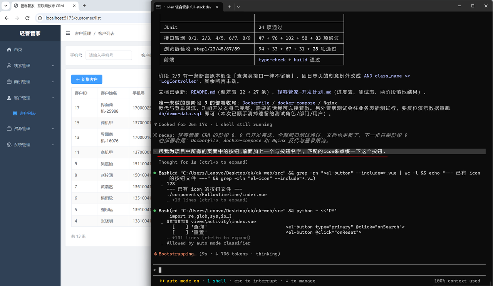
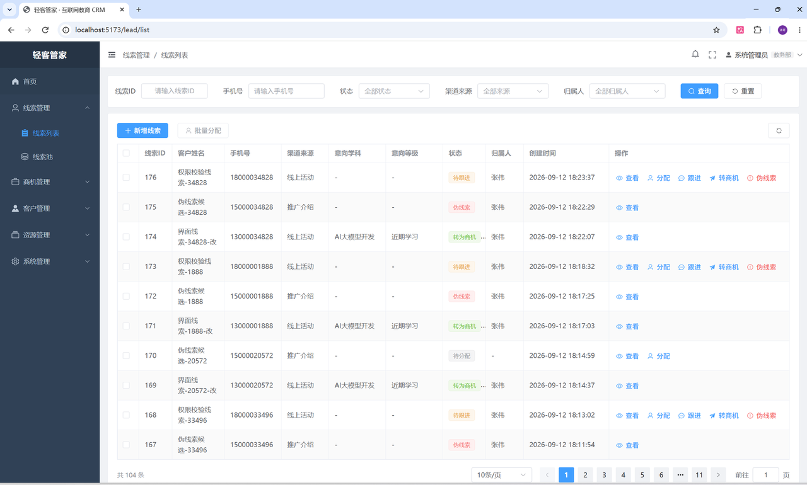
### 7.2 界面风格优化Skills
如果我们需要对于整个项目的界面风格进行优化，这里我们可以借助于官方以及第三方提供的Skills来优化。
常见的Agent Skills下载网站（在这些网站中涵盖了各种各样的常见的Skills，涉及到日常办公、软件开发、新闻资讯、股票市场等各个领域）：
- https://github.com/anthropics/skills/tree/main/skills
- https://skillsmp.com/
- https://www.skills.sh/
接下来，我们就使用其中一个用于对软件界面风格进行优化的skills。
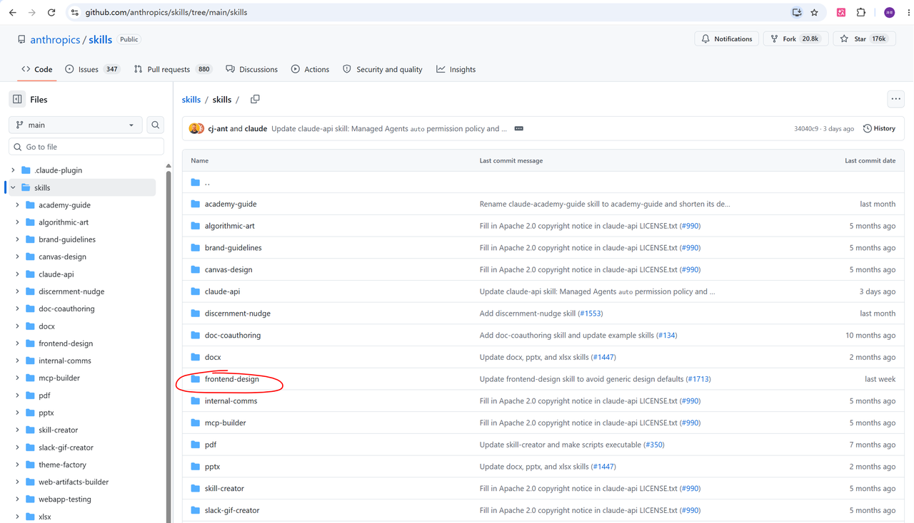
`将这个skills下载下来之后（提供的课程资料中已经提供），只需要将其解压出来放在 C:/Users/用户名/.claude/skills 目录下（如果第一次操作，没有skills目录，自己新建一个即可）。`

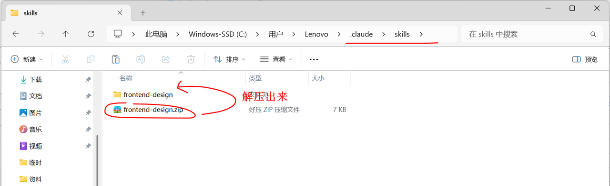
解压出来之后，再重新打开claude，就可以加载到我们配置好的skills了。
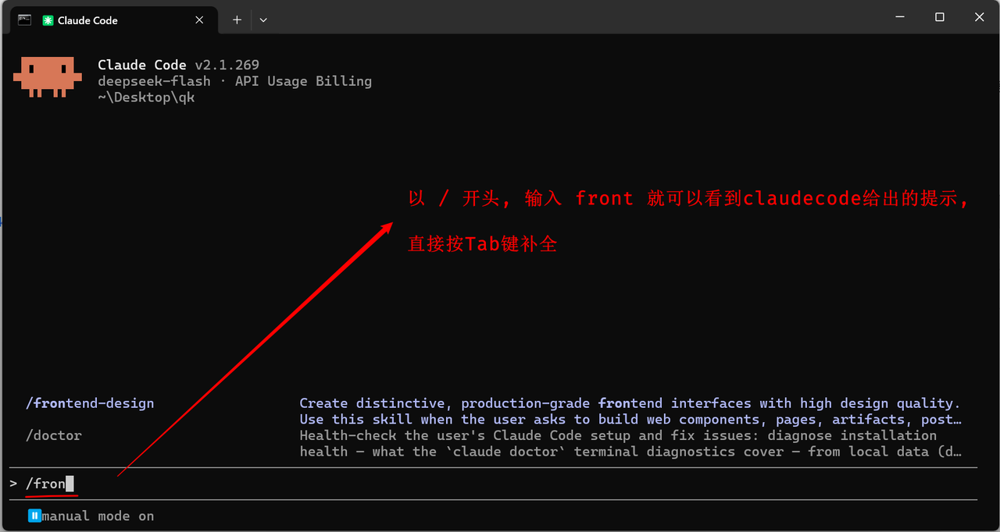
`可以看到，提示出来的 frontend-design 就是我们配置的skills的名字。`
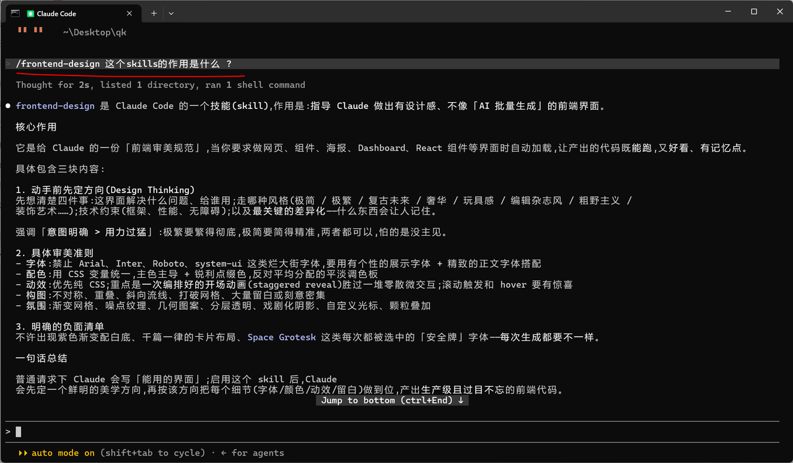
接下来，我们就可以尝试，通过该skills来优化我们整体的界面风格了（包括字体、配色、动效、构图等等）。【而其实我们当前是一个后台管理系统，界面相对来说，就是比较固定的，没必要优化，这里仅仅是给大家提供一种思路，演示一下】
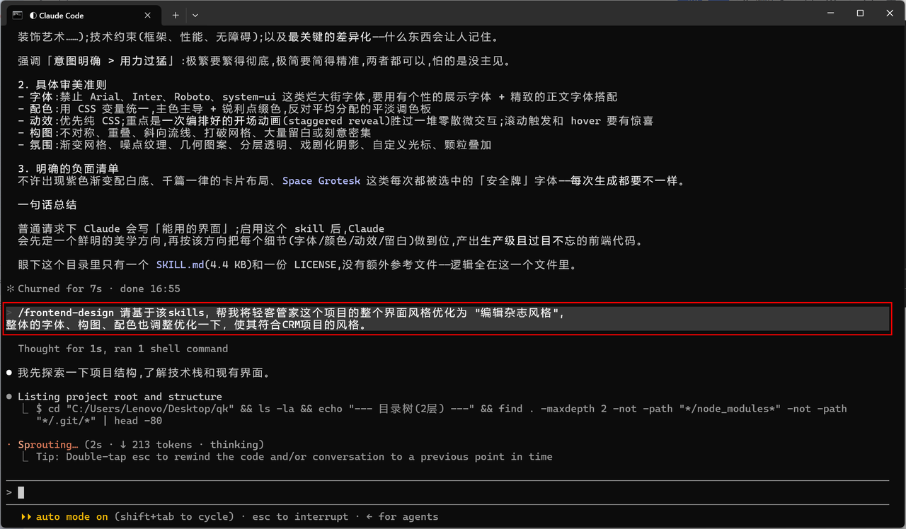
由于需要重构优化整个项目的界面风格，所以这里的耗时可能会比较长一点。
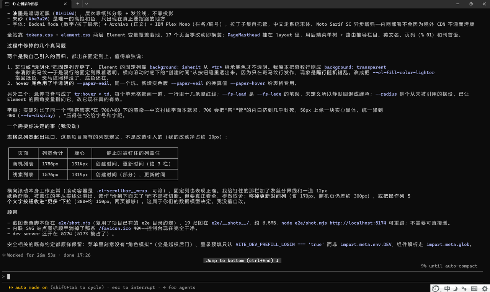
优化完毕后，我们可以打开浏览器访问项目的前端页面，可以看到具体的风格。
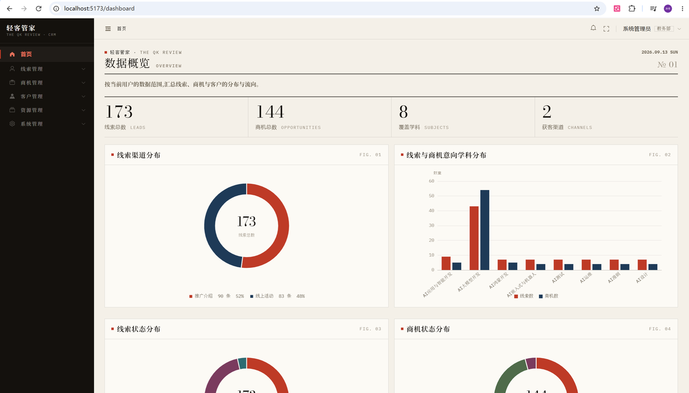
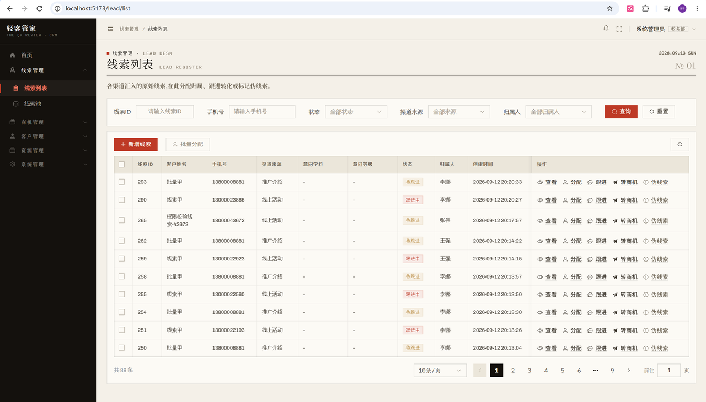
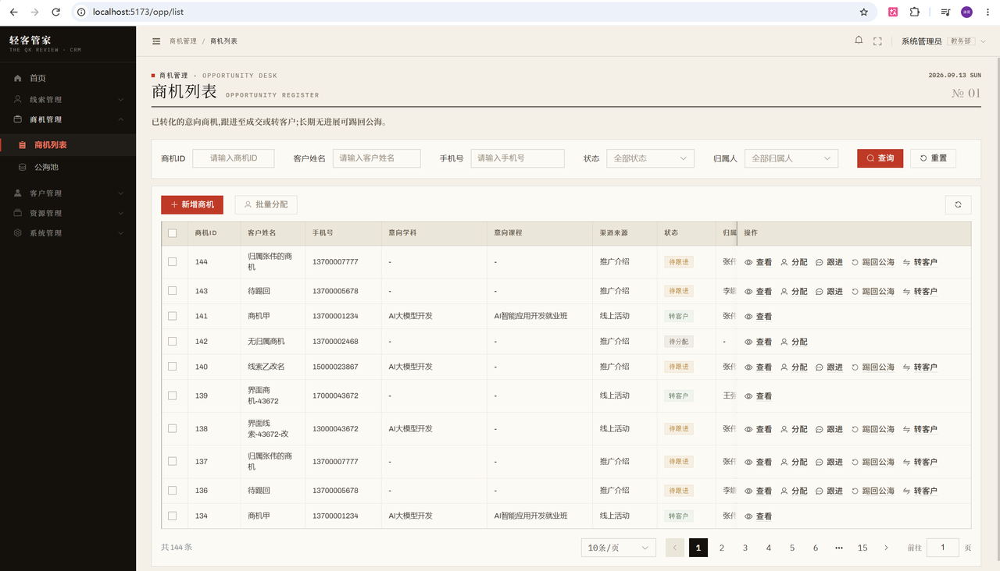
怎么样，有没有浓浓的杂志风格呢，(#^.^#)，这就是Skills的魅力 （具体想设置为什么风格，可以自己查看下skills的能力，然后自己调整风格即可）。
/help
显示帮助信息
忘记命令时查看
/model
查看/切换当前模型（高/中/低档）
我们设置的模型都是一样的，暂时没用
/clear
完全清空当前对话
开始全新的任务时
/btw
该命令下的对话不会记入上下文，适合临时提问
主任务进行中想问个无关问题
/rewind
回退到某个节点
说错几句话，不污染上下文
双击esc
停止/回退
如果claudecode正在执行，停止当前操作
如果claudecode没有执行，等同于/rewind
/simplify
从"代码质量"、"运行效率"、"可复用性"三个角度去审核并修改项目代码
开发完毕之后，项目优化时使用
/resume
选择历史对话
异常终止
轻客管家是面向互联网教育机构的智能CRM，旨在提升线索→商机→客户的转化效率。涵盖6大模块：首页（数据看板）、线索管理（查看、跟进、分配、伪线索、转商机）、商机管理（查看、分配、跟进、踢回公海、转客户）、客户管理、资源管理（课程/活动）、系统管理（部门角色权限日志）。支持多角色权限校验与 数据隔离。请帮我详细梳理一下这个项目的功能需求，最终生成一份项目设计文档，命名为 "功能需求.md" , 有不确定的地方，可以和我进行确认。
那这个操作，是比较耗时的操作，因此呢，在课程中，我们就不再一步一步的去调整这个项目需求文档了。 那么在提供的课程资料中，我提供了一份 《轻客管家》项目的需求说明书 --- 《轻客管家-需求说明书.md》
【那这份需求说明书，就是与AI进行n多轮交互以及自己手动调整优化的一份需求说明书，我们课程中使用这份需求说明书即可。 】
【由于课程时间有限，我们就不再课程中一步一步的确认页面，然后再进行调整了】
**Agent Skills（智能体技能）：它不是某个具体的产品，而是一种让 AI Agent（智能体）获得新能力的机制或规范。目前最主流、最广为人知的定义，来自 Anthropic 在 2025 年 10 月推出的 Agent Skills 体系，并随 Claude 一同发布。**
Agent Skills 是把 “完成某类任务所需的指令、脚本、资源” 打包成一个文件夹，让 AI 智能体在需要时自动加载并执行，从而学会一项新技能。
在没有 Skills 之前，让 AI 完成复杂任务通常有几种方式，各有痛点：
- **写超长 System Prompt：上下文爆炸，维护困难，所有任务都塞进去，浪费 token**
- **微调模型：成本高、周期长、不灵活**
- **外挂工具（Function Calling）：只能调用单个函数，缺少“怎么用、何时用、组合用”的知识**
- **多轮人工提示：每次都要用户重复交代，无法沉淀**
