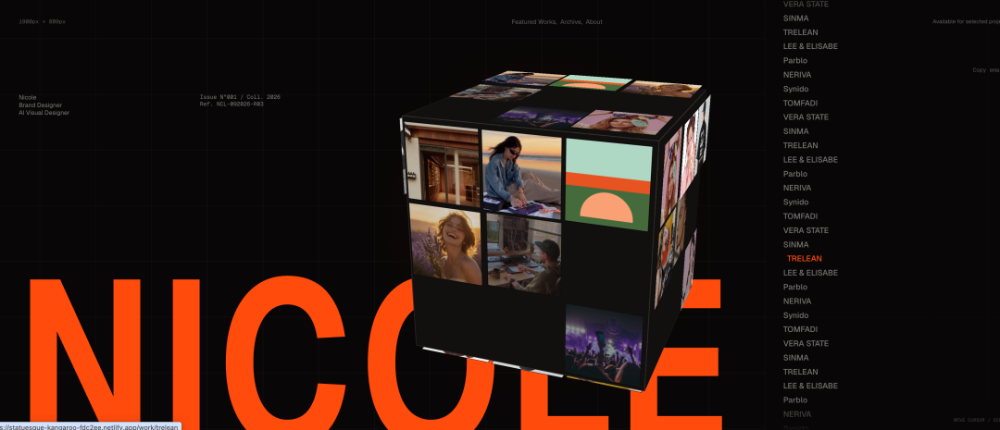
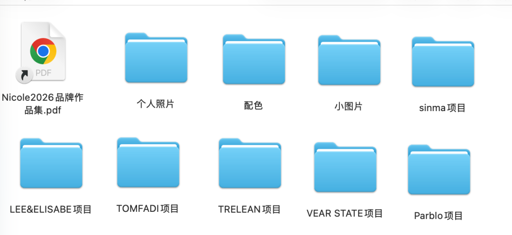
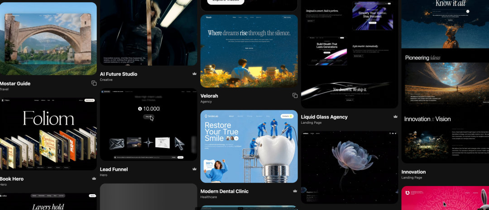
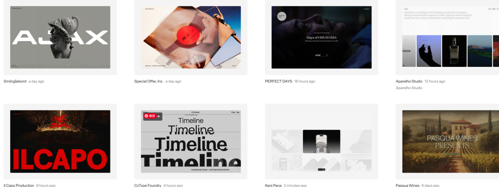
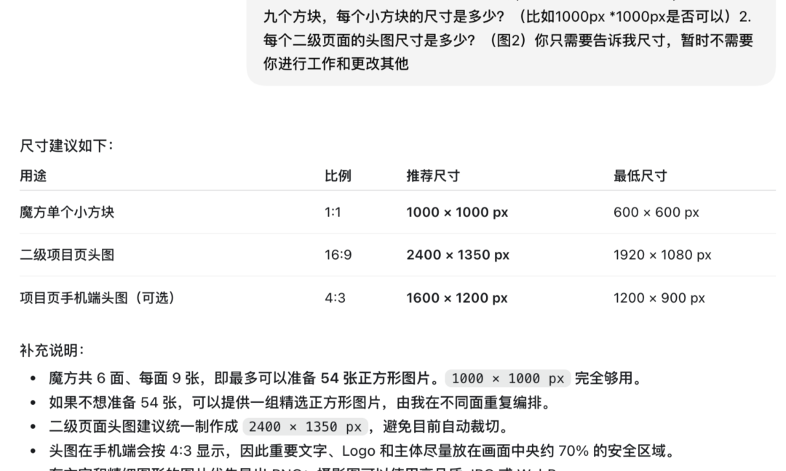
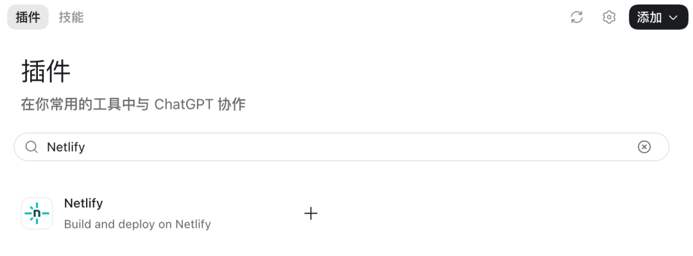
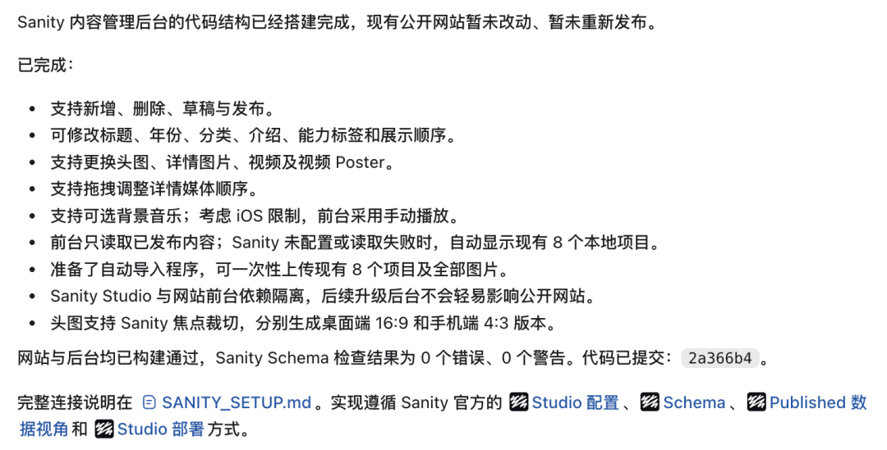
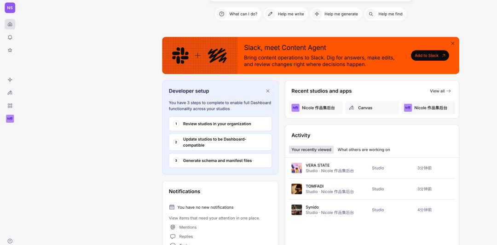

# 我用Codex做了个作品集网站

> 原创 三吉吉 · 公众号「设计师三吉吉」 · 2026年9月10日 08:01 · 广东



最近在整理自己近期的作品。

原本只是想把项目重新梳理一遍，后来突然想到既然素材都整理了，那顺便用 Codex 搭一个自己的作品集网站。

以前做作品集网站，对设计师来说还是一件门槛挺高的事情。要么找现成模板，要么找开发配合，后续想加一个项目、改一段文案，也比较麻烦。

现在不用写代码，从整理资料、搭建首版、调整视觉、添加交互动效，到最后部署上线和搭后台，都直接和 Codex 协作完成了。

所以今天我把整个过程分享出来。

## 01｜规划准备

先想清楚你的作品网站要展示些什么

在电脑新建一个本地文件夹，把你的个人形象，介绍，项目图片等整理到里面

如果你有自己的品牌色或喜欢的配色也可以先放到里面

- 个人照片
- 个人介绍
- 设计项目
- 项目介绍
- 品牌色 / 喜欢的配色
- 其他可能会用到的小图片



这里建议一个项目建一个单独文件夹。

当Codex 开始搭建时，它就能清晰知道你是谁、你有哪些作品、网站准备展示什么。

## 02｜Codex协作

我这次比较明显的感受是：用 Codex 做网站，最好分阶段推进。

如果你只告诉它：“帮我做一个高级作品集网站。”

虽然也能做。

但很容易变成一个看起来没什么问题，却也没什么个人特色的模板网站。

所以我把整个过程拆成了三个阶段。

### 阶段一：先搭一个能运行的版本

资料整理好之后，我把整个文件夹交给 Codex，然后先让它完成网站基础结构。

我当时用的 Prompt 是：

> 参考附件我的作品集和个人信息，请帮我从零搭建一个响应式个人作品集网站。
>
> 我的身份定位是：品牌设计师 / AI视觉设计师。
>
> 网站整体希望是暗色系，黑、橙、灰配色，克制、高级、带一点科技感，但不要做成通用模板站。
>
> 页面优先包含：
>
> 1. 首屏 Hero
> 2. 个人经历
> 3. 精选项目
> 4. 个人优势
> 5. 页尾联系
>
> 如果我已经提供对应文案，请优先使用我的版本。
>
> 先完成一版可以运行、可以预览、方便继续修改的版本，后续我会继续提供素材和参考网站进行优化。

### 阶段二：按参考网站优化视觉排版与动效

首版出来以后，如果整体方向已经比较接近，我就直接在这个基础上继续修改。

如果视觉差很多，我会先停下来找参考。

这里分享两个我常用的视觉参考网站

第一个：

Motion Sites https://motionsites.ai/

它包含很多高级动态效果创意，适合用来找氛围感的视觉风格



第二个：

SiteInspire https://www.siteinspire.com/

它没有这么多交互的动态效果，可以用来做整体版式的参考



找到喜欢的网站以后，可以直接截图给 AI。

如果特别喜欢某一个网站，我会直接把网址给它。

但这里有一个小经验。

**涉及复杂动效时，先让 AI 分析，再让它执行。**

可以输入以下提示词：

```
目前文案基本可用，但视觉需要整体优化。 请研究这个参考网站：[参考网址]，重点分析它的版式比例、信息密度、项目展示方式、鼠标与滚轮动态，交互动效。以及移动端处理。 我的名字是：[名字]，身份是：[身份定位]。请用我的信息覆盖参考站中的英文身份信息。 先在本地完成并让我核对，不要发布。
```

### 阶段三，替换全部真实素材

页面整体风格确定后，我才开始大量替换自己的真实项目。

如果一开始就在一个还没有确定的页面里不停塞几十张作品，后面改版式时反而更麻烦。



网站看起来差不多之后，最后又让 Codex 做了一轮完整验收。

这一轮很有必要。

因为电脑上看起来正常，不代表手机端也正常。

特别是作品集这种图片比较多、又带交互的网站，很容易出现图片顺序、响应式尺寸、滚动动画之类的小问题。

我用的prompt是：

> 请不要只检查页面能否打开，而要进行上线前验收：
>
> 1. 实际点击首页、Archive 和每个项目入口
> 2. 检查全部项目详情页与下一项目链接
> 3. 检查图片清晰度、加载状态和顺序
> 4. 用 iPhone 尺寸检查横向溢出、安全区和触摸交互
> 5. 检查浏览器控制台错误
> 6. 确认鼠标、滚轮和触摸驱动的动效仍然有效
>
> 发现问题直接修复，修复后重新构建并复测。

## 03｜让全世界看见你的作品

到这里，网站其实已经完成得差不多了。

接下来就是把本地网站变成一个公开链接。

我这次直接通过 Netlify 部署。



给 AI 的要求也很简单：

> 需要部署到 Netlify，生成公开访问链接，并且手机端也能打开，保留所有交互动效，界面展示需要适应 iOS。

稍等一会儿，就能得到一个公开网址。

之后不管是求职发给 HR，还是接项目发给品牌方，对方点开链接就可以直接浏览完整作品。

## 04｜搭建后台系统

部署完成之后，如果我之后想新增或者修改作品如何操作呢

我在想难道每次都要重新制作吗

所以我想让它给我搭建一个管理后台

可以输入这段提示词

> ```
> anity 后台可行性
>
> 后台已经覆盖你的核心需求:
> 新增和删除作品
> 修改作品标题、年份、分类和文案
> 图片/视频类型切换
> 更换封面、视频和视频 Poster
> 修改详情页媒体
> 使用 sortOrder 调整顺序
> 草稿与发布状态
> 可选背景音乐字段
> 未配置 Sanity 或网络失败时使用本地数据兜底|
> ```



几分钟之后，它就帮我搭建好了一个后台管理系统，以后我要修改标题，增加删减图片之类，我只要在这里操作一下，网站就会自动更新。



## 最后

**现在设计师已经可以自己完成很多过去需要开发配合的事情。**

整个过程中，花时间的地方依然是：

**想清楚自己到底想展示什么，每个页面分别放什么，想要用怎样的画面和效果呈现，并且把这些东西清晰的描述出来。**

Codex负责把这些想法变成真正可以运行的网站。

而且今天这一套流程也不只适合做作品集。

品牌官网、摄影师网站、个人主页、独立项目介绍页，其实都可以沿用：

**整理内容 → 搭首版 → 找参考 → 调视觉 → 换素材 → 验收 → 上线 → 搭后台。**

\- END -

---

## 附：公众号名片信息


**我是Nicole**

品牌设计师，个人品牌系统搭建者。

目前正在把过去零散的设计经验，整理成可以反复调用的灵感系统、AI工作流和个人知识资产。这里主要记录：设计灵感与审美调用｜AI工作流｜设计师个人资产系统搭建｜设计师个人成长与自由职业

如果你是设计师，想把零散的设计经验转化成可以长期积累的个人品牌系统，并进一步发展个人事业方向。

这是我能帮助你的方式：

**1.设计师灵感管理系统：**

把收藏的图片、网站和项目经验，整理成一套可以反复查找与调用的个人灵感库：📎 [设计师灵感系统2.0](https://mp.weixin.qq.com/s?__biz=Mzk1NzcxODg4OQ==&mid=2247485328&idx=1&sn=cff794c12f5441095c03441da251ffa2&scene=21#wechat_redirect)

**2.设计师个人事业实验室：**

通过一套我基于人生设计课理论自研的AI探索工具，梳理你的技能、经验与兴趣，并通过5次1v1深度沟通根据你遇到的问题规划下一步的方向➡️聚焦定位/产品/内容创作/AI工作流系统流程：📎 [领取见面礼，设计师实现自由之路手册](https://mp.weixin.qq.com/s?__biz=Mzk1NzcxODg4OQ==&mid=2247484736&idx=1&sn=0dfb3b48f2dcb8901c982d2ce820eeaa&scene=21#wechat_redirect)

## 附：推荐阅读

### 灵感管理与审美提升

- [审美力是AI时代最大的红利](https://mp.weixin.qq.com/s?__biz=Mzk1NzcxODg4OQ==&mid=2247484595&idx=1&sn=0614c41fb96dd8e5fbe3fe84e5d2e2b3&scene=21#wechat_redirect)
- [🌟将灵感转化成随时调用的项目库](https://mp.weixin.qq.com/s?__biz=Mzk1NzcxODg4OQ==&mid=2247485003&idx=1&sn=14c91be760a35113c81fdb1d3cb69dff&scene=21#wechat_redirect)
- [设计师有效记录灵感的3个具体场景和方法](https://mp.weixin.qq.com/s?__biz=Mzk1NzcxODg4OQ==&mid=2247485157&idx=1&sn=3a45d01484d88307003fa249b3ac5123&scene=21#wechat_redirect)
- [AI能识别风格，还需要学辨别设计风格吗？](https://mp.weixin.qq.com/s?__biz=Mzk1NzcxODg4OQ==&mid=2247485100&idx=1&sn=5ba0d54e1e10664b86887d59a139bd80&scene=21#wechat_redirect)
- [🌟一套方法论搞定设计参考](https://mp.weixin.qq.com/s?__biz=Mzk1NzcxODg4OQ==&mid=2247485029&idx=1&sn=f5014f64b15523d530ed536aa0777782&scene=21#wechat_redirect)

### AI工作流

- [设计师如何用灵感系统和AI完成品牌项目](https://mp.weixin.qq.com/s?__biz=Mzk1NzcxODg4OQ==&mid=2247485263&idx=1&sn=d80ebb4071bda5987e3a8731d1400f31&scene=21#wechat_redirect)
- [Lovart重塑品牌设计工作流](https://mp.weixin.qq.com/s?__biz=Mzk1NzcxODg4OQ==&mid=2247485224&idx=1&sn=484fed58aa00b8f2eb887f07b5e20e87&scene=21#wechat_redirect)
- [设计师如何用AI系统性提高工作效率？](https://mp.weixin.qq.com/s?__biz=Mzk1NzcxODg4OQ==&mid=2247484714&idx=1&sn=c45ff8b77b832ade65f34b7237ed24e3&scene=21#wechat_redirect)
- [一图看懂设计师高效ai工作流](https://mp.weixin.qq.com/s?__biz=Mzk1NzcxODg4OQ==&mid=2247484836&idx=1&sn=531bbe37bab311f7643d27d1ad778ee4&scene=21#wechat_redirect)
- [如何建立一套可迁移的个人AI语料库](https://mp.weixin.qq.com/s?__biz=Mzk1NzcxODg4OQ==&mid=2247485309&idx=1&sn=fa46c27f43ddd3ace0ae700ce7795cf6&scene=21#wechat_redirect)
- [设计师可以用codex做什么?(附教程)](https://mp.weixin.qq.com/s?__biz=Mzk1NzcxODg4OQ==&mid=2247485356&idx=1&sn=2f01f01d591bc61c3942ff43cf600072&scene=21#wechat_redirect)

### 系统与知识库搭建

- [你不是成长慢，是从未搭建系统。](https://mp.weixin.qq.com/s?__biz=Mzk1NzcxODg4OQ==&mid=2247484799&idx=1&sn=987ebf329708f41733387962c41cbe33&scene=21#wechat_redirect)
- [搭建设计知识库实现高效成长](https://mp.weixin.qq.com/s?__biz=Mzk1NzcxODg4OQ==&mid=2247484986&idx=1&sn=5fcb60e3626df702e6f926c56f10be75&scene=21#wechat_redirect)
- [设计师灵感系统搭建完整方法分享](https://mp.weixin.qq.com/s?__biz=Mzk1NzcxODg4OQ==&mid=2247485301&idx=1&sn=f49432b7e1426fcfc55cef9adc3ac0d4&scene=21#wechat_redirect)

### 设计师成长与自由职业

- [设计师自由职业的时间真相](https://mp.weixin.qq.com/s?__biz=Mzk1NzcxODg4OQ==&mid=2247485241&idx=1&sn=5d5db2859f1fefc4b5dc7c270000e528&scene=21#wechat_redirect)
- [设计师一定要做有积累的事](https://mp.weixin.qq.com/s?__biz=Mzk1NzcxODg4OQ==&mid=2247485234&idx=1&sn=1bbe9e509b58ecafc36194779336b481&scene=21#wechat_redirect)
- [被裁员后我是如何开始重建自己的岛屿](https://mp.weixin.qq.com/s?__biz=Mzk1NzcxODg4OQ==&mid=2247485112&idx=1&sn=ab6abf7acc31966b8de5f1bddb7e2799&scene=21#wechat_redirect)
- [设计师自由职业如何顺应身体能量高效产出？](https://mp.weixin.qq.com/s?__biz=Mzk1NzcxODg4OQ==&mid=2247484766&idx=1&sn=1dd4689f6d1f4428c74c96c63214e51c&scene=21#wechat_redirect)
- ["目标思维"正在悄悄毁掉你的生活](https://mp.weixin.qq.com/s?__biz=Mzk1NzcxODg4OQ==&mid=2247484898&idx=1&sn=2be6de53f8f15a56be6b04eba9d36653&scene=21#wechat_redirect)
- [如何用设计思维设计你想要的生活？](https://mp.weixin.qq.com/s?__biz=Mzk1NzcxODg4OQ==&mid=2247484760&idx=1&sn=85d2d550d0e516e1b38083462b6178a0&scene=21#wechat_redirect)
- [设计师如何利用下班后2小时提升生活质量？](https://mp.weixin.qq.com/s?__biz=Mzk1NzcxODg4OQ==&mid=2247484746&idx=1&sn=50988663324aac798ccef34f2c29dbcd&scene=21#wechat_redirect)
- [29岁，我看见了我想要的生活](https://mp.weixin.qq.com/s?__biz=Mzk1NzcxODg4OQ==&mid=2247485277&idx=1&sn=23fb9df8ef5753caac62286c39677c45&scene=21#wechat_redirect)
- [自由，从来不是离职换来的。](https://mp.weixin.qq.com/s?__biz=Mzk1NzcxODg4OQ==&mid=2247485368&idx=1&sn=c51b00e9ac42ef04b822d06535ab827c&scene=21#wechat_redirect)
