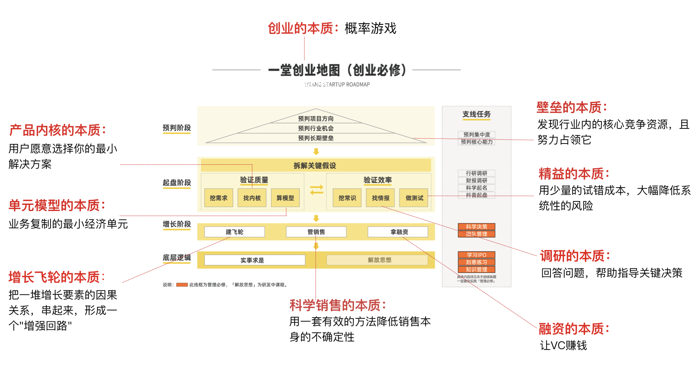
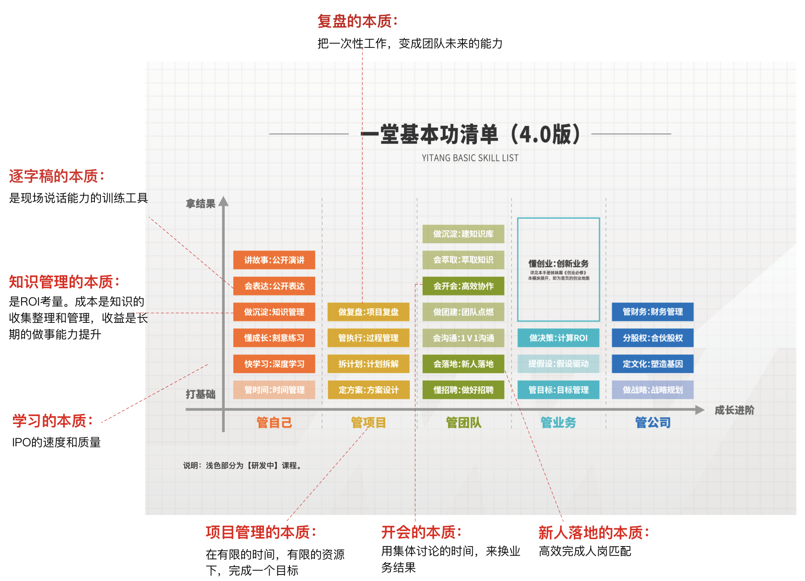

### Part I. 课上的总结

这一部分是课上已经发布的"本质定义"，相对稳定和可靠，很多这么多年我常用的一些理解，已经都陆续放到了课程里了。

你可以重点体会一件事：如何从这一句话本质定义，推导出一堂方法模型，进而推导出整个课程出来。

站在整个过程来看，你可以理解一堂追求的是"道法器用"链路的统一和自洽，就很容易看懂了：『道』就是本质逻辑，『法』就是方法论框架，『器』就是工具小抄，『用』就是思考作业和刻意练习。

这是一个很有趣的过程，大家可以试着体会一下当初我们提炼这些本质定义的过程。

