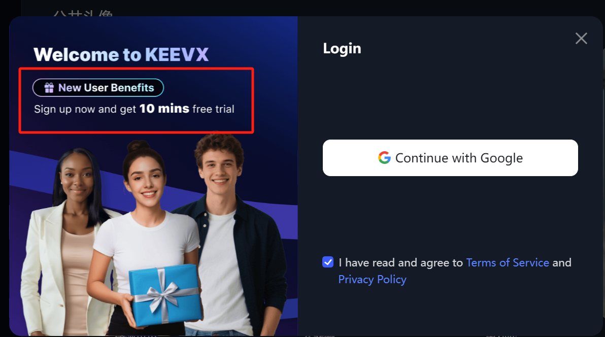
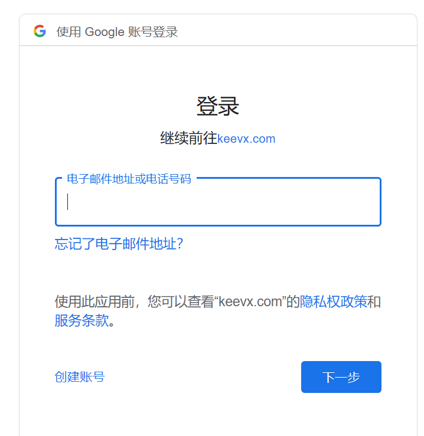
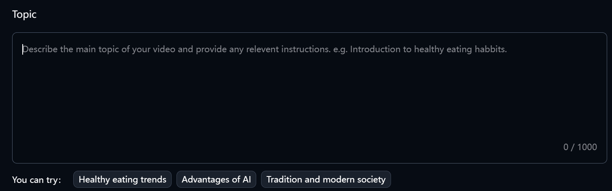
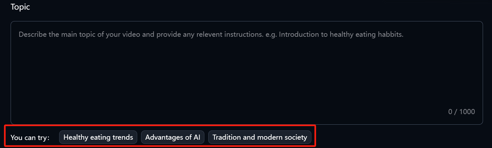
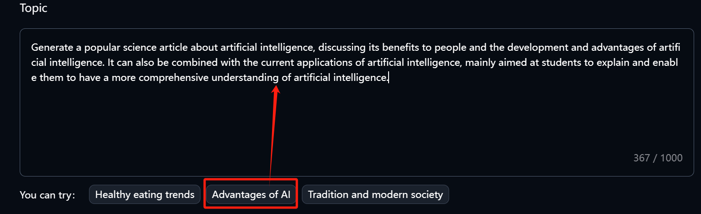
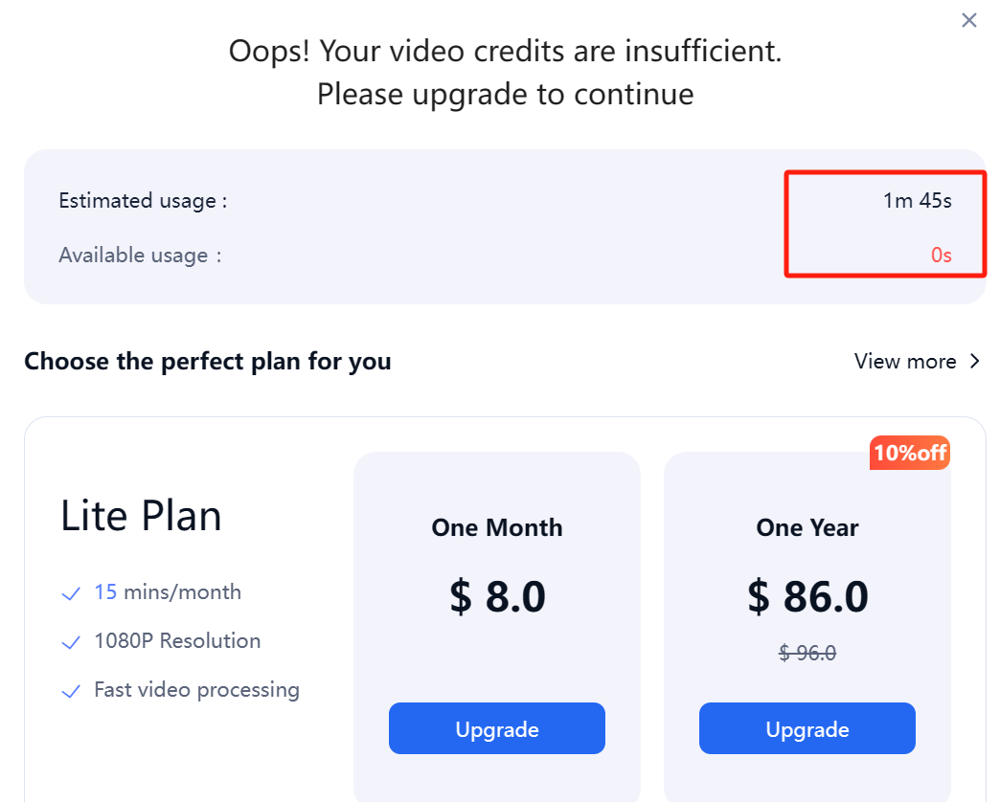
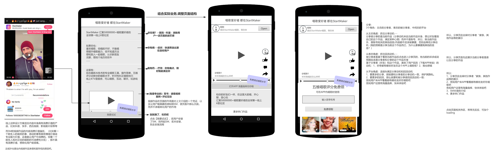

### 一堂创业者：百度数字人优化分析

**明确待解决的问题：试着分析下百度6月份新上线的数字人产品Keevx的可优化空间。**

**一、当我还没有去了解keevx是个面向什么群体在什么场景下解决其什么问题的产品时：**

**假设0：**Keevx这个名字，便于沟通吗？有利于建立用户心智吗？

**假设1：**用户打开网页时，根据用户设备所在地，判断用户当前语言，网页显示对应语言，比如我在bj，如果显示中文那么体验可能更好（我还需要翻译成中文）//当然可能因为这个产品是面向海外的，可能已经做了这个语言适配。

**假设2：**用户首次进入页面时，对整个产品是陌生的，且是游客状态，如果能更快速的让用户提前感知到“用户价值”（核心功能），也就相当于能让更多的用户感知到了用户价值（因为让用户感知到用户价值后的留存从群体样本来讲一定大于未感知到的），比如一个简短的功能使用过程的视频等（目的是让用户知道当前这里能给你提供什么）。

**假设3：**每个模板都是静态的，看着以为都是图片，如果将首个做出自动播放及直接外显按钮，自动等是否会更好？

**假设4：**对于一个“新”用户来讲，当其要注册/登录时：

- “奖励/礼物”这个激励是否是影响注册登录率的一个正向因子
- 或者将“激励”放在注册登录路径的哪个节点更合适？
- 以及"10”mins是一个aha点吗？
- 下面对应的3个人这个图片感觉只是将“礼物”这个激励增加了视觉感知而已-仅知道是个“礼物”但这个礼物是个啥呢，并没有预期；那么，是否这里会有个假设--让用户感知“激励”本身的价值可能更好呢（比如让用户感知到10分钟试用将得到什么，也就是对“激励”的对象是什么有个基本的预期？ 因为应该会有部分用户对这个“激励”没有一个具体的认知，比如可能存在部分用户不清楚激励的是当前模板的试用权益还是所有模板任选一个都行，一旦有这个疑惑，就存在漏斗损失）
- 根据人的阅读习惯（视线移动），以及当前弹窗的关键元素是注册按钮（用户打开这个弹窗的预期也是注册的），那么用户看到这个弹窗的第一时间视线应该大概率会集中在这个按钮上，关注左侧“礼物”那块的概率会小很多，所以又一个假设：上下结构的方式是否更好？

**假设5：**当前的注册登录拦截时机是否是最优的？若将拦截时机放在路径的其他节点，比如用户已经完成一个“创建”后，当用户想“发布”或“使用”时（我不确定是否有这些行为，只是举例子）再拦截呢？

进入登录页应该可以判断用户当前设备的Google账号，将其自动填入吧

**二、当我在网上搜索了解了下keevx是个什么产品后：**

**网上能查到的信息太少了，可能因为产品刚上线**

此时，可能上方有些假设就不太成立了

在网上，我了解到，keevx刚上线不久，所以估计应该还没什么用户量，另外从每个模板使用数基本都是二百多能看出来这个数应该是假的；

如果确实是刚上线不久，还没有什么用户量，那产品当前阶段应该处于“用户价值（或说用户需求）”是否成立的阶段；

那么，可以把这个产品当成一个“创业项目”来分析，TA要走的路还很长，也会面临一些竞争等等；

**从创业项目角度分析，我从抽象到具体一步步拆解分析：（259模型）**

**1）、项目是否成立需要有两个前提假设被验证成立：**

1、用户价值假设

2、增长假设

**用户价值：用户【愿意】选择你的最小解决方案**

即验证这个需求是个真实客观存在的需求（如果有一个上帝视角的话），这块我相信团队前期应该是做过大量调研的，目标用户群体的确定，群体范围的大小，使用场景，解决他们什么样的问题等。

**增长假设：**

假设1：随着数字人技术的不断提高，视频创作者这个群体规模将大大增大；

假设2：随着数字人技术的不断提高，视频内容生产成本将大大降低；

假设3：上述两个假设，将导致大量优质视频内容产生，从而进一步带动消费侧流量及使用时长的增大，消费侧流量和使用时长的增大将带来产品商业化空间的增大即收入增大，收入的增大促进企业进一步提升数字人技术或更丰富的模板以及更优惠的价格等，从而进一步促进优质视频的供给，形成增长飞轮。

**2）、在上述两个基本假设成立的基础上，继续下拆一层**

（补充说明：上述两个假设在需求论证阶段或产品上线初期我们无法通过数据证明它成立，只是通过逻辑推演论证，如果用逻辑推演都成立不了，那么就不必继续下拆了）

**用户需求**

**解决方案**

**商业模式**

**增长模式**

**竞争壁垒**

**这里需要把“用户-场景-问题”梳理清晰**

用户细分：

1）创作者：这类用户的核心诉求或问题是什么？

2）创作机构：这类用户的核心诉求或问题是什么？

分大区再细拆？（不同大区是否用户需求显著有差异）

基于需求，产品提供的解决方案是什么？

1）数字人技术

2）丰富的数字人模板

3）傻瓜式的操作

4）低价格？其他服务？

5）？

以上，**哪一个或哪几个才是最小单元内核**？即没了它需求就不成立。

目前看应该是订阅制

订阅制能否成立需要市场验证；

未来有没有其他可能的变现模式？

海外：

根据成本来决策，先向哪个大区渗透，占领市场，或多个大区一起渗透占领市场？

（比如北美文化有全球辐射能力，日韩文化有向东南亚辐射能力，不知道这个当前产品上是否有效）

创作者为主，还是相关创作机构为主？

本产品以什么样的单元模型复制增长？单个单元模型在增长之前需验证商业模式或起码解决方案要能跑通

技术？

感觉技术不太可能成为壁垒，AI相关技术逐渐开源之后，成本逐渐降低之后，技术越来越会被拉平。除非Top1可能会有技术上的领先，但预计难以形成技术上的壁垒；

规模效应？

……？

以上五步，从创业角度讲或者说从一个创新项目的角度讲，一般是从左到右需依次被验证成立才继续往右验证的。

目前来看，产品如果是在上线初期，应该还处于需求验证或解决方案的验证阶段；

需求从逻辑推演上来看，应该是成立的。

（解决方案是用户价值的载体，或者说是在产品形态上的一个投射，用户价值在上帝视角下是一个客观的值，60分的解决方案只能投射出60分的用户价值，80分的解决方案可以投射80的用户价值）

解决方案被证明后，需验证商业模式是否成立；

反之，若用户量上来但流失严重，或用户量起不来，那说明解决方案不成立，需求不确定是否成立。

当然，市场上很多产品，都将解决方案和增长这两部放在一起去了，也就是解决方案和商业模式（甚至连用户需求都没调研和推演是否成立）都没有验证就盲目大规模扩张，失败的概率必然很大。（当然也有少数行业需要先抢占市场比如之前滴滴快的打车）

**3）、进一步下拆，商业画布做更详细的分析，比如获客渠道，成本，收入等等（时间原因，此处略）**

**4）、接下来，我们落到产品信息结构上进行分析**

需要先把当前的业务目标定下来，我不确定当前业务一级指标是什么（**以下只是做一个假设推演**）

假设1：是新用户首开注册登录率（或登录数）

假设2：是新用户首开创建1个作品率（或作品数）

假设1应该不是一个好指标，因为注册登录是在用户点击使用模板（暂忽略其他分支路径）时弹出，也就是用户是带着使用模板的预期进行注册登录的，而如果他注册登录了，但最终没有成功创建1个作品，说明大概率他对产品的感知相对不那么好，再来的概率也就不大。

所以，一级指标为：

  新用户首开创建1个作品数

  口径：历史首次打开keevx页面的设备中，24小时内，成功创建了1个数字人作品的设备数

**业务公式拆解：（业务公式）**

        新用户首开创建1个作品数 = Keevx首页新设备访问uv*注册登录弹窗曝光uv*注册登录uv视频创作页曝光uv *……*创作视频成功

以上，根据实际数据情况，看哪个因子是关键因子，以及对各因子提出假设，衡量ROI，然后验证假设；

首页的相关假设参考“一”，这里不继续展开了，在当前产品没有足够用户行为数据的前提下，很多东西都需要先靠逻辑推演来决策，比如新用户的Aha时刻是什么？这或许决定了注册登录以及付费的拦截时机等。

当一个新用户首次进到下面这个页面时：

**假设：**文案从用户当前场景角度来描述或许更容易理解（目前文案是从产品设计者角度写的，对于老用户没问题），比如“AI将按照你写的这段描述干什么……之类”这样或许对于一个新用户来讲更容易理解这个框是干嘛的。

**假设：**红框的内容放到文本框内或许使用率更高（之前APP上做过类似AB，效果要好一点点，因为放到里面不用思考就知道和这个框是一体的，放在外面需要稍加思考，一旦思考就会有损失）当然这个假设的ROI肯定不高

**假设：**这个文本框若以markdown格式进行填写，长期来看，使用率，或者生成效果等是否会更好；因为结构化的描述方式，可能让用户更容易学会如何去表达自己的诉求（我理解这块应该就是给大模型的一个用户Prompt）；

所以，当用户点击下面的事例标签时，以结构化的形式进行填充，相当于官方对用户创作的一个潜在引导；当然用户自己填写的话，按大白话的方式也能填写；

中间几个步骤和工具本身强相关，个人不熟悉，所以不适合给出相关假设

到下面这一步有个疑惑：作为新用户前面提示是有10分钟试用的，为什么这里提示额度不足… 是指在10分钟免费额度的基础上还超出了1分45秒吗？ 不论怎样，这里应该存在较大的用户卡点；

月付和年付除了10%优惠外，权益是一样的，或许后续从权益上可以做区分，凸显年付的价值；

**假设：**在付费拦截这个页面如果将用户制作好的视频外显在这，且呈播放状态，用户将更舍不得放弃制作好的视频，进入提示付费转化。

假设：付费拦截的时机，比如下载时，应用时等。

**邀请好友**：从功能设计上来看，应该是一个纯分享邀请，不是裂变形式

假设：产品冷启阶段，如果能找到一批种子用户，一个好玩的裂变或许能成为一个获客渠道（比如东南亚用户，对于裂变玩法应该不像国内被免疫了，ROI应该不是问题）

所以，仅就产品功能现状，从分享邀请好友角度考虑，功能由分享者，平台，被分享者三方构成，拉一个邀请公式出来：

- 受邀数 = 打开uv*分享率*平均触达被分享者人数*被分享者打开率*被分享者受邀率（根据实际路径，公式会有所变化）

再拆一下影响最终分享效果的主要因子都有哪些：（**分享动机 * 分发路径 * 受邀动机 **）（**自己提炼模型**）

- 分享场景（前期可能就是分享的入口，常驻入口，某个用户清晰高点的环节等）
- 分享者（分享的目标人群画像）
- 分享动机（为什么要分享，产品设计上如何“打动”用户，不同人群其分享动机可能不同）
- 被分享者（被分享者人群画像）
- 受邀理由（如何“打动”用户）

其他因子：

- 分享路径
- 受邀回流路径：
- 路径上的激励手段：

东西太多，仅拿下面这个页面举例说明：

这块从数据信息上看包含三种结构：

- 分享者
- 被分享者
- 激励物

而主角是分享者，所以这里的设计从分享者角度考虑：（以上假设是基于上述分享公式中的“分享率”这一因子展开的，其他因子同理）

  假设1：强化激励感知，可补充 “25 分钟能做什么”，让用户更直观感知到奖励的价值。

  假设2：动态进度展示，“You've got: 0 min” 太静态，或许可试试进度条的形式，视觉上刺激用户。

  假设3：分钟数4 6 15三者对应的行为有先后关系，所以可尝试在视觉设计上体现出来，用户更易理解。

  假设4：按钮文案：比如 获得 25 分钟 之类，点击率或许更好。

  假设5：被分享者是否有礼物？

  假设6：这个功能应该是多邀多得的形式吧？如果是，页面上或许可外显出来，降低用户理解成本。

  其他：比如展示xxx3天前邀请2人，获得n分钟奖励等等

  或者，以大区为单位，xx大区，奖励分钟数n，瓜分中，还剩余m分钟等等。

被分享者角度：（基于上述公式中的被分享者打开率或受邀率因子）

        我没有尝试作为被分享者看到的是什么页面，所以拿我之前做过的一个被分享者看到的页面改版案例思路说明下：

APP端的，Web我理解在分享的底层结构上本质是一样的：

